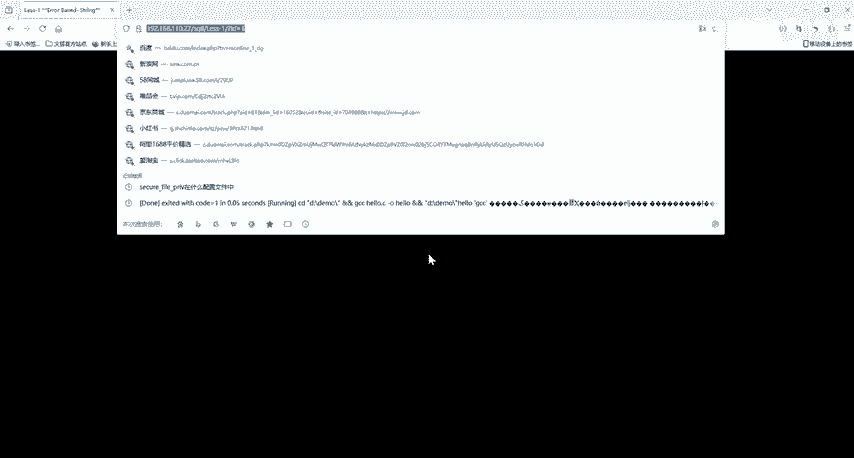
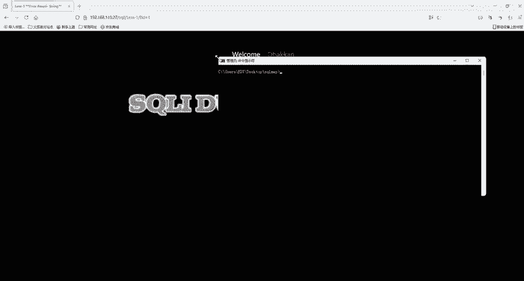
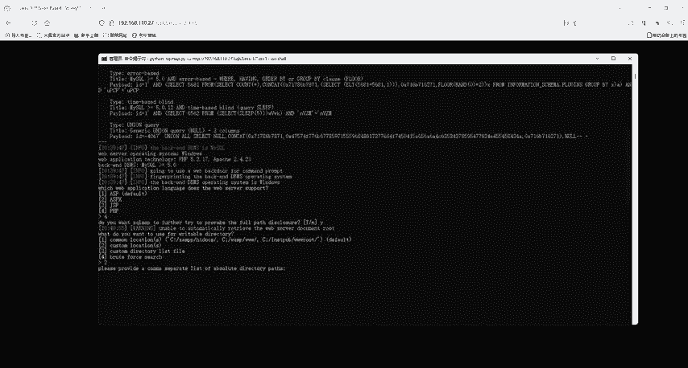
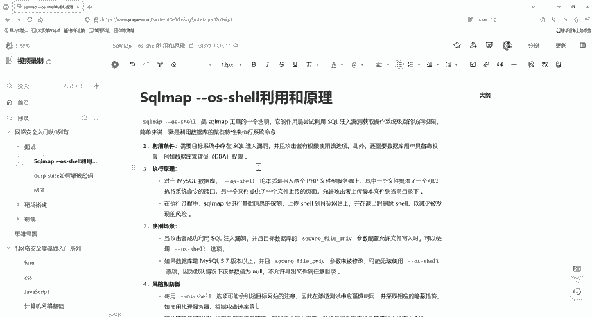

# 网络安全面试突击：P35：sqlmap --os-shell利用 🛡️💻

在本节课中，我们将学习一个重要的渗透测试技巧：如何使用 `sqlmap` 工具的 `--os-shell` 参数来获取目标服务器的操作系统命令行访问权限。这对于理解SQL注入漏洞的深度利用至关重要。

## 概述

`sqlmap` 是一款开源的自动化SQL注入检测与利用工具。其主要功能是发现并利用Web应用程序中的SQL注入漏洞。简单来说，如果网站的数据库存在安全漏洞，攻击者可能通过构造特殊的SQL命令来窃取或篡改数据。`sqlmap` 就像一名数据库侦探，能自动尝试多种方法“询问”数据库，以发现其安全弱点。发现漏洞后，`sqlmap` 会生成报告，帮助开发者修复问题，防范安全风险。

## 利用条件

要成功使用 `--os-shell` 参数，必须满足以下几个先决条件。以下是具体的要求列表：

*   **高权限账户**：执行操作的数据用户需要具备较高的权限（例如root或数据库管理员权限）。权限过低将无法写入文件。
*   **绝对路径已知**：必须知道目标Web目录在服务器上的绝对路径，否则工具无法确定上传文件的位置。
*   **PHP配置要求**：目标服务器的PHP配置中，`magic_quotes_gpc` 选项需要处于关闭状态。
*   **特定参数状态**：Web应用程序的某些文件上传或包含参数需要为空或指向可写的特定路径。

## 工作原理

上一节我们介绍了使用 `--os-shell` 的前提条件，本节中我们来看看它的核心工作原理。



其原理主要分为几个步骤：首先对目标进行基础信息探测，然后向目标Web服务器上传两个用于建立命令通道的脚本文件，最后通过脚本传参来执行操作系统命令。退出时，工具会尝试删除创建的临时文件。



由于数据库类型不同，具体的利用细节也有差异。例如，针对 Microsoft SQL Server 数据库，需要数据库支持 `xp_cmdshell` 扩展，并且数据库用户具备 `SA` 权限。其核心是利用 `xp_cmdshell` 扩展来执行系统命令。

其核心操作可以用以下伪代码流程概括：
```python
1. 探测目标并确认SQL注入点。
2. 通过SQL注入写入两个文件到Web目录：
   - webshell.php (用于接收命令)
   - upload.php (用于文件上传，辅助建立通道)
3. 通过访问 webshell.php 并传递参数，在服务器上执行命令。
4. 命令执行结果通过HTTP响应返回。
5. (可选) 清理阶段删除上传的文件。
```

## 演示流程

以下将简要演示 `--os-shell` 的基本使用流程。假设我们已经发现一个存在SQL注入漏洞的URL：`http://target.com/page.php?id=1`。



1.  启动 `sqlmap` 并指定目标URL和 `--os-shell` 参数。
    ```bash
    python sqlmap.py -u "http://target.com/page.php?id=1" --os-shell
    ```
2.  工具会自动进行注入测试。成功后，会提示选择服务器端脚本语言（如PHP、ASP等）。
3.  选择语言后（例如选择PHP），工具会询问Web目录的绝对路径。此时需要输入之前探测到的绝对路径。
4.  输入正确的绝对路径并确认后，`sqlmap` 将尝试上传必要的文件。
5.  如果一切条件满足，将成功获得一个交互式的操作系统命令行shell，可以在此执行系统命令。

**关键点**：整个过程的成功依赖于工具向服务器写入两个PHP文件，并通过这些文件构建一个命令执行通道，从而实现对服务器的远程控制。

## 总结



本节课中我们一起学习了 `sqlmap` 工具中 `--os-shell` 参数的利用方法。我们首先了解了 `sqlmap` 的基本作用，然后详细列出了使用该功能必须满足的四个条件：高权限、已知绝对路径、特定的PHP配置以及参数状态。接着，我们剖析了其工作原理，即通过SQL注入上传Webshell并建立命令执行通道。最后，我们概述了基本的操作流程。理解这些内容对于深入掌握SQL注入漏洞的危害及防御方法具有重要意义。