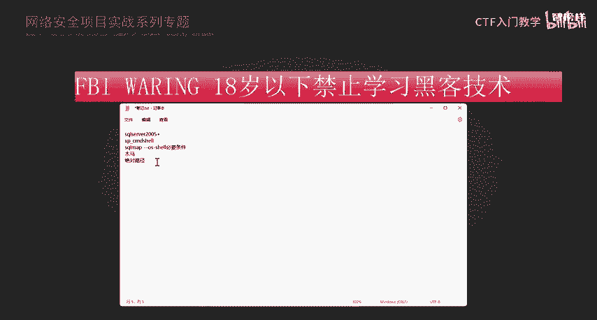
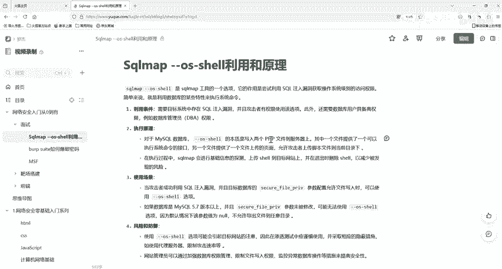

**网络安全面试突击：P36：sqlmap --os-shell原理**

在本节课中，我们将学习网络安全面试中的一个重要知识点：自动化渗透测试工具 sqlmap 中 `--os-shell` 命令的工作原理。理解这一原理有助于你深入掌握SQL注入漏洞的利用方式。

---

### **概述：sqlmap 工具简介**

sqlmap 是一款开源的自动化SQL注入与数据库渗透测试工具。它主要用于检测和利用SQL注入漏洞。该工具能够自动尝试多种技术来探测和利用数据库，目标是获取数据库中本不应被访问的信息。

上一节我们介绍了sqlmap的基本用途，本节中我们来看看其高级功能 `--os-shell` 是如何工作的。

---

### **`--os-shell` 命令的核心目标**

`--os-shell` 命令的目标是，在成功利用SQL注入漏洞后，进一步获取目标网站或服务器的操作系统命令行（shell）权限。这本质上是通过数据库执行系统命令，从而实现“提权”操作。

---

### **`--os-shell` 的工作原理**

其原理依赖于数据库本身的功能。当数据库（如MySQL或SQL Server）运行用户拥有足够权限时，可以调用特定函数来执行操作系统命令。

以下是针对不同数据库的实现方式：

*   **对于 MySQL 数据库：**
    sqlmap 会上传一个共享库（.dll 或 .so）文件到服务器。这个库包含用户自定义的函数（UDF），例如 `sys_exec` 和 `sys_eval`。通过调用这些函数，sqlmap 就能执行系统命令。
    *代码示例（概念性）：*
    ```sql
    SELECT sys_exec('whoami');
    ```



*   **对于 SQL Server 数据库：**
    sqlmap 会利用一个名为 `xp_cmdshell` 的存储过程。这个存储过程允许在SQL Server中执行操作系统命令。
    *代码示例（概念性）：*
    ```sql
    EXEC xp_cmdshell 'dir';
    ```
    在 SQL Server 2005 及以上版本中，`xp_cmdshell` 默认被禁用。但 sqlmap 会尝试重新启用它。如果该存储过程被删除，sqlmap 甚至会尝试自动创建它。

从上述机制可以看出，sqlmap 的功能非常强大。

---

### **使用 `--os-shell` 的必要条件**

要成功通过 `--os-shell` 获取 shell 权限，通常需要满足以下几个条件：

1.  **数据库高权限**：执行命令的数据库用户（如 `root`、`sa`）必须拥有最高级别的权限。
2.  **知晓网站绝对路径**：需要知道Web应用程序在服务器上的绝对路径，以便将“木马”文件写入正确的位置。
3.  **数据库具备文件写入能力**：
    *   对于 **MySQL**，关键参数是 `secure_file_priv`。这个参数限制了文件读/写操作的位置。
        *   如果设置为空，则可以写入任意目录。
        *   如果设置为特定路径，则只能写入该路径。
        *   如果设置为 `NULL`，则禁止文件操作。
4.  **Web环境配置允许**：
    *   对于PHP环境，需要关注 `magic_quotes_gpc` 参数。如果该参数开启，可能会对注入的数据进行转义，影响文件写入。通常需要其处于关闭状态。
5.  **Web目录有写入权限**：运行数据库进程的用户必须对目标网站的目录拥有写入权限，才能成功上传文件。

---

### **通俗理解**

简单来说，`--os-shell` 就像一个高级的自动化黑客工具。它利用数据库漏洞作为跳板，尝试控制整个服务器。使用这个“工具”需要几个“钥匙”：
*   **权限钥匙**：数据库用户必须是“大老板”（高权限）。
*   **能力钥匙**：数据库必须允许向服务器硬盘写文件（`secure_file_priv` 等设置不能太严格）。
*   **地址钥匙**：必须知道网站文件存放在服务器的哪个具体位置（绝对路径）。
*   **环境钥匙**：服务器的Web环境（如PHP配置）不能阻止特殊字符，以便文件能被正确写入和执行。

最终，`--os-shell` 的原理就是：**通过SQL注入漏洞，向服务器写入一个特殊的“木马”文件，然后通过访问这个文件或调用数据库函数，来执行远程系统命令。**

---

### **总结**



本节课中，我们一起学习了 sqlmap 工具中 `--os-shell` 命令的工作原理。我们了解到，该功能的核心是利用数据库自身扩展（如MySQL的UDF或SQL Server的 `xp_cmdshell`）来执行系统命令。同时，成功利用需要满足数据库高权限、知晓路径、具备文件写入能力等一系列条件。掌握这些原理，能帮助你更深入地理解SQL注入漏洞的危害层级和防御重点。