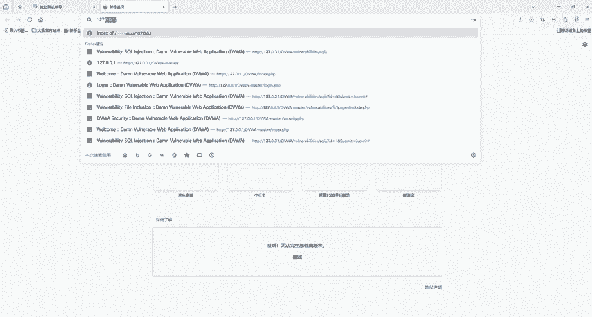
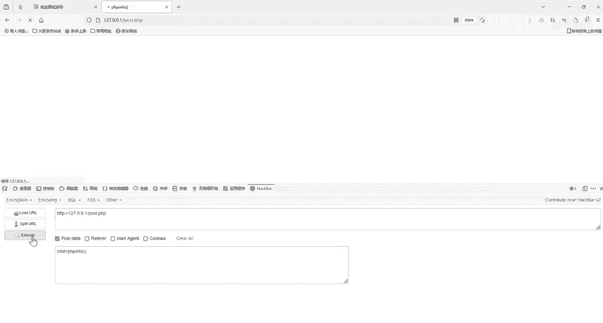
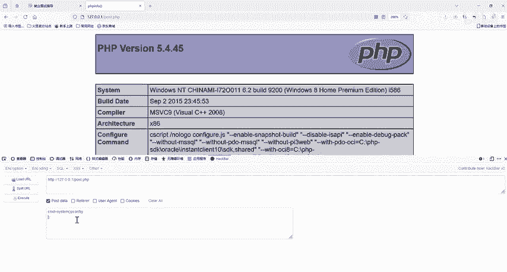
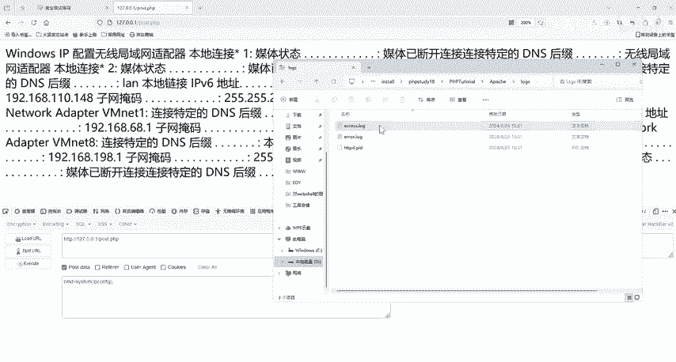
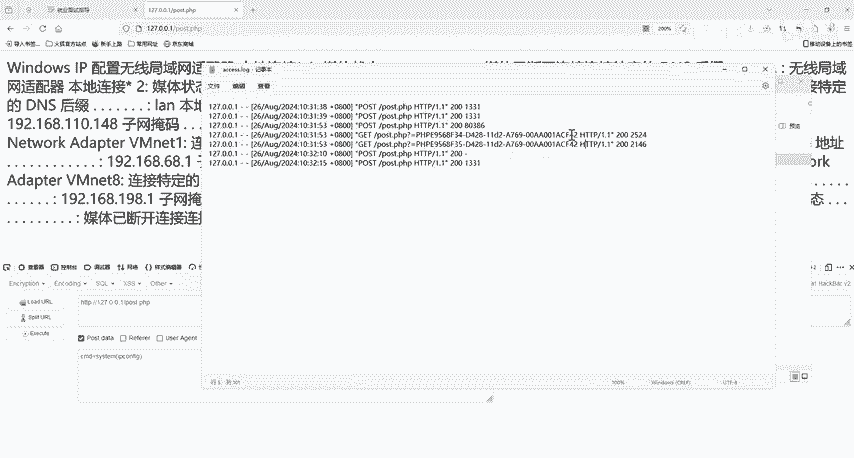
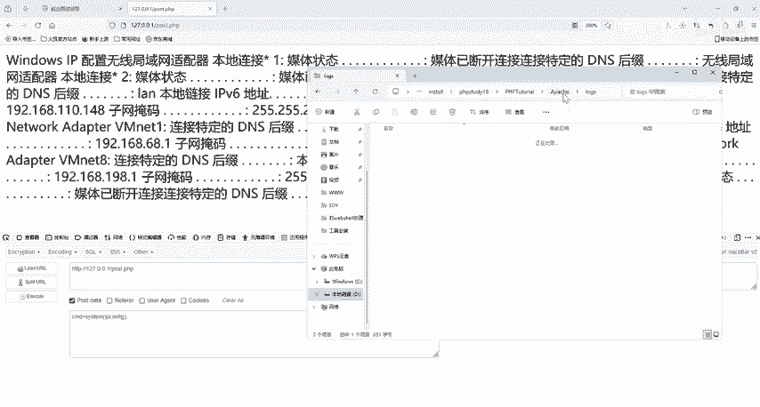
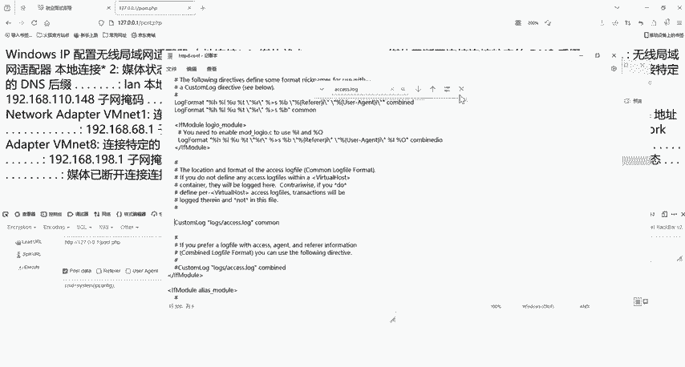
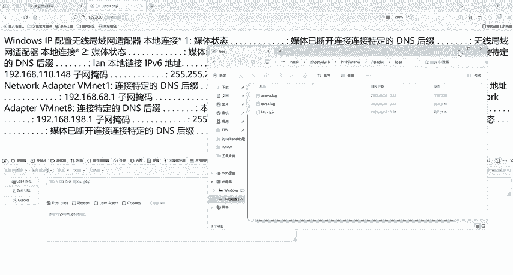
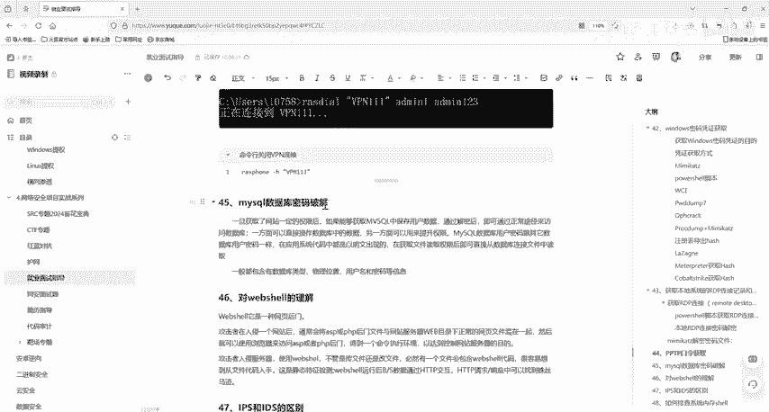
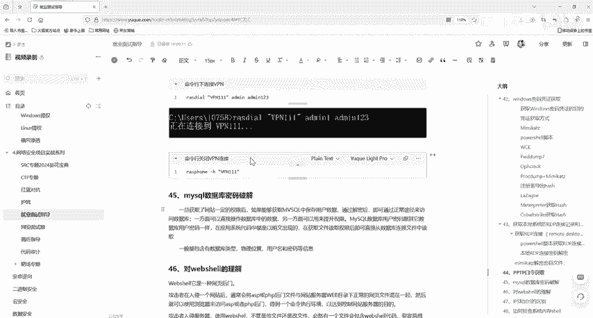

# 网络安全面试突击：P37：WebShell 的理解与检测 🕵️♂️

在本节课中，我们将学习网络安全中一个核心概念——WebShell。我们将了解它的定义、工作原理、如何通过一个简单的环境进行演示，以及如何从日志中发现其踪迹。理解WebShell是渗透测试、安全运营和CTF比赛中的一项重要技能。

## 什么是WebShell？🤔

WebShell是一种基于网页的后门。攻击者在成功入侵一个网站后，通常会将一个ASP或PHP后门文件，放置在网站服务器Web目录下的正常网页文件之中。此后，攻击者便可以通过浏览器访问这个ASP或PHP后门，从而获得一个命令执行环境，最终达到控制网站服务器的目的。



## WebShell的工作原理与演示 💻

上一节我们介绍了WebShell的基本概念，本节中我们来看看它的实际工作原理和操作演示。

攻击者利用WebShell控制服务器时，无论是上传新文件还是修改现有文件，最终都会在服务器上留下包含WebShell代码的文件。因此，检测可以从文件代码的静态特征入手。

此外，当WebShell开始运行后，在B/S架构的数据交互中，HTTP请求与响应里也会暴露出一些痕迹。





以下是一个在本地PHPStudy环境中演示WebShell的步骤：

1.  启动PHPStudy搭建的Web服务，并访问本地网站（如 `http://127.0.0.1`）。
2.  在网站的根目录下，攻击者上传的WebShell文件（例如 `post.php`）会与其他正常的网页文件混合在一起。
3.  通过浏览器或工具（如HackBar）访问这个WebShell文件。例如，访问 `http://127.0.0.1/post.php`。
4.  通过GET或POST方式向该文件传递命令参数。例如，传递 `cmd=phpinfo()` 可以查看服务器PHP配置信息。
5.  WebShell会执行接收到的命令并返回结果。例如，传递 `cmd=system(“ipconfig”)` 可以获取服务器的网络配置信息。

核心的WebShell代码片段通常包含执行系统命令的函数，例如在PHP中：
```php
<?php
    if(isset($_GET[‘cmd‘])) {
        system($_GET[‘cmd‘]);
    }
?>
```



## WebShell的日志踪迹 📝

我们了解了WebShell如何工作，接下来看看它会在系统中留下哪些痕迹。使用WebShell的一个特点是，它通常不会在操作系统本身的系统日志中留下记录，但会在Web服务的访问日志中留下无法抹除的痕迹。



这些访问日志记录了所有的HTTP请求。例如，在Apache服务器（PHPStudy环境）中，日志文件通常位于 `Apache/logs/access.log`。



在这个日志文件中，你可以看到类似以下的记录：
```
127.0.0.1 - - [05/Nov/2023:10:00:00] “GET /post.php?cmd=ipconfig HTTP/1.1” 200 1256
```
这条记录显示了一个来自 `127.0.0.1` 的IP地址，通过GET请求访问了 `/post.php` 文件，并传递了 `cmd=ipconfig` 参数。对于有经验的安全管理员来说，这种对非常规文件传递系统命令参数的请求，是明显的攻击迹象。





**注意**：有时你可能找不到 `access.log` 文件，这通常是由于文件或目录权限设置问题，导致Apache服务无法写入日志。此时需要检查Apache的配置文件（如 `httpd.conf`），确保 `CustomLog` 指令未被注释，并指向正确的路径，然后重启Web服务。

## 总结 🎯





本节课中，我们一起学习了WebShell的核心知识。我们明确了WebShell是一种通过网页后门控制服务器的攻击手段，并通过本地环境演示了其命令执行的过程。同时，我们也了解到，尽管WebShell会刻意规避系统日志，但其HTTP请求必然会记录在Web访问日志中，这是检测WebShell攻击的关键所在。对于网站管理员而言，定期审查和分析Web访问日志是至关重要的安全实践。