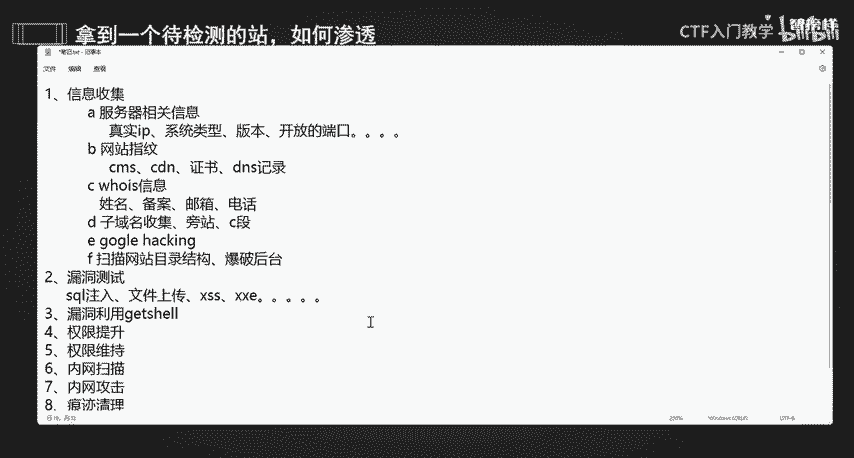
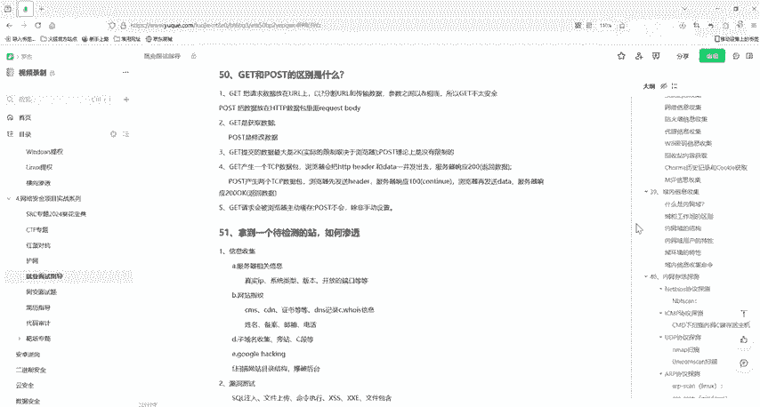

# 网络安全面试突击：P38：拿到一个待检测的站，如何渗透

在本节课中，我们将学习渗透测试的核心流程与思路。当面对一个授权检测的网站时，如何系统性地进行渗透，是面试中常见的问题。我们将从信息收集开始，逐步深入到漏洞利用、权限维持，直至最后的报告撰写。

## 渗透测试流程概述

渗透测试必须在获得明确授权的前提下进行。授权是合法合规开展所有测试活动的基础。

上一节我们明确了授权的重要性，本节中我们来看看渗透测试的具体步骤。完整的流程通常包括信息收集、漏洞测试、漏洞利用、权限提升与维持、内网渗透以及最后的清理与报告。

## 第一步：信息收集 🕵️

信息收集是渗透测试的基石。收集到的信息越多，潜在的攻击面就越广，成功渗透的几率也越大。

以下是信息收集的主要方面：

*   **服务器相关信息**：目标是获取目标的真实IP地址、操作系统类型（如 `Windows`、`Linux`）及版本、开放的端口和服务。
*   **网站指纹识别**：识别网站使用的技术，例如内容管理系统（CMS）、是否使用CDN、SSL证书信息以及DNS解析记录。
*   **whois信息**：查询域名注册信息，包括注册人姓名、备案号、邮箱、电话等。这些信息可用于后续的社工库查询。
*   **子域名与旁站**：收集目标的子域名，并探测同一IP段（C段）的其他网站，以寻找薄弱点。
*   **针对性搜索**：利用 **Google Hacking** 语法进行针对性搜索，例如查找暴露的PDF文件、中间件版本信息、默认口令等。
*   **目录结构扫描**：使用工具爆破网站的目录结构，寻找后台管理入口、测试页面、备份文件、敏感文件（如 `config.php`、`.git` 目录）泄露等。
*   **其他**：关注不安全的传输协议（如 `FTP`）、已知的通用漏洞（EXP）以及公开的漏洞库（如 `Exploit-DB`）和源代码审计。

## 第二步：漏洞测试 🔍

在充分的信息收集之后，下一步是针对目标进行漏洞探测。

我们需要检测目标网站是否存在常见的Web漏洞，例如：
*   **SQL注入**：`‘ or ‘1’=’1`
*   **文件上传漏洞**
*   **跨站脚本攻击（XSS）**
*   **XML外部实体注入（XXE）**
*   **命令执行（RCE）**
*   **文件包含漏洞（LFI/RFI）**

## 第三步：漏洞利用与初始权限获取 ⚔️

当发现可利用的漏洞后，下一步就是利用它来获取系统的初始访问权限。

通过验证的漏洞（如文件上传、SQL注入写shell）上传 **Webshell**，从而获得服务器的命令行交互界面或文件管理能力，即拿到 `shell`。

## 第四步：权限提升与维持 👑

获得初始权限（通常是普通用户权限）后，往往需要提升至更高权限（如 `root` 或 `SYSTEM`）。

**权限提升** 的方法因系统而异：
*   **Windows**：可利用系统漏洞（如 `MS17-010`）、服务配置错误或 `MySQL UDF` 提权等方式。
*   **Linux**：可通过内核漏洞、`SUID` 文件滥用、计划任务劫持等方式进行提权。

为了长期控制目标，需要进行 **权限维持**：
*   创建隐藏的后门账户。
*   部署持久化的后门程序或Webshell。
*   设置计划任务或启动项。

## 第五步：内网渗透 🌐

在控制一台内网主机后，渗透测试的范围可以扩展到整个内部网络。

首先进行 **内网扫描**，使用工具或命令探测内网存活主机、开放端口和服务。
接着进行 **内网信息收集**，获取网络拓扑、域环境信息、共享资源等。
然后通过 **隧道技术**（如 `frp`、`ngrok`）建立代理，以便从外部访问内网资源。
最后，在内网中重复 **漏洞利用、权限提升和维持** 的步骤，横向移动，控制更多主机。

## 第六步：清理痕迹与报告撰写 📝

所有测试活动结束后，必须清理留下的痕迹，并形成专业的报告。

**痕迹清理**：删除或修改在目标系统上添加的后门、创建的账户以及相关的系统日志和Web访问日志，以掩盖测试行为。

**报告撰写**：输出详细的渗透测试报告。报告应包括测试过程、发现的安全漏洞、漏洞危害等级、利用过程以及最重要的——**修复建议与方案**。这是渗透测试价值的最终体现。

## 总结

本节课我们一起学习了面对一个待检测网站时的完整渗透测试流程。我们从 **信息收集** 开始，逐步进行 **漏洞测试**、**漏洞利用** 获取权限，接着进行 **权限提升与维持**，然后拓展到 **内网渗透**，最后完成 **痕迹清理** 并输出 **测试报告**。掌握这个系统化的思路，是回答此类面试题和进行实际渗透测试工作的关键。