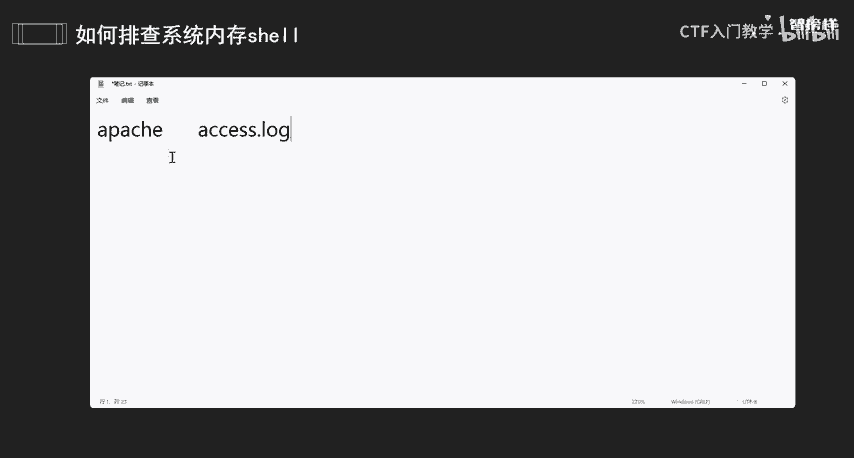
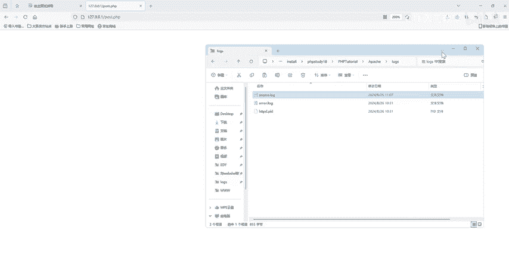
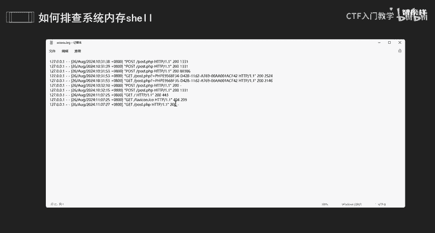
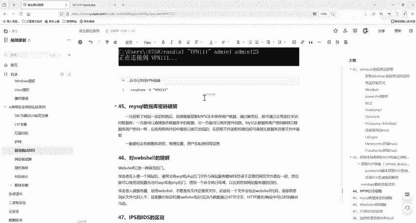

# 网络安全面试突击：P39：如何排查系统内存马 🕵️

在本节课中，我们将学习如何排查系统中的内存马。内存马是一种驻留在服务器内存中的恶意后门，它不依赖于磁盘上的文件，因此更难被传统安全扫描发现。我们将通过几种方法来识别和定位这类威胁。

## 判断注入方式

上一节我们介绍了内存马的基本概念，本节中我们来看看如何判断内存马是基于何种方式注入的。核心方法是分析服务器的访问日志。

可以通过查看Web日志，检查是否存在可疑的Web访问记录。例如，在Apache服务器中，日志文件通常名为 `access.log`。

如果注入类型是PHP或JSP，日志中可能会出现大量请求路径相同但参数不同的记录，或者访问不存在的页面却返回了200状态码的情况。

## 分析日志特征

以下是分析日志时需要关注的关键点：

*   **异常状态码**：查找访问不存在的路径但返回状态码为200的请求。
*   **工具特征**：检查是否有与哥斯拉、冰蝎等常见WebShell管理工具流量特征相符的URL请求。这些工具的流量特征与普通WebShell基本吻合。
*   **路径验证**：对比日志中返回200的URL路径，检查网站根目录下是否实际存在对应的文件。如果路径对应的文件不存在，则该请求很可能是访问了内存马。

## 排查其他注入途径

如果在Web访问日志中未发现明显异常，则需要排查其他可能导致代码执行的途径。

可以检查中间件的错误日志（例如Apache的 `error.log` 文件），查看在可疑时间段内是否有相关的错误或异常信息。

根据业务使用的组件和框架，排查是否存在已知的漏洞：

*   **组件漏洞**：排查是否存在Java代码执行漏洞（RCE）。
*   **框架漏洞**：检查是否利用了反序列化漏洞等框架安全缺陷。
*   **WebShell上传**：排查是否通过已存在的WebShell上传并注入了内存马。

## 总结

本节课中我们一起学习了排查系统内存马的几种方法。首先，通过分析 `access.log` 等Web日志，判断异常的访问模式和状态码。其次，对比请求路径与真实文件，并识别常见攻击工具的特征。最后，如果Web日志无果，则需转向排查中间件错误日志、组件漏洞及框架反序列化漏洞等其他注入途径。系统性地结合这些方法，可以有效提高发现内存马的能力。