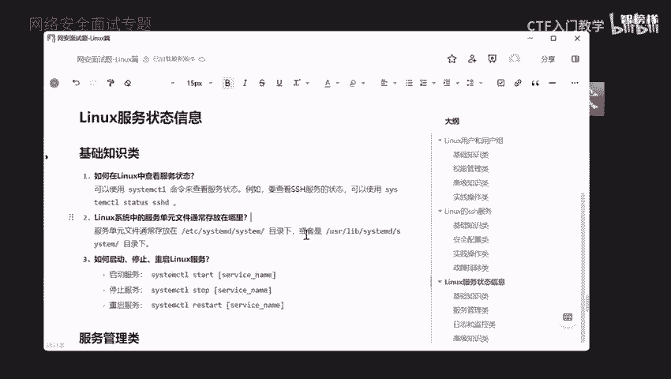
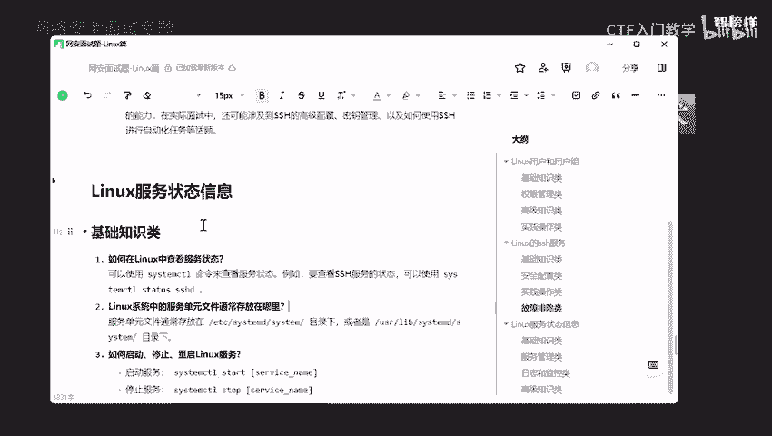
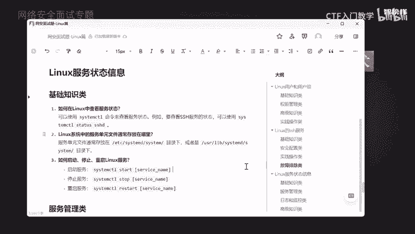
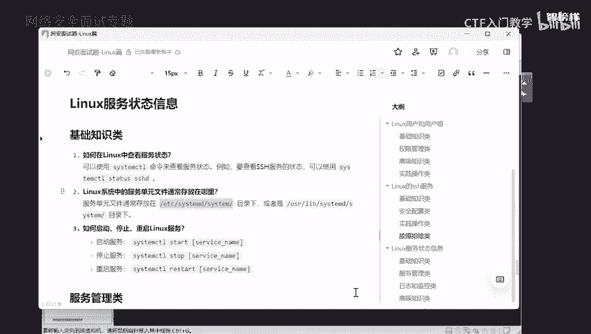
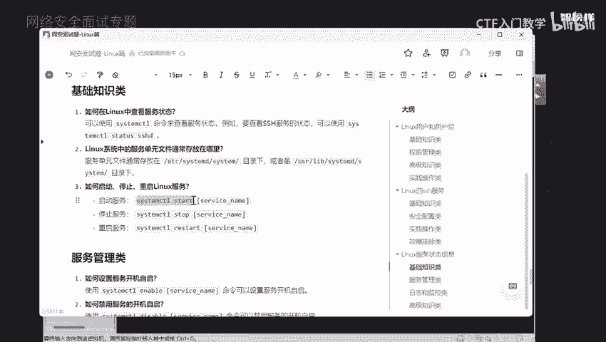
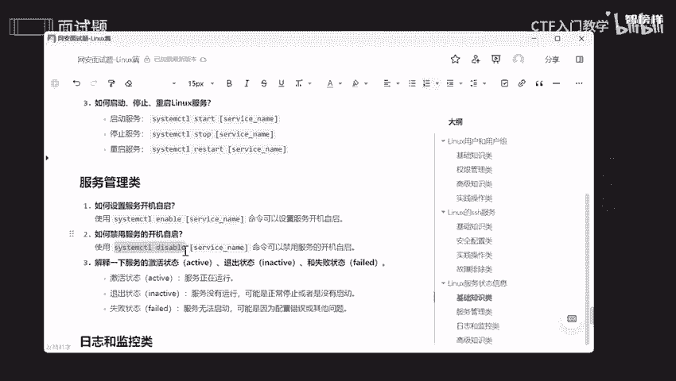
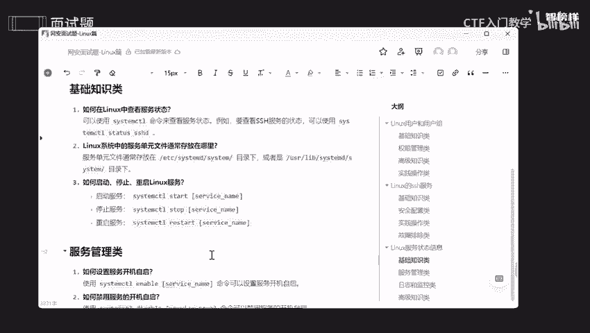

# 网络安全面试突击：P3：Linux服务状态信息 🐧

在本节课中，我们将学习Linux系统中服务状态信息的相关知识。这对于排查系统故障、进行性能监控和安全维护至关重要。我们将从基础知识开始，逐步深入到服务管理、日志监控和故障排除。



---

## 基础知识类

上一节我们介绍了课程概述，本节中我们来看看关于服务的基础知识。

面试官询问服务状态信息，是因为服务是操作系统中的运行进程，负责提供网络、数据库、文件共享等功能。如果服务出现问题，将严重影响系统功能，因此需要掌握如何排查故障、监控性能和维护安全。



### 如何在Linux中查看服务状态？

在运行服务前，需要确保服务处于活跃状态。例如，要检查SSH服务的状态，可以使用 `systemctl` 命令。



以下是查看SSH服务状态的命令：
```bash
systemctl status ssh
```
执行该命令后，会显示服务的状态信息。按空格键可以翻页查看，按 `q` 键退出。

---

## 服务管理类

了解了如何查看状态后，本节我们来看看如何管理服务。

### Linux系统中，服务单元文件通常存放在哪里？



要管理服务，需要知道其配置文件的位置。服务单元文件通常存放在 `/etc/systemd/system/` 目录下。

### 如何启动、停止或重启Linux服务？

管理服务的基本操作包括启动、停止和重启。相关命令如下：
*   **启动服务**：`systemctl start <服务名>`
*   **停止服务**：`systemctl stop <服务名>`
*   **重启服务**：`systemctl restart <服务名>`



例如，管理SSH服务：
```bash
# 停止SSH服务
systemctl stop ssh
# 查看状态，确认已停止
systemctl status ssh
# 启动SSH服务
systemctl start ssh
# 再次查看状态，确认已活跃
systemctl status ssh
```

---

## 服务管理类（续）

掌握了基本操作后，我们进一步学习服务的启动设置和状态解读。

### 如何设置服务的开机自启？如何禁止？

对于需要持续运行的服务（如SSH），可以设置为开机自启，避免每次手动启动。

以下是相关命令：
*   **设置开机自启**：`systemctl enable <服务名>`
*   **禁止开机自启**：`systemctl disable <服务名>`

操作示例：
```bash
# 设置SSH服务开机自启
systemctl enable ssh
# 查看状态，确认已启用 (enabled)
systemctl status ssh
# 禁止SSH服务开机自启
systemctl disable ssh
# 查看状态，确认已禁用 (disabled)
systemctl status ssh
```

### 解释服务的激活状态、退出状态和失败状态。

在 `systemctl status` 命令的输出中，可以识别服务的不同状态：
*   **激活状态 (active)**：服务正在运行。
*   **退出状态 (inactive)**：服务未运行，可能是正常停止或从未启动。
*   **失败状态 (failed)**：服务无法启动，通常是由于配置错误或依赖问题。



---

## 日志和监控类

服务管理不仅包括启停，还需要监控其运行日志和资源使用情况。

### 如何查看服务的日志信息？

日志记录了服务的运行、访问和错误信息，是故障诊断的重要依据。使用 `journalctl` 命令可以查看指定服务的日志。

查看SSH服务日志的命令如下：
```bash
journalctl -u ssh
```

### 如果服务进入失败状态，如何诊断？

当服务启动失败时，可以按照以下步骤排查：
1.  **检查日志文件**：使用 `journalctl -u <服务名>` 查看详细错误信息。
2.  **检查配置文件**：确认服务的配置文件语法和路径是否正确。
3.  **检查依赖**：确保该服务所依赖的其他服务或资源可用。

### 如何监控服务的资源使用情况？

可以使用 `top`、`htop` 或 `ps` 命令监控服务的CPU和内存使用情况。

要查看特定服务（如SSH）的资源使用情况，可以使用以下命令组合：
```bash
ps aux | grep ssh
```
该命令会显示SSH相关进程的PID、CPU和内存占用率等信息。

---

## 高级知识类

最后，我们探讨一些与服务相关的进阶概念。

### 什么是 `target`？它与 `service` 有什么区别？

`target` 相当于旧版Linux中的运行级别，它是一组服务单元的集合，定义了在特定运行环境下应该启动哪些服务。而 `service` 是一个具体的服务单元。

### 如何创建自定义的服务单元文件？

可以创建以 `.service` 结尾的自定义服务单元文件，并将其放置在 `/etc/systemd/system/` 目录下。

创建时，需要根据服务单元文件的格式编写必要的指令，例如 `[Unit]`、`[Service]` 和 `[Install]` 部分。

---



本节课中我们一起学习了Linux服务状态信息的核心知识。我们了解了如何查看和管理服务状态，如何设置开机自启，如何通过日志诊断问题，以及如何监控服务资源。掌握这些技能对于维护系统稳定性和安全性至关重要。