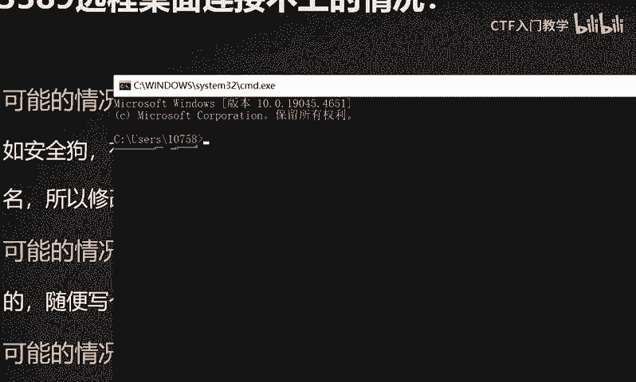
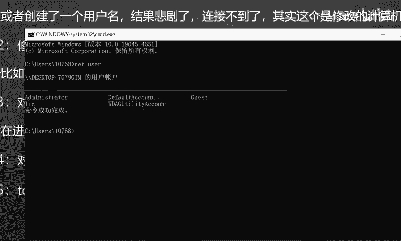
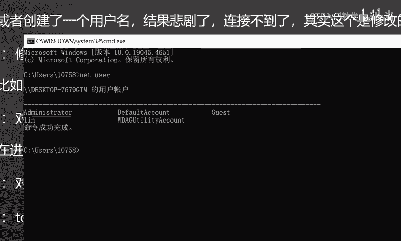
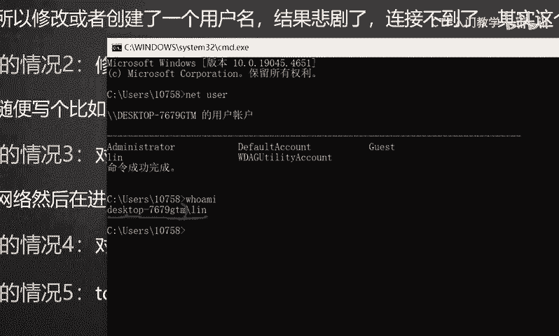

# 网络安全面试突击：P40：3389无法连接的可能原因分析 🛡️

在本节课中，我们将学习一道经典的渗透测试工程师面试题：当尝试连接目标主机的3389端口进行远程桌面连接时，发现无法连接。我们将系统地分析导致此问题的多种可能原因，帮助你理解问题排查的思路。

## 3389端口简介

上一节我们介绍了课程背景，本节中我们来看看3389端口是什么。3389是Windows操作系统远程桌面连接（RDP）服务的默认端口。该服务在Windows系统安装时即自带，无需额外安装。用户通过在远程桌面连接程序中输入目标主机的IP地址，即可在对方开放此端口的情况下，发起远程控制，其操作体验类似于直接操作本地计算机。

## 问题分析与可能原因

了解了3389端口的基本作用后，接下来我们深入探讨连接失败的可能原因。这类问题在面试中频繁出现，旨在考察应聘者的实战经验和技术排查能力。对于渗透测试等高技能岗位而言，具备分析并解决此类连接问题的能力至关重要。

以下是连接3389端口失败时，需要考虑的五种常见情况：

**1. 安全软件或防火墙拦截**
这是最优先排查的情况。由于3389属于敏感端口，目标主机可能安装了如安全狗等防护软件，或启用了系统防火墙，并对该端口设置了屏蔽规则。某些防护软件会实施“白名单”策略，例如：
*   **核心限制**：仅允许**指定计算机名**的主机进行连接。
*   **常见误区**：许多初学者误以为是用户账户问题，从而尝试在目标系统上新建用户。但计算机名（通过命令 `hostname` 查询）与用户名（通过命令 `whoami` 查询）是两个不同的概念。新建用户账户无法绕过针对计算机名的限制。

**2. 远程桌面端口被修改**
3389并非不可更改的固定端口。系统管理员出于安全考虑，可能会修改远程桌面服务的默认监听端口。例如，将其改为54452等随机端口。此时，直接连接默认的3389端口必然失败。这好比一个人从3389号房间搬到了54452号房间，去原地址自然找不到人。

**3. 目标处于隔离网络环境**
如果目标主机位于纯内网环境，与你的网络不在同一网段且无法直接通信（例如没有路由或存在网络隔离），则无法建立连接。解决此类问题通常需要借助端口转发工具（如 **lcx**、**ew** 等），先建立通信隧道。

**4. 远程桌面服务未开启**
这是最基础但不容忽视的情况。如果目标主机根本没有开启“远程桌面”服务，或相关服务（Terminal Services）被禁用，那么3389端口实际上并未处于监听状态。尝试连接一个未开启的服务自然是无效的。

**5. 防火墙策略限制（IP白名单）**
此情况与第一种类似，但限制层面不同。目标主机可能通过防火墙策略设置了TCP/IP安全限制，仅允许来自**特定IP地址**的连接。如果你的IP地址不在其允许的白名单列表中，连接请求会被直接拒绝。

## 总结

本节课中我们一起学习了导致3389远程桌面连接失败的五大常见原因：**安全软件拦截**、**端口被修改**、**网络环境隔离**、**服务未开启**以及**IP白名单限制**。掌握这些排查思路，不仅能应对面试提问，更能有效指导实际的渗透测试与安全运维工作。理解每种情况背后的原理，是成为一名合格安全工程师的关键。