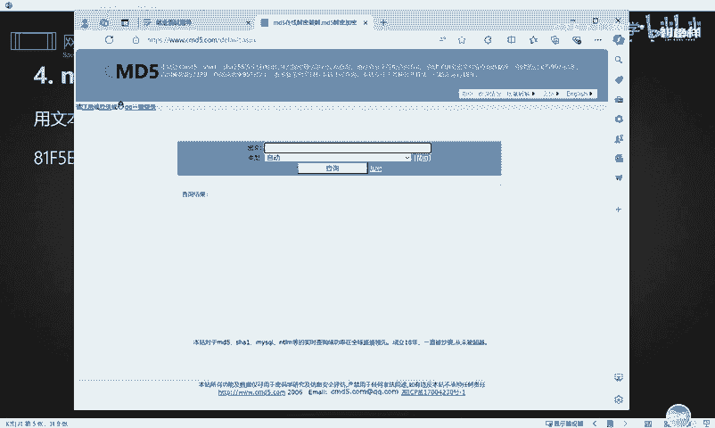
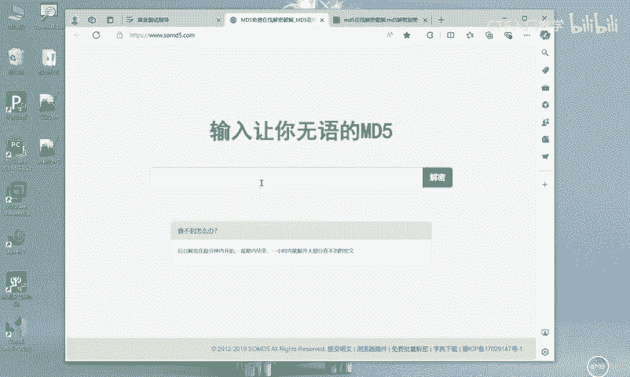
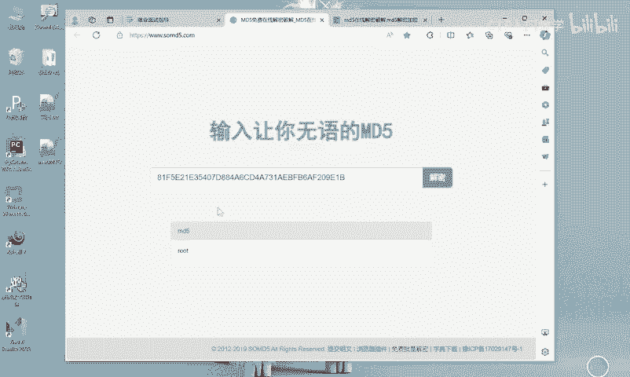
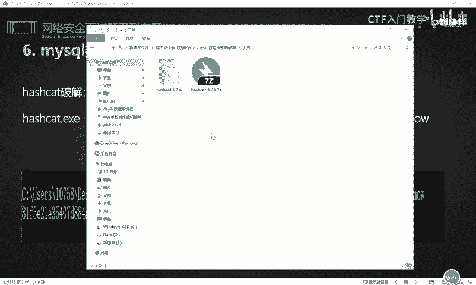
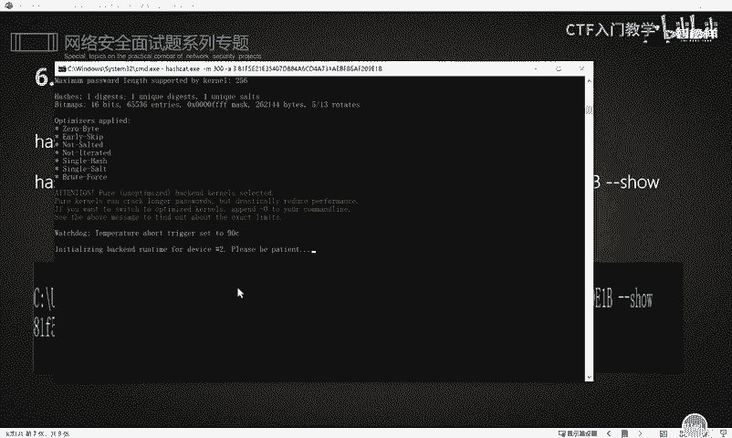
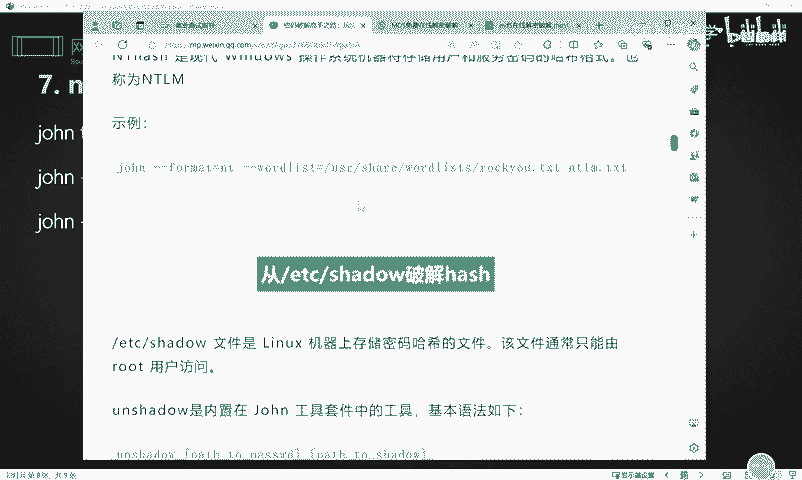

# 网络安全入门：P42：MySQL数据库密码破解 🔑

在本节课中，我们将学习如何获取并破解MySQL数据库的密码。掌握这项技能有助于在获得网站初步权限后，进一步获取数据库中的用户数据，甚至实现权限提升，从而更深入地控制系统。

## 概述：为何需要破解MySQL密码

在获取网站一定权限后，我们可以尝试获取其MySQL数据库。数据库中保存的用户数据经过解密后，可以通过正常途径访问。一方面，我们可以直接操作数据库中的数据，获取用户信息等敏感内容。另一方面，通过MySQL数据库可能实现权限提升，从而彻底控制系统。

MySQL数据库的用户密码与其他数据库类似，在应用系统中通常以密文形式存储。当获得文件读取权限后，我们可以直接从数据库连接配置文件中获取其账号密码。

## MySQL数据库文件结构 📁

上一节我们介绍了破解MySQL密码的目的，本节中我们来看看MySQL数据库的文件存储结构。了解文件结构是定位密码存储位置的第一步。

MySQL数据库主要包含三种类型的文件：

*   **.frm文件**：描述数据库中表结构的文件。
*   **.MYD文件**：表的数据文件，数据库中的所有数据都保存在此类文件中。
*   **.MYI文件**：表数据文件的索引文件，类似于字典的检索目录。

MySQL数据库的账号密码保存在 `mysql` 库的 `user` 表中。因此，要找到密码，我们需要定位 `user.MYD` 文件，该文件记录了用户名和加密后的密码。

## MySQL密码加密方式 🔐

知道了密码的存储位置后，我们需要了解其加密方式，才能进行破解。

MySQL的认证加密主要有两种方式：

1.  **MySQL 4.1版本之前**：采用 `MySQL323` 加密。
2.  **MySQL 4.1版本之后**：采用 `MySQLSHA1` 加密。

这些加密方式通常是不可逆的。所谓的“解密”过程，实际上是通过碰撞（如彩虹表、暴力破解）的方式来尝试还原明文密码。



## 实战：获取与破解密码 💻

前面我们介绍了理论基础，现在进入实战环节。我们将演示如何从文件中提取加密密码，并使用多种工具进行破解。

### 步骤一：定位并提取加密密码

假设我们已经获得了目标系统的 `user.MYD` 文件。可以使用文本编辑器（如Notepad++）打开该文件。



在文件中，用户名（如 `root`）可能是明文，而密码则是分段保存的加密字符串。我们需要找到并拼接这些加密字符串。例如，在文件中找到类似 `*6BB4837EB74329105EE4568DDA7DC67ED2CA2AD9` 的值，这就是加密后的密码哈希值。


### 步骤二：使用在线网站解密



以下是两种常用的在线解密网站，操作简单，适合快速查询。

**方法一：使用 CMD5 网站**
1.  访问 CMD5 等在线解密网站。
2.  将提取到的加密字符串粘贴到查询框中。
3.  选择“自动识别”或“MySQL5”等模式。
4.  点击查询，网站会尝试碰撞并返回明文密码（如 `root`）。



**方法二：使用 Somd5 网站**
操作流程与 CMD5 类似，将哈希值粘贴到网站进行查询即可。

### 步骤三：使用本地工具 Hashcat 破解

对于更复杂或离线的场景，可以使用专业的密码破解工具 Hashcat。它功能强大，支持多种哈希类型。

以下是使用 Hashcat 破解 MySQL 密码的基本命令格式：

```bash
hashcat.exe -m 300 -a 3 --force <加密字符串>
```

**参数解释：**
*   `-m 300`：指定哈希类型为 MySQL4.1/MySQL5。
*   `-a 3`：指定攻击模式为暴力破解。
*   `--force`：忽略某些警告，强制运行。
*   `<加密字符串>`：替换为你提取到的加密密码哈希。

**操作流程：**
1.  在命令行中进入 Hashcat 工具所在目录。
2.  执行上述命令，工具会开始碰撞破解。
3.  破解成功后，命令行会显示明文密码。

### 其他工具：John the Ripper



除了 Hashcat，Kali Linux 等渗透测试环境中常用的 `John the Ripper` 工具也支持破解数据库密码。其功能和使用方法可通过相关专业文章进行深入学习。

## 总结与注意事项 📝

本节课中我们一起学习了MySQL数据库密码破解的全过程。

1.  **理解目的**：破解数据库密码是为了深入获取数据或提升权限。
2.  **定位文件**：密码存储在 `mysql` 库的 `user.MYD` 文件中。
3.  **了解加密**：认识 `MySQL323` 和 `MySQLSHA1` 两种主要加密方式。
4.  **掌握方法**：
    *   使用 **在线网站**（如CMD5）进行快速查询。
    *   使用 **专业工具**（如Hashcat）进行离线暴力破解。



**重要提示**：本教程仅用于网络安全学习与授权测试，旨在帮助安全人员了解防御薄弱点。未经授权对他人系统进行攻击是违法行为，务必遵守法律法规。

关于更多的网络安全面试题及相关学习资料，我已整理完毕，有需要的学习者可通过指定渠道领取。祝你学习顺利。