# 网络安全面试突击：P43：PPTP口令获取与利用

在本节课中，我们将学习在Windows渗透测试中，如何获取和利用PPTP（点对点隧道协议）的凭证。掌握这项技术有助于我们在获得系统权限后，进一步横向移动到目标内网。

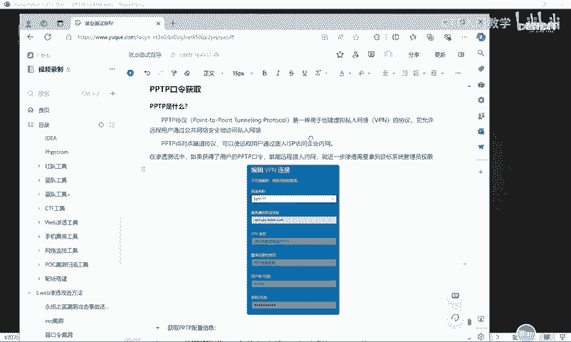

## 什么是PPTP？

上一节我们介绍了Windows凭据获取的多种场景，本节中我们来看看PPTP凭证的获取。

PPTP是“点对点隧道协议”的简称。它是一种网络协议，主要用于创建VPN连接。在Windows系统中，它允许用户通过公共网络（如互联网）安全地访问私有网络（如公司内网）。许多企业会使用堡垒机，员工需要通过VPN拨号进入内网才能管理服务器。在渗透测试中，如果获取了用户的PPTP口令，攻击者就能冒充其身份拨入VPN，从而深入内网进行横向移动。

## 模拟PPTP连接环境

为了进行实验，我们需要先在系统中创建一个PPTP连接。以下是创建步骤：

1.  打开Windows设置，进入“网络和Internet” -> “VPN”。
2.  点击“添加VPN连接”。
3.  在相应字段填写信息（可随意填写用于测试），并设置用户名和密码。
4.  点击“保存”。

这样，系统中就保存了一条PPTP连接记录，我们可以模拟攻击者来获取其凭证。

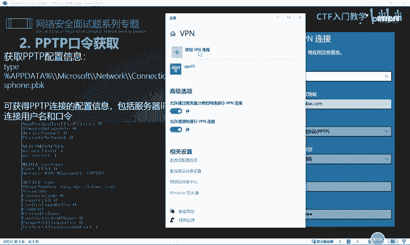

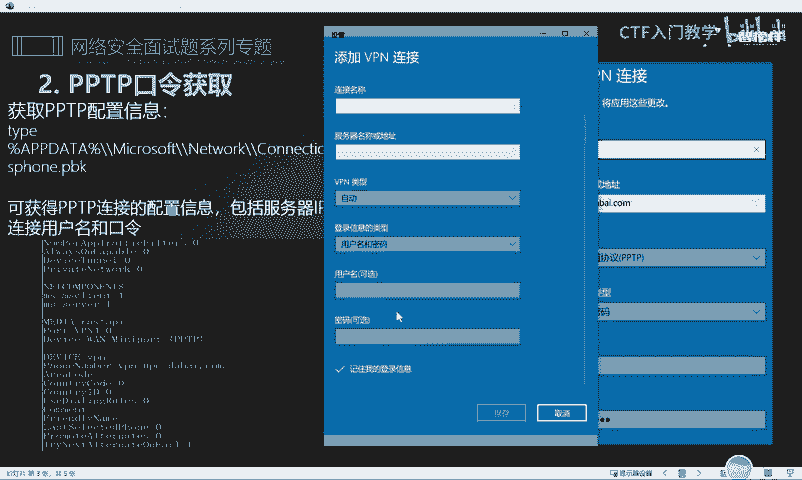

## 获取PPTP口令的方法

成功入侵目标系统后，需要进行信息收集，其中就包括凭据信息。以下是获取PPTP口令的两种主要方法。

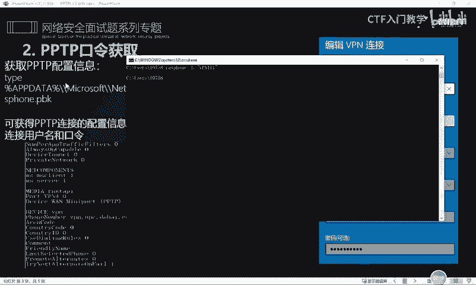

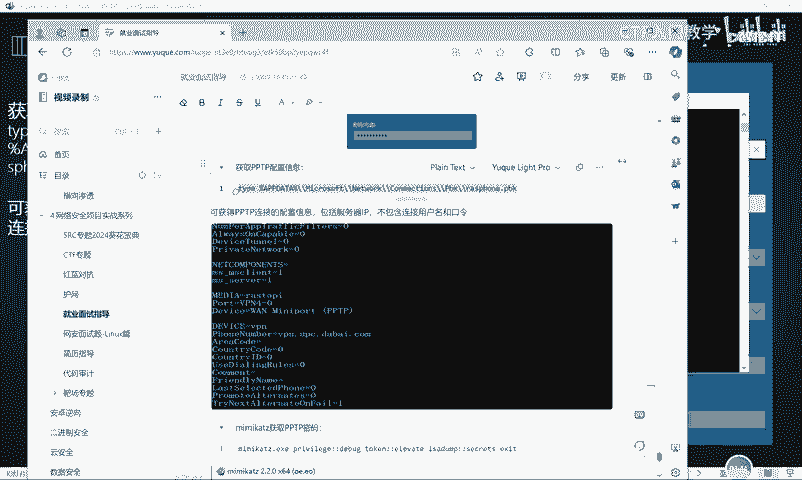

### 方法一：通过命令行读取配置文件

我们可以直接读取系统存储PPTP配置的文件来获取信息。

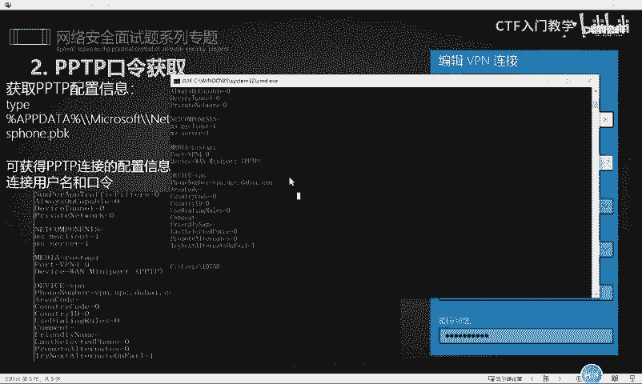

执行以下命令：
```cmd
cmdkey /list
```
此命令会列出系统存储的所有凭据。在输出结果中，我们需要筛选出类型为“通用凭据”且名称与VPN相关的条目，其中可能包含明文的连接用户名。

### 方法二：使用Mimikatz工具

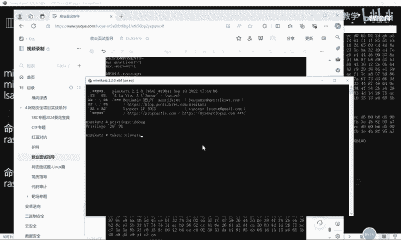

Mimikatz是一款功能强大的凭据提取工具。在获得目标系统权限后，可以上传并运行它。

以下是操作步骤：

1.  以管理员权限运行Mimikatz。
2.  依次输入以下命令：
    ```cmd
    privilege::debug
    sekurlsa::logonpasswords
    ```
    `privilege::debug`命令用于启用调试权限（提权）。`sekurlsa::logonpasswords`命令会提取内存中的登录凭证，在冗长的输出结果末尾，可以找到`MS-VPN`或`RAS`相关的字段，其中就包含了PPTP连接的用户名和密码。

例如，输出中可能包含如下信息：
```
Username : admin
Password : admin123
```
这对应了我们之前设置的PPTP连接的账号和密码。

## 利用获取的PPTP口令

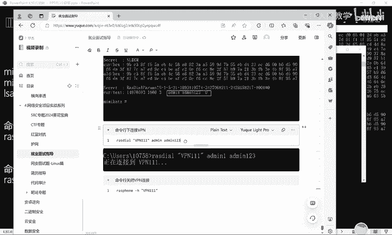

成功获取PPTP账号和密码后，就可以在命令行中直接连接目标VPN。

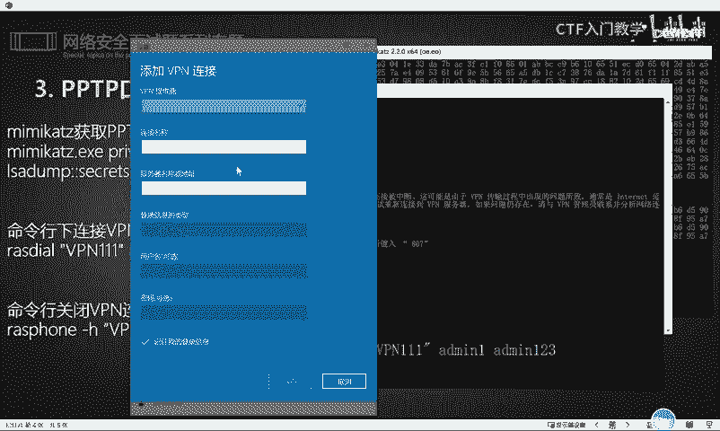

使用以下命令格式进行连接：
```cmd
rasdial “你的VPN连接名称” 用户名 密码
```
例如：
```cmd
rasdial “MyCompanyVPN” admin admin123
```
执行后，系统会尝试建立VPN连接。如果连接成功，你的机器就进入了目标内网。若要断开连接，使用命令：
```cmd
rasdial “你的VPN连接名称” /disconnect
```

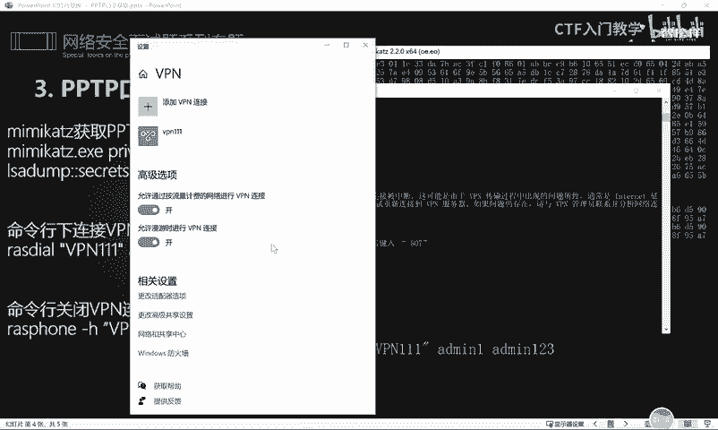

## 总结

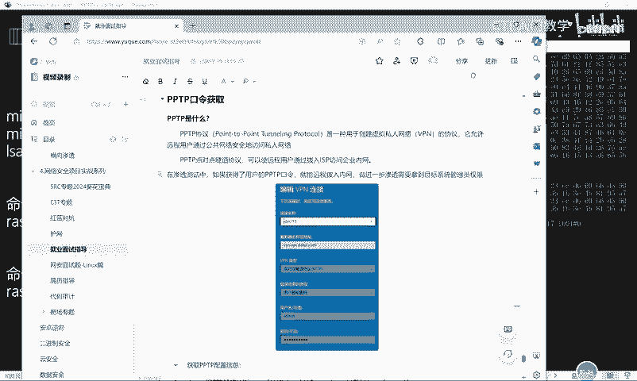

本节课中我们一起学习了PPTP协议的基本概念，并掌握了两种获取Windows系统PPTP连接口令的方法：通过`cmdkey`命令读取配置以及使用Mimikatz工具提取内存凭证。最后，我们学习了如何利用获取到的口令通过`rasdial`命令连接VPN，为内网横向渗透做好准备。理解这些流程对于全面的渗透测试至关重要。