# 网络安全入门：P44：Windows Hash简介 🔐

在本节课中，我们将要学习Windows系统中的哈希值概念。哈希是网络安全，特别是内网渗透和横向移动中一个至关重要的知识点。理解Windows如何存储和处理用户密码，是后续学习密码破解、凭证窃取等高级技术的基础。

## 什么是Windows哈希？🔍

上一节我们介绍了用户登录的基本流程，本节中我们来看看Windows系统如何处理用户密码。Windows系统不会保存用户输入的明文账号密码。用户登录时输入的账号密码，会经过系统进程的加密运算，转换成哈希值。

**哈希** 是指使用一种加密函数对任意长度的字符串数据进行数学加密运算，返回一个固定长度的字符串结果。

在Windows系统中，主要使用两种哈希方法来处理用户密码：
*   **LM哈希**：一种较老的加密方式。
*   **NTLM哈希**：目前主流的加密方式，现已发展到NTLMv2版本。

此外，在域环境中还会用到 **Kerberos协议认证**。

Windows系统的密码哈希默认由LM哈希和NTLM哈希两部分组成。

## LM哈希与NTLM哈希的区别 📊

以下是两种哈希方式的主要应用场景：

| 系统版本 | 密码长度 | 默认使用的哈希 |
| :--- | :--- | :--- |
| 较老版本（如Win2000， XP， 2003） | 小于14位 | LM哈希 |
| 较老版本（如Win2000， XP， 2003） | 等于或大于14位 | NTLM哈希 |
| 较新版本（如Win7， Win10， Win11） | 任意长度 | NTLM哈希 |

目前主流的操作系统已基本不再使用LM哈希。

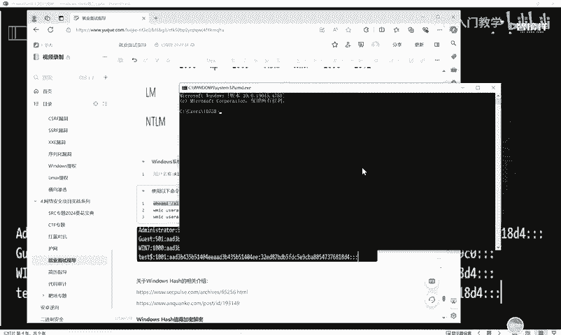

## Windows哈希密码格式 📝

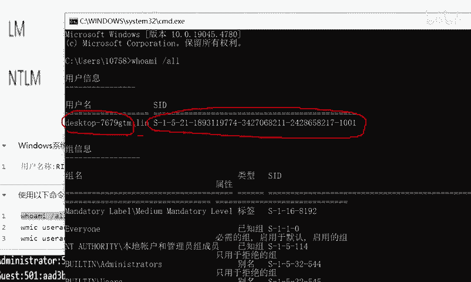

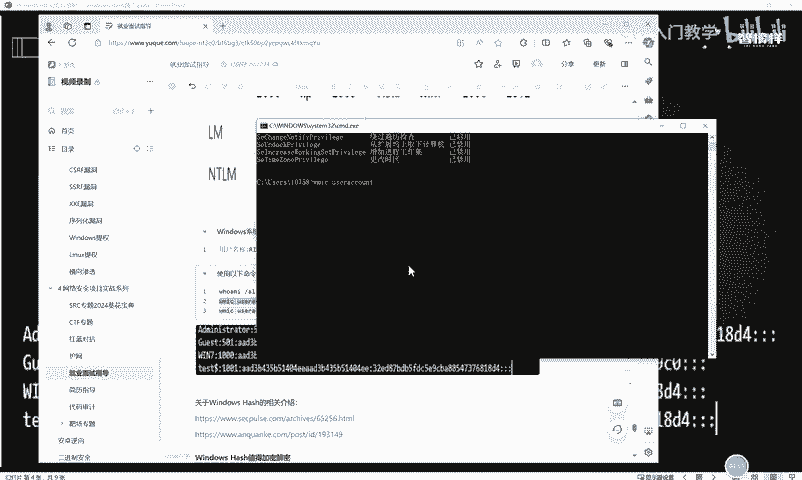

在Windows系统中，哈希密码有特定的存储格式。其基本结构如下图所示：

`用户名:RID:LM哈希值:NTLM哈希值:::`


*   **用户名**：系统账户名。
*   **RID**：相对标识符，是用户安全标识符的一部分。
*   **LM哈希值**：使用LM算法加密后的哈希值（可能为空）。
*   **NTLM哈希值**：使用NTLM算法加密后的哈希值。

## 如何查看用户SID值？ 💻

我们可以通过命令行查看当前系统用户的SID等信息。SID（安全标识符）是标识用户、组和计算机账户的唯一号码。

1.  按 `Win + R`，输入 `cmd` 打开命令提示符。
2.  输入以下命令查看当前用户信息：

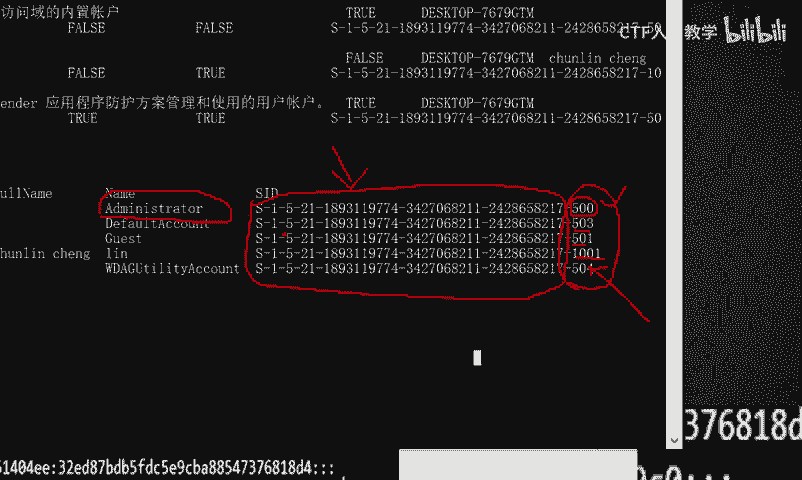

```cmd
whoami /user
```

命令执行后会显示当前用户名和对应的SID。

3.  输入以下命令查看本机所有用户账户信息：

```cmd
wmic useraccount get name， sid
```

4.  可以使用更精确的命令减少干扰信息：

```cmd
wmic useraccount get name， sid | findstr /v "S-1-5-21"
```

SID值具有固定规律。开头的长串（如 `S-1-5-21-...`）对于同一台计算机是相同的，真正标识用户身份的是末尾的**RID**部分。
*   **RID为500**：表示系统内置管理员账户。
*   **RID为1000+**：表示系统创建的后缀普通用户（可被加入管理员组）。

## Windows身份认证的三种方式 🛡️

Windows身份认证主要分为三种方式：

**1. 本地认证**
用户在本机输入账号密码，由 `lsass.exe` 进程将明文密码转换为NTLM哈希，并与本地 `SAM` 数据库中的哈希值进行比对。匹配成功则登录成功，失败则被拒绝。

**2. 网络认证**
当用户尝试远程访问网络资源（如文件共享、FTP）时触发的认证。其核心也是基于NTLM哈希的挑战/响应机制。

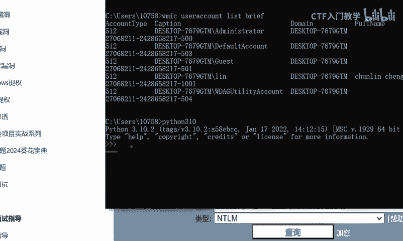

**3. 域认证**
主要在域环境中使用，基于Kerberos协议进行认证，比NTLM更安全。

## NTLM哈希的加密与解密演示 🧪

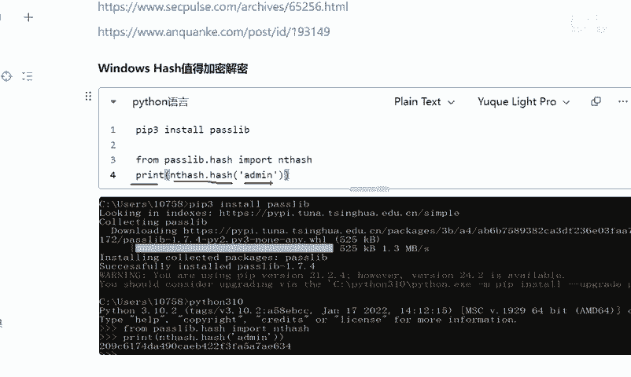

了解理论后，我们通过Python进行一个简单的NTLM哈希加密解密演示，直观感受其过程。

**步骤1：准备Python环境**
首先，需要在Python环境中安装必要的模块。在命令行中执行：

```bash
pip3 install passlib
```

**步骤2：进行NTLM哈希加密**
启动Python交互环境，执行以下代码对字符串“hello”进行NTLM哈希加密：

```python
from passlib.hash import nthash
print(nthash.hash("hello"))
```

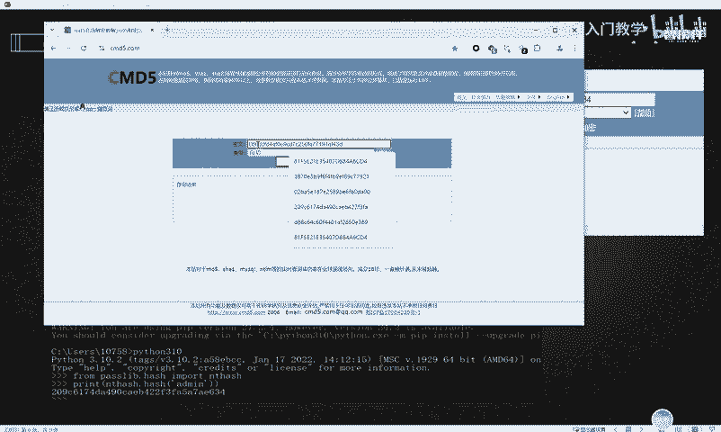

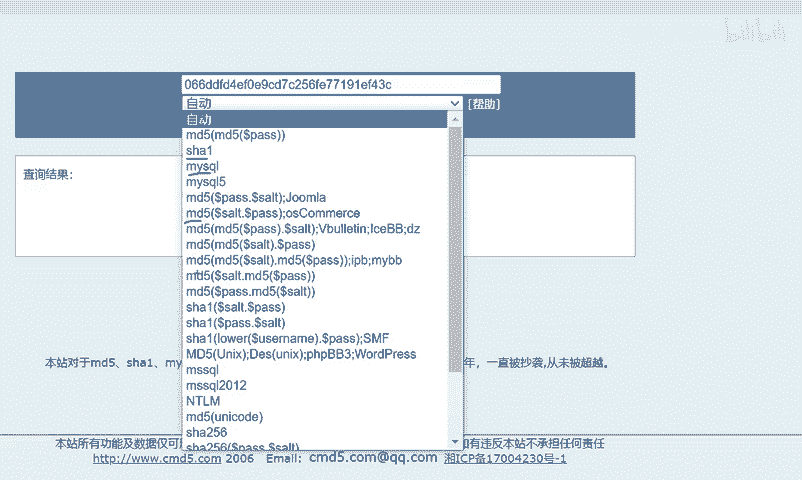

执行后会输出一串哈希值，例如：`6f6e0b4c4b8e0c6f6e0b4c4b8e0c6f6e`。这就是“hello”的NTLM哈希值。

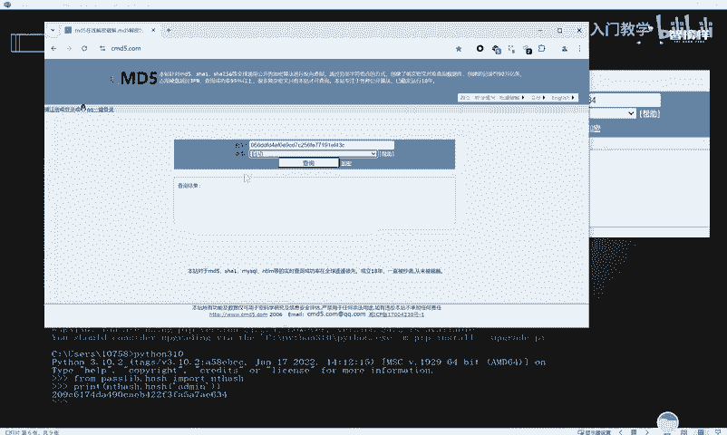

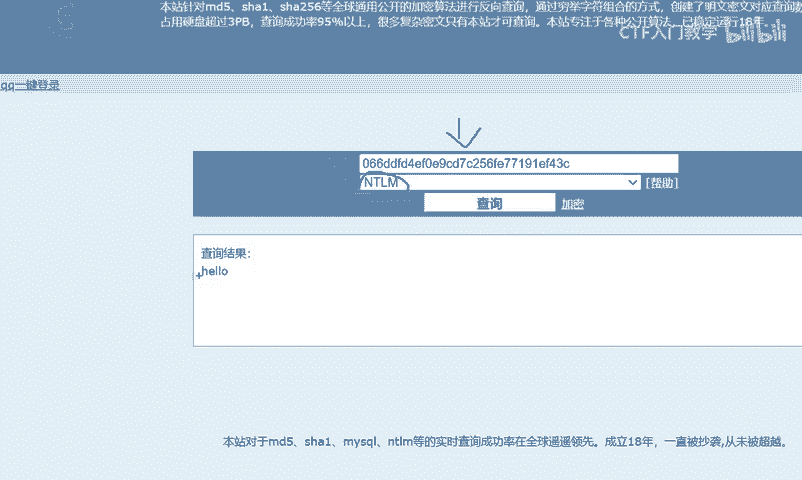

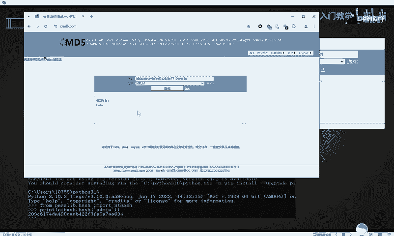

**步骤3：尝试在线解密**
我们可以使用在线哈希解密网站（如 `cmd5.com`）尝试破解。将上一步得到的哈希值粘贴到网站搜索框，网站会自动识别哈希类型（NTLM）并尝试反向查询。对于简单密码，很可能查询到原文“hello”。

> **注意**：此演示旨在理解流程。对于强密码，NTLM哈希在理论上不可逆，在线网站通过庞大的“彩虹表”进行匹配查询。

## 本地认证流程回顾 🔄

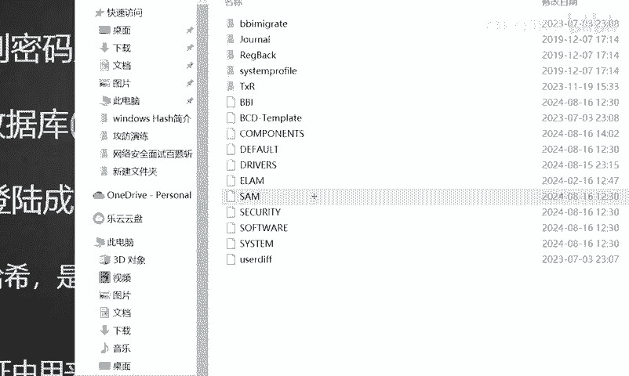

现在，让我们结合新学的哈希知识，回顾本地认证的完整流程：

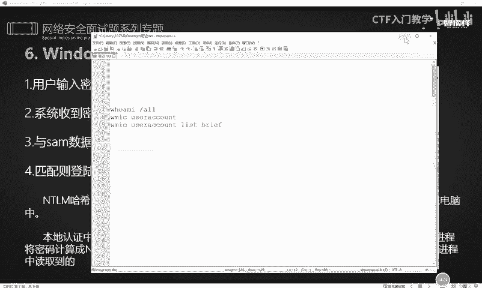

1.  用户在登录界面输入用户名和密码。
2.  系统接收密码后，由 `lsass.exe` 进程将其计算成NTLM哈希值。
3.  系统将计算得到的哈希值与存储在 `C:\Windows\System32\config\SAM` 文件数据库中的对应哈希值进行比对。
4.  如果哈希值完全匹配，则认证通过，允许登录；否则，认证失败。

在内网渗透的信息收集阶段，攻击者会尝试使用特定工具（如Mimikatz）读取内存或SAM数据库中的哈希值，获取这些凭证后用于横向移动。

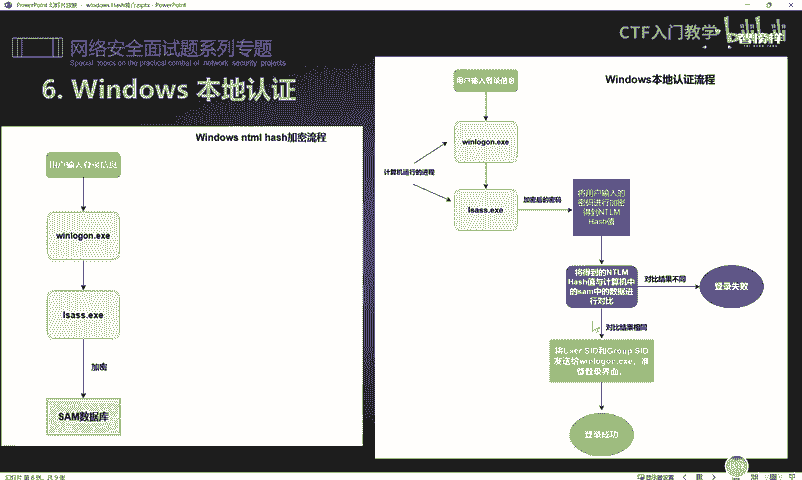

---

本节课中我们一起学习了Windows哈希的核心概念。我们了解了哈希的定义、LM与NTLM哈希的区别、Windows哈希的存储格式，并学会了查看用户SID。我们还探讨了Windows的三种认证方式，并通过Python演示了NTLM哈希的加密与解密过程。最后，我们回顾了本地认证的完整流程，并指出了哈希值在内网横向移动中的重要性。掌握这些基础知识，是进一步学习Windows系统安全与渗透测试的关键一步。