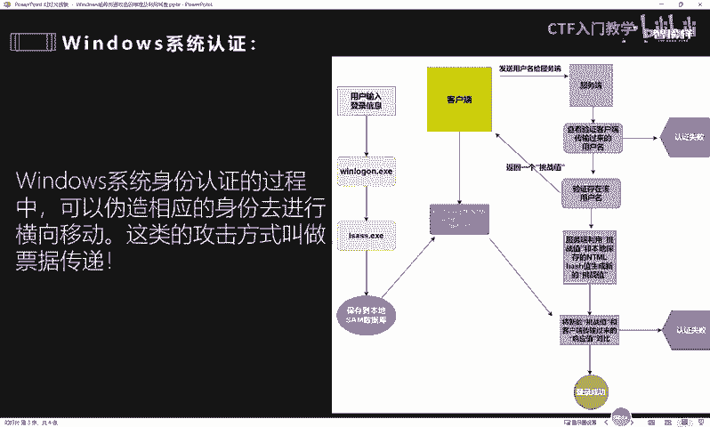
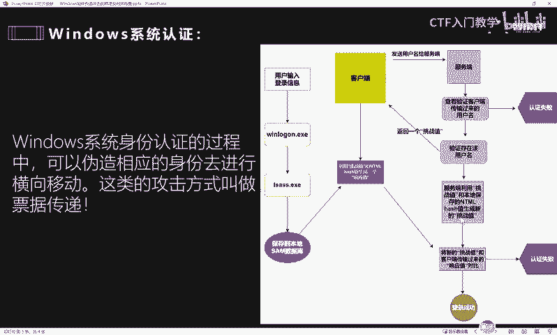
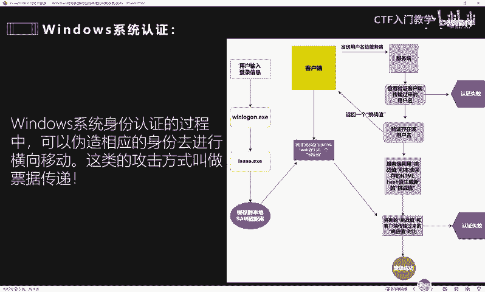
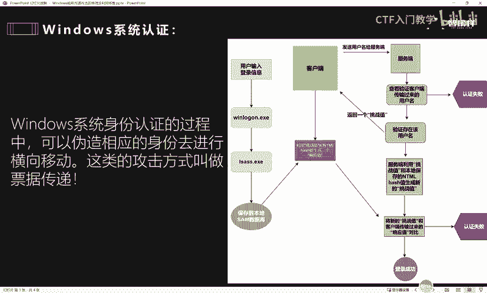

# 网络安全面试突击：P45：Windows哈希传递攻击的原理及利用场景 🔐

在本节课中，我们将学习Windows哈希传递攻击的原理及其在内网渗透中的利用场景。这是一种关键的横向移动技术，对于理解高级渗透测试至关重要。

上一节我们介绍了内网渗透的基本概念，本节中我们来看看一种具体的横向移动技术——哈希传递攻击。

## 认证流程基础

要理解哈希传递攻击，首先需要了解Windows系统的标准认证流程。

在Windows系统中，当用户输入明文账号密码登录时，本地安全机构子系统服务进程会将其加密为NTLM哈希值，并保存在本地的安全账户管理器数据库中。

当客户端需要访问网络资源或登录域控制器时，会发起认证请求。以下是标准流程：

1.  客户端向服务器发送用户名。
2.  服务器将用户名转发给域控制器进行验证。
3.  如果用户存在，服务器会生成一个随机数，作为“挑战值”返回给客户端。
4.  客户端使用本地存储的NTLM哈希值与收到的挑战值进行计算，生成一个“响应值”。
5.  客户端将响应值发送回服务器。
6.  服务器进行同样的计算，并将自己计算的结果与客户端发来的响应值进行比对。
7.  如果两者匹配，则认证成功；否则失败。

这个过程的核心公式可以简化为：
`响应值 = NTLM_Hash(挑战值)`

## 攻击原理

哈希传递攻击正是利用了上述认证流程中的漏洞。攻击者无需知道用户的明文密码，只需获得其NTLM哈希值，即可模拟该用户完成认证。

假设攻击者已经控制了一台内网主机，并从中提取出了某个高权限账户的NTLM哈希值。攻击流程如下：

1.  攻击者伪装成客户端，向目标服务器（如域控制器）发起认证请求，发送用户名。
2.  目标服务器返回挑战值。
3.  攻击者**无需进行密码哈希计算**，而是直接使用已窃取的NTLM哈希值与挑战值，通过工具（如Mimikatz）生成正确的响应值。
4.  攻击者将此响应值发送给服务器。
5.  服务器验证通过，攻击者成功以该用户身份获得访问权限。

关键点在于，攻击者跳过了由明文密码生成NTLM哈希的步骤，直接使用了“传递”过来的哈希值来完成认证。这就像拥有了房子的钥匙（哈希），而不需要知道制造钥匙的密码（明文）。

## 利用场景与危害

哈希传递攻击主要应用于内网横向移动阶段，特别是在域环境中威力巨大。

以下是哈希传递攻击的主要利用场景：

*   **权限提升与横向移动**：在拿下一台普通主机后，通过提取内存或本地存储的哈希值，攻击者可以尝试横向移动到内网中更重要的机器，如文件服务器、数据库服务器等。
*   **攻击域控制器**：这是最具威胁的场景。在域环境中，域管理员账户的哈希值通常具有最高权限。一旦获取，攻击者可以直接攻击域控制器，从而控制整个域网络。域控制器相当于整个域的“大脑”，控制它就等于控制了域内所有资源。
*   **绕过安全策略**：当网络策略禁止使用明文密码进行某些认证时，哈希传递攻击可以绕过这一限制。

这种攻击的危害性极大：
*   攻击者可以轻松获得对目标系统的访问权限。
*   能够完全模拟被窃取哈希值的用户行为，进行数据窃取、系统破坏等。
*   在域环境中，可能导致整个网络沦陷。

## 防御措施

了解攻击原理后，我们可以采取以下措施进行防御：

*   **使用强密码与定期更换**：增加哈希值被破解的难度。
*   **实施最小权限原则**：确保用户和账户只拥有完成其任务所必需的最小权限，限制攻击者横向移动的能力。
*   **启用Credential Guard**：这是Windows的一项安全功能，可以隔离和保护NTLM哈希、Kerberos票据等凭据，使其难以被工具提取。
*   **限制敏感账户的登录范围**：例如，域管理员账户只能登录到域控制器，禁止在其他工作站登录，减少其哈希值被窃取的机会。
*   **监控异常认证行为**：使用安全信息和事件管理解决方案监控网络中的异常登录和认证请求，尤其是来自非常规位置的哈希认证尝试。
*   **采用更安全的认证协议**：尽可能使用Kerberos认证替代NTLM，并考虑部署双因素认证。

本节课中我们一起学习了Windows哈希传递攻击的原理、利用场景及防御措施。我们了解到，攻击的核心在于直接使用窃取的NTLM哈希值绕过密码验证流程，从而在内网中实现横向移动，尤其在域环境中对域控制器的攻击威胁最大。防御的关键在于保护哈希值不被窃取、限制账户权限，并加强网络监控。掌握这一知识点对于应对高级渗透工程师岗位的面试至关重要。