# 网络安全面试突击：P46：Windows哈希值抓取教程 🔐

在本节课中，我们将学习一道经典的内网渗透面试题：如何抓取Windows系统的哈希值。我们将从理解面试官的考察意图开始，介绍核心工具，并分步演示抓取明文密码和哈希值的具体操作。

## 概述与考察点

上一节我们介绍了内网渗透的基本概念。本节中，我们来看看一道具体的面试题：“Windows系统哈希值如何进行抓取？”。

这道题通常出现在红队或高级渗透工程师岗位的面试中。面试官的核心考察点，是面试者对内网信息搜集环节的具体应用能力。信息搜集是整个渗透测试过程中至关重要的环节，甚至有“信息收集就是渗透测试的灵魂”这一说法。因此，抓取Windows系统中的哈希值，正是信息搜集在内网渗透中的一项关键实践。

## 核心工具介绍：Mimikatz 🛠️

在演示具体操作前，我们需要先认识一款功能强大的工具：**Mimikatz**。

Mimikatz主要用于抓取系统中的敏感信息，包括明文密码、哈希值、PIN码等，因此被誉为“密码抓取神器”。除了抓取凭据，它还能进行哈希传递、票据传递等操作，是一款强大的内网渗透工具。

## 抓取原理与两种场景

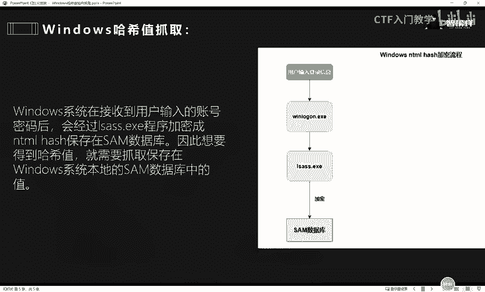

了解了工具后，我们来看看如何利用它抓取账号密码。抓取操作主要分为两种情况：

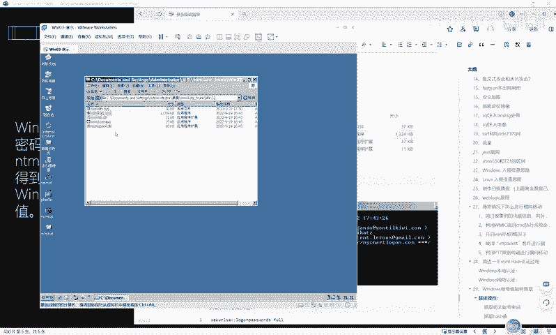

**1. 抓取明文密码**
Windows系统通常不会直接保存用户输入的明文密码。用户输入的密码会先由 `LSASS` 进程临时存储，随后被加密成NTLM哈希值并存入本地的SAM数据库。因此，要抓取明文密码，就需要从 `LSASS` 进程的内存中提取这些临时存储的凭据。

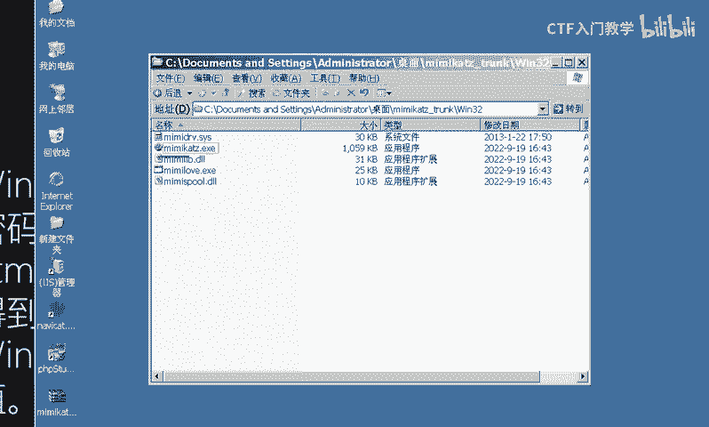

**2. 抓取哈希值**
我们的目标从 `LSASS` 进程转向了本地的 **SAM数据库**。Windows系统将用户密码加密后的NTLM哈希值就存储在这里。

## 实操演示：抓取明文密码 💻

接下来进入实操环节。我们在一台Windows 2003虚拟机上演示。首先，需要将Mimikatz工具上传至目标机器并运行。

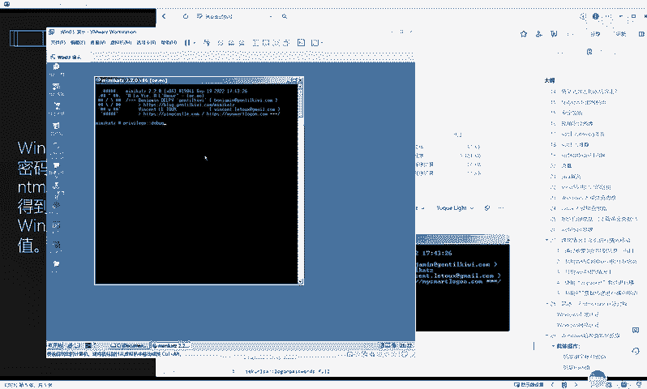

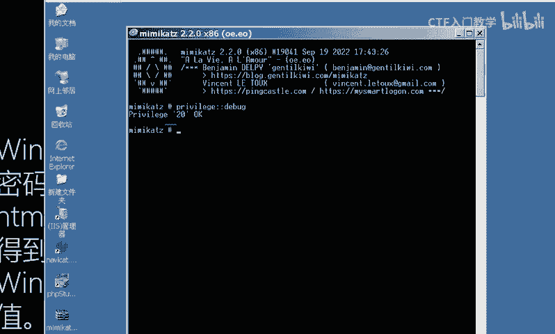

由于抓取凭据信息需要管理员权限，我们首先需要调用Mimikatz的提权模块。

以下是提权命令：
```bash
privilege::debug
```
在Mimikatz命令行中输入此命令并执行，若返回“OK”或“Privilege ‘20’ OK”，则说明提权成功。

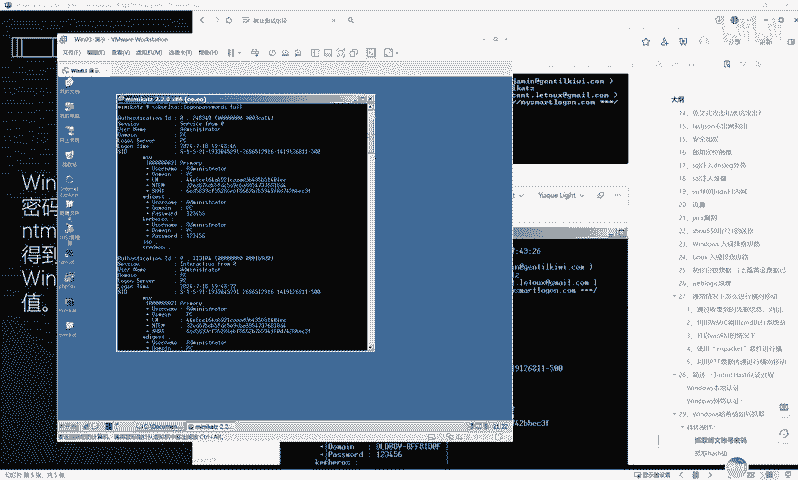

提权成功后，即可调用密码抓取模块。以下是抓取明文密码的命令：
```bash
sekurlsa::logonpasswords
```
执行该命令后，Mimikatz会列出当前系统内存中的所有登录凭据。在结果中，你可以找到例如 `Username` 为 `Administrator`，`Password` 显示为 `123456` 这样的明文信息。这表明我们成功抓取到了管理员的明文密码。

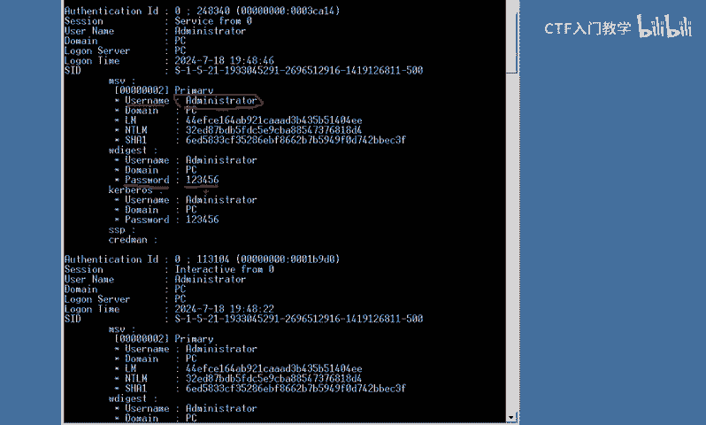

## 实操演示：抓取哈希值 🔑

现在，我们演示如何抓取存储在SAM数据库中的哈希值。同样，此操作需要管理员权限。

首先，确保已使用 `privilege::debug` 命令完成提权。

然后，使用以下命令来导出SAM数据库中的哈希值：
```bash
lsadump::sam
```
执行该命令后，Mimikatz会显示本地系统所有用户的用户名及其对应的NTLM哈希值。例如，用户 `Administrator` 的哈希值会以一长串字符的形式显示出来。

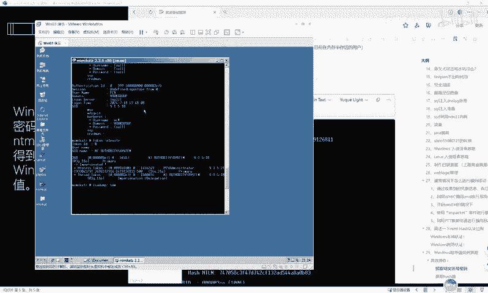

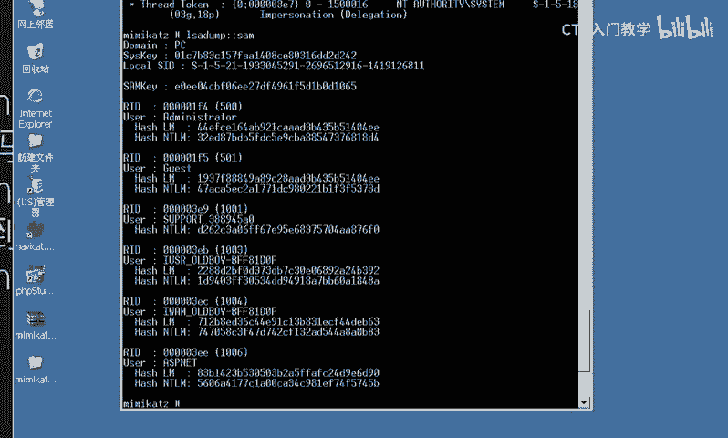

成功获取哈希值后，如果需要破解，可以将其提交至在线哈希破解网站（如CrackStation）进行离线解密尝试。

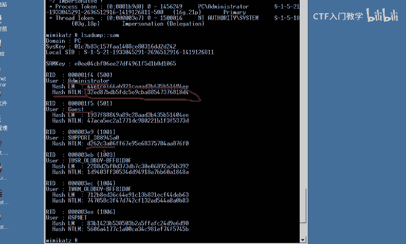

## 总结 📝

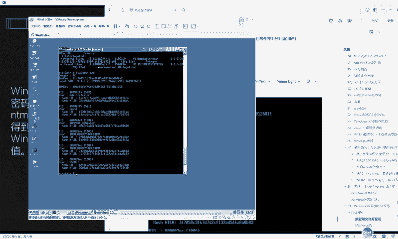

本节课中，我们一起学习了如何回答“Windows哈希值如何抓取”这道面试题。

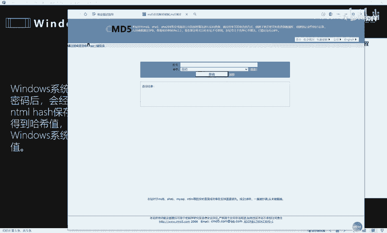

我们首先明确了面试官对内网信息搜集能力的考察意图。接着，介绍了核心工具Mimikatz及其在内网渗透中的作用。然后，我们区分了抓取明文密码和哈希值两种场景的原理差异：明文密码源于 `LSASS` 进程内存，而哈希值存储于 **SAM数据库**。最后，通过分步实操演示，我们使用Mimikatz完成了权限提升，并分别执行命令成功抓取了明文密码和NTLM哈希值。

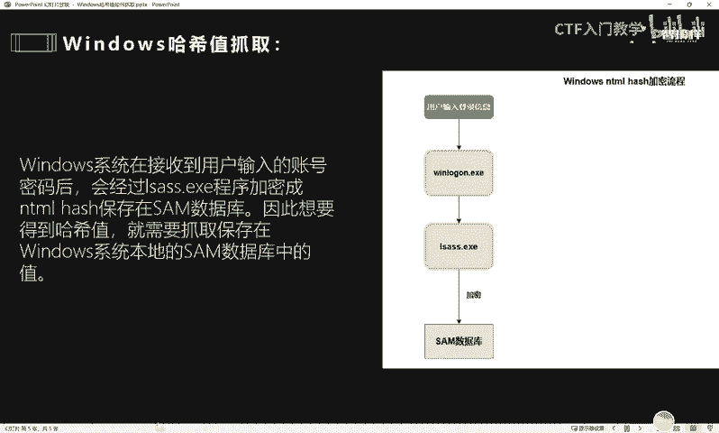

掌握这些操作，不仅能应对面试提问，更是内网渗透测试中信息搜集阶段必备的实战技能。