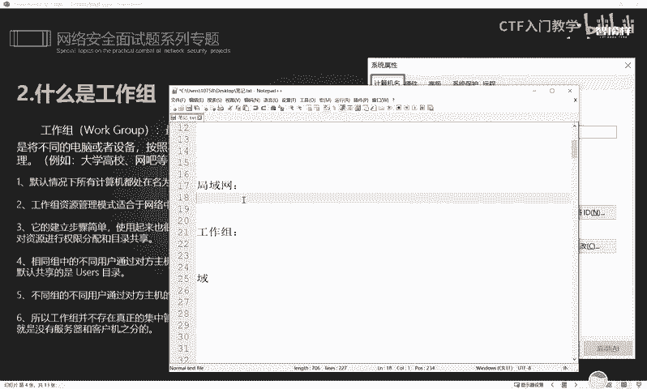
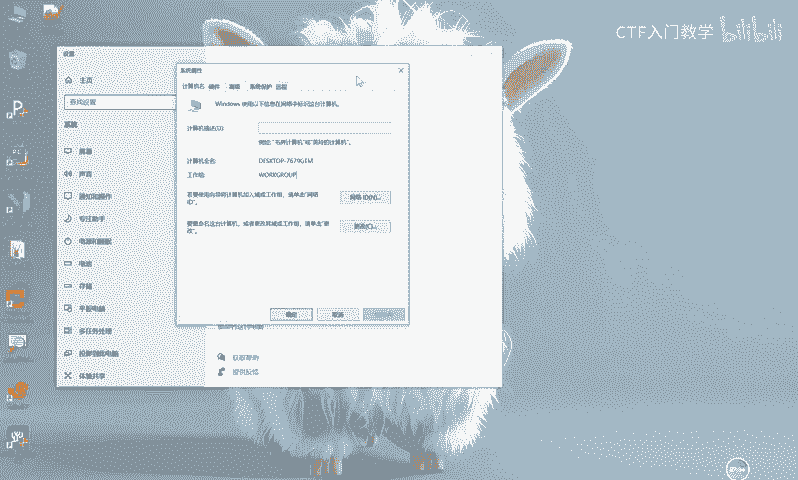
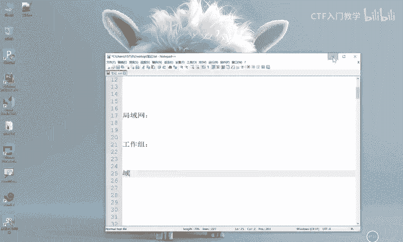
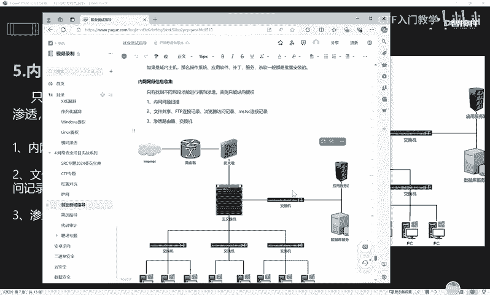

# 网络安全面试突击：P47：内网信息收集思路

在本节课中，我们将要学习内网渗透测试中至关重要的一步：内网信息收集。我们将从基本概念入手，理解内网环境的不同架构，并详细拆解信息收集的具体思路和目的，为后续的横向移动和权限提升打下坚实基础。

## 什么是内网渗透与信息收集

上一节我们介绍了课程背景，本节中我们来看看内网渗透的核心定义。

渗透测试的攻击流程中，信息收集是非常关键的一步。信息收集主要分为两个部分：
*   **外网信息收集**：发生在渗透攻击之前。目标是收集目标的域名、子域名、指纹、DNS信息、ICP备案号、旁站等资产信息。目的是寻找主站防护薄弱之处，利用漏洞发起攻击。
*   **内网信息收集**：发生在成功攻击并控制目标系统之后。目标是针对已控制目标所处的内部网络环境进行资产和信息搜集。这种收集比外网信息收集更全面、更精准。

内网渗透的定义是：在获取Webshell或系统权限后，进入网络内部，搜集各种信息，从而获取内部网络中有价值的资产或人员的重要信息。因此，信息收集被视为渗透测试的灵魂，在一次完整的渗透测试中，其工作量占比通常超过60%。做好信息收集对后续的渗透测试或攻击极为有利，而内网渗透的第一步就是进行内网信息收集。

## 内网网络架构：工作组、域与局域网

在开始具体的信息收集之前，我们需要先理解内网常见的几种网络架构。

内网网络架构主要分为三个层次：局域网、工作组和域。它们各有特点，应用于不同规模的网络环境。

以下是三种架构的区别：
1.  **局域网 (LAN)**：规模最小的网络单元。一个典型的例子是家庭网络，由路由器（或Wi-Fi）及其连接的所有设备（如手机、电脑、智能家电）组成。
2.  **工作组 (Workgroup)**：网络规模比局域网更大，常见于学校、网吧等早期对管理要求不严格的环境。工作组通过将计算机分组来进行管理，避免内网系统过于混乱。在默认情况下，Windows计算机都处于名为 **`WORKGROUP`** 的工作组中。
3.  **域 (Domain)**：用于管理严格的大型复杂网络，是大型企业或互联网公司常用的环境。域环境的管理和控制力度远高于工作组和局域网，将是我们后续学习的重点。

## 内网信息收集的核心思路

认识了基本概念后，本节我们来看看攻入内网后，具体应该收集哪些信息。

在通过漏洞成功控制一台内网机器后，我们需要立即进行信息收集。首要目标是摸清本机及其所处网络环境的基本情况。

针对本机，需要收集的信息包括：
*   本机的IP地址、网关、DNS设置。
*   网络连接情况，判断能否连通外网。
*   本机开放了哪些端口。
*   本机的hosts文件记录，并判断是否可以修改。
*   本机是否开启了代理。
*   判断是否存在域环境，如果存在，域名是什么。
*   操作系统的详细信息和当前获得的权限级别。
*   是否安装了杀毒软件。
*   安装了哪些服务与补丁。

收集这些信息的目的，是为了全面掌握目标网络的架构和资产情况，为后续扩大渗透成果（即横向移动和权限提升）做好准备。

## 横向渗透与纵向提权

在完成本机信息收集后，我们需要根据收集到的信息规划下一步行动，这就涉及到两个核心概念：横向渗透和纵向提权。

为了理解这两个概念，我们可以参考一个简单的内网拓扑图。假设我们通过漏洞控制了内网中的一台应用服务器。

*   **纵向提权 (Vertical Privilege Escalation)**：指在单台机器上，从较低权限（如普通用户）提升到更高权限（如管理员/系统用户）的过程。例如，我们控制的应用服务器当前是普通用户权限，许多信息收集命令无法执行。此时，我们需要先进行提权，获得完全的系统控制权。
*   **横向移动/渗透 (Lateral Movement)**：指在完全控制一台机器后，以此机器为跳板，对内网中的其他机器发起攻击，扩大控制范围。例如，在完全控制应用服务器后，通过信息收集发现同内网还有数据库服务器、员工电脑等。我们就可以尝试攻击这些新目标，从而获取更多敏感数据。

## 信息收集的扩展手段

明确了行动方向后，我们可以利用一些扩展手段来发现更多的内网资产和攻击路径。

除了基本的系统命令扫描外，还可以通过检查目标机器的使用记录来发现线索：
*   **文件共享与FTP连接记录**：查看文件管理器地址栏的下拉历史或FTP客户端连接记录，可以发现近期访问过的其他内网主机。
*   **浏览器历史记录**：检查浏览器的访问历史、保存的密码和表单数据，可能发现内部系统地址、登录凭证等敏感信息。
*   **远程桌面连接记录**：查看远程桌面客户端的连接历史。如果目标用户有保存密码的习惯，可能直接获取到连接其他主机的凭证，从而实现快速的横向移动。
*   **网络设备探测**：对网关、路由器、交换机等网络设备进行探测，这些设备可能配置不当，成为新的突破口。

这些分析和判断的思路，都可以灵活运用到具体的渗透测试项目中。

## 总结与预告

本节课中我们一起学习了内网信息收集的核心思路。我们首先区分了外网与内网信息收集的时机与目的，然后介绍了内网的三种基本架构：局域网、工作组和域。接着，我们详细列出了攻入内网后需要收集的本机信息，并解释了**横向渗透**与**纵向提权**这两个关键概念。最后，我们探讨了一些扩展的信息收集手段，如分析各种连接记录。

通过本课的学习，你应该对内网渗透初期的工作有了清晰的框架性认识。下次课，我们将一起学习内网渗透测试中具体使用的命令和工具，将理论转化为实践。