# 网络安全入门：P48：内网信息收集演示一

## 概述
在本节课中，我们将学习内网信息收集的具体操作。我们将通过一个模拟的靶场环境，演示如何使用一系列命令来收集目标主机的用户信息、系统配置、网络设置等关键数据。这些操作是渗透测试和网络安全评估中基础且重要的步骤。

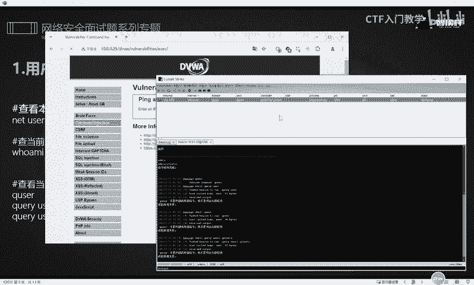

---

## 环境准备
上一节我们介绍了内网信息收集的思路和流程。本节中，我们来看看具体的命令操作和它们能达到的效果。

演示环境基于一台安装了Windows 10的虚拟机。该虚拟机上部署了PHPStudy中间件和DVWA靶场。我们利用DVWA靶场中的一个命令执行漏洞，执行Cobalt Strike的木马命令，从而获得对目标主机的初步控制权限（即CS上线）。获得权限后，下一步就是进行信息收集。


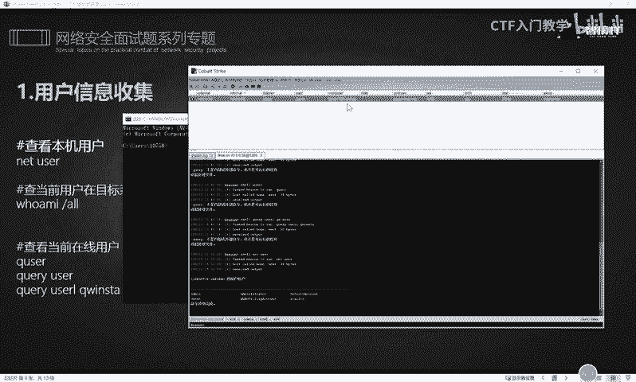

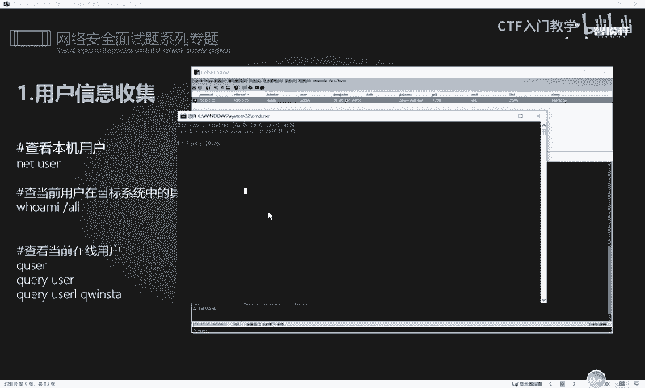

---

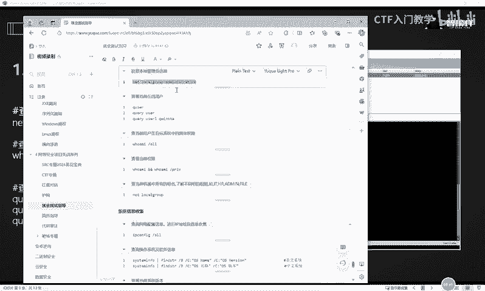

## 用户信息收集
获得目标主机的控制权后，首先需要收集用户相关的信息。这有助于了解系统的用户构成和权限分配。

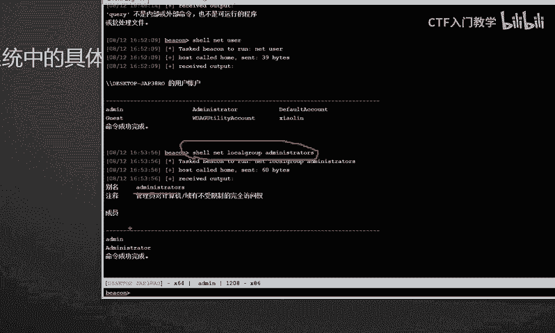

以下是收集用户信息的常用命令：

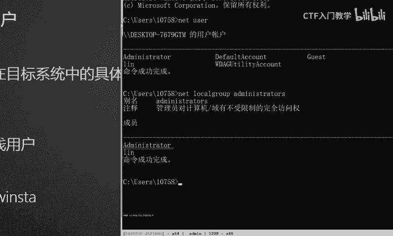

1.  **查看本地用户账户**
    使用 `net user` 命令可以列出当前系统中的所有用户账户。
    ```cmd
    net user
    ```
    执行该命令后，会显示如 `Administrator`、`Guest` 等用户账户。不同系统的显示结果会因环境而异。

    

2.  **获取本地管理员组信息**
    使用 `net localgroup administrators` 命令可以查看具备管理员权限的用户。
    ```cmd
    net localgroup administrators
    ```
    该命令会列出所有属于管理员组的用户，例如 `Administrator` 和自定义的管理员账户。

    

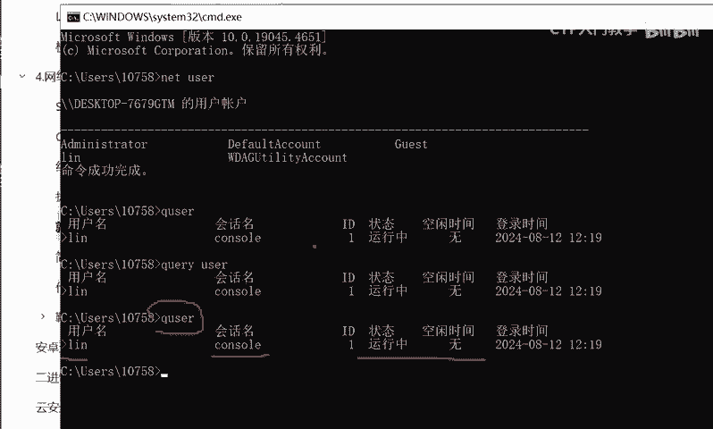

3.  **查看当前登录用户**
    以下三条命令中的任意一条都可以用来查看当前登录到系统的用户名。
    ```cmd
    whoami
    ```
    ```cmd
    query user
    ```
    ```cmd
    quser
    ```
    执行后，会显示当前会话的用户名，例如 `Administrator`。

    

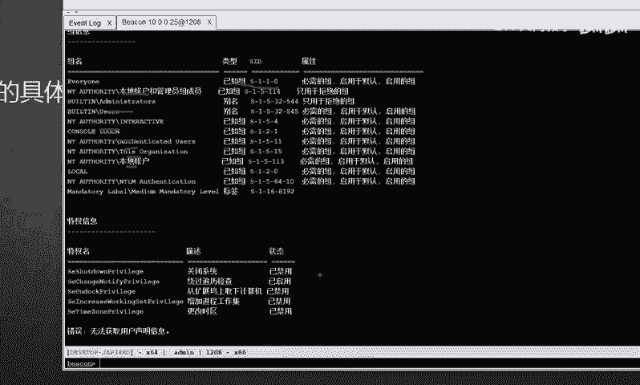

4.  **查看当前用户的详细权限**
    使用 `whoami /all` 命令可以展开显示当前用户的所有权限和所属组等详细信息。
    ```cmd
    whoami /all
    ```
    与单独的 `whoami` 命令相比，此命令提供的信息更为全面。

    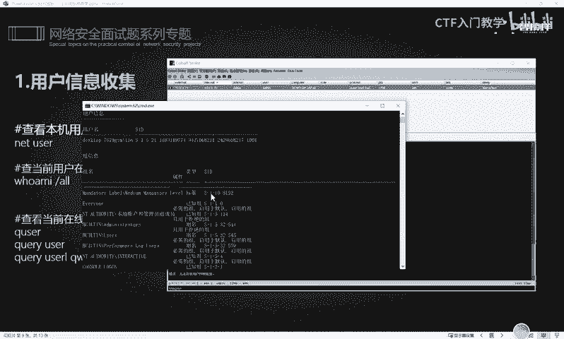

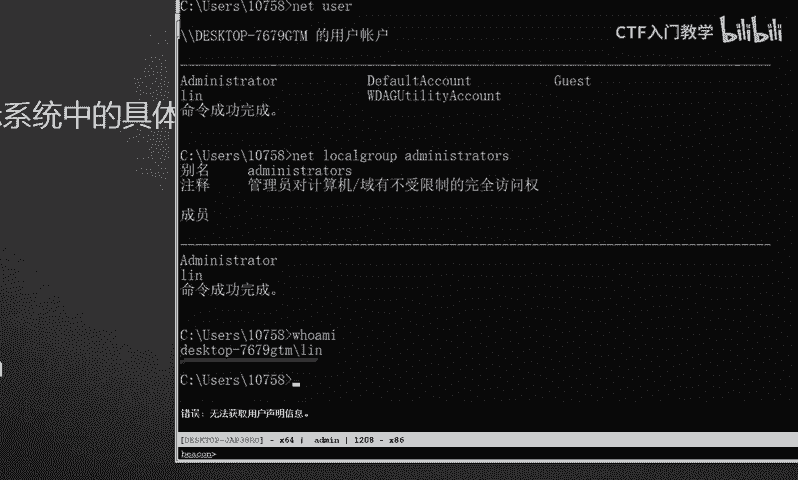


5.  **查看所有组名**
    使用 `net localgroup` 命令可以查看系统中所有的组，这有助于理解不同组（如IT组、HR组）的职能。
    ```cmd
    net localgroup
    ```

---

## 系统信息收集
了解用户信息后，接下来需要收集目标主机的系统配置和网络信息。

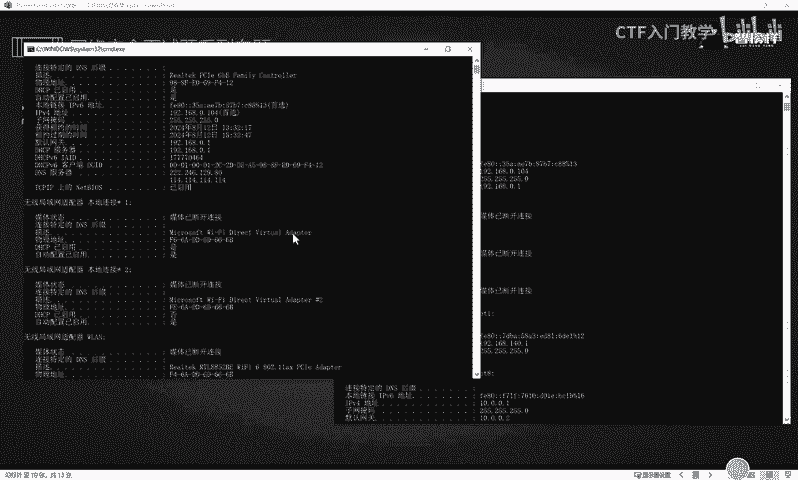

以下是收集系统信息的常用命令：

1.  **查询网络配置信息**
    *   **查看IP地址**：使用 `ipconfig` 命令可以查看本机的IP地址、子网掩码、默认网关等基本信息。
        ```cmd
        ipconfig
        ```
    *   **查看详细信息**：使用 `ipconfig /all` 命令可以获取更全面的网络配置信息，包括MAC地址、DNS服务器等。
        ```cmd
        ipconfig /all
        ```
        通过对比两个命令的输出，可以直观地看到 `/all` 参数带来的信息增量。

        

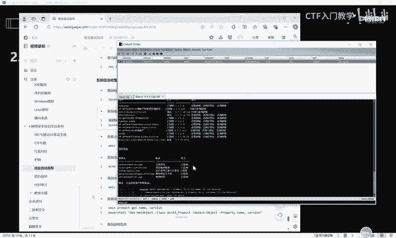

2.  **查询操作系统及软件信息**
    *   **针对英文系统**：可以使用以下命令来查询操作系统名称。
        ```cmd
        systeminfo | findstr /B /C:"OS Name"
        ```
    *   **针对中文系统**：在中文Windows环境下，需要匹配中文“OS 名称”。
        ```cmd
        systeminfo | findstr /B /C:"OS 名称"
        ```
        根据系统语言选择正确的命令，才能正确获取信息。

        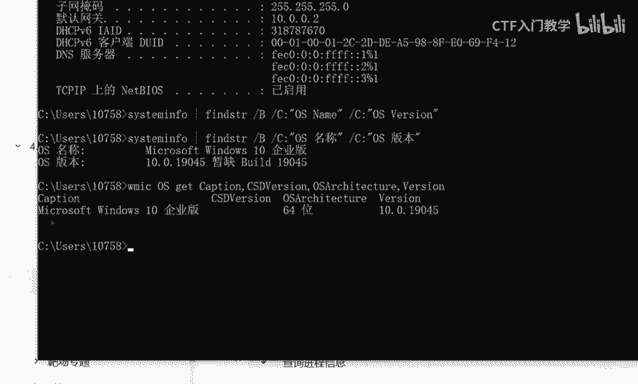

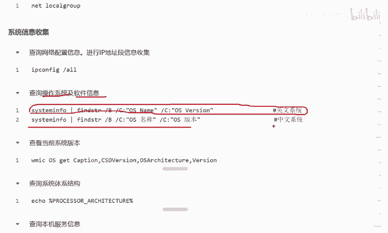

3.  **查看详细系统版本**
    使用 `systeminfo` 命令可以获取非常详细的系统信息，包括版本号、安装日期、热修复等。
    ```cmd
    systeminfo
    ```

4.  **查询系统体系结构**
    使用以下命令可以判断操作系统是32位还是64位。
    ```cmd
    echo %PROCESSOR_ARCHITECTURE%
    ```
    执行后，会显示类似 `AMD64` 的结果，表明是64位系统。

    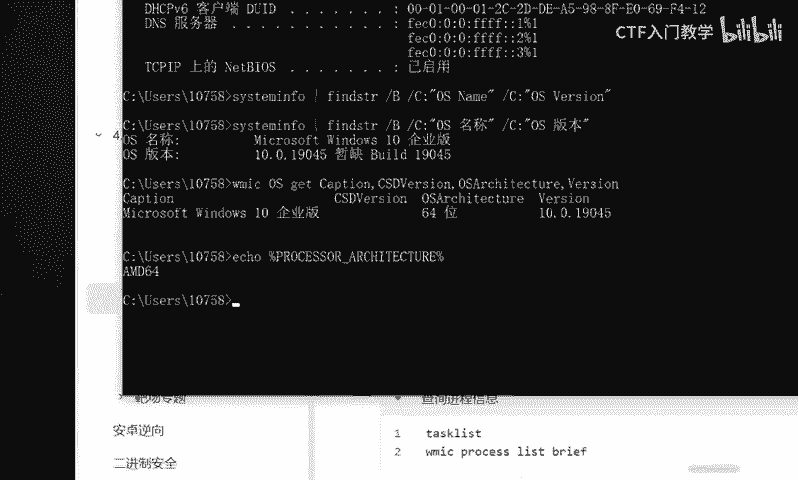


5.  **查询本机服务信息**
    使用 `net start` 命令可以查看当前系统正在运行的所有服务。
    ```cmd
    net start
    ```
    在实际渗透测试中，收集到的所有命令回显结果都应妥善记录，用于后续分析，而不是仅仅查看。

6.  **其他有用命令**
    *   **查看进程列表**：`tasklist`
    *   **查看程序安装路径**：通常可通过检查注册表或特定目录（如 `Program Files`）来实现。

---

## 总结
本节课中，我们一起学习了内网信息收集阶段需要执行的一系列基础命令。我们演示了如何收集用户账户、权限、网络配置以及操作系统详情等信息。掌握这些命令是进行有效渗透测试和信息安全评估的基础。关键在于多加练习，并在实际操作中养成及时记录和整理信息的习惯。