# 网络安全入门：P49：内网信息收集演示二

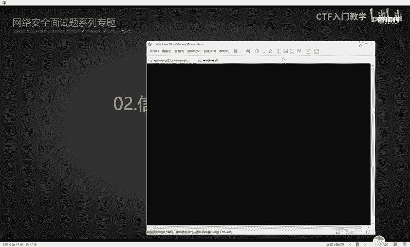

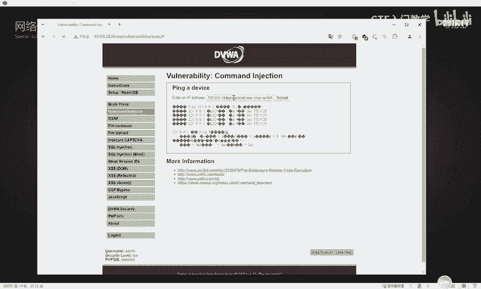

## 概述
在本节课程中，我们将继续学习内网渗透测试中的信息收集环节。上一节我们介绍了系统层面的基础信息收集，本节我们将重点学习如何收集网络配置、防火墙策略以及安全软件等更深层次的信息，这些信息对于后续的内网横向移动至关重要。

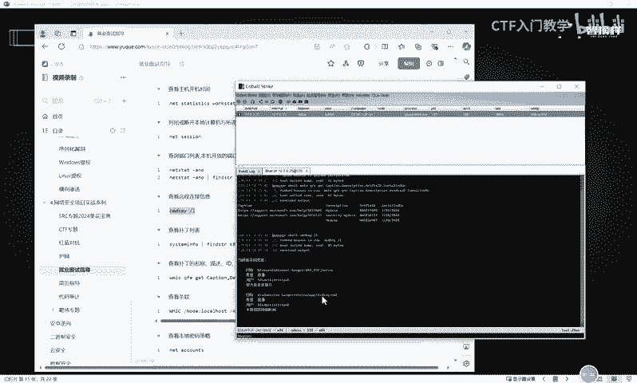

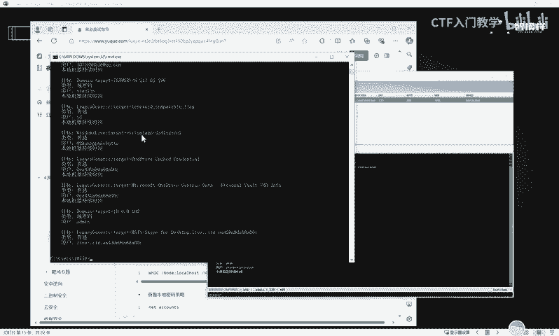

## 系统信息深度收集
在控制目标主机后，除了基础信息，还需要收集更详细的系统配置。

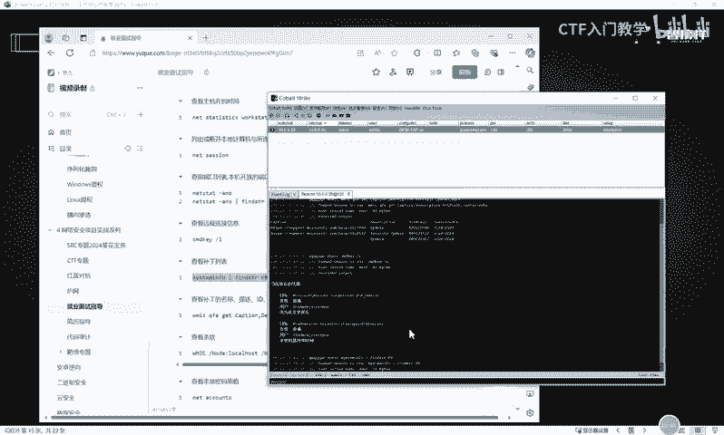

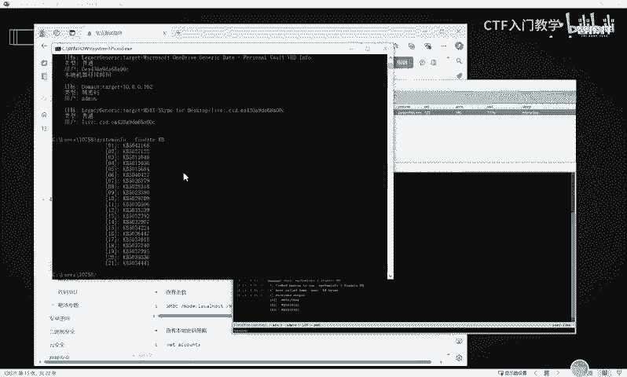

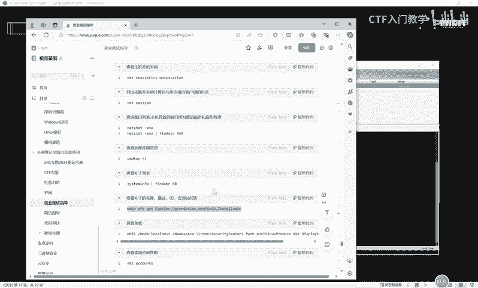

以下是关于系统连接和补丁信息的收集命令：

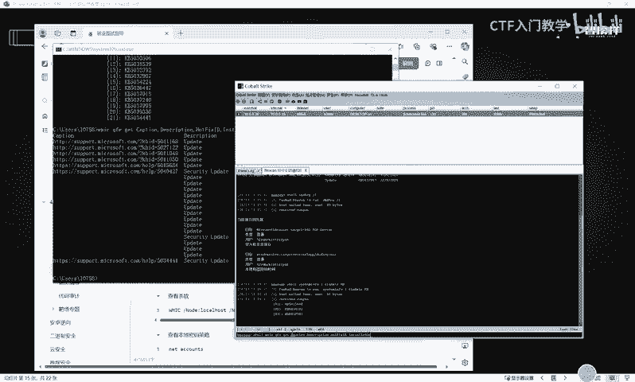

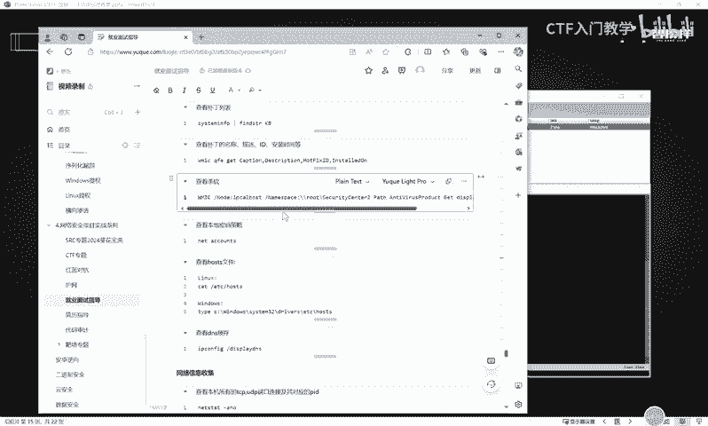

*   **查看远程连接记录**：使用 `query user` 命令可以查看当前及历史的远程桌面连接会话信息。
    ```cmd
    query user
    ```
*   **查看已安装的补丁列表**：使用 `systeminfo` 命令可以列出系统详细信息，其中包含已安装的补丁。
    ```cmd
    systeminfo
    ```
*   **查看补丁的详细信息**：使用 `wmic qfe list` 命令可以更清晰地查看补丁的名称、描述、ID和安装时间。
    ```cmd
    wmic qfe list
    ```

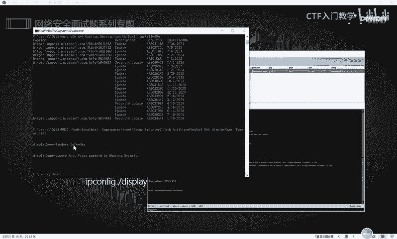

## 安全环境信息收集
了解目标主机的安全防护措施，有助于我们规避检测和选择攻击方式。

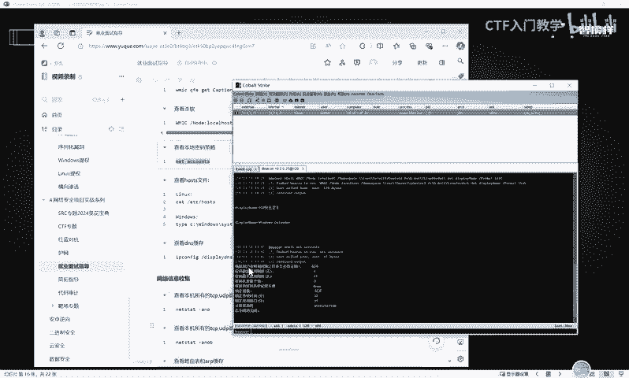

以下是关于安全软件和策略的收集命令：

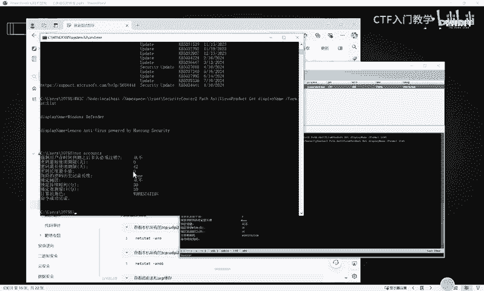

*   **查看已安装的杀毒软件**：使用 `WMIC` 命令可以查询系统中安装的安全产品。
    ```cmd
    WMIC /Namespace:\\root\SecurityCenter2 Path AntiVirusProduct Get displayName
    ```
*   **查看本地密码策略**：使用 `net accounts` 命令可以查看当前系统的密码复杂度、长度、有效期等策略。
    ```cmd
    net accounts
    ```

## 网络与共享信息收集
网络信息是内网渗透的路线图，能帮助我们理解目标网络结构并寻找横向移动的路径。

以下是关于网络配置和共享资源的收集命令：

*   **查看HOSTS文件**：HOSTS文件用于本地域名解析，可能包含内部网络的重要映射关系。
    *   **Windows系统**：
        ```cmd
        type C:\Windows\System32\drivers\etc\hosts
        ```
    *   **Linux系统**：
        ```bash
        cat /etc/hosts
        ```
*   **查看DNS缓存**：DNS缓存可能揭示目标访问过的内部域名，有助于判断是否处于域环境。
    ```cmd
    ipconfig /displaydns
    ```
*   **查看所有网络连接**：使用 `netstat` 命令查看所有TCP/UDP端口连接及其对应的进程ID（PID）。
    ```cmd
    netstat -ano
    ```
*   **查看路由表**：路由表显示了数据包的转发路径。
    ```cmd
    route print
    ```
*   **查看ARP缓存表**：ARP缓存表记录了与本机通信过的内网主机的IP和MAC地址。
    ```cmd
    arp -a
    ```
*   **查看本机共享列表**：列出本机开启的所有共享资源。
    ```cmd
    net share
    ```

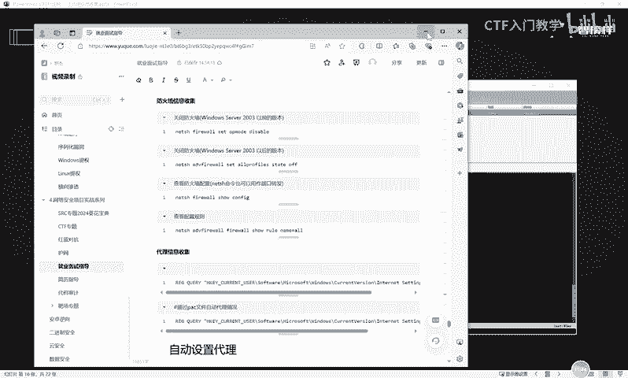

## 防火墙策略信息收集
防火墙是常见的网络访问控制手段，收集其策略有助于我们绕过防护。

以下是关于防火墙状态和规则的收集命令：

*   **查看防火墙状态**：检查Windows防火墙是否开启。
    ```cmd
    netsh advfirewall show allprofiles state
    ```
*   **查看防火墙详细配置**：查看入站、出站等详细规则。
    ```cmd
    netsh advfirewall firewall show rule name=all
    ```
*   **关闭防火墙（需管理员权限）**：在获得足够权限后，可以尝试关闭防火墙以方便后续操作。
    ```cmd
    netsh advfirewall set allprofiles state off
    ```

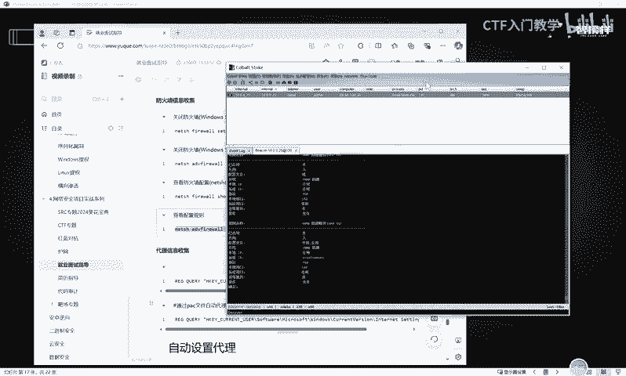

## 总结
本节课我们一起学习了内网信息收集的进阶内容。我们掌握了如何收集系统的补丁、安全软件、密码策略等安全配置信息，也学会了查看网络连接、共享资源、路由以及防火墙策略等关键网络信息。这些信息构成了我们对目标内网环境的完整认知，是制定有效渗透和横向移动策略的基础。请务必在实战中系统性地收集并记录这些信息。