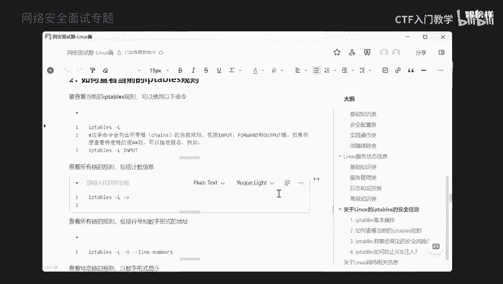
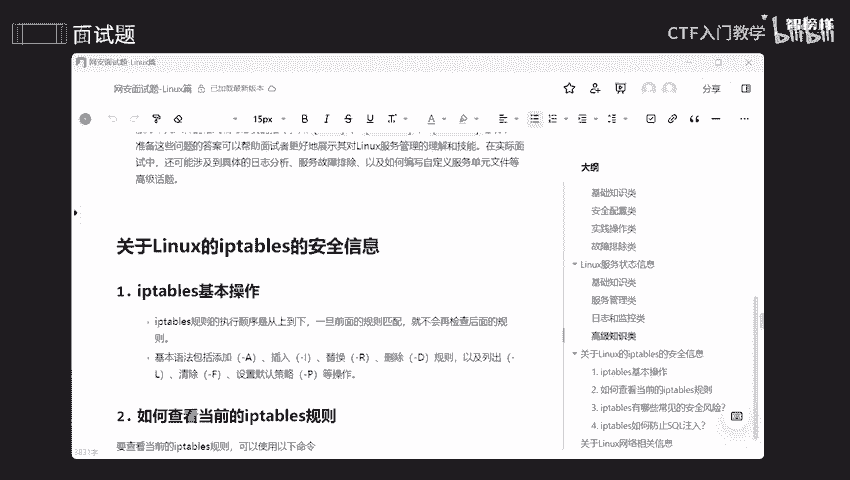
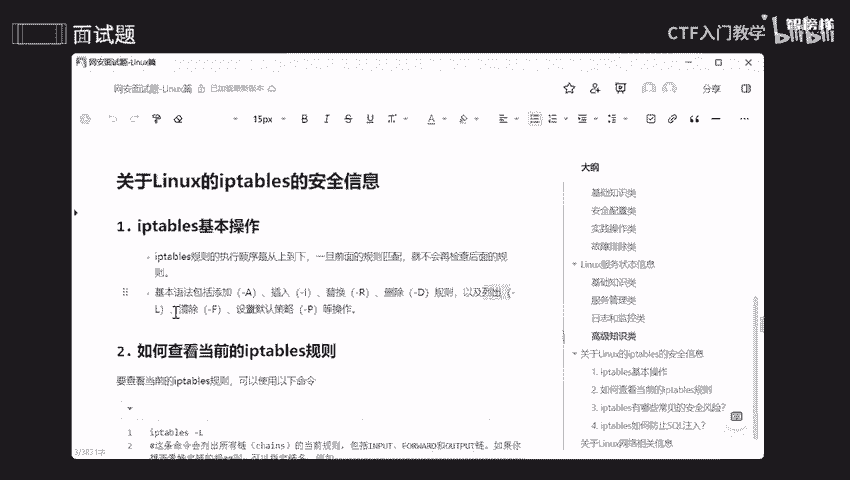
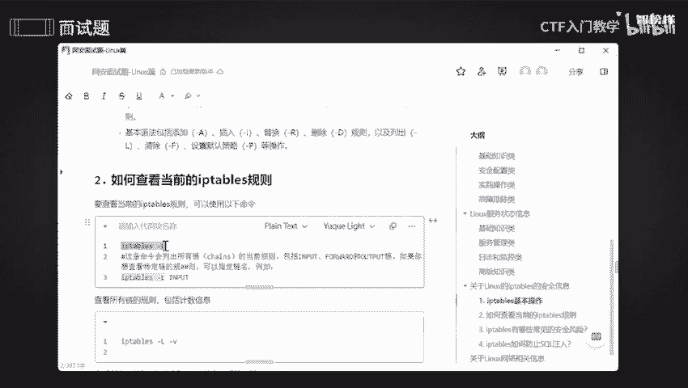
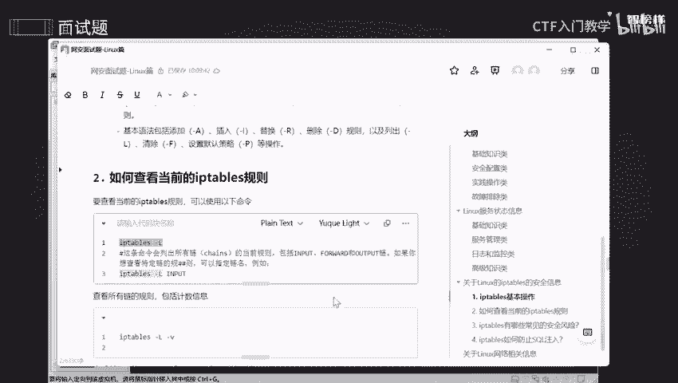
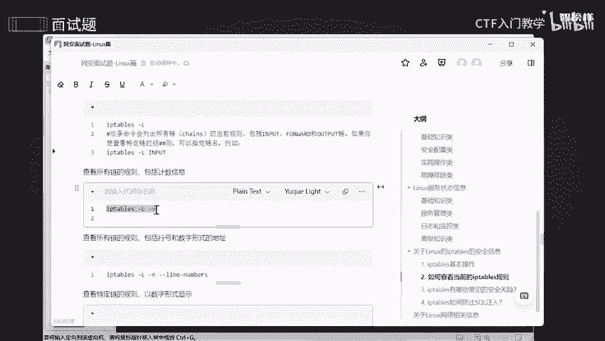
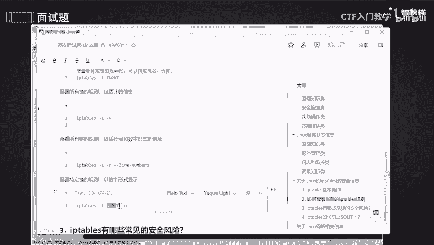
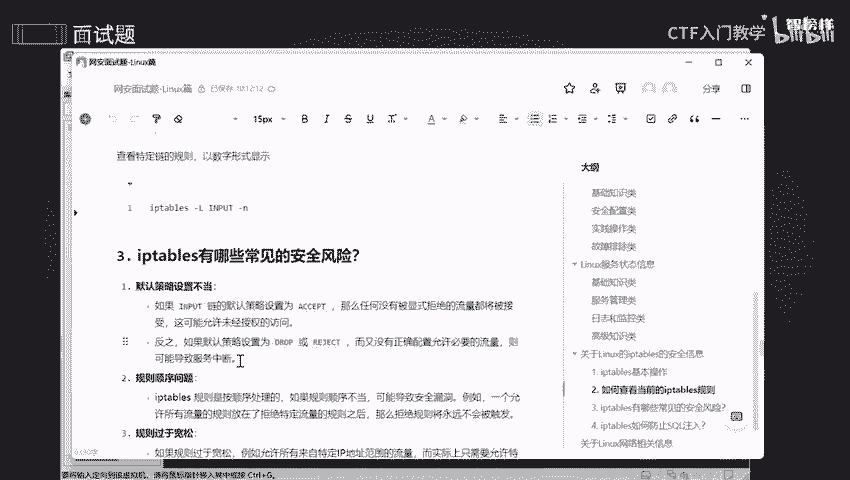
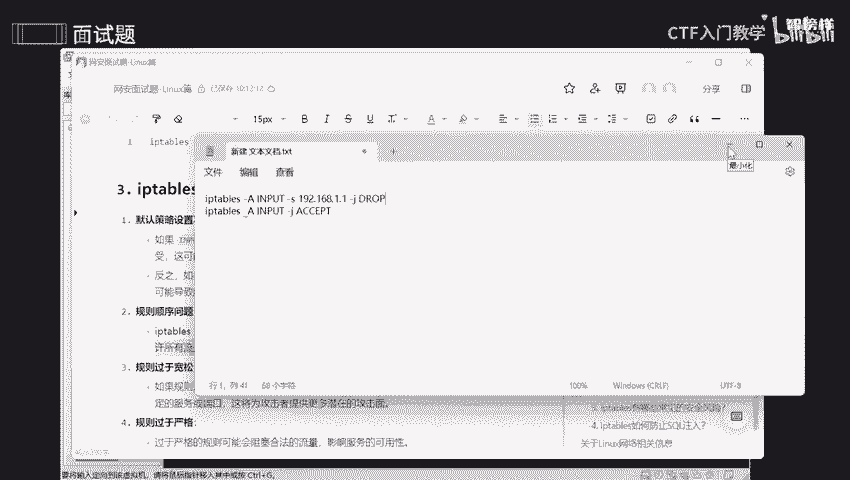

# 网络安全面试突击：P4：关于Linux iptables的安全信息 🔒



在本节课中，我们将学习Linux系统中一个重要的防火墙管理工具——`iptables`。我们将了解其基本操作、常见的安全风险，以及如何利用它来间接防范SQL注入等攻击。掌握这些知识对于配置安全的服务器环境至关重要。

## iptables的基本操作与规则查看 🔧



上一节我们介绍了课程概述，本节中我们来看看`iptables`的基本操作。`iptables`的规则执行顺序是**从上到下**的。其基本语法包括添加、插入、替换、删除规则，以及查看、清除规则和设置默认策略等操作。这些是管理防火墙的基础。





在实际工作中，使用`iptables`可以处理服务器的安全性和网络配置。网络安全非常重要，通过设置恰当的规则和策略，可以对网络数据进行筛选。这既能提高效率，减少资源消耗，也能提升安全性并简化管理。随着规则数量的增加，管理会变得困难。优化规则可以减少不必要的复杂性，使防火墙管理更简单直观。



`iptables`是一个管理防火墙的工具。那么，如何查看防火墙的规则呢？



以下是查看`iptables`规则的相关命令：



*   **列出所有规则**：使用 `iptables -L` 命令可以列出所有链的规则清单。
    ```bash
    iptables -L
    ```
*   **查看特定链的规则**：例如，只想查看`INPUT`链的规则。
    ```bash
    iptables -L INPUT
    ```
*   **显示详细信息**：使用 `-v` 参数可以查看所有链的规则，并显示数据包和字节数等计数信息。
    ```bash
    iptables -L -v
    ```
*   **以数字形式显示**：使用 `-n` 参数可以查看所有链的规则，并以数字形式显示IP地址和端口，避免DNS解析。
    ```bash
    iptables -L -n
    ```
*   **查看特定链的数字形式规则**：例如，查看`INPUT`链的规则并以数字形式显示。
    ```bash
    iptables -L INPUT -n
    ```

## iptables的常见安全风险 ⚠️



了解了基本操作后，我们来看看配置`iptables`时可能遇到的常见安全风险。不当的配置可能会引入漏洞，降低系统的安全性。

以下是`iptables`的几个常见安全风险点：

1.  **默认策略配置不当**：如果`INPUT`链的默认策略设置为`ACCEPT`（接受），那么任何未被显式拒绝的流量都会被接受，这可能导致允许未经授权的访问。如果默认策略是`DROP`（丢弃），但没有正确配置允许必要的流量，则可能导致服务中断。
2.  **规则顺序问题**：`iptables`按从上到下的顺序处理规则。如果顺序不当，会导致安全漏洞。例如，一条允许所有流量的规则放在拒绝特定流量的规则之后，那么拒绝规则永远不会被触发。
    *   **错误示例**：先拒绝特定IP，后又允许所有IP，导致拒绝规则失效。
        ```bash
        # 规则1：拒绝192.168.1.1
        iptables -A INPUT -s 192.168.1.1 -j DROP
        # 规则2：允许所有（此规则在后，会覆盖前面的拒绝效果）
        iptables -A INPUT -j ACCEPT
        ```
3.  **规则过于宽松**：规则过于宽松可能导致允许不必要的IP或端口访问。实际上，通常只需要开放特定的服务或端口。
4.  **规则过于严格**：规则过于严格可能会阻塞合法的流量，影响服务的可用性。

## 如何利用iptables辅助防止SQL注入 🛡️



上一节我们讨论了`iptables`自身的风险，本节中我们来看看如何利用它来辅助防范应用层攻击。`iptables`本身是一个防火墙管理工具，主要用于控制网络流量和防止未经授权的访问。它**不能直接防止SQL注入**，因为SQL注入是应用层的安全漏洞，而`iptables`工作在**网络层和传输层**。

但是，可以通过以下方式帮助减少SQL注入的风险：

*   **限制访问与端口过滤**：通过限制可以访问数据库服务器的IP地址，可以缩小攻击面。
    *   **示例**：只允许特定的管理IP（如192.168.1.100）访问数据库端口（默认3306）。
        ```bash
        iptables -A INPUT -p tcp -s 192.168.1.100 --dport 3306 -j ACCEPT
        iptables -A INPUT -p tcp --dport 3306 -j DROP
        ```
    *   **示例**：限制所有非本地IP访问数据库端口。
        ```bash
        iptables -A INPUT -p tcp -s 127.0.0.1 --dport 3306 -j ACCEPT
        iptables -A INPUT -p tcp --dport 3306 -j DROP
        ```
*   **速率限制**：可以对到数据库端口的连接进行速率限制，减缓暴力破解或扫描攻击。

这些措施是初级的网络层筛选。要真正有效地防止SQL注入，必须在应用层采取措施，例如：**输入验证**、使用**参数化查询（预编译语句）**、遵循**最小权限原则**以及进行安全的**错误处理**。

---

本节课中我们一起学习了`iptables`的基本操作与规则查看方法，分析了配置`iptables`时可能遇到的常见安全风险，并探讨了如何利用`iptables`在网络层辅助防范SQL注入攻击。记住，`iptables`是网络安全纵深防御体系中重要的一环，但并非万能，需要与其他层面的安全措施结合使用。