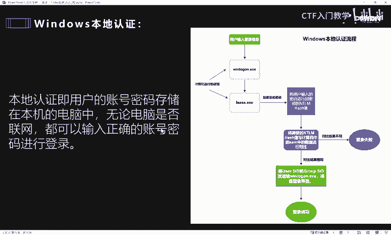
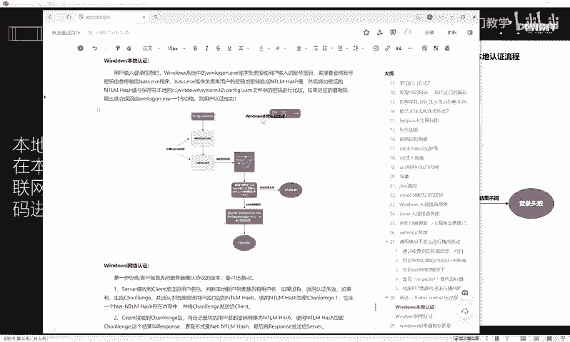
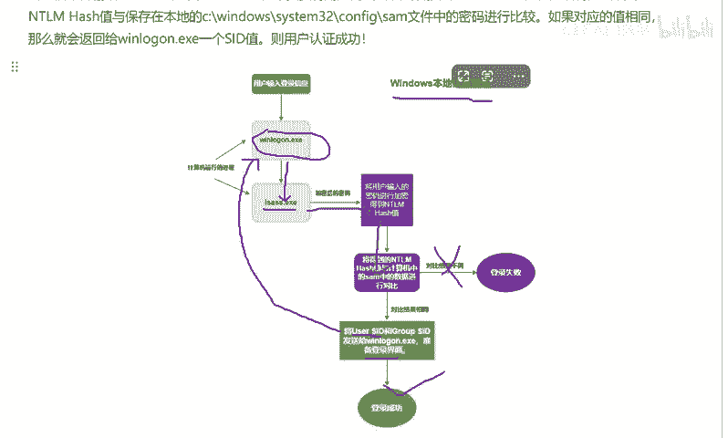
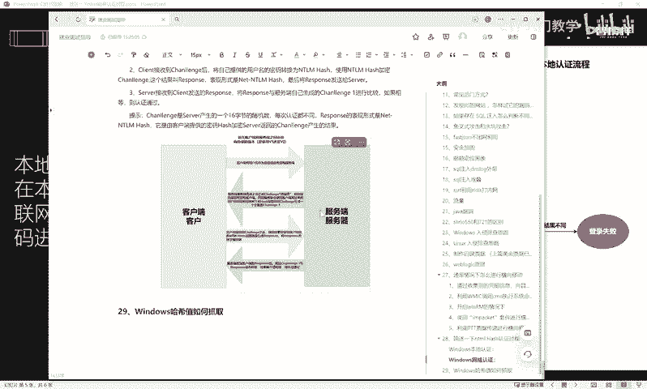
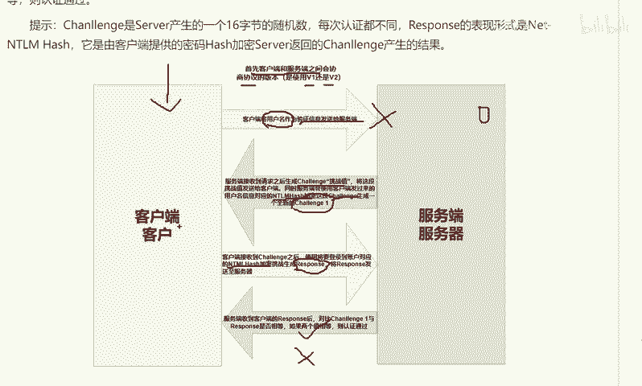
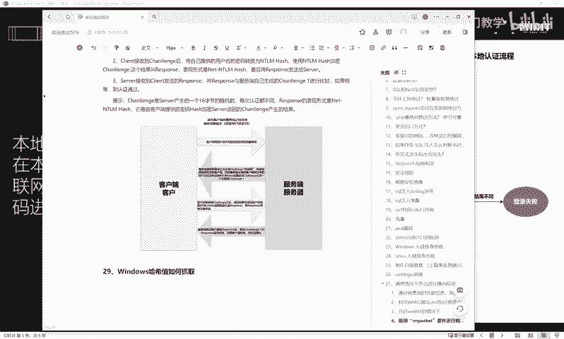

# 网络安全面试突击：P53：NTLM哈希认证过程详解

在本节课中，我们将学习NTLM哈希的认证过程。这是高级渗透测试工程师岗位面试中的一道经典题目，旨在考察面试者的内网安全知识。理解这一过程对于掌握Windows系统安全机制至关重要。

## 概述：什么是NTLM哈希？

在深入认证流程之前，我们首先要明白什么是NTLM哈希。NTLM哈希是一种加密算法，可以看作是一种密码加密的方法和手段。

在Windows系统中，当用户首次设置登录密码时，系统会通过特定程序将用户输入的明文密码进行加密处理。Windows系统本身并不存储用户的明文密码，而是将加密后生成的NTLM哈希值存储在本地的SAM数据库中。

当用户再次登录时，系统会将用户新输入的密码用相同算法加密，生成一个新的哈希值，并与SAM数据库中存储的原始哈希值进行比对。如果两个值匹配，则登录成功。

为了便于理解，我们可以将哈希值想象成一个“唯一编号”。假设有一个装满各种小球的盒子，每个小球在颜色、大小、材质上都不同。如果想快速找到特定小球非常困难。但如果给每个小球分配一个独一无二的编号，那么通过编号就能快速定位到它。这个“独一无二的编号”就类似于哈希值。

## 关键术语解析

在讲解具体过程前，我们先熟悉几个将用到的专业术语：

*   **Winlogon程序**：管理计算机登录框的程序。用户输入用户名和密码的界面即由此程序管理。
*   **LSASS.exe进程**：管理用户本地安全和策略的程序。用户输入的明文密码会经此程序加密，最终变成哈希值。
*   **SAM数据库**：存储在计算机本地的一个目录文件。该文件保存了经由LSASS加密后的各种用户哈希值。
*   **SID值**：安全标识符。相当于Windows系统中每个用户的“身份证”，是一个独一无二的标识。
*   **Challenge（挑战值）**：在Windows网络认证过程中，由服务端随机生成的一段随机值。
*   **Response（响应值）**：在认证过程中，客户端根据挑战值和用户密码哈希计算生成的一段值，用于响应服务端的挑战。

## NTLM哈希认证的两种方式

NTLM哈希认证主要分为两种场景：本地用户认证和网络用户认证。

### 本地用户认证过程

上一节我们介绍了NTLM哈希的基本概念，本节中我们来看看它在本地登录时是如何工作的。

当用户在登录界面输入账号和密码后，认证过程随即启动。

1.  **凭证提交**：用户输入的账号和密码由**Winlogon**程序捕获。
2.  **哈希计算**：**Winlogon**将这些凭证传递给**LSASS**进程。**LSASS**将用户输入的明文密码进行加密，计算生成对应的NTLM哈希值。
3.  **哈希比对**：系统会拿计算出的哈希值，与本地**SAM数据库**中存储的该用户的原始哈希值进行比对。
4.  **结果判定**：比对会产生两种结果：
    *   **失败**：如果两个哈希值不一致，则登录失败。
    *   **成功**：如果两个哈希值一致，则认证通过。
5.  **创建会话**：认证成功后，系统会为该用户创建一个包含其**SID**等信息的访问令牌，并准备登录界面，最终显示登录成功状态。

以上就是Windows本地认证的核心流程。

### 网络用户认证过程

除了本地登录，用户经常需要访问网络共享等资源，这就涉及到网络认证。下面我们来看看网络认证是如何进行的。

网络认证比本地认证稍复杂，涉及客户端与服务端之间的交互。首先，客户端与服务端会在后台协商使用NTLM协议的版本（如v1或v2）。

以下是详细的交互步骤：

1.  **发起请求**：用户在客户端输入用户名和密码。
2.  **发送用户名**：客户端将用户名（不包含密码）作为验证信息发送给服务端。
3.  **服务端验证用户名**：服务端收到用户名后，会在其本地账户数据库（如SAM或活动目录）中查找该用户。
    *   如果用户名不存在，认证立即失败。
    *   如果用户名存在，服务端进行后续操作。
4.  **生成挑战值**：服务端生成一个随机的**Challenge（挑战值）**。
5.  **服务端预计算**：服务端从自己的数据库中取出该用户对应的NTLM哈希值，将其与刚刚生成的**Challenge**结合，计算出一个新的值，我们称之为 **`Challenge1`**。计算完成后，服务端进入等待状态，准备进行二次验证。
6.  **返回挑战值**：服务端将生成的随机**Challenge**发送回客户端。
7.  **客户端计算响应值**：客户端收到**Challenge**后，将用户输入的密码计算为NTLM哈希值。然后，客户端将此哈希值与收到的**Challenge**结合，计算出一个**Response（响应值）**。
8.  **发送响应值**：客户端将这个**Response**发送给服务端。
9.  **最终验证**：服务端收到客户端发来的**Response**后，将其与自己之前计算好的 **`Challenge1`** 进行比对。
    *   **成功**：如果 `Response` 与 `Challenge1` 相等，则认证通过。
    *   **失败**：如果不相等，则认证失败。

## 总结

本节课中我们一起学习了NTLM哈希认证的完整过程。我们首先了解了NTLM哈希是一种用于保护密码的加密算法。接着，我们详细剖析了两种认证场景：

*   **本地认证**：核心在于将用户输入的密码哈希值与本地SAM数据库中的存储值进行比对。
*   **网络认证**：采用挑战-响应机制，服务端通过发送随机挑战值，并验证客户端返回的响应值是否正确，来确保密码验证过程不会在网络上传输明文或可重放的哈希值，从而提升了安全性。

理解这一过程是掌握Windows内网渗透、横向移动和权限维持技术的基础，对于应聘高级安全岗位至关重要。