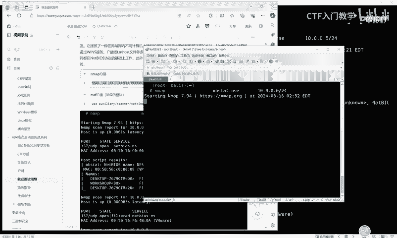
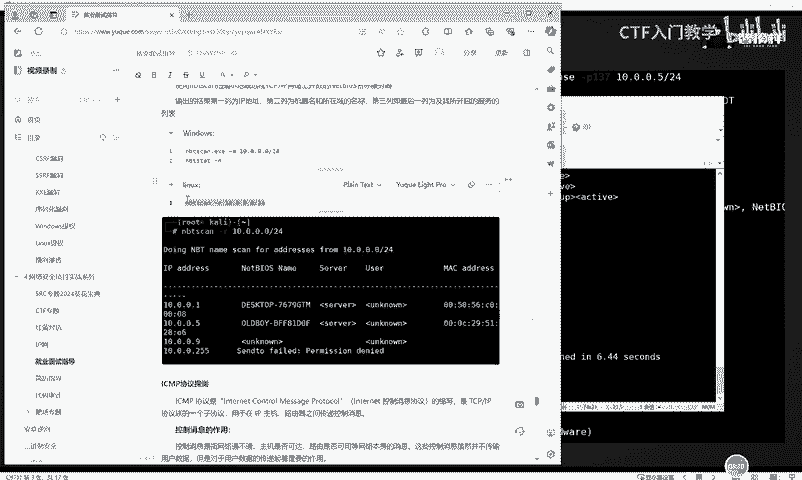
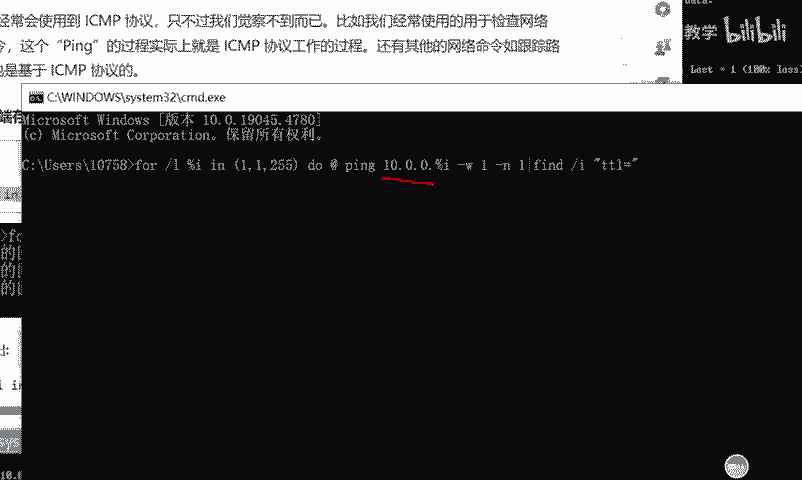
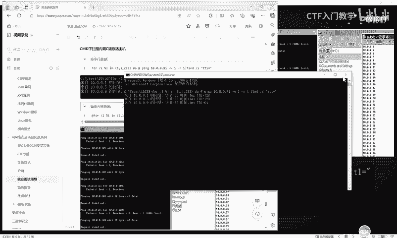
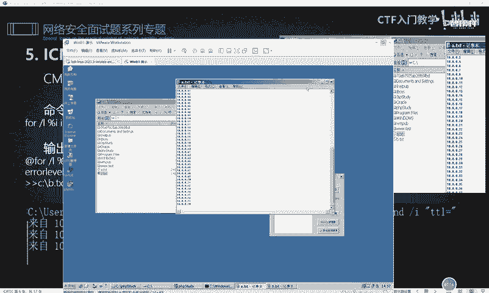

# 网络安全入门：P55：内网存活探测

在本节课中，我们将学习内网渗透测试中一个至关重要的环节：内网存活主机探测。掌握这项技能，可以帮助我们在获得内网初始访问权限后，进一步发现和定位网络中的其他目标主机。

## 概述：内网通信与探测基础

上一节我们介绍了内网信息收集的重要性，本节中我们来看看如何探测内网中的存活主机。内网中的计算机互相通信会遵循特定的通信协议，我们可以利用这些协议及其相关工具来发现网络中的活动设备。

首先，我们来了解 **NetBIOS** 协议。该协议是基于局域网内不同计算机上运行的程序之间进行通讯和数据共享的一种方法。利用这个协议，我们可以使用一些工具或命令来实现内网信息收集与主机探测。

## 使用 Nmap 进行 NetBIOS 探测

以下是使用 Nmap 工具进行 NetBIOS 协议探测的方法。Nmap 在 Kali Linux 系统中是自带的，无需额外安装。

```bash
nmap -sU --script nbstat.nse -p137 10.0.0.0/24
```

这条命令调用了 Kali 中自带的 Nmap 工具，对 `10.0.0.0/24` 网段发起 NetBIOS 探测。执行后，工具会列出该网段内所有响应 NetBIOS 查询的存活主机及其 IP 地址。

除了 Nmap，在取得一台主机的会话（Session）后，也可以通过加载 Metasploit Framework（MSF）中的相应模块，对内网进行自动化的探测与信息收集。



## 使用 nbtscan 工具进行探测

第二个介绍的工具是 **nbtscan**。该工具在 Linux 系统（如 Kali）中通常也已集成。

以下是调用 nbtscan 对指定网段进行扫描的命令：

```bash
nbtscan 10.0.0.0/24
```

此命令会调用 nbtscan 工具，对 `10.0.0.0/24` 网段发起内网探测，并将探测结果（如主机名、IP地址等）在下方呈现出来。



## 基于 ICMP 协议的探测

内网中还存在其他可用于探测的协议，例如 **ICMP**（Internet Control Message Protocol，互联网控制消息协议）。该协议在 IP 主机和路由器之间负责传递控制消息。

ICMP 协议最常用的探测命令就是 `ping`。我们可以直接在物理机的命令行中使用 `for` 循环来批量探测一个网段。

以下是 Windows 系统下使用 CMD 进行 ICMP 存活探测的命令：

```cmd
for /l %i in (1,1,254) do @ping -n 1 -w 100 10.0.0.%i | findstr "TTL="
```

这条命令会依次 ping `10.0.0.1` 到 `10.0.0.254` 的地址，并通过 `findstr` 过滤出有回应的主机（TTL值存在）。

我们还可以将探测结果输出到文件，实现简单的自动化信息收集。



以下是输出探测结果到文件的命令示例：

```cmd
for /l %i in (1,1,254) do @ping -n 1 -w 100 10.0.0.%i | findstr "TTL=" >> C:\alive.txt
```

此命令将存活的 IP 地址记录到 `C:\alive.txt` 文件中。A文件记录探测过程，B文件（如果分开记录）则专门记录最终存活的机器列表。



## 基于 UDP 协议的探测

UDP（User Datagram Protocol）是 OSI 七层模型中一种无连接的传输层协议。它的优点是速度比 TCP 更快，资源消耗较少，但可靠性较低。

同样可以使用 Nmap 发起 UDP 协议的探测。

以下是使用 Nmap 进行 UDP 端口扫描以发现主机的命令：

```bash
nmap -sU -p 53,161 10.0.0.1/24
```



此命令对 `10.0.0.1/24` 网段扫描常见的 UDP 端口（如 53 DNS, 161 SNMP），根据响应判断主机存活状态。填写正确的目标 IP 地址至关重要。

MSF 框架中也包含许多基于 UDP 协议的探测模块。在取得 MSF 会话后，可以调用这些模块对目标内网进行 UDP 协议探测。

此外，也有专门的 UDP 探测工具，在 Linux 系统中可能自带，可以直接通过命令调用。

## 基于 ARP 协议的探测

ARP（Address Resolution Protocol，地址解析协议）用于在内网通信中将 IP 地址解析成以太网的 MAC 地址。

Nmap 工具也集成了 ARP 扫描功能。

以下是使用 Nmap 进行 ARP 扫描的命令：

```bash
nmap -sn -PR 10.0.0.0/24
```

`-sn` 参数表示只进行主机发现（不端口扫描），`-PR` 表示使用 ARP 协议。ARP 扫描通常速度极快且结果准确，因为它基于二层协议。

MSF 框架同样收录了关于 ARP 协议的探测模块。

还有一些独立的 ARP 探测工具，例如 **arp-scan**。该工具在 Kali Linux 中通常也已集成。

以下是使用 arp-scan 进行扫描的命令：

```bash
arp-scan --interface=eth0 --localnet
```

这条命令指定网卡 `eth0`，并对该网卡所在的本地网络进行 ARP 扫描，探测存活主机。

## 其他协议与工具

除了上述协议，内网中还有诸如 **SMB** 等协议也可用于探测。这些探测都是基于内网通信协议来发现存活主机。

下方列出一些其他可能有用的工具或命令思路，供大家深入学习和练习：

*   **MSF 辅助模块**：利用 `auxiliary/scanner/discovery/` 目录下的各种发现模块。
*   **第三方工具**：如 `netdiscover`（主动/被动 ARP 发现工具）。

## 总结

本节课中我们一起学习了内网存活探测的多种方法。我们了解到，探测可以基于不同的网络协议进行，包括 NetBIOS、ICMP、UDP 和 ARP 等，并掌握了使用 Nmap、nbtscan、系统内置命令及 MSF 模块等工具来实施探测。这些技能是内网渗透测试中信息收集阶段的核心，通过不断练习，你将能更高效地发现和定位内网目标。