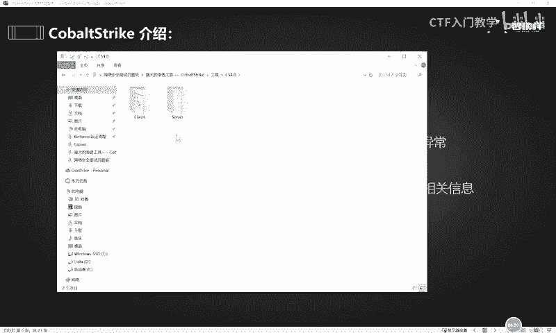
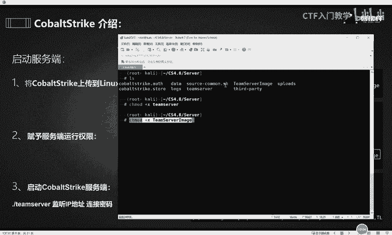
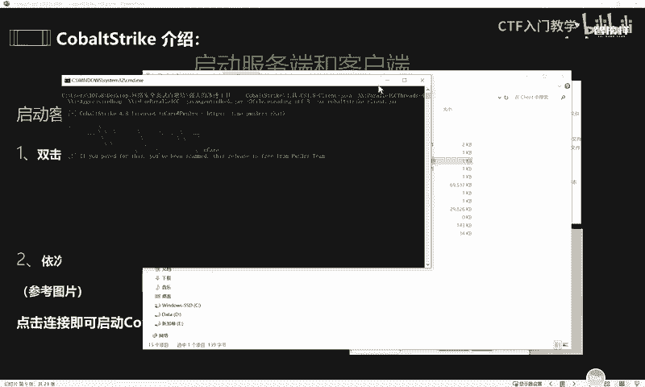

# 网络安全工具入门：P56：CobaltStrike 简介与部署 🛠️

在本节课中，我们将要学习一款在网络安全领域，特别是内网渗透测试中至关重要的工具——CobaltStrike。我们将了解它的基本概念、功能、起源，并详细演示如何搭建其服务端与客户端。

## 概述：什么是 CobaltStrike？

CobaltStrike（业内常简称为 **CS**）是一款功能强大的内网渗透测试平台。它并非游戏“反恐精英”，而是安全从业者进行团队协作、权限维持、横向移动等高级攻击模拟的“神器”。掌握 CobaltStrike 对于希望从事渗透测试、红队攻防等高薪技术岗位的学习者而言，是一项必备技能。

上一节我们介绍了学习 CobaltStrike 的必要性，本节中我们来看看它的核心功能与定位。

### CobaltStrike 的核心功能与定位

CobaltStrike 的功能非常全面，主要包括：
*   **权限维持与凭证导出**：获取并维持在被控主机上的访问权限。
*   **端口转发与 Socks 代理**：构建通道，深入内网进行探测和攻击。
*   **鱼叉式钓鱼攻击**：通过邮件等方式进行社会工程学攻击。
*   **文件捆绑与漏洞利用**：生成木马或利用漏洞获取初始访问。
*   **集成 Mimikatz**：可以直接调用 **Mimikatz** 工具来抓取系统内存中的明文密码、哈希等凭据，其命令通常类似于 `mimikatz sekurlsa::logonpasswords`。
*   **团队协作**：采用客户端/服务器（C/S）架构，一个服务端可以连接多个客户端，便于团队协同作战。

### CobaltStrike 与 Metasploit 的关系

熟悉安全工具的朋友可能知道 **Metasploit Framework (MSF)**，这是一款开源的渗透测试框架，集成了数千个漏洞利用模块。

CobaltStrike 在早期版本中曾依托于 MSF，但后来逐渐发展成为一个独立的、更侧重于后期渗透和团队协作的平台。在实际渗透测试中，CS 和 MSF 经常联动使用，互相弥补不足，实现“1+1 > 2”的效果。

了解了 CobaltStrike 的起源和强大功能后，接下来我们需要知道如何获取并运行它。



## CobaltStrike 的目录结构与运行环境

CobaltStrike 的安装包通常包含服务端和客户端文件。其运行依赖于 **Java 环境**，无论是服务端还是客户端，都必须提前安装好合适的 Java 运行环境（JRE）。

以下是解压后常见的目录结构简介：

```
cobaltstrike/
├── teamserver           # 服务端启动脚本 (Linux)
├── cobaltstrike.jar     # 客户端主程序
├── cobaltstrike.auth    # 认证文件
├── logs/                # 日志目录
├── data/                # 数据目录
├── third-party/         # 第三方工具目录
└── ...
```

在知道它的目录结构之后，接下来我们就要动手把它架设起来。

## 实战部署：启动服务端与客户端

我们将分步完成 CobaltStrike 服务端（在 Linux 上）和客户端（通常在 Windows 上）的启动与连接。

### 第一步：启动 CobaltStrike 服务端



服务端必须运行在 Linux 系统上（例如 Kali Linux 或云服务器）。

1.  **上传与授权**：将 CobaltStrike 安装包上传到 Linux 服务器，并进入其目录。首先需要给服务端启动脚本赋予执行权限。
    ```bash
    chmod +x teamserver
    ```

2.  **启动服务端**：使用以下命令启动服务端。你需要指定监听 IP 和连接密码。
    ```bash
    ./teamserver <服务器IP地址> <连接密码>
    ```
    *   **<服务器IP地址>**：你的 Linux 服务器的 IP 地址（例如 `192.168.1.100`）。
    *   **<连接密码>**：自定义一个强密码，客户端连接时需要用到。
    执行后，看到服务端成功监听（默认端口 **50050**）即表示启动成功。如需修改端口，可编辑 `teamserver` 脚本文件。

### 第二步：启动 CobaltStrike 客户端并连接

客户端可以在 Windows、Linux 或 macOS 上运行，但需要图形化界面。

1.  **运行客户端**：在客户端计算机上，进入 CobaltStrike 目录，找到启动脚本（如 `cobaltstrike.bat` 或 `cobaltstrike`）并运行。



2.  **配置连接**：客户端启动后会弹出连接对话框，需要填写以下信息：
    *   **Host**: 填写你刚刚启动服务端的 **Linux 服务器 IP 地址**。
    *   **Port**: 服务端监听端口，默认为 **50050**。
    *   **User**: 用户名，可以任意填写。
    *   **Password**: 填写启动服务端时设置的 **连接密码**。

3.  **连接**：点击 “Connect” 按钮。如果信息正确，客户端将成功连接到服务端，进入 CobaltStrike 的主操作界面。

## 总结

本节课中我们一起学习了内网渗透神器 CobaltStrike 的基础知识。我们了解了它的核心功能、与 Metasploit 的关系，并一步步完成了服务端在 Linux 上的部署以及客户端连接的全部流程。成功搭建环境是使用任何工具的第一步，接下来你就可以在这个平台上探索其强大的后期渗透测试能力了。