# 网络安全面试突击：P58：CobaltStrike常用功能详解

在本节课中，我们将深入学习CobaltStrike（CS）在目标主机上线后的常用操作功能。上一节我们介绍了如何生成监听器和木马，本节中我们来看看如何与已上线的目标进行交互，执行命令、收集信息以及进行内网渗透的初步操作。

## 概述：上线后的操作菜单

目标主机上线后，会在CS的会话列表中显示一条记录。右键点击该会话，会弹出一个功能菜单，这些选项就是针对当前会话所能执行的操作。

以下是右键菜单中的主要功能选项：

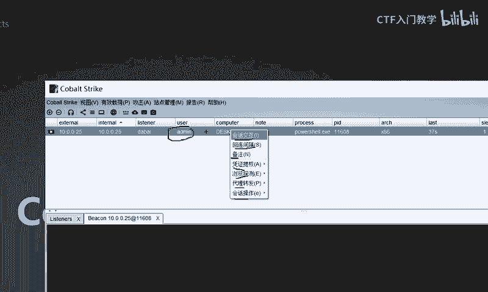

*   **会话交互**：打开一个命令行交互界面。
*   **回联间隔**：设置与目标主机通信的时间间隔。
*   **备注**：为当前会话添加备注信息。
*   **凭证提权**：包含抓取哈希、提升权限等内网渗透工具。
*   **浏览探测**：包含文件浏览、端口扫描、屏幕截图等信息收集工具。
*   **代理转发**：包含SOCKS代理、端口转发等隧道搭建工具。
*   **会话操作**：对当前会话进行标记、删除或退出操作。

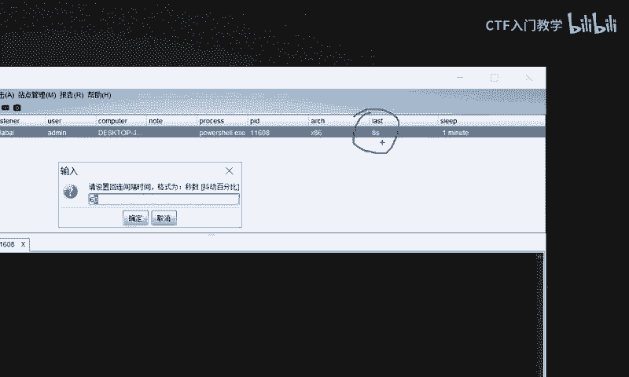

接下来，我们将逐一详解这些功能。

## 功能一：回联间隔与备注设置

目标上线后，首先建议调整回联间隔。回联间隔指的是CS与目标主机之间通信的延迟时间，类似于网络延迟。

设置回联间隔的目的是平衡隐蔽性与响应速度。间隔太长（如几十秒），执行命令后等待结果的时间会过长；间隔太短（如小于1秒），则会频繁与目标通信，可能触发安全设备的警报。在实战中，通常设置为2到5秒。

设置命令在右键菜单中直接选择，在弹出的窗口中输入秒数即可，例如：
```
3
```

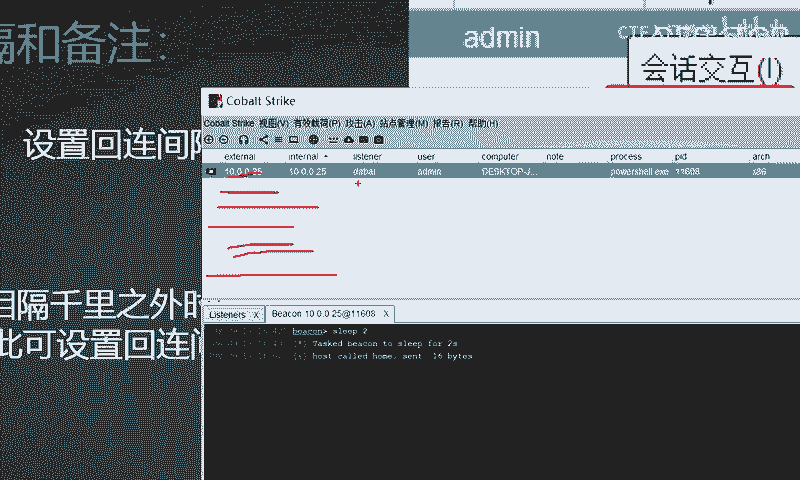

备注功能用于管理多个上线主机。当同时控制多台目标时，可以为每条会话添加备注，例如记录目标IP、主机名或所属部门，便于区分和管理。

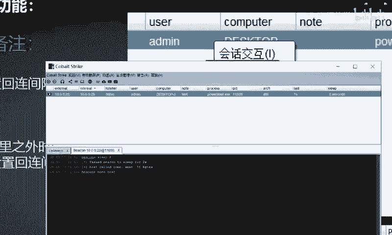

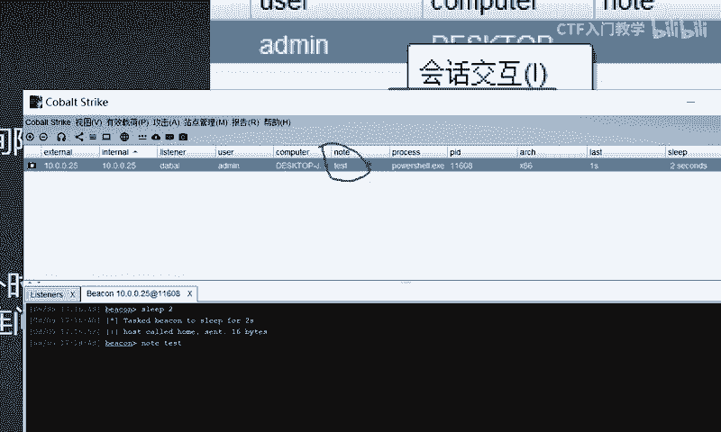

## 功能二：会话交互（命令执行）

选择“会话交互”会打开一个交互式命令行窗口。这相当于在目标主机上远程打开了一个命令提示符（CMD）。

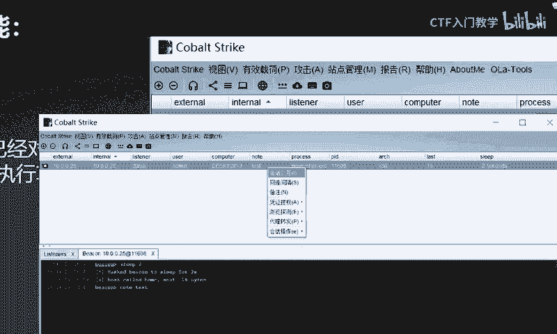

在此窗口中，可以执行Windows系统命令。需要注意的是，CS要求在每个命令前加上 `shell` 关键字。

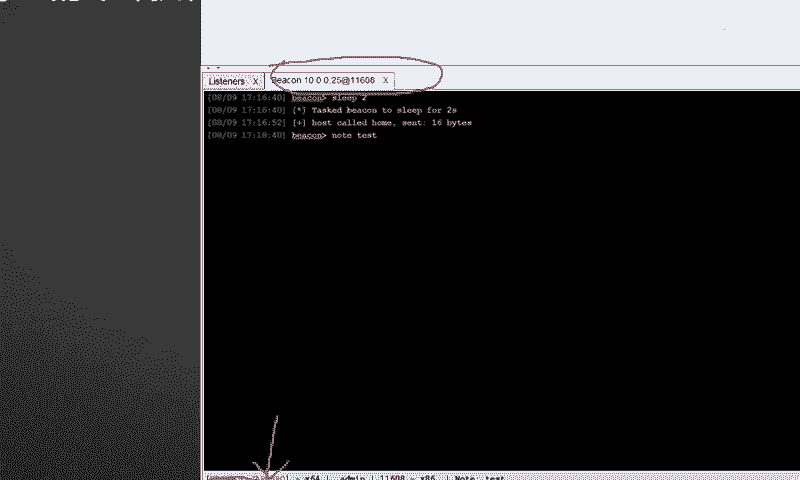

例如，查看当前用户身份：
```bash
shell whoami
```
执行后，下方会回显结果，如 `desktop-j38or\admin`，表示当前用户是 `admin`。

再例如，查看目标IP地址：
```bash
shell ipconfig
```
通过这个界面，可以执行绝大多数Windows命令行操作。


## 功能三：凭证提权与内网渗透模块

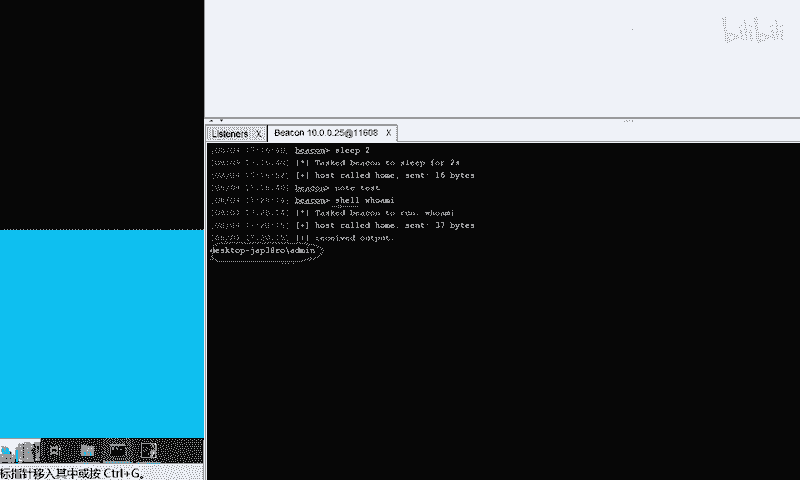

“凭证提权”选项中集成了多个内网渗透的关键功能模块。

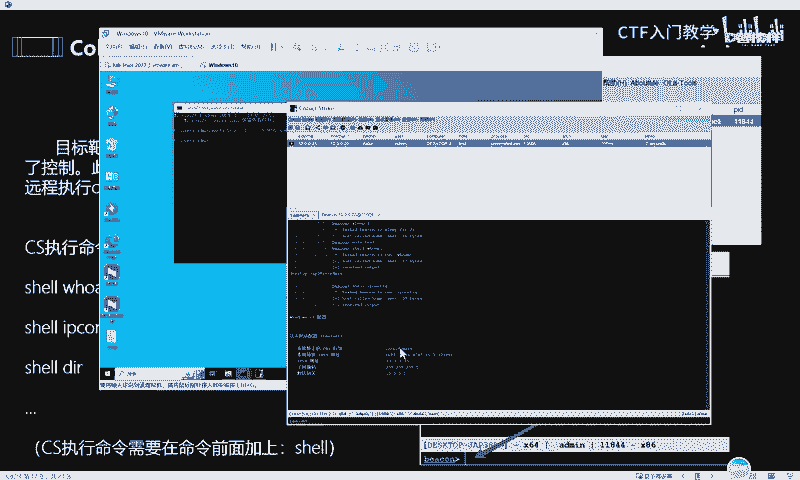

以下是该选项下的主要子功能：

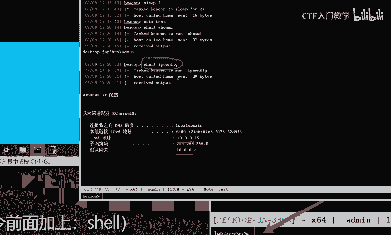

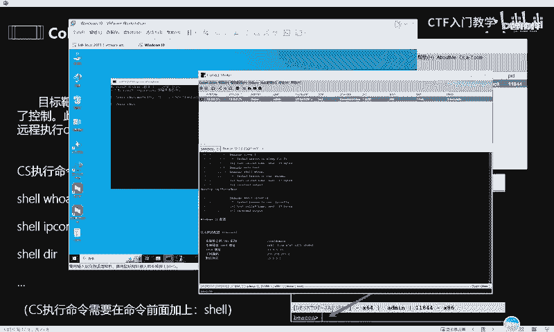

*   **抓取哈希**：使用 `hashdump` 等工具提取目标主机的密码哈希值。
*   **抓取明文密码**：调用 `Mimikatz` 工具尝试获取内存中的明文密码。
*   **权限提升**：利用集成的漏洞利用模块（POC），尝试将当前权限提升至系统权限。
*   **黄金票据 / 创建令牌**：用于权限维持，创建可用于身份验证的Kerberos票据或令牌。
*   **PowerShell一句话**：生成PowerShell类型的木马。
*   **新建会话 / 其他用户上线**：用于横向移动，以当前凭证在新的进程中建立会话。

这些功能是内网渗透的核心，CS将其集成化，方便直接调用。

## 功能四：浏览探测与信息收集

“浏览探测”选项提供了图形化的信息收集和操作能力。

以下是该选项下的主要子功能：

*   **文件浏览**：以图形化界面浏览和下载目标主机上的文件系统。
*   **端口扫描**：对目标主机或目标内网进行端口扫描，支持TCP、ARP等多种扫描方式。
    *   扫描结果可以在 **视图（View） -> 目标列表（Targets）** 中查看。
*   **网络探测**：探测目标内网存活主机。
*   **屏幕截图**：截取目标主机的当前屏幕。
*   **浏览器代理**：通过目标主机代理上网，以目标身份访问内网Web资源。

例如，使用“文件浏览”可以直观地查看目标桌面、文档等目录；使用“端口扫描”可以快速发现目标开放的服务。

## 功能五：代理转发与隧道搭建

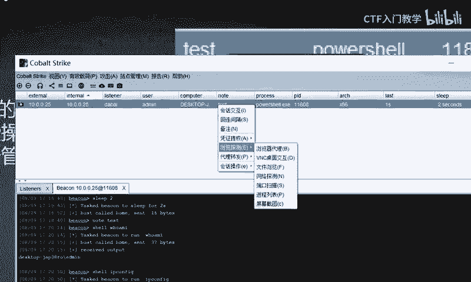

当目标网络与攻击者网络之间存在防火墙或访问控制策略时，需要使用“代理转发”功能来打通网络通道。

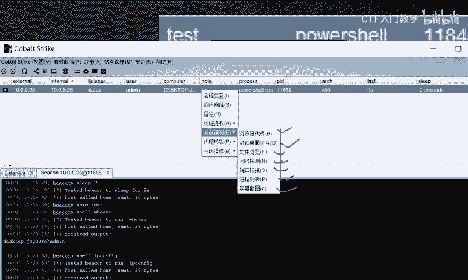

该选项主要包含：

*   **SOCKS代理**：在目标主机上建立SOCKS代理服务器，使攻击者能通过该代理访问目标内网。
*   **端口转发**：将目标内网特定端口的流量转发到攻击者机器上。
*   **部署VPN**：在目标网络内部部署一个VPN隧道，实现更完整的网络接入。

这些功能是实现内网横向移动和深度渗透的基础。

## 功能六：会话操作

“会话操作”提供针对会话本身的管理功能。

*   **颜色标记**：为会话设置颜色标签，用于分类。
*   **删除**：从CS界面中移除该会话记录（并非终止目标上的进程）。
*   **退出**：终止与目标主机的会话连接。

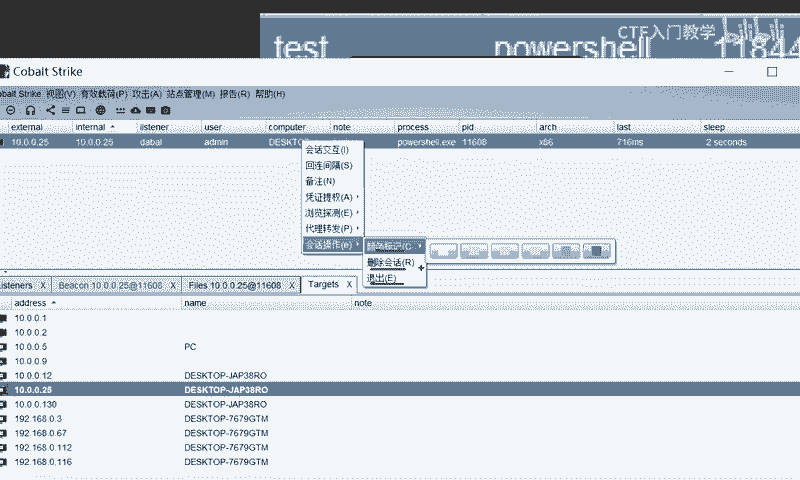

## 总结

本节课中我们一起学习了CobaltStrike在目标上线后的核心操作功能。我们了解了如何设置合适的回联间隔以保持隐蔽，如何使用会话交互执行命令，并探索了凭证提权、信息收集、代理转发等高级模块的用途。这些功能构成了从单点控制到内网渗透的完整能力链条，是使用CS进行安全测试的关键步骤。掌握这些功能后，你将能够更有效地利用CS进行后续的渗透测试工作。