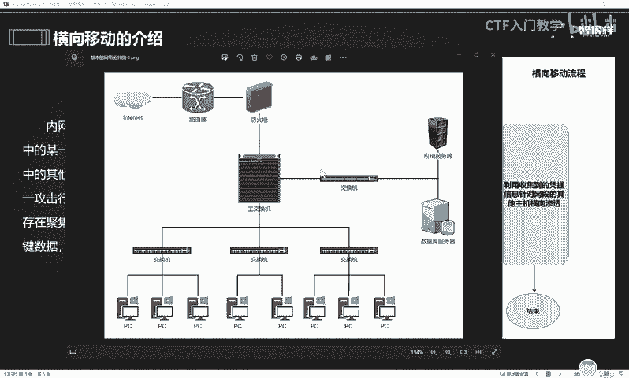
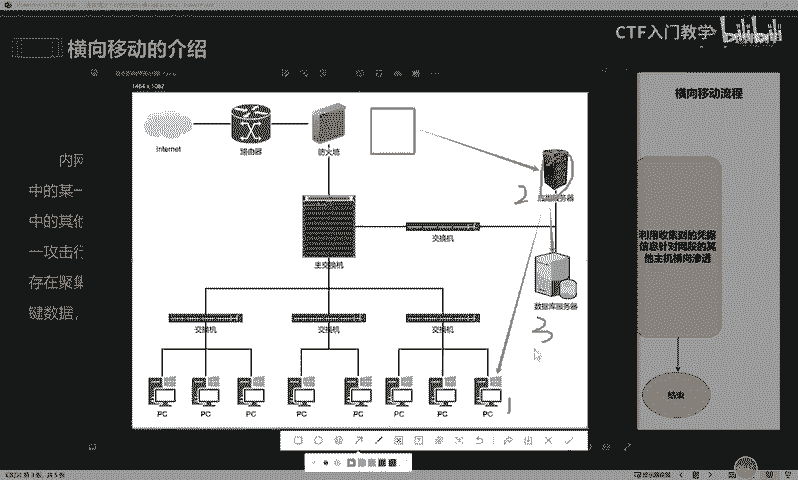
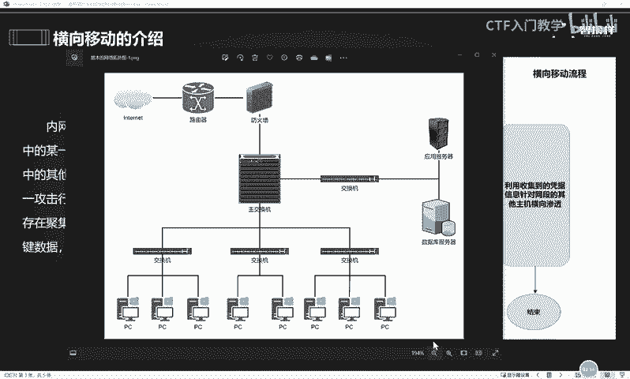
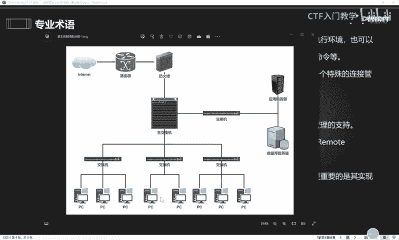
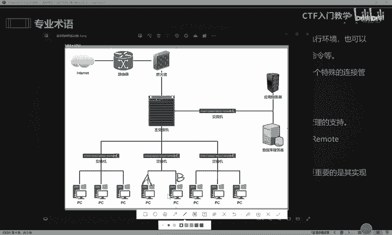
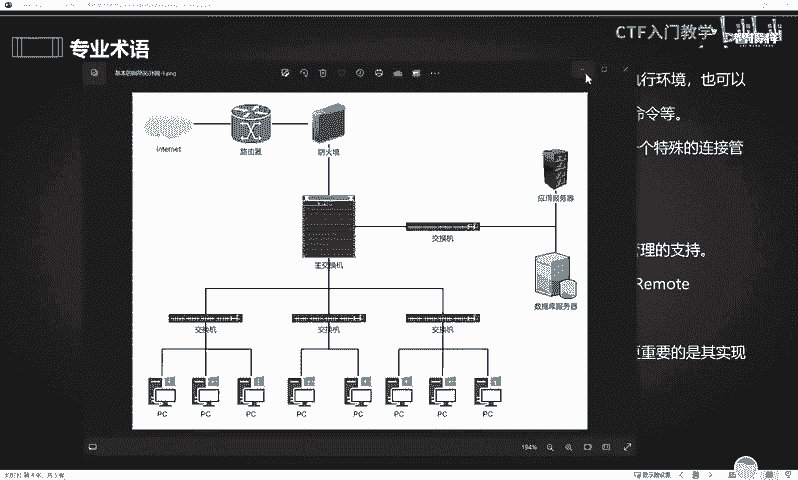

# 网络安全面试突击：P60：横向移动

在本节课中，我们将学习网络安全面试中的一个核心概念——横向移动。我们将从定义入手，逐步拆解其原理，并学习如何系统性地回答相关面试问题。

## 什么是横向移动？🤔



上一节我们明确了学习目标，本节中我们来看看横向移动的具体定义。

内网横向移动，是指攻击者在成功入侵内网中的一台计算机后，以该计算机作为跳板，进一步渗透和攻击同一网络内的其他计算机，以扩大战果、获取更多权限的过程。

为了帮助理解，请看下图所示的简单内网环境（局域网）：


该网络中包含交换机、应用服务器、数据库服务器以及多台办公电脑等资产。假设攻击者通过漏洞等手段，首先拿下了“2号”应用服务器的控制权。在初步信息搜集未能满足其需求时，攻击者便会以2号服务器为据点，探测并攻击同一网段下的其他资产，例如价值更高的“1号”老板电脑或“3号”数据库服务器。






这个以已控主机为跳板，攻击其他内网主机的过程，就称为横向移动。




## 关键术语解析 🔑

在深入探讨如何进行横向移动之前，我们需要先理解回答中可能涉及的一些关键专业术语。以下是核心概念的介绍：





*   **Webshell**：一种网页后门，通常以ASP、PHP等脚本文件形式存在。攻击者常利用漏洞上传Webshell，以获得对Web服务器的初步控制权。在上述例子中，攻击者拿下“2号”应用服务器的过程就可能使用了Webshell。
*   **IPC$**：微软为方便Windows系统管理而开发的进程间通信机制。在内网横向移动中，它常被用作在两台计算机之间建立通信“通道”或“桥梁”。
    *   **作用**：假设有主机A和B。当A与B成功建立IPC$连接后，A可以远程让B执行命令，或对B上的文件进行复制、删除等操作。
        
*   **定时任务**：系统中设定在特定时间自动执行的任务。可以类比为手机上的闹钟。在横向移动中，攻击者常利用它来在目标主机上定时执行恶意脚本或程序。
        
        
*   **WMIC**：Windows管理工具命令行。它提供了从命令行接口批量管理Windows系统的能力，功能上与IPC$有部分重叠，也可用于远程执行命令。
*   **WinRM**：Windows远程管理服务。类似于系统自带的“远程桌面连接”，它允许用户远程管理Windows主机，是实现横向移动的潜在途径之一。
*   **Impacket**：一个专注于网络协议处理的Python工具包，包含了对SMB、MSRPC等多种协议的实现。它提供了一系列现成的脚本和工具（如`psexec.py`, `wmiexec.py`），极大方便了内网渗透测试和横向移动。
    *   **示例代码（概念性）**：使用Impacket的`psexec`模块远程执行命令。
        ```bash
        python psexec.py 域名/用户名:密码@目标IP
        ```

## 如何回答横向移动问题？💡

明白了基本概念和术语后，现在我们来学习如何系统性地回答“你如何进行横向移动？”这类面试题。

面试官您好。在内网中进行横向移动，首先需要一个前提：已经通过诸如获取**Webshell**等方式，控制了内网中的至少一台机器。

在获得立足点后，我的横向移动流程通常如下：

1.  **信息收集**：以已控主机为跳板，全面收集内网信息，包括但不限于：
    *   存活主机IP地址 (`net view`, `nbtscan`)
    *   开放端口和服务 (`netstat -an`, 内网端口扫描)
    *   域环境信息 (`net config workstation`, `net group “domain computers” /domain`)
    *   凭据信息（内存抓取、配置文件查找等）
    *   目标是定位高价值资产（如域控、文件服务器、数据库）并搜集尽可能多的凭据。

2.  **实施横向移动**：根据信息收集的结果，我会尝试多种方法，以下是主要途径：
    *   **IPC$连接配合计划任务**：尝试与目标主机建立IPC$连接。成功后，可将木马文件复制到目标主机，并利用`at`或`schtasks`命令创建计划任务执行它，从而获取目标主机的控制权。
        *   **示例命令**：
            ```cmd
            # 建立IPC$连接
            net use \\目标IP\IPC$ “密码” /user:”用户名”
            # 复制文件
            copy payload.exe \\目标IP\C$\windows\temp\
            # 创建计划任务（旧版）
            at \\目标IP 时间 “C:\windows\temp\payload.exe”
            # 或使用schtasks（新版）
            schtasks /create /s 目标IP /u 用户名 /p 密码 /tn 任务名 /tr “C:\windows\temp\payload.exe” /sc once /st 时间
            ```
    *   **WMIC远程命令执行**：利用WMIC工具，在拥有目标主机凭据的情况下，直接远程执行命令。
        ```cmd
        wmic /node:目标IP /user:用户名 /password:密码 process call create “cmd.exe /c C:\windows\temp\payload.exe”
        ```
    *   **WinRM远程管理**：在目标主机开启WinRM服务且拥有权限时，使用WinRM进行远程连接和管理。
    *   **利用Impacket套件**：使用Impacket工具包中成熟的脚本进行横向移动，例如`psexec.py`、`wmiexec.py`、`smbexec.py`等，这些工具能有效处理各种协议交互。
    *   **PTT票据传递攻击**：在域环境中，利用诸如MS14-068漏洞或`mimikatz`等工具生成或窃取Kerberos票据（Ticket），然后使用这些伪造或有效的票据向其他域内主机进行身份验证，实现横向移动。
        *   **核心概念**：`黄金票据`、`白银票据`、`MS14-068`。
    *   **使用自动化框架**：借助Cobalt Strike、MetasF等高级渗透测试框架，它们集成了多种横向移动方法（如`jump`功能），可以更高效地进行内网扩散。

以上就是我进行内网横向移动的主要思路和方法。我会根据具体的网络环境、权限和收集到的信息，灵活组合运用这些技术。

## 总结 📝

本节课中我们一起学习了横向移动的核心知识。我们首先明确了横向移动的定义——以内网已控主机为跳板攻击其他主机。接着，我们解析了**Webshell**、**IPC$**、**定时任务**、**WMIC**、**WinRM**、**Impacket**等关键术语。最后，我们系统地学习了回答横向移动面试题的逻辑：从**信息收集**前提，到具体实施手段，包括**IPC$与计划任务**、**WMIC**、**WinRM**、**Impacket工具包**、**票据传递攻击**以及**自动化框架**的运用。掌握这些内容，能够帮助你更有条理地应对相关面试问题。