# 网络安全面试突击：P61：mimikatz的使用 🛡️

在本节课中，我们将学习一个在Windows内网渗透中至关重要的工具——mimikatz。我们将了解它的基本用途，并通过实际操作演示如何利用它来获取Windows系统中的密码哈希值与明文凭证。

## 概述：为何需要获取Windows凭证？

上一节我们介绍了NTLM哈希的基本概念。本节中，我们来看看如何实际获取这些凭证信息。获取Windows系统的密码凭证（如哈希值或明文密码）在内网安全测试中至关重要，主要原因有以下几点：

*   **便于横向与纵向渗透**：在攻破一台主机后，获取到的密码或哈希值可用于尝试登录网络中的其他机器（横向移动）或权限更高的服务器（纵向移动），从而更容易地“拿到权限”。
*   **最大化利用权限与扩大战果**：在红队攻防演练中，攻击者控制一台主机后，为了进一步扩大控制范围，必须尝试提取内存或存储中的密码凭据。
*   **利用弱密码策略**：在企业域环境中，运维人员可能为新员工设置统一、简单的初始密码。如果员工未更改密码，攻击者一旦获取到一台域内主机的密码，就可能利用它作为“通用密码”尝试登录其他重要主机（如域控制器）。一旦控制域控制器，便可能掌控整个域的所有用户账号。

## 常用工具简介

以下是几种常见的Windows凭证获取工具，本节课我们将重点学习第一种：

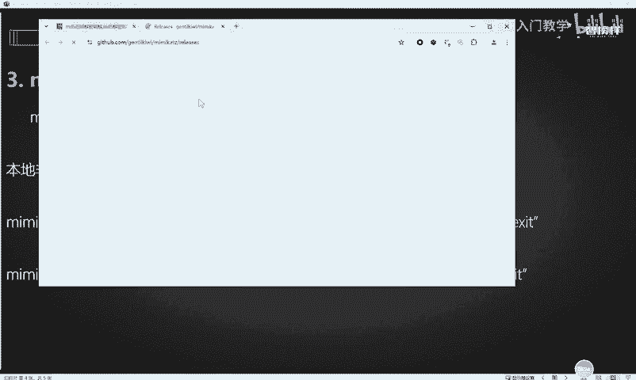

*   **mimikatz**：功能强大的开源工具，可直接从内存中提取明文密码、哈希、PIN码和Kerberos票据。
*   **PowerShell脚本**：例如`Invoke-Mimikatz`等，利用PowerShell加载mimikatz功能，便于在受限环境中使用。
*   **WCE (Windows Credentials Editor)**：另一款用于获取Windows登录会话明文密码的工具。

## mimikatz实战演练 🛠️

首先，你需要获取mimikatz工具。你可以从其官方GitHub仓库下载，或使用课程提供的工具包。

### 场景一：获取本地哈希值 (NTLM Hash)

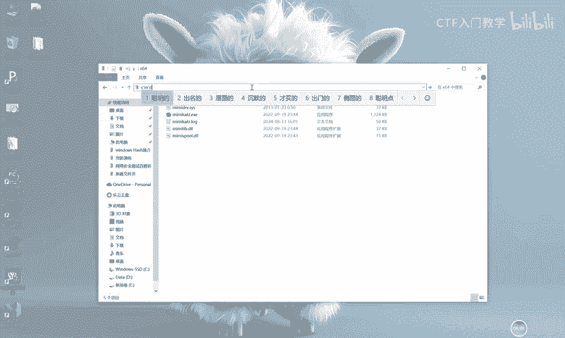

这个场景的目标是读取本地SAM数据库中存储的用户密码哈希值。由于操作需要高权限，**务必以管理员身份运行命令提示符或mimikatz本身**。

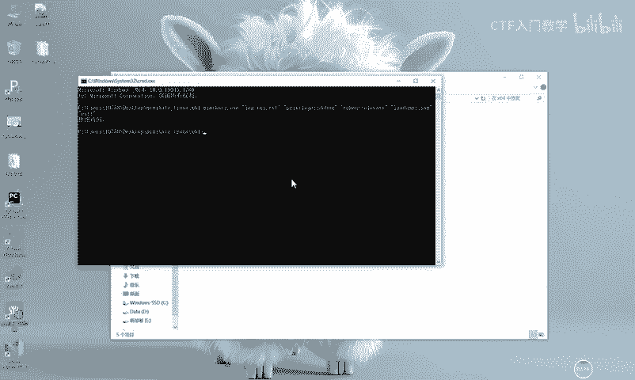

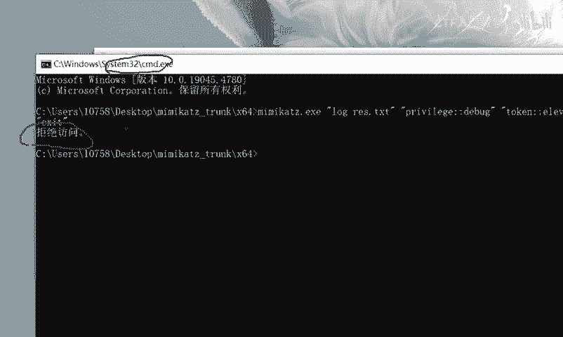

以下是核心操作命令的分解与解释：

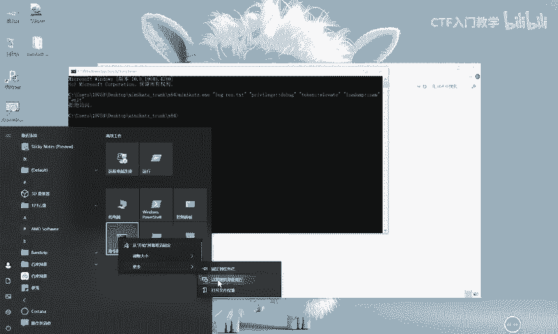

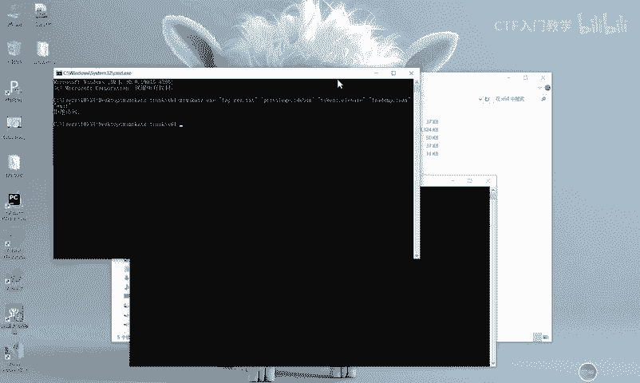

```bash
mimikatz # privilege::debug
```
此命令尝试启用`SeDebugPrivilege`权限。这是mimikatz与系统内存交互、提取凭据所必需的一步。执行成功会返回“`Privilege ‘20’ OK`”。

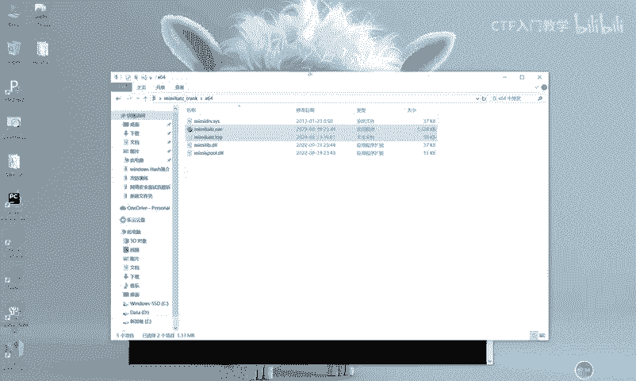

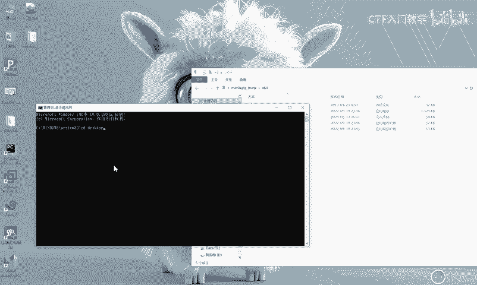

```bash
mimikatz # token::elevate
```
此命令用于窃取或模拟系统级（SYSTEM）令牌。SAM数据库等敏感信息通常只允许SYSTEM权限访问，提升令牌权限后，我们便能以更高身份执行后续操作。

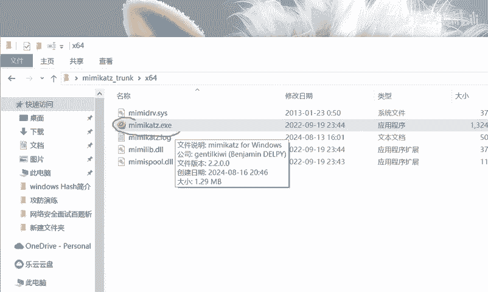

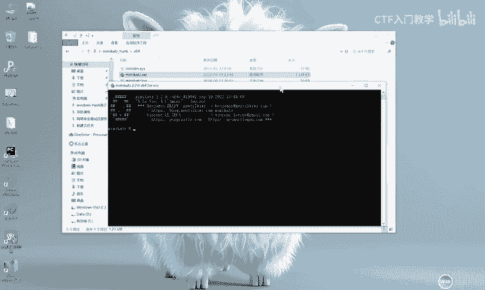

```bash
mimikatz # lsadump::sam
```
这是核心命令，用于转储（dump）本地SAM数据库中的内容。执行后，将列出所有本地用户的用户名、RID以及对应的NTLM哈希值。

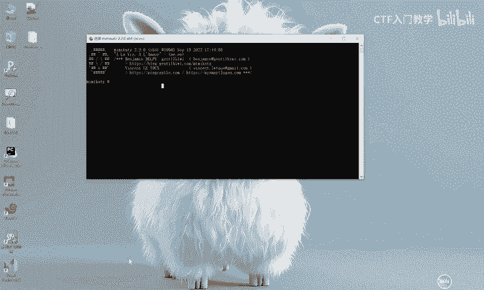

**操作流程总结**：
1.  以管理员身份运行命令提示符。
2.  切换到mimikatz所在目录并运行`mimikatz.exe`。
3.  在mimikatz交互界面中，依次输入上述三条命令。
4.  在`lsadump::sam`的输出中，找到目标用户的NTLM哈希（例如，`Administrator`的哈希）。

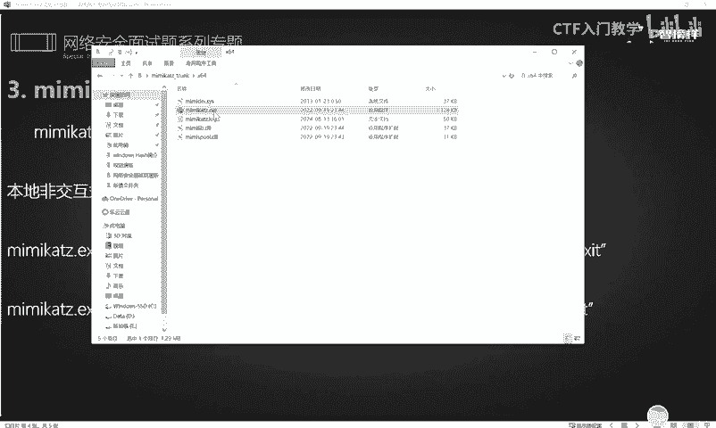

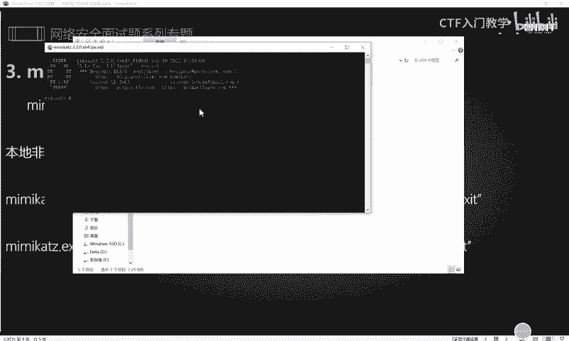

获取到的NTLM哈希可用于“哈希传递”攻击，或在网站如`cmd5.com`进行碰撞破解（注意：NTLM哈希加密强度高，复杂密码难以破解）。

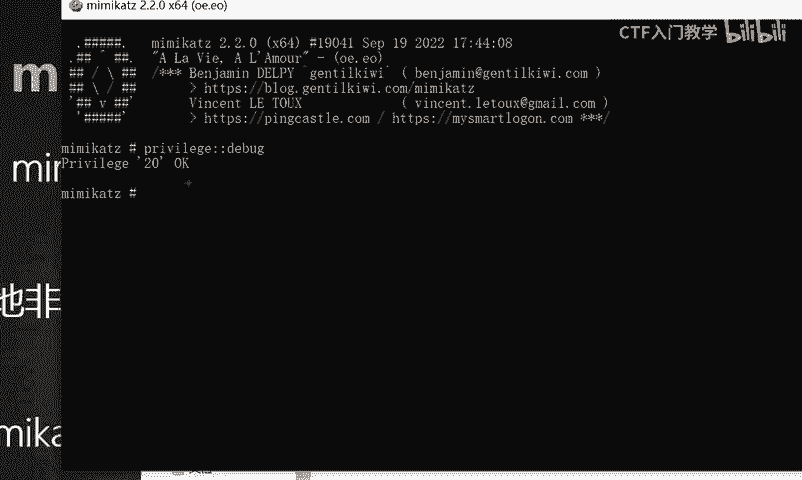

### 场景二：获取内存中的明文密码

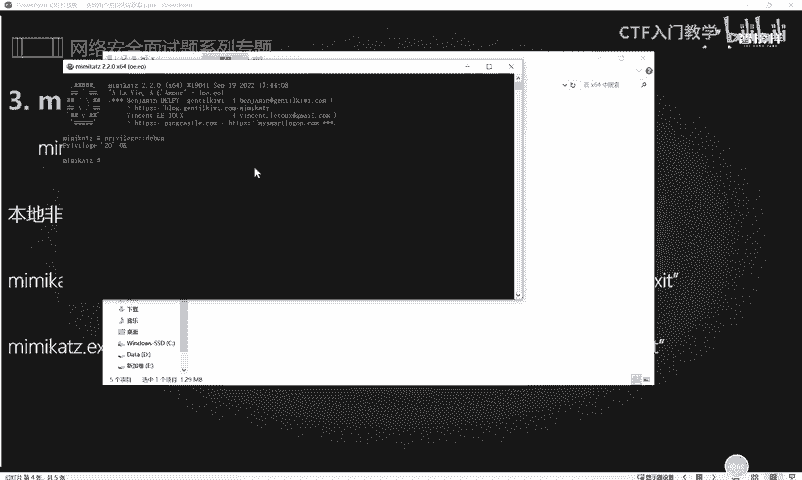

除了哈希，mimikatz更强大的功能是直接从`lsass.exe`进程的内存中提取最近登录过的用户的**明文密码**。

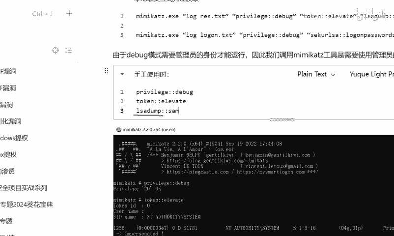

操作命令更为直接：

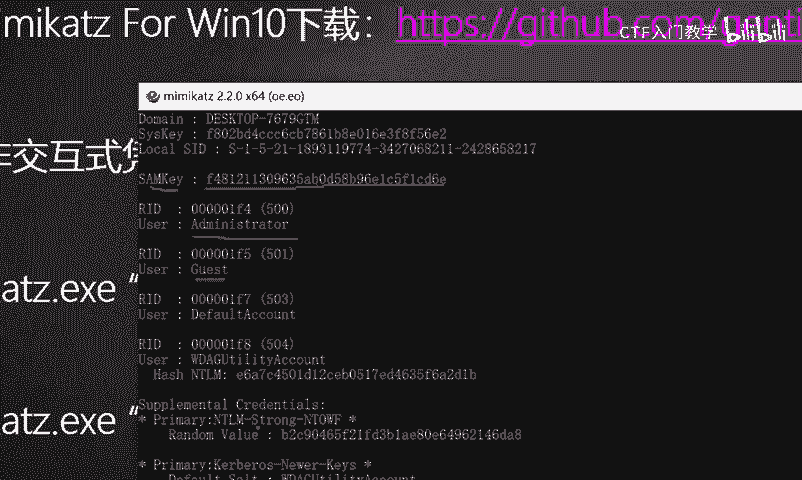

```bash
mimikatz # privilege::debug
mimikatz # sekurlsa::logonpasswords
```
第一条命令同样是获取调试权限。第二条命令`sekurlsa::logonpasswords`会扫描`lsass`进程的内存，尝试提取所有可用的登录凭据，包括明文密码、NTLM哈希、Kerberos票据等。

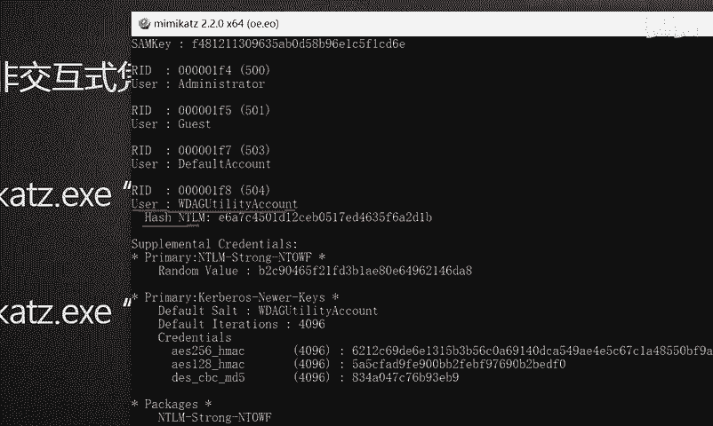

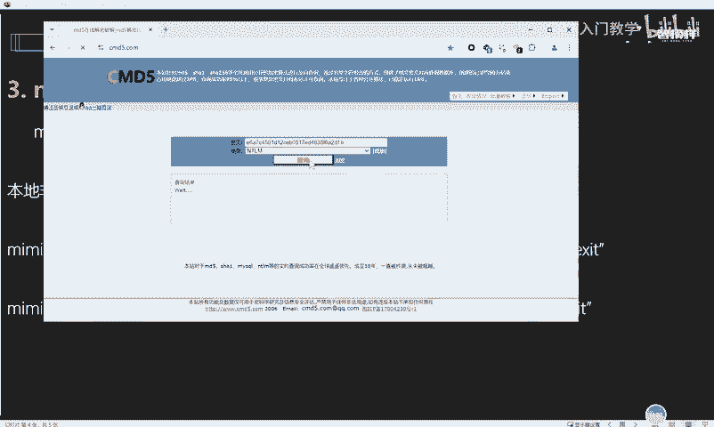

**执行结果**：在输出信息中，寻找`Authentication Id`下的`Username`和`Password`字段。如果用户近期成功进行过交互式登录（如远程桌面、控制台登录），且系统未打特定补丁，这里很可能直接显示明文密码。

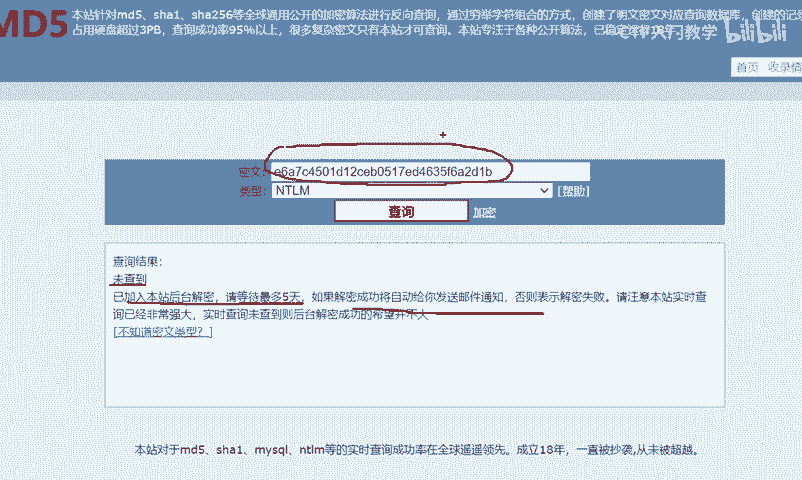

## 注意事项与防御

*   **权限要求**：mimikatz几乎所有功能都需要管理员或SYSTEM权限。
*   **杀软拦截**：mimikatz被绝大多数安全软件标记为恶意工具，在实际环境中运行可能被立即拦截。
*   **防御措施**：
    *   **打补丁**：及时安装系统安全更新，防止凭据明文存储在内存中。
    *   **启用Credential Guard**（Windows 10/Server 2016+）：有效防止mimikatz从内存中提取凭据。
    *   **限制管理员权限**：遵循最小权限原则。
    *   **监控进程行为**：对`lsass.exe`进程的异常访问进行告警。

## 总结

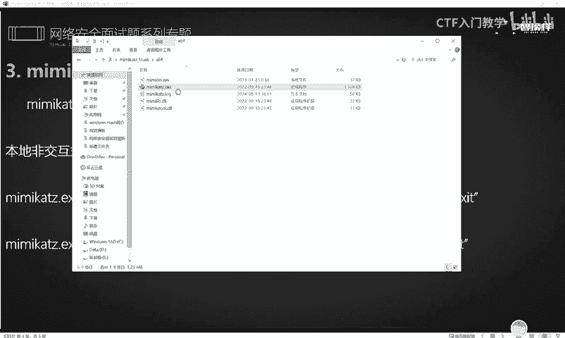

本节课我们一起学习了内网渗透中的利器——mimikatz的基本使用方法。我们掌握了两个核心场景：
1.  通过`privilege::debug`、`token::elevate`和`lsadump::sam`命令获取本地用户的NTLM哈希值。
2.  通过`privilege::debug`和`sekurlsa::logonpasswords`命令尝试从内存中提取明文密码。

理解这些攻击手法，不仅能帮助安全人员评估系统风险，也能让防御者更好地知道如何加固系统。下一节，我们将继续学习其他凭证获取工具和方法。