# 网络安全入门：P63：3、其他方式讲解

在本节课中，我们将学习在Windows系统中获取密码凭证的其他几种工具和方法。这些方法涵盖了从本地哈希提取到利用渗透测试框架进行凭证抓取，是渗透测试和内网安全评估中的重要环节。

上一节我们介绍了Mimikatz、WCE等工具，本节中我们来看看其他一些同样有效的凭证获取方式。

## 🛠️ 使用PwDump7提取哈希

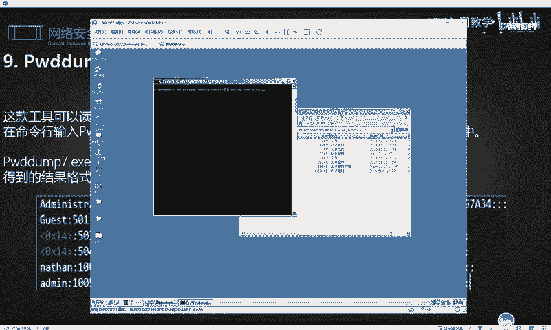

PwDump7是一款能够读取当前系统所有用户密码哈希值的工具。其特点是运行后会直接输出结果并关闭命令行窗口，因此通常需要将输出结果重定向到文件中以便查看。

以下是使用PwDump7的基本命令：
```cmd
PwDump7.exe > pass.txt
```
这条命令会将提取到的哈希值保存到当前目录下的 `pass.txt` 文件中。执行成功后，打开该文件即可查看所有本地用户的NTLM哈希。

## 🔐 使用Ophcrack配合彩虹表破解哈希

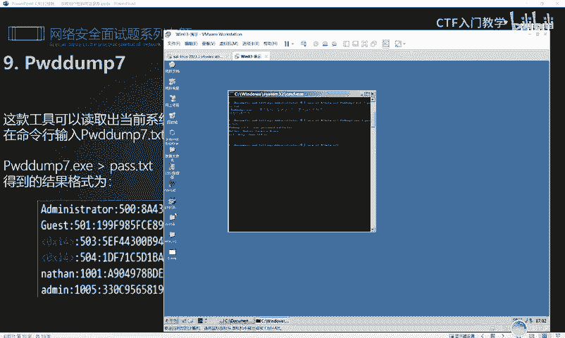

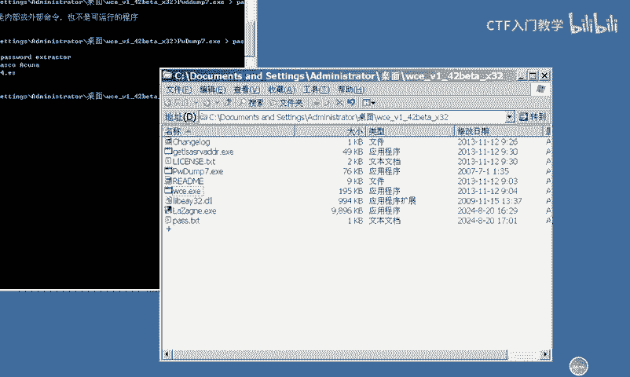

当获取到的哈希值无法通过在线网站破解时，可以使用Ophcrack这类本地破解工具。它通过加载预先生成的彩虹表来尝试还原哈希对应的明文密码。

这种方法依赖于彩虹表的完整性和规模。表越大，破解成功率越高，但所需时间也越长。因此，在实战中通常作为备选方案。

## 📂 使用Procdump转储LSASS进程内存

Procdump是微软官方发布的命令行工具，可用于创建进程的内存转储文件。我们可以用它来转储保存着明文凭据的 `lsass.exe` 进程内存。

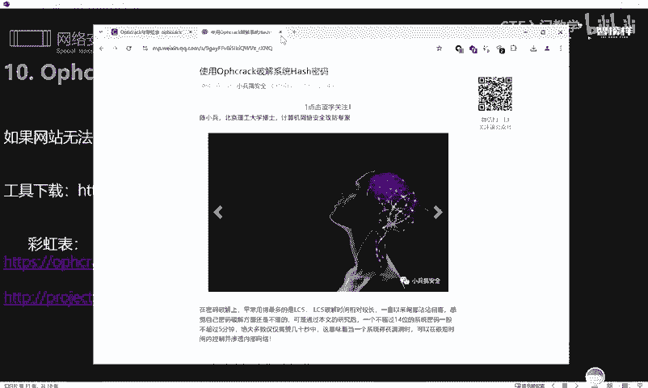

根据目标系统架构，使用不同的命令：
*   **32位系统**：`procdump.exe -accepteula -ma lsass.exe lsass.dmp`
*   **64位系统**：`procdump64.exe -accepteula -ma lsass.exe lsass.dmp`

转储生成的 `.dmp` 文件需要配合Mimikatz来解析和提取其中的明文密码。

## 🗂️ 通过注册表导出哈希

Windows系统的SAM数据库中存储着用户的哈希值，我们可以通过注册表操作将其导出。

使用 `reg` 命令保存相关注册表项：
```cmd
reg save HKLM\SAM sam.hive
reg save HKLM\SYSTEM system.hive
```
导出 `sam.hive` 和 `system.hive` 文件后，可以使用Mimikatz或专门的脚本（如 `secretsdump.py`）来提取其中的哈希值。

## ⚡ 使用LaZagne快速抓取凭据

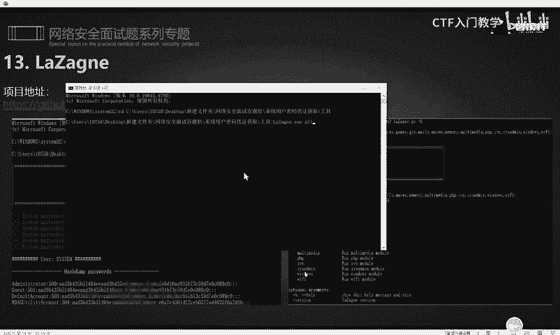

LaZagne是一款功能强大的开源凭据恢复工具，支持抓取系统内多种软件保存的密码。

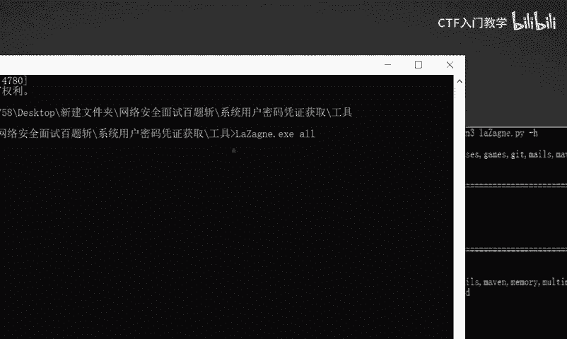

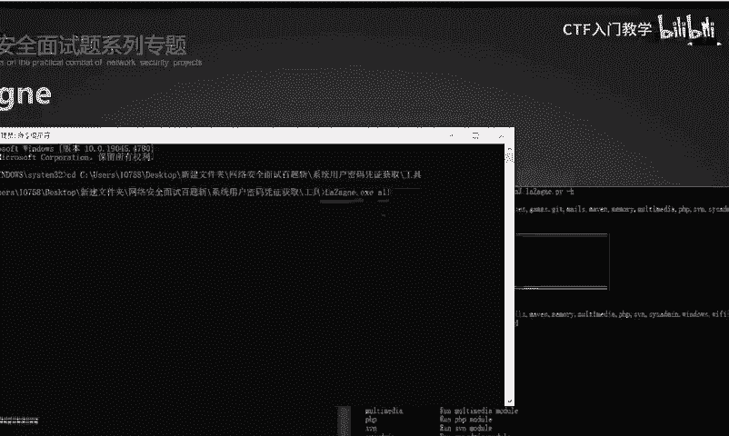

其使用方法非常简单，上传到目标系统后，在命令行中执行：
```cmd
laZagne.exe all
```
该命令会尝试抓取系统内所有可恢复的凭据，包括浏览器、邮件客户端、系统登录密码等，并以清晰的格式输出。

## 🐛 利用Metasploit框架抓取哈希

Metasploit框架内置了多个用于提取Windows系统哈希的模块，在获得目标系统Meterpreter会话后可以方便地调用。

以下是两个核心模块：
1.  **hashdump模块**：`post/windows/gather/hashdump`
2.  **smart_hashdump模块**：`post/windows/gather/smart_hashdump`

加载会话并运行模块后，获取的哈希默认会保存在 `/root/.msf4/loot/` 目录下。此外，也可以直接在Meterpreter会话中使用 `mimikatz` 命令来抓取哈希和明文密码。

## ☕ 使用Cobalt Strike抓取凭据

Cobalt Strike同样集成了强大的凭据抓取功能，可以通过图形化界面或命令行快速操作。

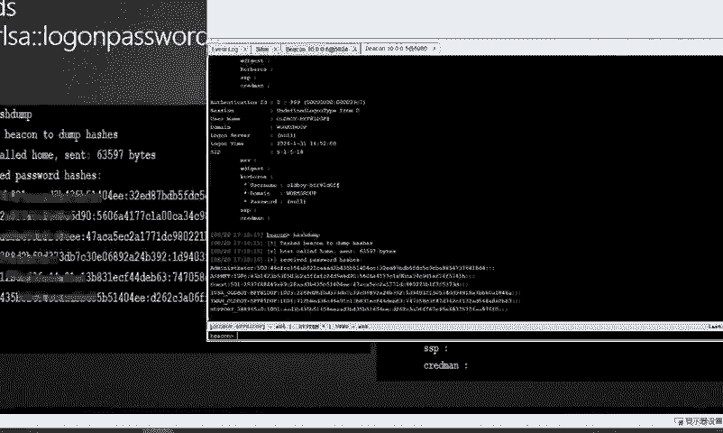

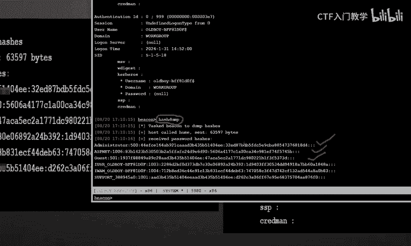

在图形界面中，选中一个 Beacon 会话，通过 `Access` -> `Dump Hashes` 或 `Run Mimikatz` 即可抓取哈希或明文密码。

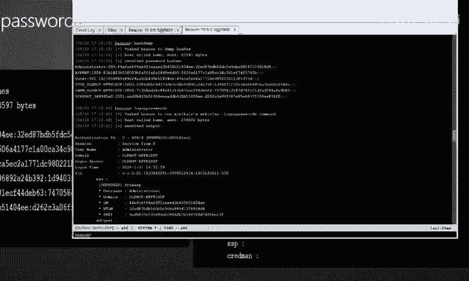

在命令行中，可以直接输入以下命令：
*   `hashdump`：转储哈希。
*   `logonpasswords`：运行Mimikatz的 `sekurlsa::logonpasswords` 命令抓取明文密码。

操作结果会实时显示在 Beacon 的输出窗口中。

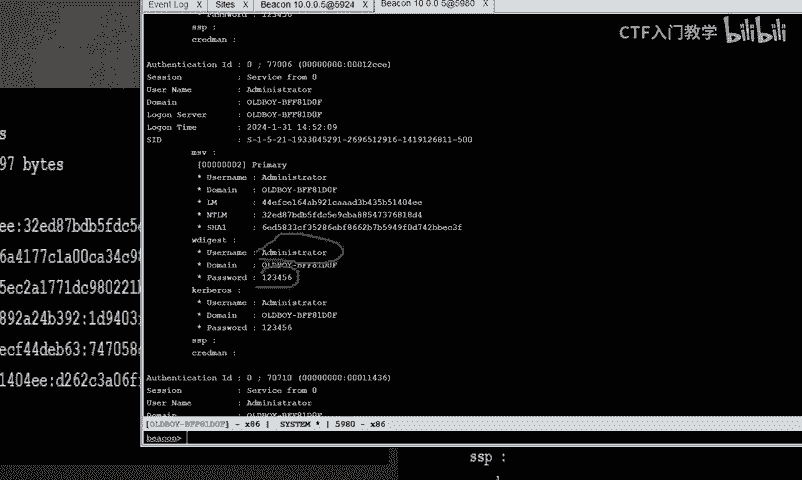

---

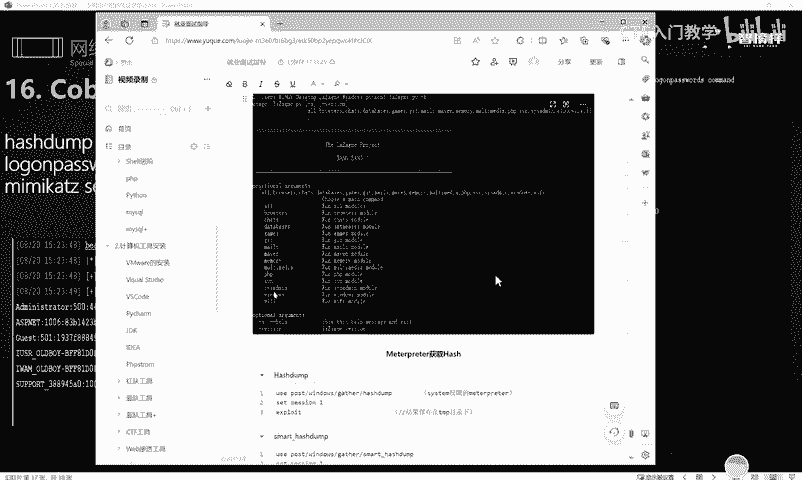

本节课中我们一起学习了多种在Windows系统中获取密码凭证的工具和方法，包括PwDump7、Ophcrack、Procdump、注册表导出、LaZagne，以及在Metasploit和Cobalt Strike框架中的应用。掌握这些技术有助于在授权渗透测试中全面评估系统的安全性。请注意，所有技术仅应用于合法授权的安全测试和学习研究。