# 网络安全入门：P66：3、Ninjacopy脚本获取域用户密码

在本节课中，我们将学习如何使用PowerShell脚本（特别是Ninjacopy脚本）来安全地获取域环境中的敏感文件（如SAM数据库和NTDS.dit文件），这种方法相比使用Windows自带命令，能更好地规避系统日志记录。

## 概述

在之前的课程中，我们介绍了使用VSS或NTDSUTIL等Windows自带命令来创建卷影副本并复制文件的方法。这些操作虽然有效，但会在目标系统的日志中留下记录（如事件ID 7036），可能被安全人员发现。

本节中，我们将探讨一种更隐蔽的方法：使用PowerShell脚本（如Ninjacopy）来直接复制被系统锁定的文件，从而避免在日志中留下痕迹。

## 脚本获取与准备

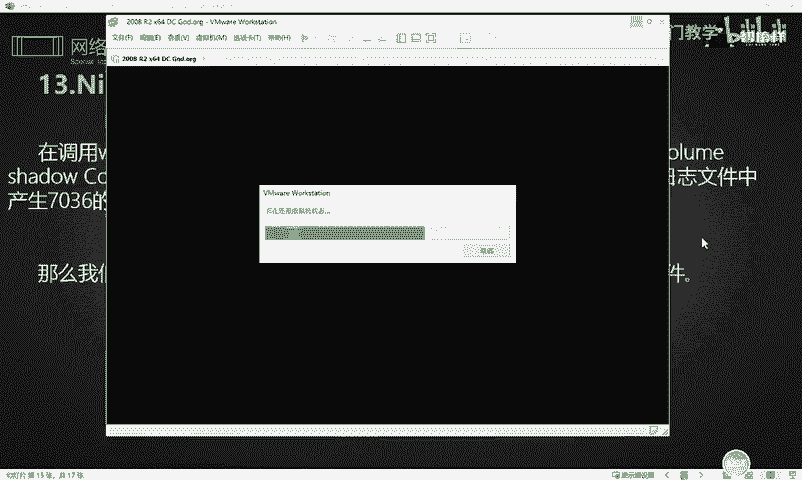

首先，我们需要获取相应的PowerShell脚本。Ninjacopy是PowerSploit工具集的一部分，该工具集包含许多用于渗透测试的脚本。

以下是获取和使用脚本的步骤：

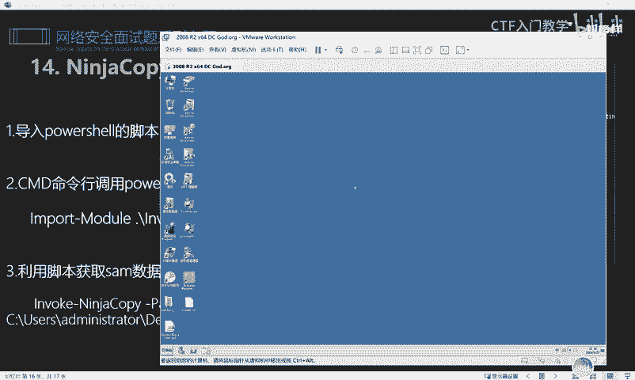

1.  **下载脚本**：可以从GitHub等平台获取PowerSploit项目，其中包含Ninjacopy.ps1脚本。相关资源链接已整理在课程资料中。
2.  **上传脚本**：将下载好的脚本文件上传到目标域控制器的文件系统中，例如桌面目录。
3.  **打开命令行**：通过RDP或其他方式，在目标系统上打开命令提示符（CMD）。

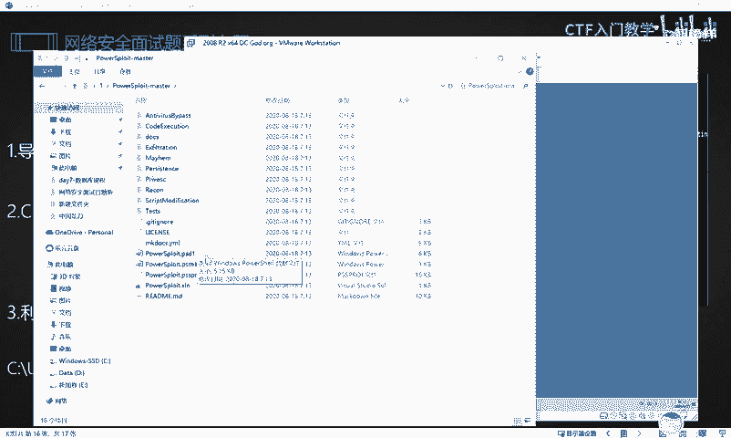

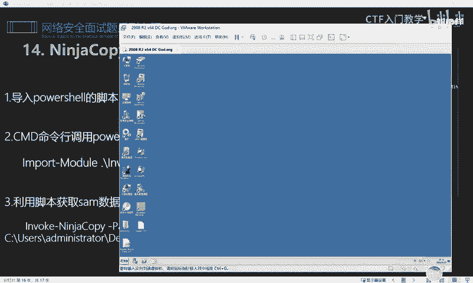

## 使用Ninjacopy脚本复制文件

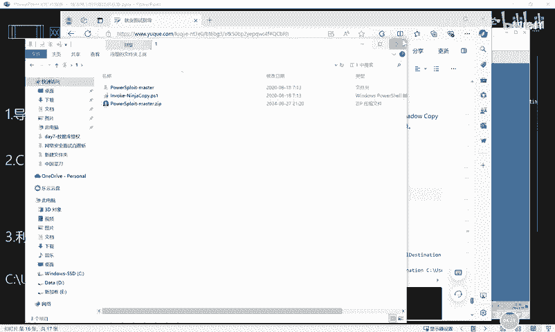

接下来，我们进入PowerShell环境并加载脚本模块来执行复制操作。

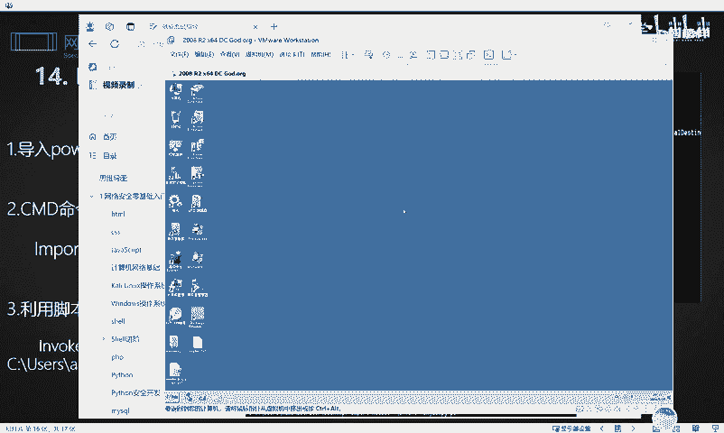

### 复制SAM数据库文件

SAM文件存储了本地用户的密码哈希值。以下是复制该文件的步骤：

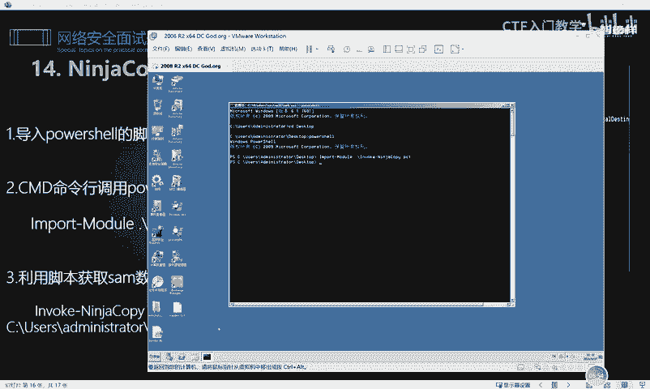

首先，切换到脚本所在目录并进入PowerShell环境。
```powershell
cd C:\Users\Administrator\Desktop
powershell
```
然后，导入Ninjacopy模块。
```powershell
Import-Module .\Ninjacopy.ps1
```
最后，执行复制命令。该命令将系统SAM文件复制到当前用户的桌面。
```powershell
Invoke-NinjaCopy -Path "C:\Windows\System32\config\SAM" -LocalDestination "C:\Users\Administrator\Desktop\sam"
```
命令执行成功后，你会在桌面上看到一个名为“sam”的文件，这就是复制出来的SAM数据库。

### 复制NTDS.dit文件

NTDS.dit是Active Directory的数据库文件，包含了所有域用户的密码哈希等信息。该文件在域控制器运行时被锁定，无法直接复制。

如果尝试用普通命令复制，会收到“进程无法访问”的错误。
```cmd
copy C:\Windows\NTDS\NTDS.dit C:\NTDS666.dit
```
此时，我们可以使用Ninjacopy脚本来绕过锁定，进行复制。命令格式与复制SAM文件类似。
```powershell
Invoke-NinjaCopy -Path "C:\Windows\NTDS\NTDS.dit" -LocalDestination "C:\Users\Administrator\Desktop\ntds.dit"
```
执行后，NTDS.dit文件就会被成功复制到指定位置。

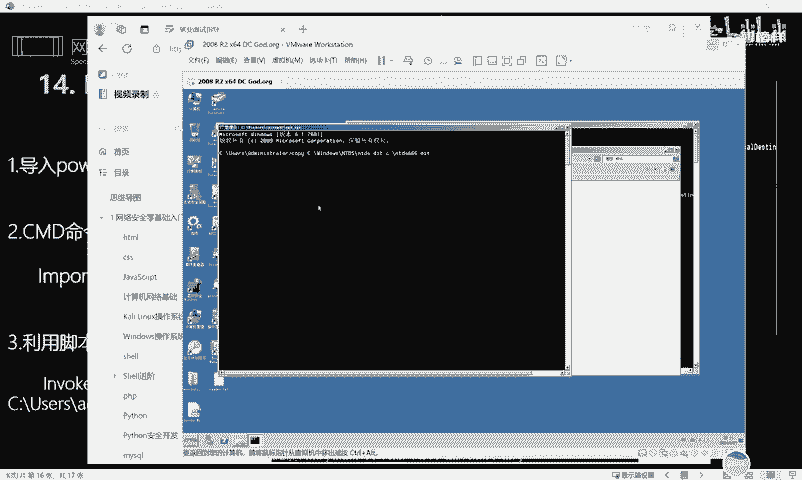

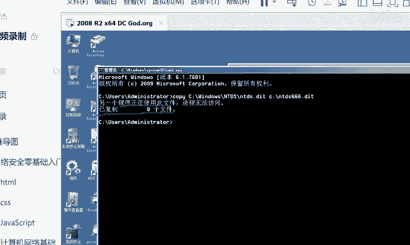

## 方法对比与进阶学习

使用PowerShell脚本（如Ninjacopy）的主要优势在于其隐蔽性，它通过直接读取磁盘扇区等方式复制文件，避免了调用系统备份服务，从而减少了日志记录。

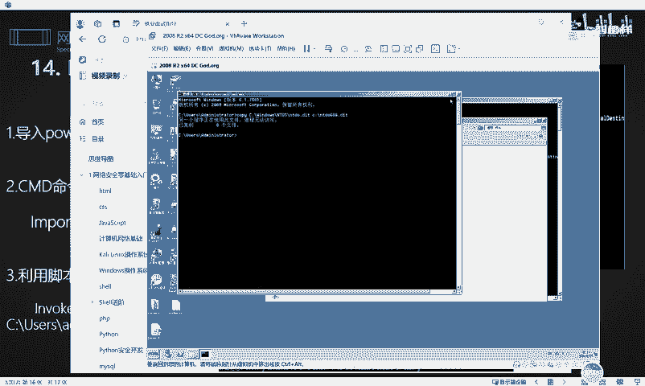

除了Ninjacopy，PowerSploit和其他安全框架中还包含大量功能各异的脚本，可用于信息收集、权限提升、横向移动等。对于希望深入学习的同学，可以进一步研究这些脚本的用法。

## 总结

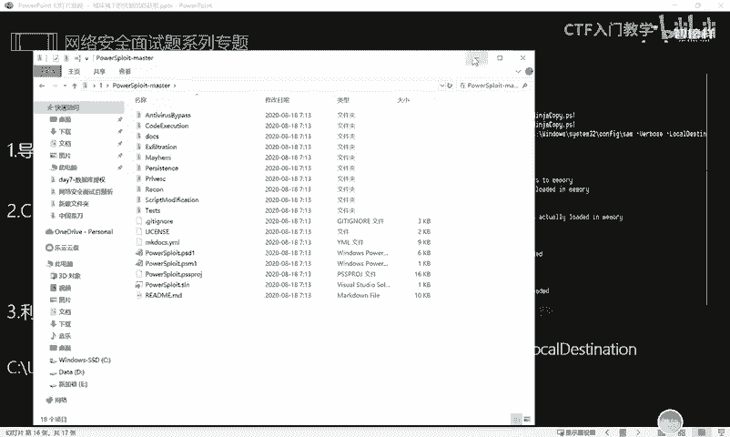

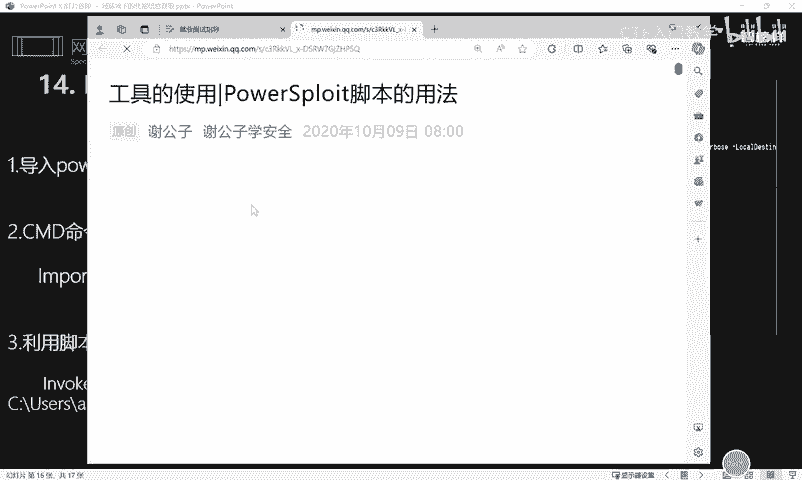

本节课中，我们一起学习了如何利用Ninjacopy PowerShell脚本在域环境中隐蔽地获取关键文件（SAM和NTDS.dit）。我们了解了其基本操作步骤：上传脚本、导入模块、执行复制命令。这种方法相比传统卷影复制技术，能更有效地规避安全日志监控，是渗透测试中一项实用的技巧。