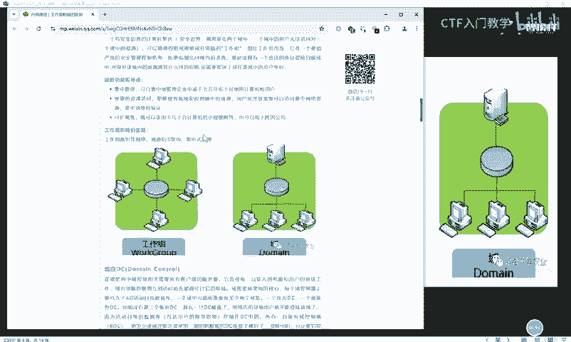
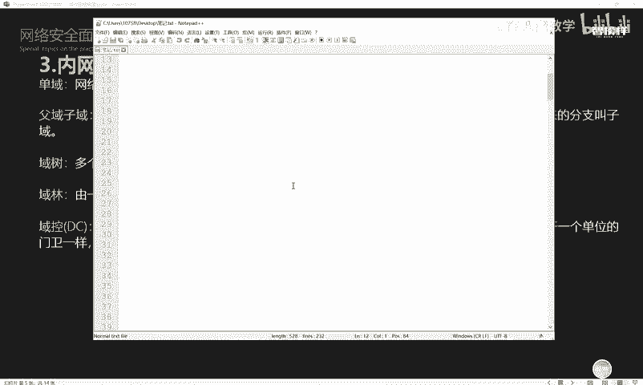
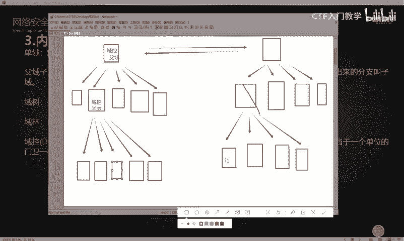
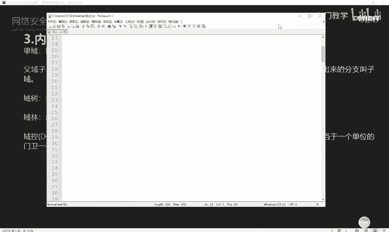
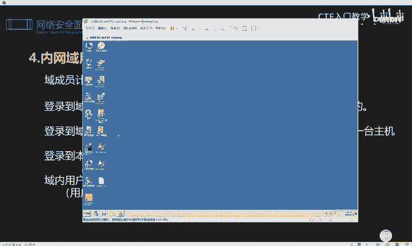
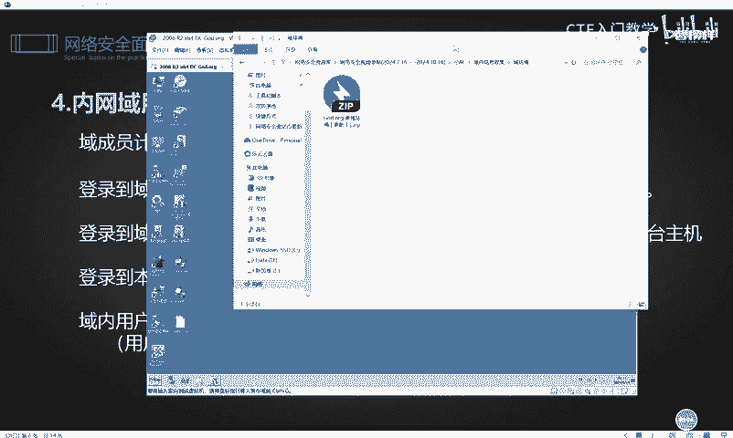
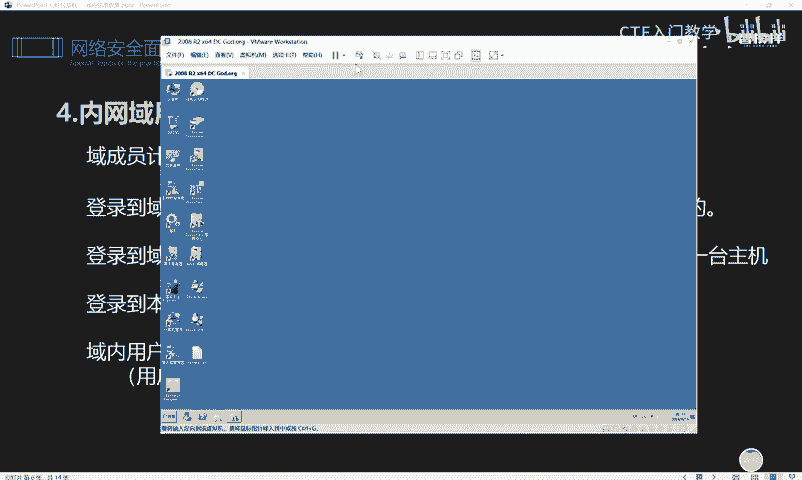

# 网络安全面试突击：P67：内网域环境简述 🏰

在本节课中，我们将学习内网安全中的一个核心概念——域。我们将了解域是什么，它与工作组的区别，以及域环境的基本结构和特性。掌握这些基础知识，是理解后续内网渗透和信息收集技术的关键。

---

## 域的基本概念

上一节我们介绍了内网工作组的信息收集，本节中我们来看看域。域是一个有着安全边界的计算机集合，它将网络中的多台计算机在逻辑上组织到一起，进行集中管理。这种区别于工作组的逻辑环境就叫做域。

域是组织和存储资源的核心管理单元。在域中，有一台专门的机器作为**域控制器**。域内的其他机器，即**域成员**，都受域控制器的管理。域控制器保存了整个域的用户账号和安全数据库。

## 域与工作组的区别

以下是域与工作组的主要区别图示：

通过图示可以清晰地看到：
*   **工作组**：内网环境中的计算机地位平等，没有统一的管理者，权限基本对等。
*   **域**：由一台专门的域控制器管理所有域成员，管理严格，使整个内网环境更加安全。

## 域的结构：单域、父域与子域

为了充分了解域的信息收集，我们需要理解域的分层结构。

*   **单域**：在一个简单的组织架构中，如果域成员数量较少，可能只使用一个域，这就是单域。
*   **父域与子域**：为了满足管理需要，可以在一个域中划分出多个域。被划分的原始域称为**父域**，划分出来的分支称为**子域**。

以下是一个层级结构的抽象图示：

可以将此结构类比为公司组织：
*   最上层的域控制器相当于公司总部。
*   下方的子域控制器相当于各个部门经理。
*   这种父与子的关系，使得子域同样受父域的管理。

## 域树与域林

随着组织规模扩大，域的结构会变得更加复杂。

*   **域树**：多个父域、子域之间建立信任关系后，就构成了一个**域树**。建立信任关系后，域树内的环境和资源可以共享。
*   **域林**：由多棵域树组成，就形成了**域林**。可以理解为一片由多棵树组成的森林。

## 域控制器及其特性

域控制器是域模式下的核心，简称 **DC**。它负责验证每一台连入网络的电脑和用户，相当于单位的门卫或小区的物业。

域控制器有一个重要特性：**它可以不经域成员允许，随意登录到域内的任意一台主机**。因此，在攻防演练中，攻击者往往以拿下域控制器为主要目标，因为控制域控制器就相当于控制了整个域环境。

## 域环境用户的登录与特性

域成员计算机在登录时有两种选择：

1.  **登录到域**：身份验证采用 **Kerberos 协议**在域控制器上进行。此时用户受域控制器的全面管理。
2.  **登录到此计算机（本地）**：身份验证采用 **NTLM 哈希**在本地 SAM 数据库中进行。

在域环境中，用户的所有行为和操作都受到域控制器的管理，包括账号密码验证、软件安装、上网行为等。这使得内网环境更安全，也更便于集中管理。

## 域环境的优势

域环境虽然管理严格，但带来了显著优势：

以下是域环境的主要优点：
*   **账号集中管理**：所有账号存储在服务器上，方便重命名和重置密码，能有效统一密码策略，解决弱口令问题。
*   **软件集中管理**：统一部署和安装软件，避免员工从不可靠来源下载携带恶意软件的程序，提升安全性。
*   **统一客户端配置**：可以统一桌面、IE等客户端配置，并强制进行杀毒、打补丁等安全操作，增强整体安全性。
*   **管理可靠**：集中化的管理方式更加可靠，并能减少系统宕机时间。

---

本节课中我们一起学习了内网域环境的基本概念。我们了解了域与工作组的区别、域的分层结构（单域、父域、子域、域树、域林），以及域控制器和域环境的核心特性与优势。理解这些是进行内网渗透测试和信息收集的重要基础。下一节课，我们将讲解域内信息收集的具体操作演示。