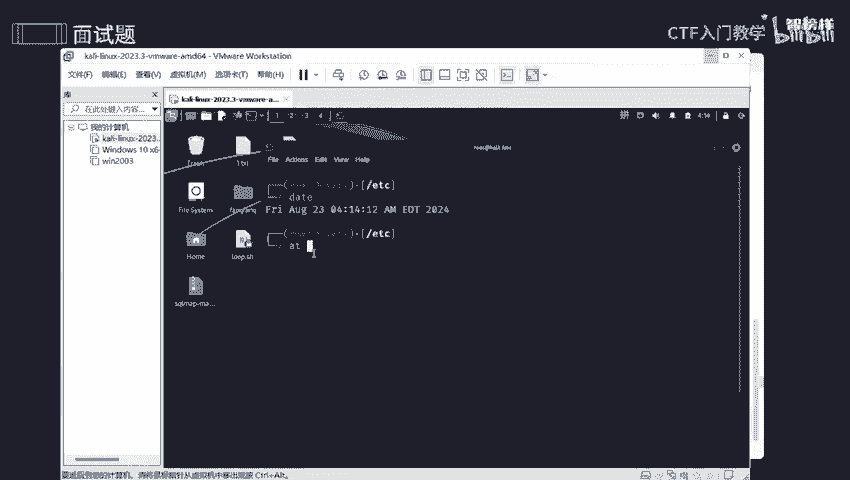
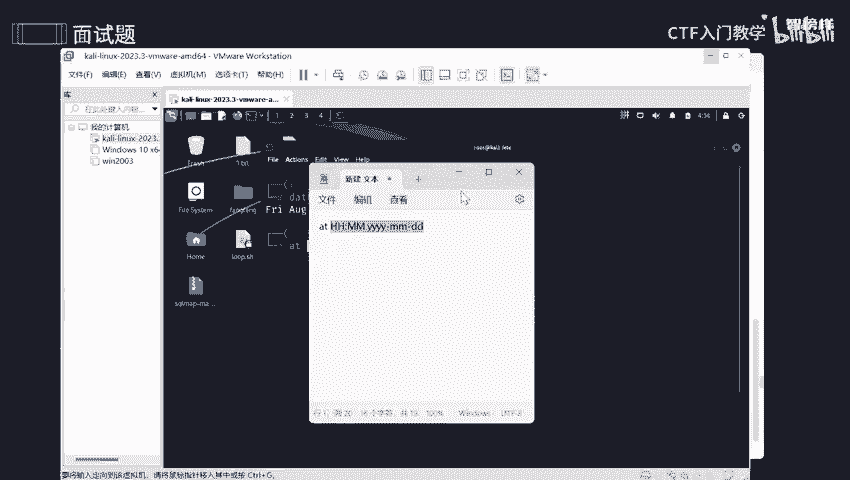
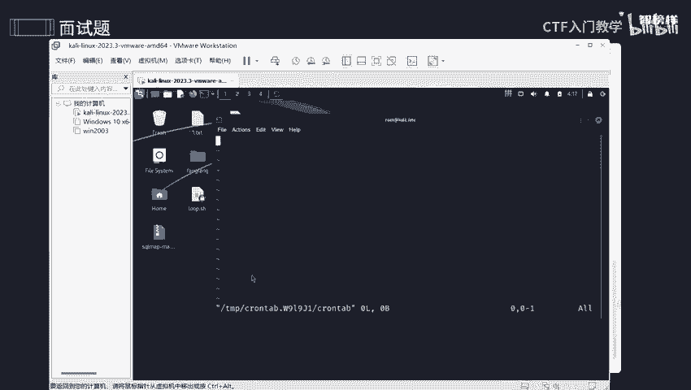

# 网络安全面试突击：P6：关于Linux定时任务 ⏰

在本节课中，我们将学习Linux系统中定时任务相关的核心概念和面试常见问题。定时任务是自动化运维和安全运维中的重要组成部分，理解其原理和安全配置至关重要。

---

## 什么是定时任务？



上一节我们介绍了课程概述，本节中我们来看看什么是定时任务。定时任务是指在预定的时间自动执行指定命令或脚本的功能。它主要分为两种类型：一次性任务和周期性任务。



*   **一次性任务**：使用 `at` 命令设置，任务在指定的未来某个时间点执行一次后即结束。
*   **周期性任务**：使用 `crontab` 命令设置，任务会按照预设的时间周期（如每天、每周）重复执行。

---

## 如何设置一次性任务？

了解了基本概念后，我们来看看如何设置一次性任务。`at` 命令用于安排一次性任务，其时间格式有特定要求。

`at` 命令的基本时间格式如下：
```
at HH:MM YYYY-MM-DD
```
*   `HH:MM` 代表小时和分钟。
*   `YYYY-MM-DD` 代表年、月、日。

以下是设置一次性任务的步骤：

1.  使用 `at` 命令并指定时间。例如，设置一个在2024年8月24日04:00执行的任务：
    ```bash
    at 04:00 2024-08-24
    ```
2.  在出现的 `at>` 提示符后，输入要执行的命令。例如，将“Hello 你好”输出到 `test.txt` 文件：
    ```bash
    echo "Hello 你好" >> ~/test.txt
    ```
3.  输入完成后，按 `Ctrl + D` 提交任务。
4.  可以使用 `atq` 命令查看已排队的一次性任务列表。

**概念比喻**：一次性任务就像一场特定日期的演唱会，只在那个时间点发生一次，之后不会重复。

---



## 如何设置周期性任务？

设置完一次性任务，接下来我们学习更常用的周期性任务。周期性任务使用 `crontab` 命令进行管理，其时间配置通过五个字段来定义。

`crontab` 的时间格式由5个星号（`*`）或数字表示的字段组成：
```
* * * * * <要执行的命令>
```
这五个字段从左到右分别代表：
1.  **分钟** (0-59)
2.  **小时** (0-23)
3.  **一个月中的第几天** (1-31)
4.  **月份** (1-12)
5.  **一周中的第几天** (0-7，其中0和7都代表星期日)

以下是创建周期性任务的步骤：

1.  使用 `crontab -e` 命令编辑当前用户的定时任务列表。
2.  在编辑器中，按照格式添加一行配置。例如，设置一个每天凌晨1点执行的任务，将“更新服务器”写入日志文件：
    ```bash
    0 1 * * * echo “更新服务器” >> ~/Desktop/log.txt
    ```
3.  保存并退出编辑器。
4.  使用 `crontab -l` 命令可以列出当前用户设置的所有周期性任务。
5.  所有用户的 `crontab` 配置文件通常存储在 `/var/spool/cron/` 目录下（如 `/var/spool/cron/root` 是root用户的）。

**概念比喻**：周期性任务就像每周五都要交的作业，会在固定的周期重复执行。

---

## 如何保证定时任务的安全性？

在业务中设置了定时任务后，确保其安全性是重中之重。以下是几个关键的安全实践和面试问题解答。

### 如何确保定时任务的权限设置是安全的？

核心原则是遵循最小权限原则。避免直接使用 `root` 权限运行非必要的任务。应为不同的任务创建专门的系统用户或使用普通用户权限，并严格控制对 `crontab` 命令和配置文件的访问权限（如 `/etc/cron.allow` 和 `/etc/cron.deny`）。

### 如何审计定时任务以确保它们没有被篡改？

可以使用文件完整性检查工具来监控关键文件和脚本的变化。例如，使用 **AIDE (Advanced Intrusion Detection Environment)** 定期检查 `/var/spool/cron/` 目录下的文件、系统级定时任务脚本（如 `/etc/crontab`, `/etc/cron.d/`）以及用户主目录下的脚本是否被非法修改。

### 如何防止定时任务被滥用？

除了权限控制和完整性监控，还应通过检查系统日志来发现异常。定期审查 `/var/log/cron` 日志文件，检查是否存在异常的执行记录、非授权用户添加的任务或执行失败的错误信息。

### 如何确保涉及网络操作的定时任务不会成为安全漏洞？

对于需要访问网络资源的定时任务（如备份、同步），应采取以下措施：
*   **使用加密连接**：例如，使用 `SSH` 密钥对进行认证和加密传输，避免在脚本中明文存储密码。
*   **避免硬编码敏感信息**：不要将密码、密钥等直接写在脚本里。应使用环境变量或受权限保护的配置文件来存储。
*   **限制网络访问**：通过防火墙策略，仅允许定时任务访问必要的最小网络范围。

### 如何监控定时任务的执行和结果？

将定时任务的输出（包括标准输出和错误输出）重定向到日志文件，是常见的监控方法。这有助于后续排查问题。
```bash
# 在crontab中，将任务的输出和错误都记录到日志文件
0 1 * * * /path/to/script.sh >> /var/log/myjob.log 2>&1
```
定期检查这些日志文件，可以确认任务是否按时执行，以及执行过程中是否出现错误。

---

## 总结

本节课中我们一起学习了Linux定时任务的核心知识。我们首先区分了一次性任务（`at`）和周期性任务（`crontab`）的概念与设置方法。接着，我们重点探讨了定时任务在安全运维中的关键点，包括权限管理、完整性审计、滥用防范、网络安全加固以及执行结果监控。理解并实践这些安全准则，对于构建稳固的自动化运维体系至关重要。