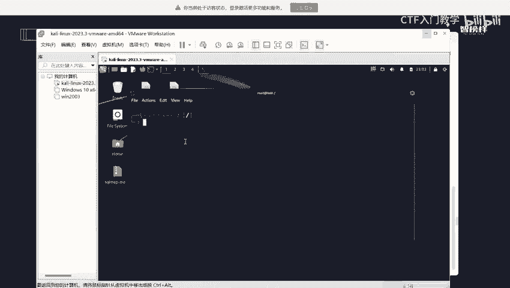
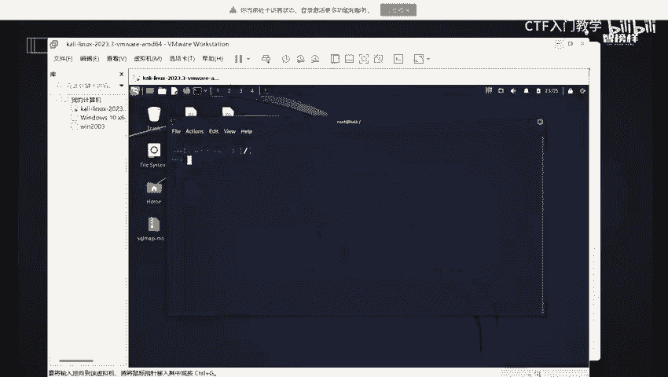
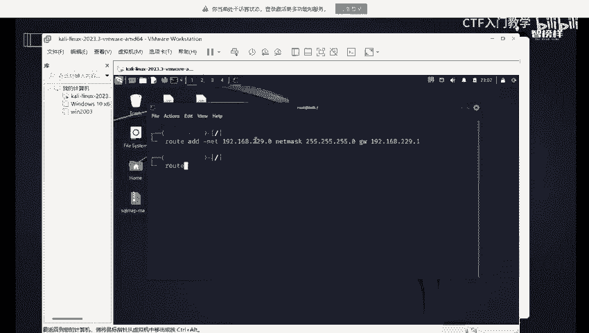
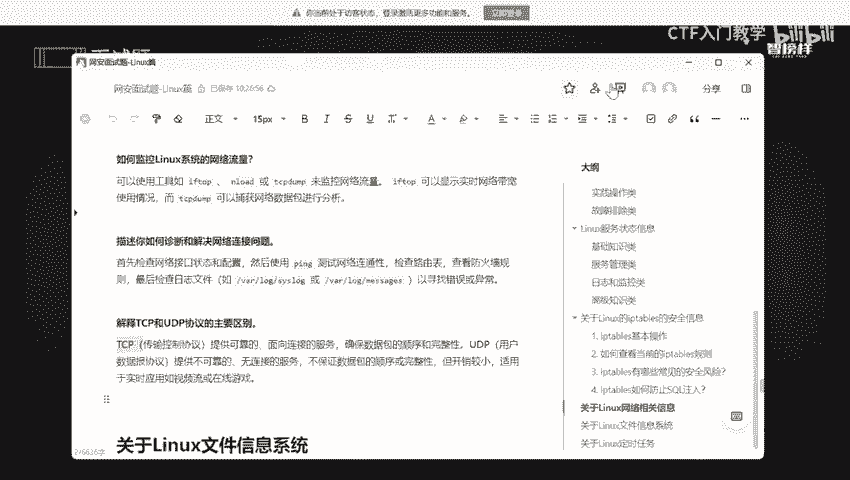

# CTF入门教学：P8：关于Linux网络相关信息 🔧

在本节课中，我们将学习Linux系统中与网络相关的核心操作和概念。这些知识对于网络安全、渗透测试以及日常的系统管理都至关重要。我们将涵盖IP地址配置、网络接口查看、路由表管理、流量监控、网络故障排查以及TCP与UDP协议的区别。

---

## 如何在Linux中配置静态IP地址

上一节我们介绍了课程概述，本节中我们来看看如何配置静态IP地址。

静态IP地址是指手动分配给设备的固定IP地址，它不会像动态IP地址那样自动改变。配置静态IP地址的主要原因包括：某些服务需要固定IP才能正常工作；在内部网络中，为确保设备间可靠通信，通常分配静态IP；静态IP地址有助于防止IP地址冲突。简而言之，对于需要稳定、可靠且易于管理的网络连接的设备和服务，静态IP地址是最佳选择。

配置静态IP地址通常通过修改网络接口的配置文件实现。以下是配置步骤：

1.  编辑网络接口配置文件，例如 `/etc/network/interfaces`（Debian/Ubuntu）或 `/etc/sysconfig/network-scripts/ifcfg-<接口名>`（RHEL/CentOS）。
2.  在文件中添加或修改以下参数：
    *   `address`: 指定IP地址。
    *   `netmask`: 指定子网掩码。
    *   `gateway`: 指定默认网关。
3.  保存文件并重启网络服务使配置生效。

示例配置代码片段（以Debian系为例）：
```bash
auto eth0
iface eth0 inet static
    address 192.168.1.100
    netmask 255.255.255.0
    gateway 192.168.1.1
```

---


## 如何查看网络接口



了解了IP地址的配置方法后，接下来我们需要知道如何查看网络接口的状态。

查看网络接口信息是诊断网络问题的第一步。Linux系统提供了多个命令来实现此功能。

以下是常用的查看网络接口信息的命令：

*   **`ip addr show` 或 `ip a`**: 这是最推荐使用的命令，它能清晰、彩色地显示所有网络接口的详细信息，包括IP地址、MAC地址和状态。
*   **`ifconfig`**: 这是一个传统的命令，同样可以显示接口信息，但输出格式较为简单，且在某些新系统中可能需要单独安装。
*   **`nmcli device show`**: 适用于使用NetworkManager管理网络的环境，能提供非常详细的配置信息。

在这些命令的输出中，`lo` 表示本地回环接口，其IP地址通常是 `127.0.0.1`。


---

## 如何查看和修改路由表



在确认了网络接口正常工作后，数据包的传输路径则由路由表决定。本节中我们来看看如何管理路由表。

路由表决定了数据包从源设备到目标设备的传输路径。使用 `route` 或 `ip route` 命令可以查看当前的路由表。


**查看路由表**:
```bash
ip route show
# 或
route -n
```
输出会显示目标网络、网关、子网掩码以及使用的网络接口等信息。



**修改路由表**:
*   **添加路由**: 使用 `ip route add` 命令。
    ```bash
    sudo ip route add 10.0.0.0/24 via 192.168.1.1 dev eth0
    ```
*   **删除路由**: 使用 `ip route del` 命令。
    ```bash
    sudo ip route del 10.0.0.0/24
    ```

---

## 如何监控网络流量

掌握了网络路径的配置，我们还需要能够观察网络上的数据流动。本节将介绍监控网络流量的工具。

监控网络流量对于分析网络行为、排查性能问题和检测安全异常至关重要。

以下是几个常用的网络流量监控工具：

*   **`iftop`**: 实时显示网络带宽使用情况，类似于 `top` 命令，但针对网络接口。
*   **`nload`**: 提供简单的图形化界面，实时显示入站和出站的流量速率。
*   **`tcpdump`**: 功能强大的命令行数据包分析器，可以捕获流经网络接口的原始数据包，用于深度分析。
*   **`Wireshark`**: 图形化的网络协议分析器，功能比 `tcpdump` 更强大和易用，支持深度数据包检查。

---

## 如何诊断和解决网络连接问题

当网络出现连接故障时，需要一套系统的方法进行排查。以下是诊断网络连接问题的标准步骤。

1.  **检查网络接口配置与状态**: 使用 `ip a` 或 `ifconfig` 确认接口已启动 (`UP`)，并且IP地址、子网掩码配置正确。
2.  **测试网络连通性**: 使用 `ping` 命令测试是否能到达目标主机（如网关或外部网站）。`ping 8.8.8.8`
3.  **检查路由表**: 使用 `ip route show` 确认是否存在通往目标网络的正确路由。
4.  **检查防火墙规则**: 确认本地防火墙（如 `iptables` 或 `firewalld`）是否阻止了相关连接。可以临时禁用防火墙进行测试。
5.  **检查系统日志**: 查看系统日志（如 `/var/log/syslog` 或 `journalctl`）中与网络相关的错误或警告信息，这能提供关键的故障线索。

---

## 解释TCP和UDP协议的主要区别

在解决了具体的网络操作问题后，我们需要理解底层网络协议的工作原理。本节将解释TCP和UDP这两个核心传输层协议的区别。

TCP（传输控制协议）和UDP（用户数据报协议）是互联网的基石，它们决定了数据如何被打包和传输。

**TCP协议**:
*   **特点**: 可靠的、面向连接的。
*   **工作原理**: 在数据传输前需要建立连接（三次握手），确保数据包按顺序、完整地到达。如果丢包，会触发重传机制。提供流量控制和拥塞控制。
*   **适用场景**: 适用于要求高可靠性的应用，如网页浏览（HTTP/HTTPS）、文件传输（FTP）、电子邮件（SMTP）。
*   **核心保证**: **顺序性** 和 **完整性**。

**UDP协议**:
*   **特点**: 不可靠的、无连接的。
*   **工作原理**: 直接发送数据包，不建立连接，不保证数据包一定到达、按序到达或不被损坏。开销小，延迟低。
*   **适用场景**: 适用于对实时性要求高、可容忍少量丢包的应用，如视频流、在线游戏、DNS查询。
*   **核心优势**: **低延迟** 和 **高效率**。

**类比**:
*   **TCP** 像寄挂号信或快递：需要确认收件人地址（连接），提供投递证明（确认），如果没送到会重发（可靠）。
*   **UDP** 像寄明信片：直接投入邮筒（无连接），更快捷便宜，但不保证对方一定能收到（不可靠）。

**公式化总结**:
*   **可靠性**: TCP > UDP
*   **速度/开销**: UDP > TCP
*   **连接方式**: TCP是 **面向连接**；UDP是 **无连接**。

---



本节课中我们一起学习了Linux网络管理的关键技能：从配置静态IP、查看接口与路由，到监控流量和系统化排查故障。最后，我们深入理解了TCP与UDP协议的根本区别，这是理解网络通信的基石。掌握这些内容，将为你在网络安全和系统管理领域的深入学习与实践打下坚实基础。