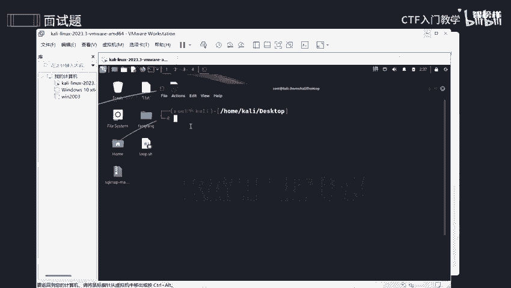
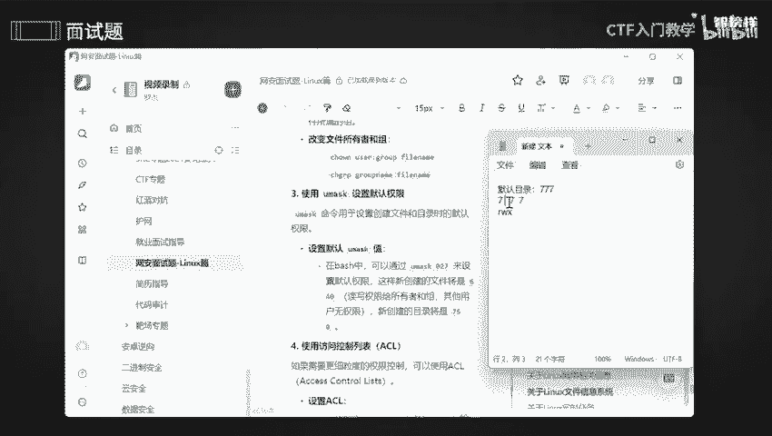

# 网络安全面试突击：P9：关于Linux文件信息系统 🔐

## 概述
在本节课中，我们将学习Linux文件系统安全相关的核心面试问题。我们将探讨如何设置文件权限、理解安全权限配置、检查文件完整性、监控文件变化以及防止未授权访问。掌握这些知识对于保障系统安全至关重要。

---

## 如何设置文件权限以防止未授权访问？

上一节我们概述了课程内容，本节中我们来看看如何具体设置文件权限。

某些文件（如数据库、财务报表、科研数据或工作日志）包含敏感信息，必须防止未授权用户读取或修改。核心目标是实现“只读”或“仅所有者可读写”的权限控制。

具体操作是使用 `chmod` 命令来修改文件权限。例如，设置权限为 `600`。



在Linux中，新创建文件的默认权限通常是 `rw-rw-rw-`（即所有用户可读可写），目录的默认权限则包含执行权限。

以下是一个操作示例。首先查看一个测试文件的当前权限：

```bash
ls -la test.txt
```

假设文件 `test.txt` 当前只有读和写权限。现在使用 `chmod` 命令修改其权限：

```bash
chmod 600 test.txt
```

**权限数字含义解析：**
权限数字 `600` 对应三组用户：用户所有者（U）、用户组（G）和其他用户（O）。
*   `6`（第一个数字）赋予**文件所有者**读（4）和写（2）的权限（4+2=6）。
*   `0`（第二个数字）表示**用户组**无任何权限。
*   `0`（第三个数字）表示**其他用户**无任何权限。

修改后再次查看权限：

```bash
ls -la test.txt
```

此时，只有文件所有者拥有读写权限，用户组和其他用户的权限位显示为 `-`（无权限）。这意味着其他用户既不能读取也不能修改该文件。

---

## 哪些文件权限设置被认为是安全的？

理解了基础权限设置后，我们来探讨什么样的权限配置是最安全的。

最安全的权限原则是**最小权限原则**，即只授予完成工作所必需的最低权限。对于高度敏感的文件，最安全的设置是仅允许文件所有者进行所有操作。

**最安全的权限配置是 `600`（仅所有者可读写）或 `700`（仅所有者可读、写、执行）。** 这确保了文件完全由其所有者控制，其他任何用户都无法访问。

如果需要在团队内部分享文件但禁止修改，可以使用 `755` 权限。
*   `7`（所有者）：读（4）+ 写（2）+ 执行（1）权限。
*   `5`（组和其他用户）：读（4）+ 执行（1）权限，**没有写（2）权限**。
这样可以防止他人意外或恶意修改重要数据。

---

## 如何检查文件系统的完整性？

在设定了安全权限后，定期检查文件系统是否被篡改同样重要。

系统完整性检查通常使用以下两个命令来验证文件是否被未经授权的修改：
1.  **`md5sum` / `sha256sum`**：生成文件的哈希值。通过对比当前哈希值与之前保存的基准哈希值，可以判断文件内容是否发生变化。
    ```bash
    sha256sum important_file.txt
    ```
2.  **`tripwire` / `aide`（高级入侵检测环境）**：这些是专业的完整性检查工具，可以监控系统关键文件和目录的变更，并生成详细的报告。

---

## 如何监控关键文件的变化？

除了定期检查，实时监控能让我们更快地发现异常。

使用 `inotifywait` 命令（属于 `inotify-tools` 软件包）可以监控文件系统事件。它能记录对特定文件或目录的访问、修改、删除等操作，有助于安全审计和故障排查。

以下是监控一个目录的基本用法示例：

```bash
inotifywait -m /path/to/important/dir
```



---

## 如何防止未授权的访问？

综合运用以上知识，我们可以系统地防止未授权访问。未授权访问是指未经登录或授权的用户能够访问敏感文件（如聊天记录、设计稿、毕业论文等）。

以下是防止未授权访问的主要方法：

### 1. 使用 `chmod` 设置严格权限
如前所述，使用 `chmod` 命令限制文件和目录的访问。
*   `600`：仅所有者可读写，最严格。
*   `644`：所有者可读写，其他人仅可读。适用于需要公开查看但禁止修改的文件。
    ```bash
    chmod 644 shared_document.txt
    ```

### 2. 使用 `chown` 和 `chgrp` 改变所有者和属组
有时需要更改文件的所有关系。
*   **`chown`**：改变文件的所有者。
    ```bash
    chown new_owner filename
    ```
*   **`chgrp`**：改变文件的所属组。
    ```bash
    chgrp new_group filename
    ```
*   也可以使用 `chown` 同时改变所有者和组：
    ```bash
    chown owner:group filename
    ```

### 3. 使用 `umask` 设置默认权限
`umask` 值决定了新创建文件和目录的默认权限。它通过“屏蔽”某些权限位来工作。
*   目录的默认最大权限是 `777`（rwxrwxrwx）。
*   文件的默认最大权限是 `666`（rw-rw-rw-）（文件默认不带执行权限）。

设置 `umask` 为 `027` 的效果：
*   对目录：`777` - `027` = `750`（所有者：rwx， 组：r-x， 其他：---）
*   对文件：`666` - `027` = `640`（所有者：rw-， 组：r--， 其他：---）

设置方法：
```bash
umask 027
```

**权限值换算小科普：**
*   `r` (读) = 4
*   `w` (写) = 2
*   `x` (执行) = 1
权限数字是这些值的和。例如，`5` = 4+1，表示可读可执行，但不可写。

### 4. 使用访问控制列表（ACL）进行精细控制
对于比传统UGO（用户、组、其他）模型更复杂的权限需求，可以使用ACL。
*   **`setfacl`**：为文件或目录设置ACL规则。
    ```bash
    setfacl -m u:username:rwx /path/to/file
    ```
*   **`getfacl`**：查看文件或目录的ACL规则。
    ```bash
    getfacl /path/to/file
    ```

---

## 安全实践注意事项与总结

**安全实践核心提示：**
*   **遵循最小权限原则**：始终只授予必要的权限，避免过度授权。
*   **定期检查**：定期审计文件权限和完整性，确保配置未被篡改。
*   **避免全局可写目录**：尽量不要设置权限为 `777` 的目录，这会带来严重的安全风险。

**本节课总结：**
本节课我们一起学习了Linux文件系统安全的核心面试知识点。我们掌握了：
1.  使用 `chmod` 设置文件权限（如 `600`， `644`）来保护数据。
2.  理解了最安全的权限配置原则。
3.  学习了使用哈希工具和监控命令（如 `inotifywait`）来检查和监控文件变化。
4.  探讨了通过 `chown`、`chgrp`、`umask` 以及ACL（`setfacl`）等多种方法防止未授权访问。
5.  牢记“最小权限”和“定期审计”的安全最佳实践。

通过系统性地应用这些知识，你可以有效地加固Linux系统的文件安全，防止敏感信息泄露和未授权篡改。