# 2024最新版网络安全秋招面试短期突击面试题【100道】我会出手带你一周上岸！（网络安全、渗透测试、web安全、安全运营、内网安全、等保测评、CTF等） - P52：获取本地系统的RDP连接记录和密码 - CTF入门教学 - BV1bcsTeXEwR

hello，大家好，我是黑客大白。很多小伙伴呢在后台啊私信我说想要学习资料。那大白这边呢已经全部给大家整理好了一整套的这个网络安全呢入门的学习笔记，以及我们的相关课件。其中呢包含上百道这个面试题。

以及我们学习的一些工具，还有这个环境呢都给大家准备好了。😊，不少小伙伴呢现在已经领取开始学习了。如果还有需要的小伙伴啊，一定要记得一键三连到评论区获取。好。

那么我们前面呢大白带着大家去学习了关于这个windows密码凭证的一些获取的方法。我们给大家介绍了很多种，对不对？好，那今天呢大白这边呢带着大家来学习如何获取本地的这个RDP的一个连接记录。

以及如何破解这个RDP的这个相关密码。好，我们首先来看一下啊，这个RDP是什么东西。RDP呢叫做呃rem desktop。其实也就是说我们呃也就是我们这个自己的电脑系统里面的这个远程桌面连接，知道吧？

那在windows系统中呢，很多的这个管理员为了自己的一个方便，都会呃启动这个远程桌面连接呢去连接一些其他的机器，或者是连接自己的这个管理的这个机器。那我们如果说进入到对方的内网中啊，拿下对方系统以后。

可以通过一些方法和工具呢，找到对方的这个RDP的一些连接的这个呃文件啊，也就是它本地的这个配置文件。😊，然后对它保存在本地的这个RDP的连接密码进行解密。解密成功以后。

我们就可以凭借这些这个呃账号密码来进行横向移动。好，那首先给大家带来的是关于这个power share脚本去获取这个RDP的一个连接记录。呃，这个脚本的下载方式呢，下载地址呢大白这边已经贴出来啊。

当然呢我这边也已经提前下载好了啊，给大家放在了评论区。😊，就在这个地方啊，大家如果说想要获取的话呢，到评论区来领取。好，那大白这边呢给大家演示一下这个脚本呢怎么去使用。其实非常简单啊。

我们把这个脚本呢解压完了之后啊，就在本地的这个呃这个路径下面啊进入这个CMD命令行，然后执行我们PPT里面的这一行命令，其实就可以去调用我们的这个power share的一个脚本。好。

那我这里的话就给大家演示一下啊，我们笔记里面也是也有这条命令的这个使用方法。😊。

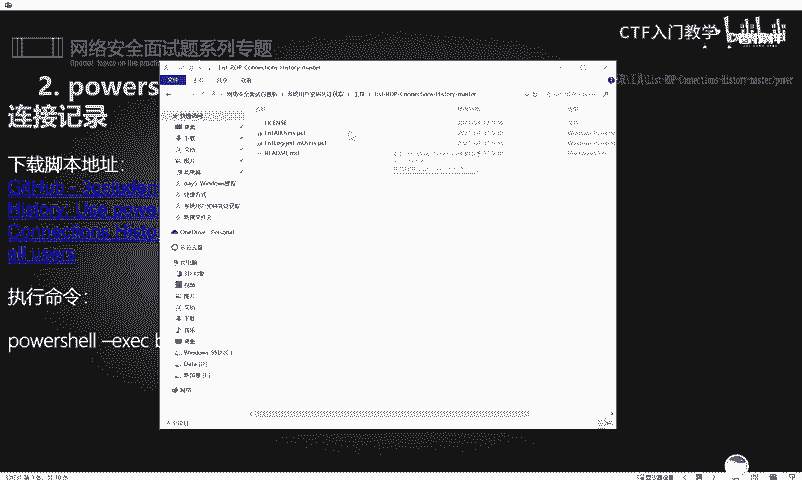

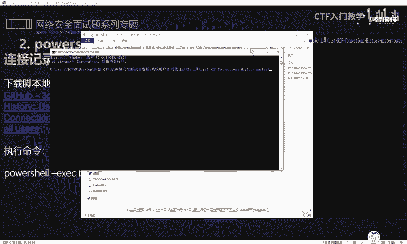

OK把这个命令呢copy一下，然后回车。好，这里的话就可以看到啊，我们实际上就已经读取了关于本地啊，也就是这台系统。

我目前这个机器上面呢呃所有的远程记录的这样一个就是连接对方的这个远程记录的这样一些呃记录啊，都在这里，知道吧？这个就是一个脚本的一个相关的用法。

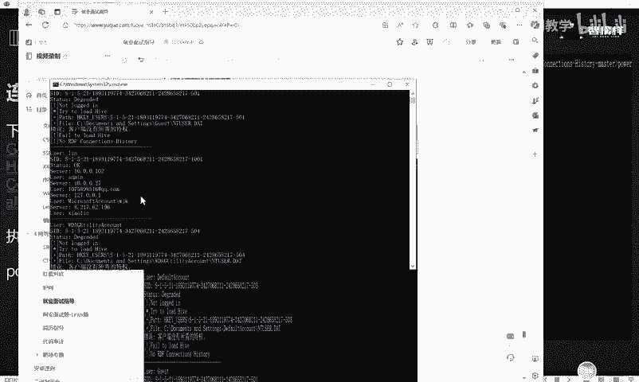

好，那除了呃我们这个脚本的话，可以收集下当前系统的这个远程桌面连接的一个记录。由此可以判断出当前目标网络的一个结构。

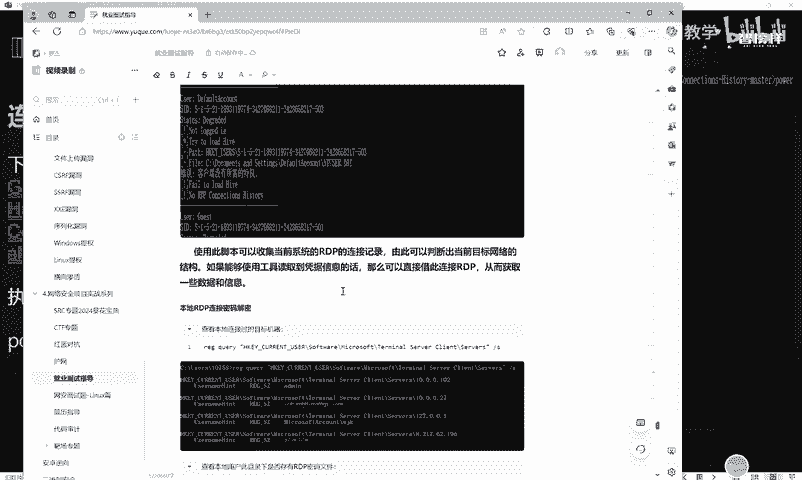

啊，然后读取到这个相关凭据信息的话呢，也可以借此呢去呃，我们就是拿到对方的这个账号密码之后，也可以直接去就使用他的账号密码去对对方发起一个连接，知道吧？好，那除了这种脚本以外。

实际上我们还可以通过这个本地CMD命令行呢去运行这个执行相应的命令去读取对方的这个账号密码。呃，首先的话给大家介绍是关于这个注册表的一个值啊。那这个值的话呢，我们可以通过这个论举啊。

这个命令就是REG这个命令呢去读取对方的这个注册表的一个值。

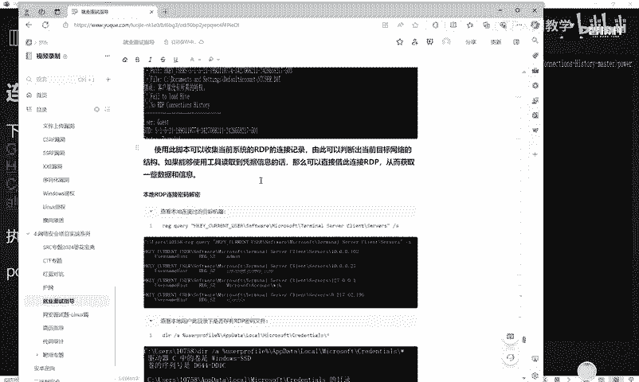

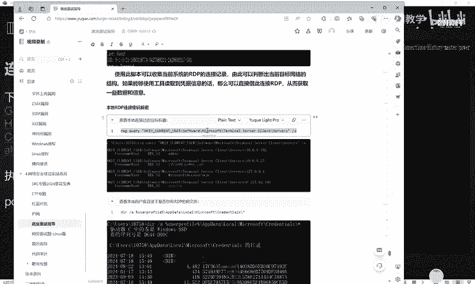

好，那我这里呢同样也是以当前这台机器呢来给大家做一个演示啊，就是执行咱们PPT里面的这样一个命令就可以了。还是同样的啊进入这个CMBD命令行，然后在这个地方呢执行我们的命令O它这个地方的话就可以看到呃。

关于我们连接了有哪些机器，对吧？它这里都有啊，目标机器是IP地址是谁，对不对？账号是什么啊，都有一个相应的记录在这里。😊，好，那呃查到对方的当前系统呢有连接记录之后。

我们就要继续去读取对方的保存在本地的这个RDP的这个密码的文件。那这个密码的文件的话，实际上它是保存在我们的这个路径下面啊，也就是当前的用户。

然后呃APPd然后lo和这个micsoft啊这样一个目录下面，我们就直接执行PPT里面的这样一个一条命令就可以了啊。这个命令就可以查看这个目录下面呢，是否存在这个RDP的账号密码啊。

有有没有这个密码文件存在啊。好，我们直接在这个M命令呢，同样去执行它。OK那这里的话呢可以看到啊，在我当前这台系统里面呢呃这个目录下面啊，也就是当前这个路径下面是存在有很多的文件的，对不对？

那这些文件的话，我们已经拿到了，已经看到了。那这样一些文件实际上都是我们呃每次使用这个远程桌面连接呢去连接对方的时候，呃，就是说远程桌面连接啊。😊，连接的时候连接目标的时候呢，这个地方会有一个勾啊。

就是允许保存这个凭据，这是什么意思呢？就是呃咱们对对方发起远程连接的时候，是会输入账号密码的那这个时候如果说你勾勾选的这个勾的话，那你呃输入的这个账号密码呢，它会记录保存在这个路径下面。

方便咱们下一次去远程连接的时候呢，你就不需要再去手输了，而是他直接调用咱们这个路径下面的这个呃你你保存在本地的这个账号密码啊，这个实际上就是呃这个系统管理员呢。

对于我们他系统的这个一些操作呢做了一些偷懒，对不对？方便他操作嘛。但是他这个账号密码保存在本地的话，我们实际上是可以通过命令去进行读取，从而去破解的啊。😊，好，那我们知道这个文件是干什么的之后。

我们接下来就要对这些文件呢呃，它这个啊这些文件实际上就是我们默认保存在本地的这个相应的文件啊。那这些文件的话，咱们随便挑一个啊，比如说我们呃挑最后一个吧。😊，好，挑这一个啊，把它呃记录下来。

记录下来之后呢，接下来使用下面的这个这个命令啊，以其实这个命令CMDK，然后斜杠list也可以查看，就是呃这个保存在本地的远程储机信息啊。那这边的话我也给大家在这里呢做一个演示。😊，CMDK。

然后斜杠list对不对？然后回车OK他这里的话呢呃可以把这个铭文的一些相关账号密码都可以读取出来。

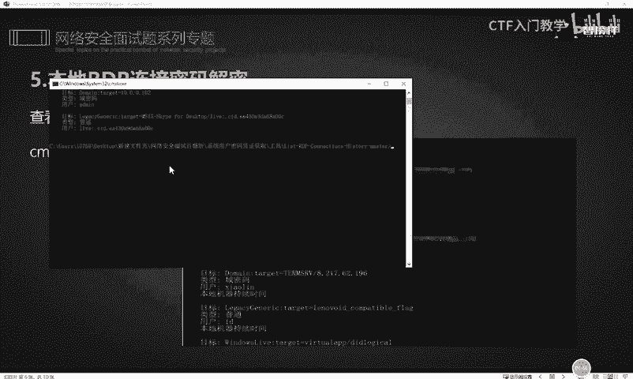

好，那这里就不给大家呃看的太仔细了。好，那下一步的话，我们知道了对方的这个相应的连接这个密码呢保存在哪里之后，接下来我们就要使用工具呢，将它这个保存在本地的这个相应的密码呢，对它进行破解解密啊。

把它读取出来。那这个工具的话呢，也是大家非常熟悉的这个mi密ca。好，关于这个密cut呢，大白前面呢也给大家呃已经进行发放过了啊，大家把它解压出来之后打开。打开我们的咪密cut呢就进入到这样一个命令行。

然后呢呃依次去执行我们这个相应的笔记里面的这个相应的命令，就可以去发起一个就把对方的这个密码呢进行一个破解啊。好，我们来给大家演示一下。😊。

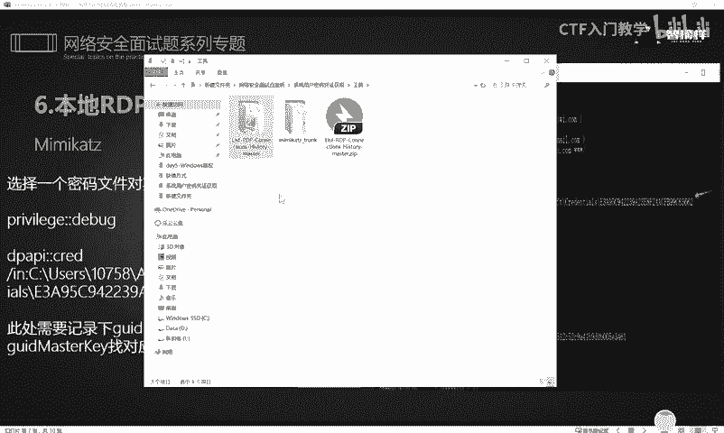

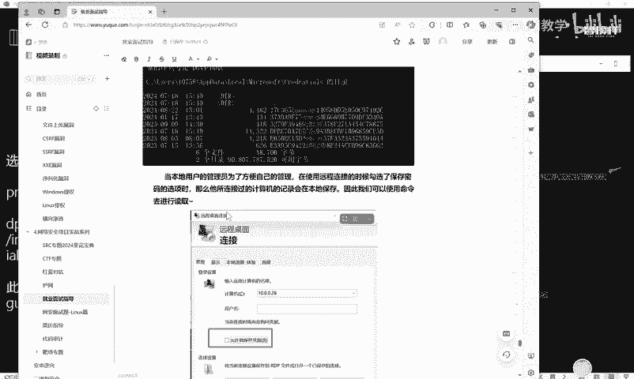

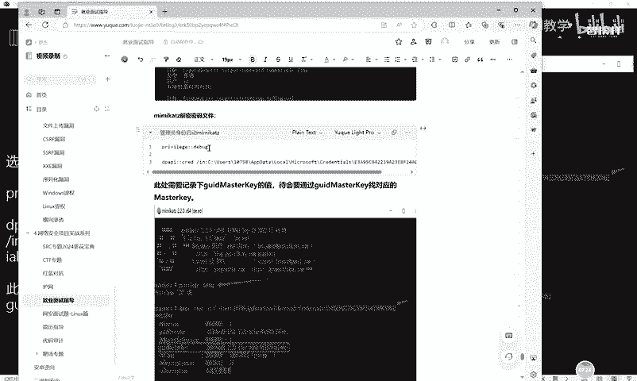

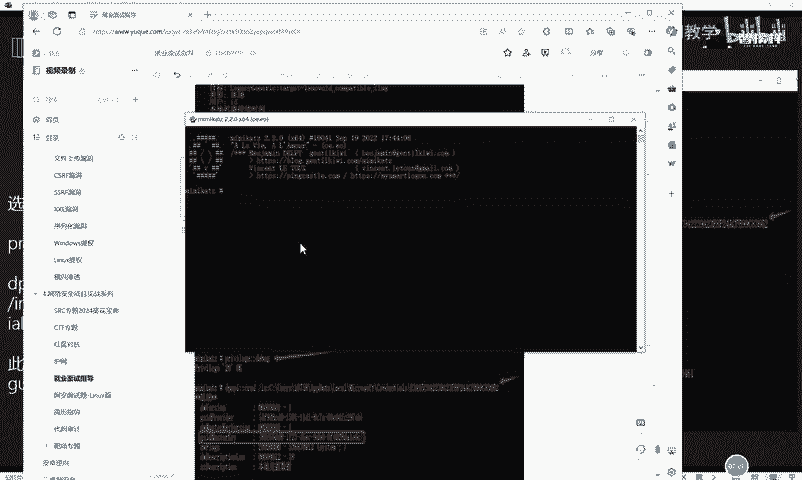

OK先这个debug啊进入这个调试的开发的一个模式，然后呢使用这样一条命令啊呃，这个DPAPI，然后后面接上这个相应的模块呃，跟上这里的话是斜杠斜杠印，然后后面接上我们的这个保存的。呃，这个本地的。

RDP连接记录了这个密码的这个文件里面的，咱们随便挑一个文件。比如说我们挑的刚刚是那个最后一个文件，对不对？好，把这个最后这个文件呢给它呃接到我们的这个模块后面啊，也就是这条命令。😊。

是吧这个大家根据自己的自己电脑上读取的这个文件来啊，你不要直接抄我的这个知道吧？直接不要不要直接抄啊，不要直接抄。好，OK那么我们输入之后就可以看到啊呃，在这个下面呢会有一个运行的一个值。

大家注意看这个PPT里面。😊，在这里的话，我们就要记录这个GUID啊mask key。这个mK的这个值啊，我们待会儿呢就要通过这个GUIDmK这个值呢找到对应的这个maskK。好。

我们呃这个运行的结果呢，这个下面呢就有一行出现了一行这个GUIDmK好，我们把这个mK的这个值啊给它呃记录一下。😊，复制一下对不对？给它复制一下啊，然后复制完了之后。

接下来就要呃再通过这个mimicut呢一些相应的工具啊进入到这样一个模式。进入这个模式里面呢，就可以找到这个相应的对应的这个m key里面的。😊，m这个GUIDmK里面这个对应的这个m he的一个值。

我们这是一步一步的去寻找的啊，而不是说它一下子就能出来的。好，下一步就执行这个命令，同样还是调用这个minmecut啊。OK这里的话它是列举了很多的这个值。那我们呃刚刚的那一串值的话是。

我们可以找一下啊。稍等一下，我们这里要找一下。诶。

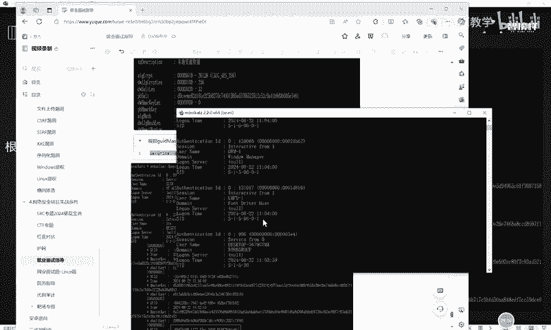

这个值太多了啊，这个值太多了啊，这个上面也还有。啊，在这里。就这串纸啊。这个尾号是116C，然后我们往上翻的时候可以看到这个呃我们刚刚读取了这个文件呢，它的这个mask key啊，就是116C，对不对？

69D56DD8，然后往下翻。呃，69哦，在这里在这里啊，那它所对应的这个这个是它的这个G。GUYD的这个mK嘛，那么我们就找到它对应的这个值。啊，把这个值呢，然后再带入到我们下一条命令里面去。

也就是啊执行这条命令。啊，把这个m key呢也带进去。带进去之后，实际上它就能够直接使用这个咪密 cards呢，将我们这个呃密码的这个值呢给它读取出来。好，这里。错了啊，命令复制错了。好，再来一遍。

OK这里的话结果已经出来了。呃，我们通过这样一条命令呢。😊，其实就是我们刚刚呃读取这个文件的这个命令啊，后面加上了一个斜杠mus key，然后再把我们呃找到的这个ma key的值呢贴到后面。最后的话呢。

它这里经过这个破解密的话，呃，这个解密的这个。😊，名这个这个就是保存在本地的。呃，这个RDP的这个用户名是这样子的，然后它的密码呢是这个。也就是说我们当前读取的这个账号和密码。

实际上它是呃它是并不存在的那我们就可。但是我们可以使用这种方法呢去依次读取我们刚刚通过前面的这个操作抓取到的我们本地的。这个呃记录在我们本地的这个相应的目录下面的这个所有的。

这个RDP的连接记录的这个保存密码的这个文件啊，我们可以通过刚刚给大家演示的这种方法呢，依次去对它进行一个抓取和读取。那么抓取和读取到了这个相应的文件之后，我们就可以通过呃这个相应的操作呢。

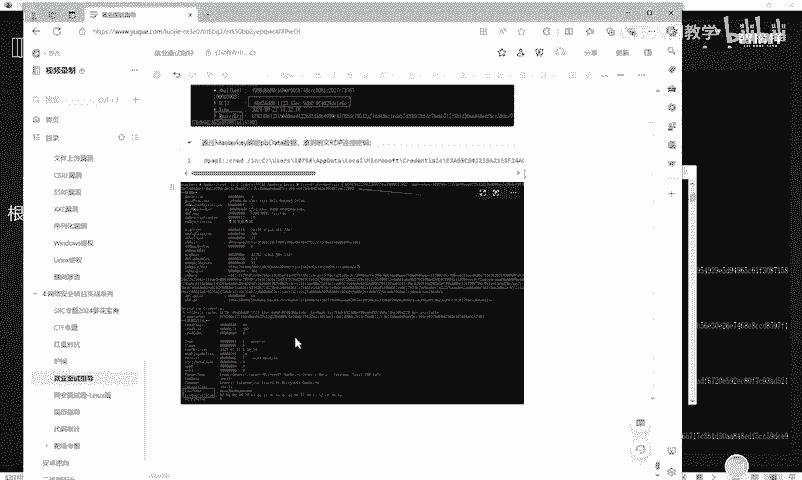

对当前的这个主机的内网呢实现一个横向的移动。好，以上呢就是我们呃这个RDP连接的账号密码的抓取和那个破解的一些方法。呃，关于更多的操作的细节和我们的一些面试题呀，还有一些知识点呢。

大白这边已经全部放在评论区，欢迎大家呢一键三连来进行领取。谢谢大家。