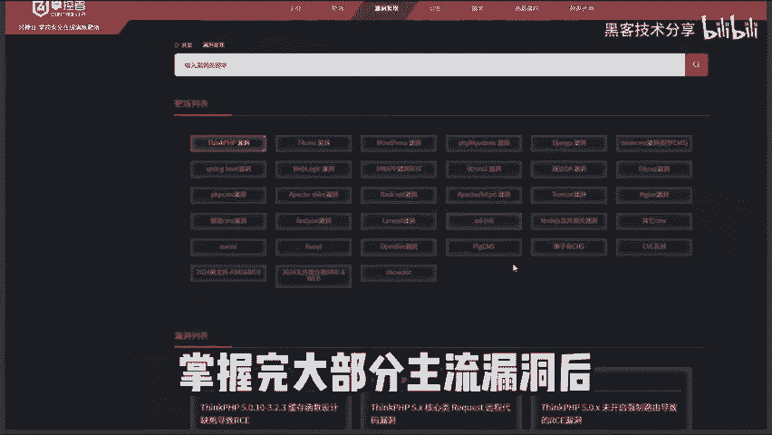

# 网络安全入门：P1：靶场先导片 🎯

在本节课中，我们将要学习网络安全实战练习的关键起点——靶场。对于初学者而言，掌握安全技术后，找到一个合法且有效的练习环境至关重要。本节将介绍四个适合不同阶段学习者的主流实战平台，帮助你从理论走向实践。

上一节我们介绍了靶场的重要性，本节中我们来看看四个具体的推荐平台。

以下是四个适合网络安全实战练习的推荐平台：

1.  **风神台**：该平台对新手非常友好，不仅提供从易到难的靶场实战习题，还包含主流漏洞的复现环境。掌握大部分主流漏洞后，去挖掘一些简单漏洞会变得轻松。

2.  **攻防战争**：这个平台提供了各种类型的靶场，并采用闯关形式的实战练习，能提供很强的攻击沉浸感。

3.  **攻防世界**：这里不仅有大量靶场习题可供练习，还会发布最新的赛事信息。当你具备一定能力后，可以从此开始参与黑客技术比赛。

4.  **补天**：当你拥有一定技术基础后，可以直接在补天平台上寻找一些SRC（安全应急响应中心）项目挖掘漏洞。成功挖掘漏洞意味着获得奖励，在赚取额外收入的同时也能锻炼技术。仅靠挖掘漏洞，月入数万的案例也大有人在。

在靶场练习主要是为了前期锻炼技术，而挖掘真实漏洞才是学好这门技术的最佳实战方式。这不仅是为了赚取额外收入，也是我们作为白帽黑客最好的技术证明。

如果你目前还缺乏基础知识，可以参考我录制的96节从零到进阶的视频教程。教程涵盖了市场上主流的攻击与防御技术。

完整地学习这些内容后，无论是参加技术比赛、就业还是挖掘漏洞，都足以应对。

本节课中我们一起学习了四个关键的网络安全实战平台：风神台、攻防战争、攻防世界和补天。它们分别适用于入门练习、沉浸式攻防、赛事参与和实战挖洞，是技术成长道路上不可或缺的实践环境。