# 网络安全靶场搭建入门：P2：靶场搭建(DVWA) 🎯

在本节课中，我们将学习如何搭建一个名为DVWA的网络安全靶场。靶场是模拟真实网络环境的平台，用于安全测试和技能练习。我们将从零开始，一步步完成DVWA靶场的部署。

## 概述

网络安全靶场为安全测试、漏洞挖掘和攻防对抗提供了一个模拟环境。它可以帮助专业人员、研究人员和爱好者提升技能，加深对网络安全问题的理解。本节课将聚焦于一个常用的Web应用靶场——DVWA的搭建过程。

## 靶场介绍

上一节我们介绍了靶场的概念，本节中我们来看看DVWA这个具体的靶场。

DVWA（Damn Vulnerable Web Application）是一个开源的Web应用程序，专门为安全专业人员设计，用于在一个合法的环境中测试技能和工具。它包含了多种常见的Web漏洞模块。

以下是DVWA包含的主要漏洞类型：
*   暴力破解
*   命令注入
*   SQL注入
*   跨站脚本（XSS）
*   跨站请求伪造（CSRF）
*   文件包含
*   文件上传

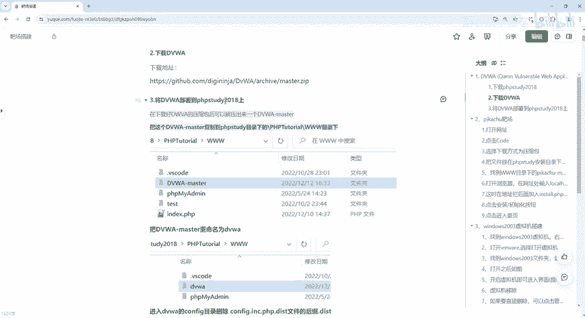

## 搭建准备

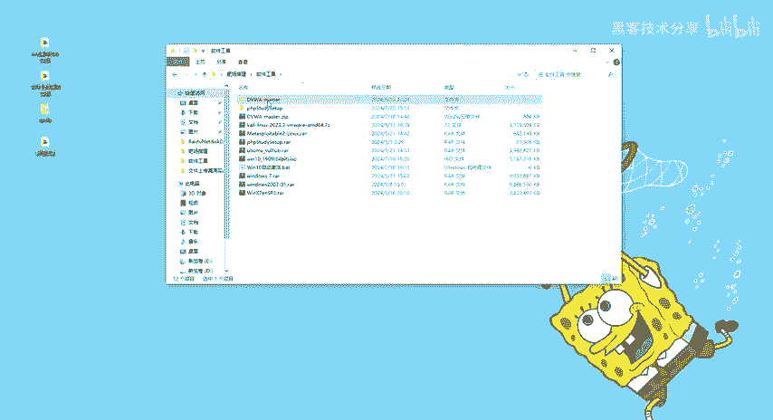

在开始搭建之前，我们需要准备相应的软件和工具。

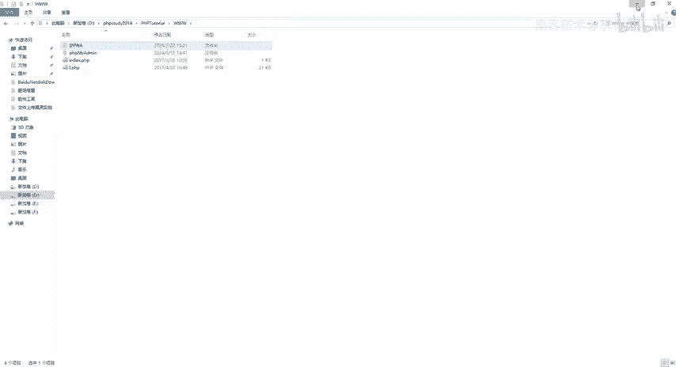

以下是搭建DVWA靶场所需的核心组件：
1.  **DVWA源码**：靶场的应用程序代码。
2.  **PHPStudy**：一个集成了Apache、MySQL和PHP的服务器环境，用于在Windows上快速搭建Web运行环境。


## 安装PHPStudy

首先，我们需要安装PHPStudy来创建本地服务器环境。

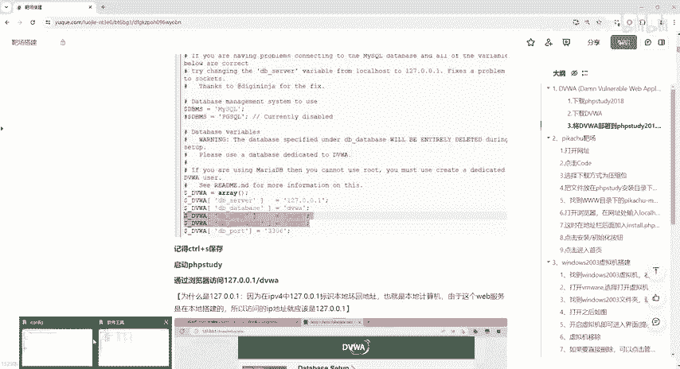

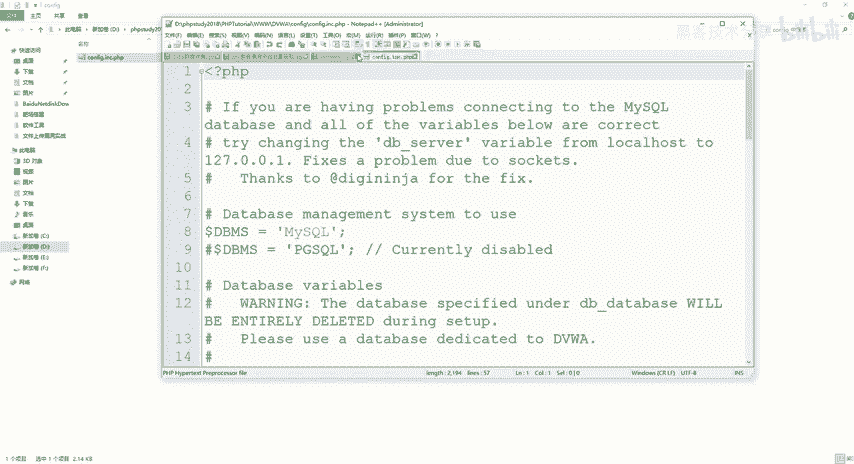

1.  解压提供的`PHPStudy`安装包。
2.  运行安装程序，按照提示点击“下一步”完成安装。
3.  安装完成后，启动PHPStudy。当看到Apache和MySQL服务旁边出现绿色的圆点，表示服务启动成功。

## 部署DVWA源码

安装好服务器环境后，接下来需要将DVWA的源代码部署到服务器目录中。

1.  找到PHPStudy的安装目录（例如 `D:\phpstudy_pro\WWW`）。
2.  在该目录下，新建一个文件夹，命名为 `DVWA`。
3.  将提供的`DVWA-master`源码压缩包解压，并将其中的所有文件复制到刚才新建的 `DVWA` 文件夹内。

## 配置DVWA

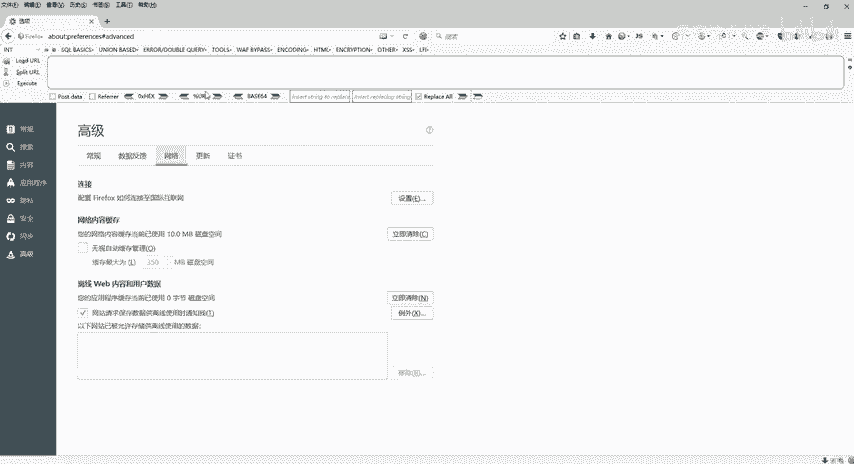

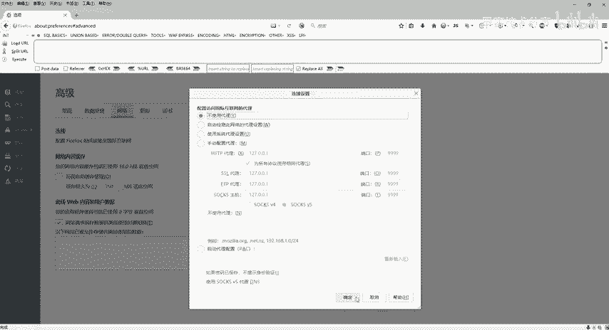

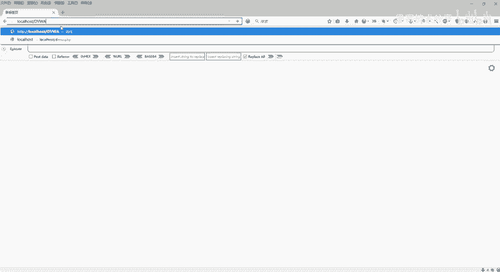

部署完源码后，需要对DVWA进行配置，使其能够连接数据库。

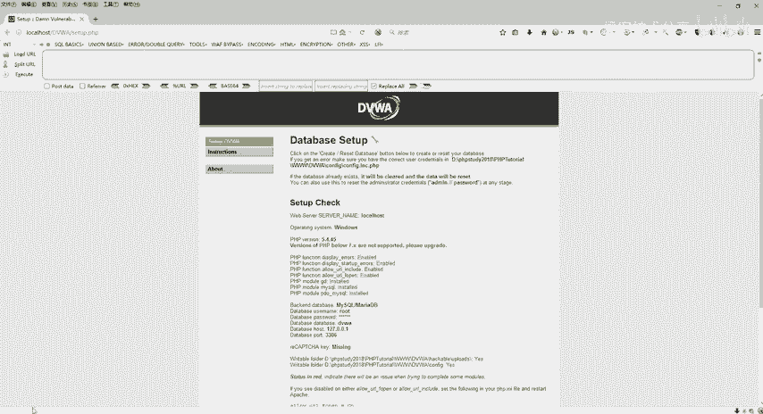

1.  进入 `DVWA/config` 目录。
2.  找到名为 `config.inc.php.dist` 的文件。
3.  将该文件重命名为 `config.inc.php`（即删除 `.dist` 后缀）。
4.  使用记事本等文本编辑器打开 `config.inc.php` 文件。
5.  找到数据库配置部分，修改 `$_DVWA[ 'db_user' ]` 和 `$_DVWA[ 'db_password' ]` 的值，确保与你的MySQL数据库用户名和密码一致。默认通常是：
    ```php
    $_DVWA[ 'db_user' ] = 'root';
    $_DVWA[ 'db_password' ] = 'root';
    ```
6.  保存并关闭配置文件。

## 初始化DVWA

配置完成后，就可以通过浏览器访问并初始化DVWA了。

1.  确保PHPStudy正在运行（Apache和MySQL服务为绿色）。
2.  打开浏览器，在地址栏输入 `http://127.0.0.1/DVWA` 或 `http://localhost/DVWA`。
3.  页面将自动跳转到 `setup.php` 页面。如果页面提示PHP版本等问题，可以暂时忽略。
4.  滚动到页面底部，点击 **Create / Reset Database** 按钮。
5.  系统将自动创建所需的数据库表。成功后，页面会跳转到登录界面 (`login.php`)。

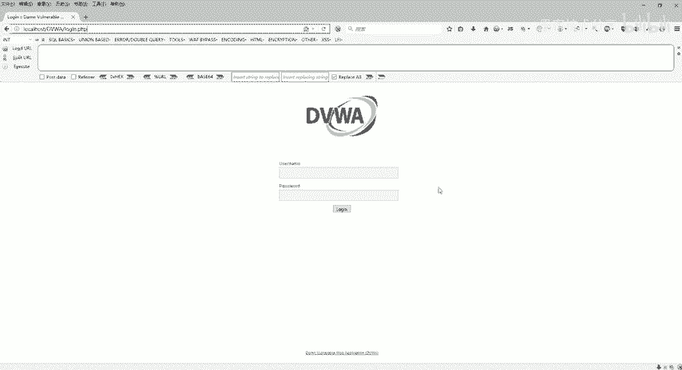

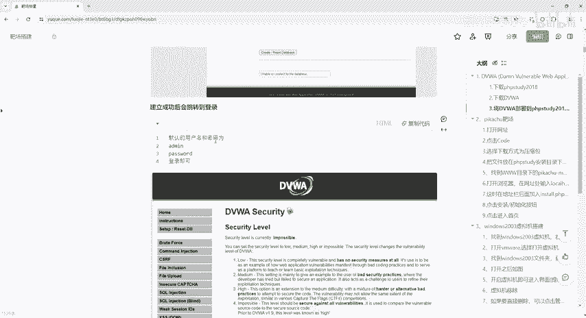

## 登录与验证

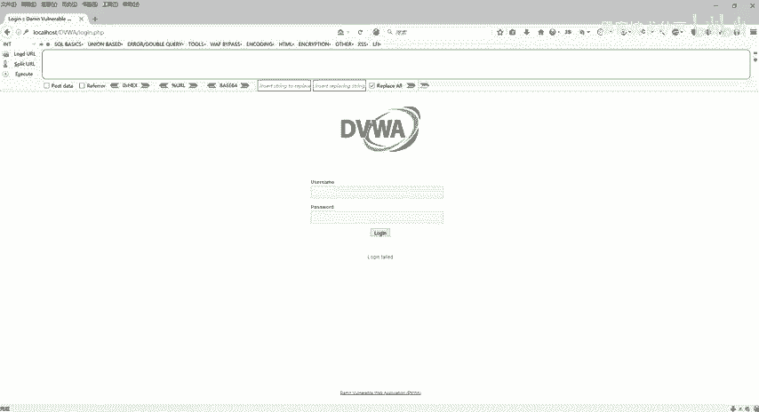

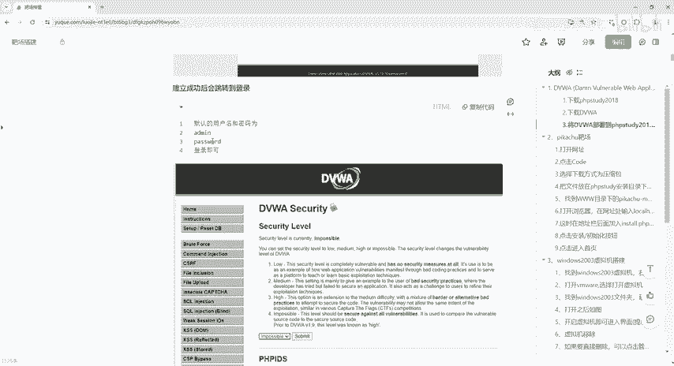

数据库初始化成功后，即可登录DVWA开始使用。

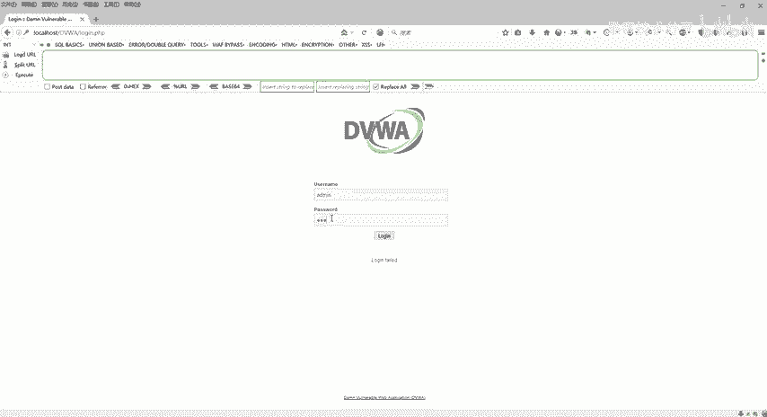

1.  在登录页面，使用默认凭证登录：
    *   用户名：`admin`
    *   密码：`password`
2.  登录成功后，你将看到 “Welcome to Damn Vulnerable Web Application!” 的界面。这标志着DVWA靶场已成功搭建并运行。

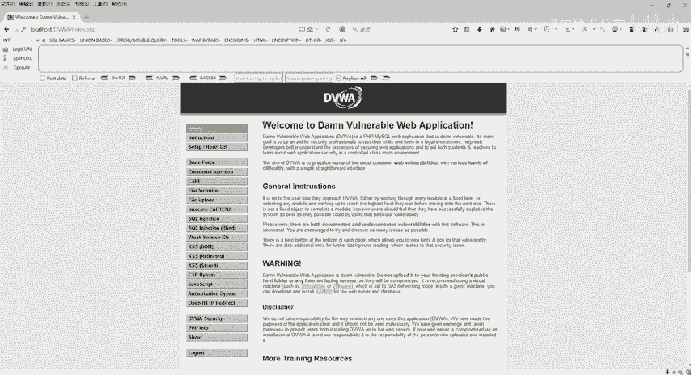

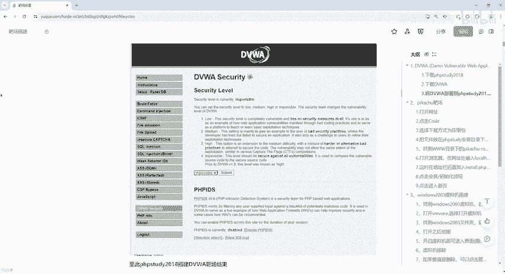

## 总结

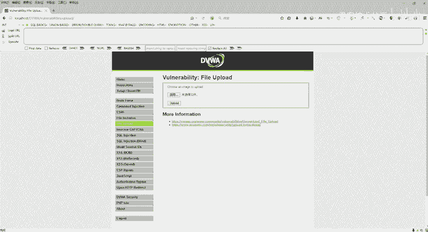

本节课中我们一起学习了DVWA网络安全靶场的完整搭建流程。我们首先了解了靶场的作用，然后准备了PHPStudy集成环境和DVWA源码。接着，我们通过部署源码、修改配置文件、初始化数据库等一系列步骤，成功在本地搭建起了DVWA靶场。现在，你可以在这个安全的实验环境中，开始对各种Web漏洞进行学习和测试了。