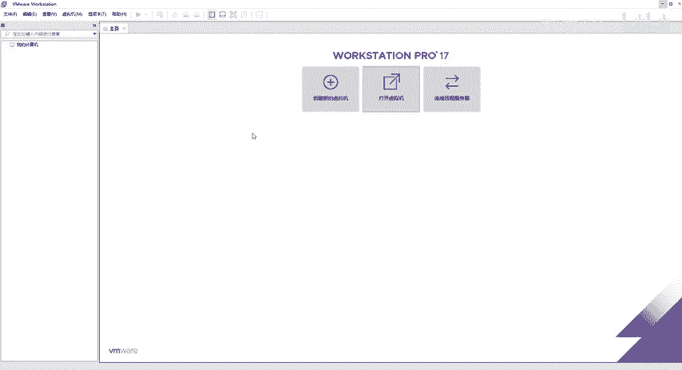
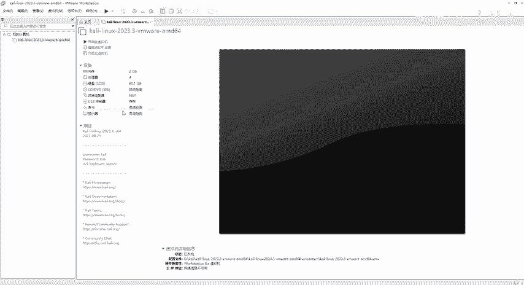
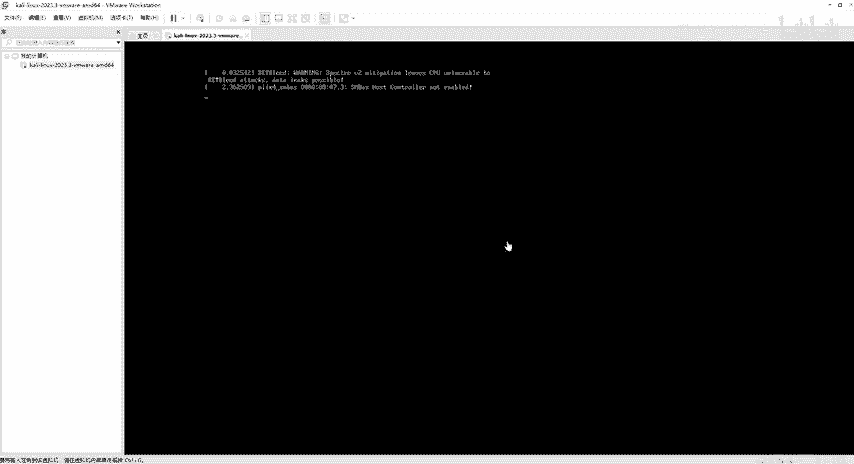
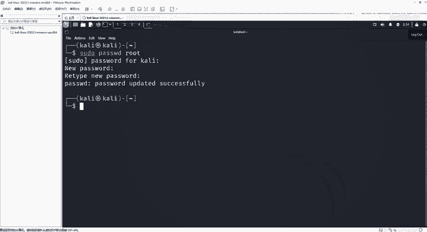
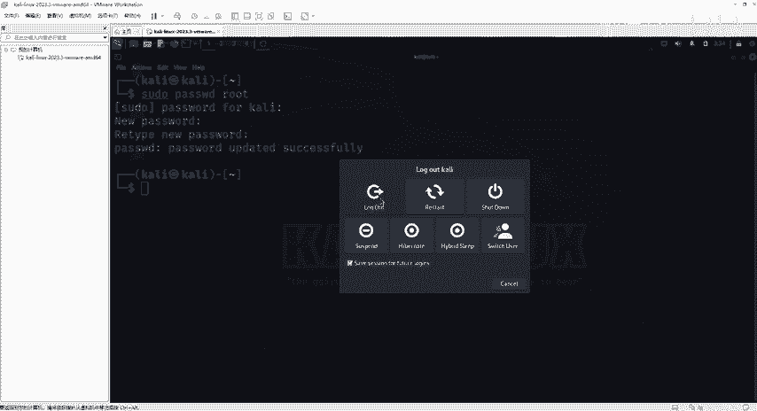
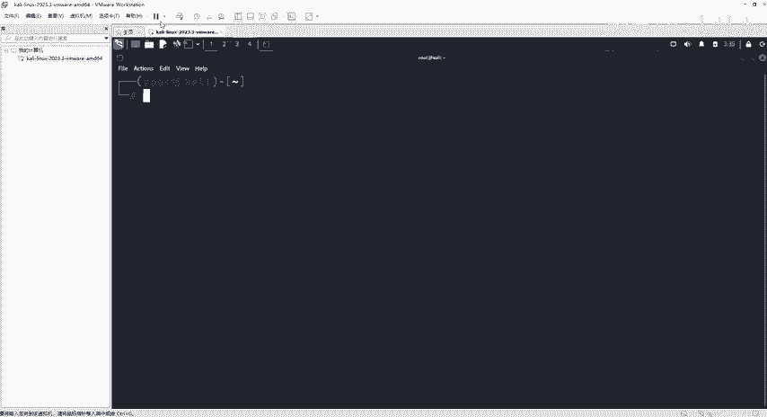
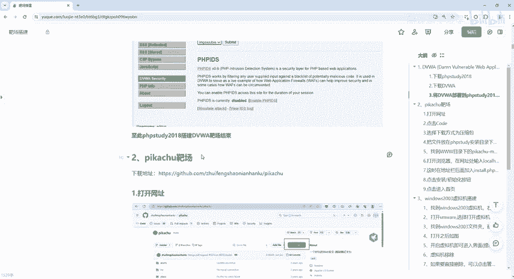
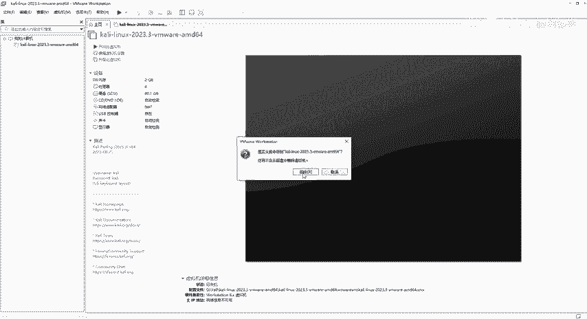
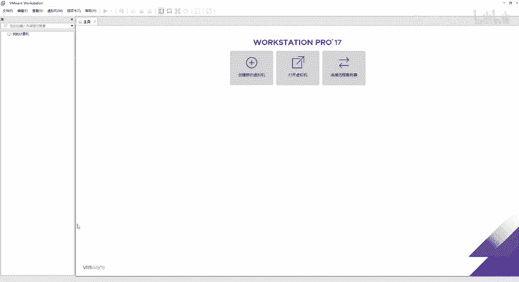

# 网络安全靶场搭建入门：P3：Kali靶机安装 🎯

在本节课中，我们将学习如何安装和配置Kali Linux虚拟机。Kali Linux是专为安全测试和渗透测试设计的操作系统，内置了大量安全工具。掌握其安装是网络安全学习的第一步。

上一节我们介绍了虚拟机环境的准备，本节中我们来看看如何部署Kali Linux靶机。

## 获取与准备Kali Linux镜像


Kali Linux是一个专为安全人员和渗透测试人员设计的操作系统。它集成了大量测试工具和资源。从事网络安全学习，可以直接下载并使用Kali Linux。相关的安装文件已为大家准备好。


安装前，需要确保已安装好虚拟机软件（如VMware Workstation）。以下是安装步骤。



## 安装Kali Linux虚拟机



以下是安装Kali Linux虚拟机的具体流程。



1.  **解压镜像文件**
    将下载好的Kali Linux压缩包右键解压到当前文件夹。

2.  **打开虚拟机配置**
    在VMware中，点击“打开虚拟机”，而不是“创建新的虚拟机”。然后导航到解压后的文件夹。

    **关键提示**：必须确保系统显示了文件扩展名。否则可能无法正确识别虚拟机配置文件。
    *   在Windows系统中，可通过“查看” -> 勾选“文件扩展名”来开启。
    *   在解压后的文件夹中，找到并选择以 `.vmx` 结尾的文件。

3.  **启动虚拟机**
    成功导入虚拟机后，界面会显示Kali Linux的配置。无需修改任何设置，直接点击“开启此虚拟机”。

4.  **登录系统**
    等待虚拟机启动完成，会看到登录界面。Kali Linux的默认账户和密码均为：
    ```
    用户名: kali
    密码: kali
    ```
    输入后点击登录（Login）。

## 配置Kali Linux系统





成功登录后，桌面环境与Windows类似，但为英文界面。**不建议安装中文语言包**，因为在实际的安全工作中，绝大多数工具和环境都是英文的，提前适应英文环境对学习更有帮助。


接下来需要进行重要配置：为root用户设置密码并切换。

1.  **为root用户设置密码**
    默认情况下，kali用户权限有限。我们需要为最高权限的root账户设置密码。
    *   首先，打开终端（黑色窗口）。可以使用 `Ctrl` + `Shift` + `+` 组合键放大字体。
    *   在终端中输入以下命令来设置root密码：
        ```bash
        sudo passwd root
        ```
        *   `sudo` 用于提升权限。
        *   `passwd root` 表示修改root用户的密码。
    *   执行命令后，系统会提示输入当前用户（kali）的密码进行验证。输入 `kali`（输入时屏幕无显示），然后回车。
    *   接着，输入为root用户设置的新密码，例如 `root`，回车。
    *   最后，再次输入一遍新密码进行确认，回车。
    *   看到 `password updated successfully` 提示，表示密码设置成功。

2.  **切换至root用户**
    点击屏幕右上角的系统菜单，选择“注销”（Log Out）。然后在登录界面，选择用户为 `root`，输入刚才设置的密码（如 `root`）登录。
    登录后，打开终端，会发现命令行提示符的用户名已变为 `root`，并且通常显示为红色，这表示已获得最高权限。





## 网络配置与虚拟机管理

1.  **网络连接**
    通常情况下，虚拟机网络已配置好。如需检查或修改，可以在VMware主界面点击“编辑” -> “虚拟网络编辑器”。
    *   确保存在一个NAT模式（如VMnet8）且状态为“已连接”。
    *   如果虚拟机无法上网，可以在虚拟机设置中，找到网络适配器选项，确保“启动时连接”和“NAT模式”已勾选。

2.  **关闭与移除虚拟机**
    *   **关闭**：在Kali系统内点击关机，或在VMware中右键虚拟机选择“关闭” -> “关闭客户机”。
    *   **移除**：在VMware库中右键虚拟机，选择“移除”。此操作仅从VMware列表中删除，虚拟机文件仍保留在磁盘上。
    *   **彻底删除**：如需完全删除，在移除后，需通过“管理” -> “从磁盘中删除”来清理磁盘空间。





本节课中我们一起学习了Kali Linux虚拟机的完整安装与初始化配置流程，包括系统安装、root权限配置和网络检查。现在，你已经拥有了一个功能完整的渗透测试环境，为后续的实战学习打下了基础。