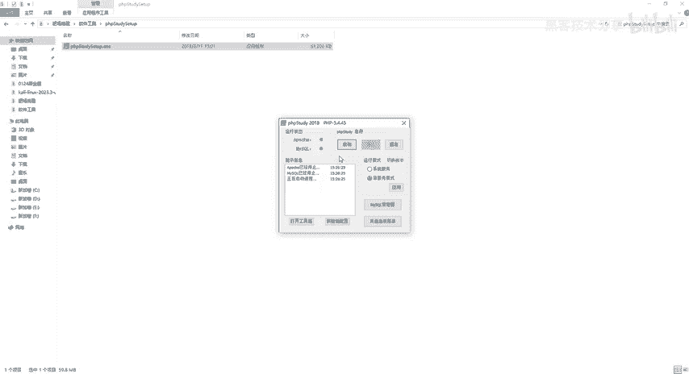
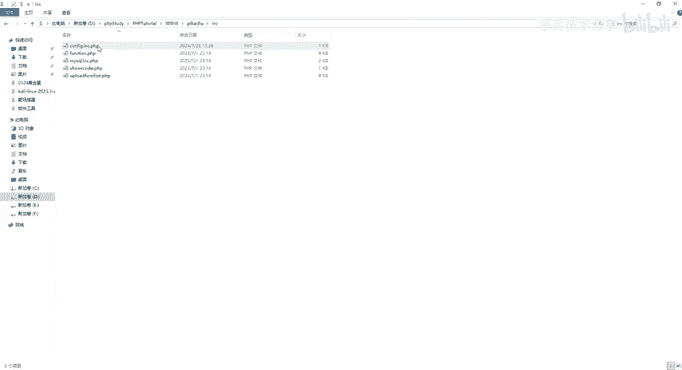
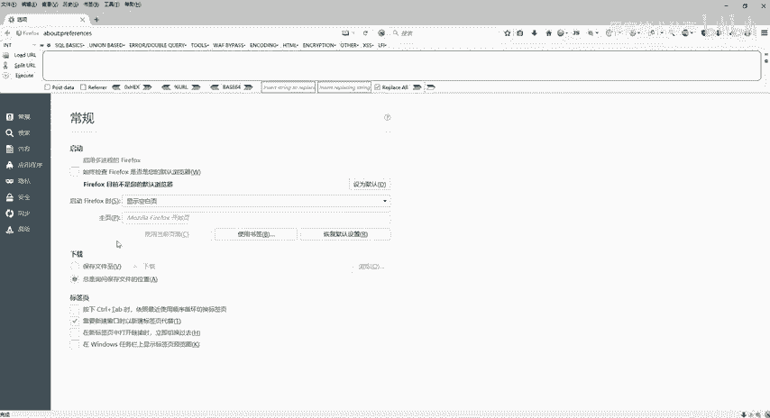
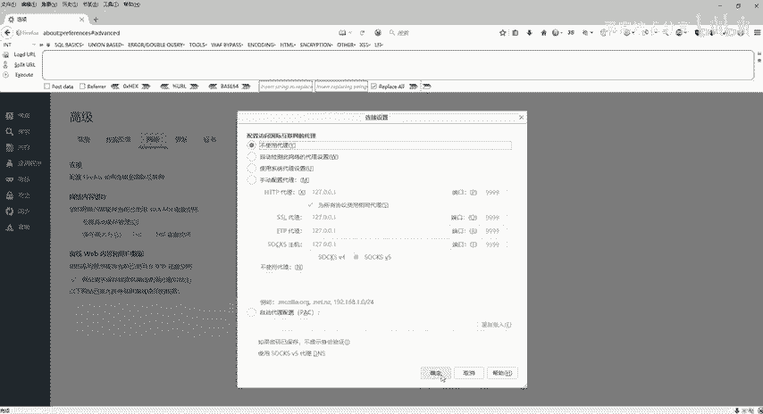
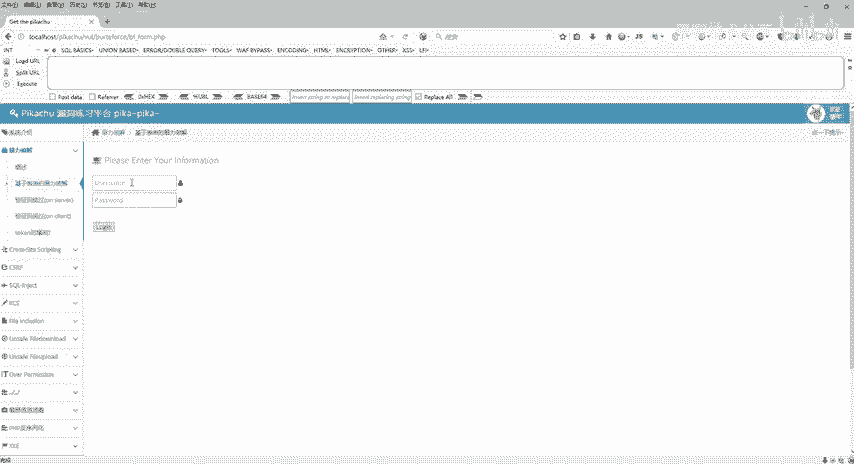

# 网络安全靶场搭建入门：P4：pikachu靶场部署 🎯

在本节课中，我们将学习如何在已安装的PHPStudy环境中，部署一个名为“pikachu”的Web漏洞靶场。这个靶场包含了多种常见的Web安全漏洞，是进行渗透测试练习的理想环境。

## 安装PHPStudy

上一节我们介绍了靶场的基本概念，本节中我们来看看如何搭建基础环境。首先需要安装PHPStudy集成环境。

1.  获取PHPStudy安装包。
2.  解压下载的压缩包。
3.  运行其中的EXE安装程序。
4.  选择安装路径。**路径中不能包含中文或空格**。建议避开系统C盘。
5.  等待安装完成。安装成功后，程序会提示站点创建成功。

安装完成后，启动PHPStudy。需要进行两项基础配置：



*   在PHPStudy设置中，找到并勾选“允许目录列表”选项。
*   检查“端口设置”，确保网站端口（默认为80）未被占用。

配置完成后，重启PHPStudy服务使设置生效。

## 部署pikachu靶场


基础环境准备就绪后，接下来我们将pikachu靶场的代码部署到网站目录中。pikachu是一个集成了多种Web漏洞的测试系统。

1.  获取pikachu靶场代码包（通常为压缩包形式）。
2.  将代码包解压，得到包含源代码的文件夹。
3.  复制该文件夹内的所有文件。
4.  进入PHPStudy的网站根目录（例如 `D:\phpstudy_pro\WWW\`）。
5.  在该目录下，新建一个名为 `pikachu` 的文件夹。
6.  将复制的所有源代码文件，粘贴到 `pikachu` 文件夹内。

## 配置数据库连接

代码放置完成后，需要修改配置文件以连接数据库。



1.  找到并打开配置文件，路径通常为 `pikachu/inc/config.inc.php`。
2.  在配置文件中，找到数据库密码的设置项。
3.  PHPStudy中MySQL数据库的默认密码通常是 `root`。将配置项修改为：
    ```php
    $_config['db']['password'] = 'root';
    ```
4.  保存配置文件。

## 安装与访问靶场

所有文件与配置就绪后，即可通过浏览器完成靶场的最终安装并访问。




首先，确保PHPStudy处于运行状态。然后，打开浏览器（以火狐浏览器为例），如果之前配置过代理（如Burp Suite），需要先关闭，以确保能直接访问本地服务。



在浏览器地址栏输入靶场地址进行安装：
```
http://localhost/pikachu/install.php
```
页面将显示系统初始化安装界面，点击安装。成功后，页面会提示数据库连接、创建成功等信息。

安装完成后，点击链接进入靶场首页。至此，pikachu漏洞靶场部署完成。您可以在其中练习如暴力破解、XSS、SQL注入、文件上传等各种Web安全漏洞的测试。

---



本节课中我们一起学习了pikachu漏洞靶场的完整部署流程，包括准备PHPStudy环境、放置靶场代码、配置数据库以及通过浏览器完成安装。现在，您已经拥有了一个功能完备的本地漏洞练习环境，可以开始进行各类Web安全技术的实践了。