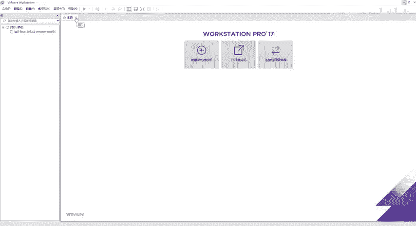
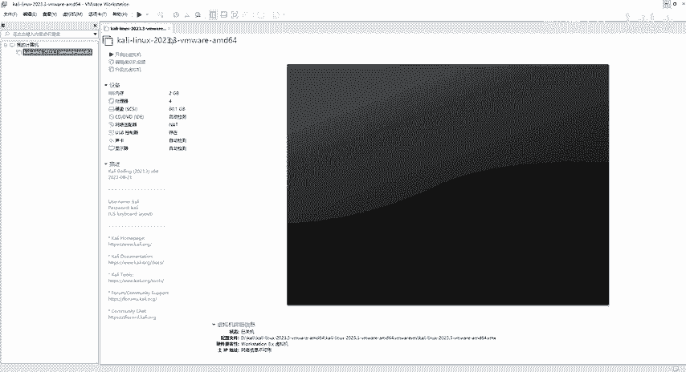
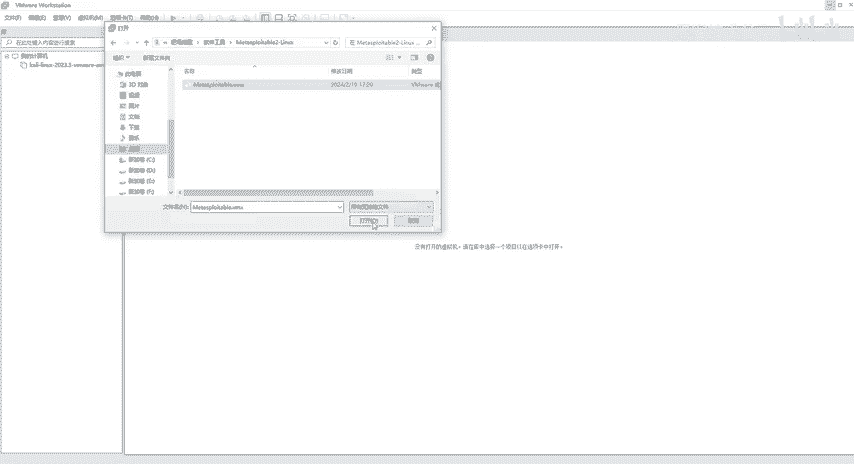
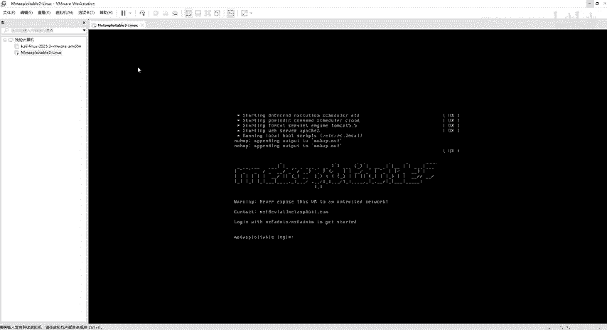

# 网络安全靶场搭建入门：P5：Metasploitable2-Linux靶场部署 🖥️

在本节课中，我们将学习如何部署Metasploitable2-Linux靶场。这是一个网络安全领域常用的练习环境，我们将使用VMware Workstation软件来加载并启动它。

## 获取与解压靶场文件

上一节我们介绍了Kali Linux的安装，本节中我们来看看如何部署Linux靶场。首先，您需要获取靶场文件。

靶场文件通常以压缩包格式提供。本教程提供的文件是RAR或ZIP格式。您需要将其解压到本地目录。

以下是操作步骤：
1.  找到提供的“软件工具”目录中的靶场压缩文件。
2.  右键点击该文件。
3.  选择“解压到当前文件夹”或类似选项。
4.  等待解压过程完成，因为文件体积较大。

解压完成后，您会得到一个包含多个文件的文件夹，其中包含日志文件和以`.vmx`结尾的虚拟机配置文件。

## 使用VMware加载虚拟机

与安装Kali Linux类似，我们将使用VMware Workstation来打开这个靶场虚拟机。核心步骤是加载`.vmx`配置文件。

以下是具体操作流程：
1.  打开VMware Workstation软件。
2.  如果软件打开了之前使用的虚拟机（如Kali），可以先将其关闭。
3.  关闭后，主界面会显示“没有打开的虚拟机”。
4.  点击顶部菜单栏的“文件”，然后选择“打开”。
5.  在弹出的文件浏览器中，导航到刚才解压出的“Metasploitable2-Linux”文件夹。
6.  选择文件夹内以`.vmx`结尾的虚拟机配置文件，点击“打开”。

## 启动与登录靶场

虚拟机加载成功后，就可以启动它了。启动过程中可能会遇到一个关于虚拟机被移动或复制的提示，这是正常现象。

以下是启动和登录步骤：
1.  在VMware中点击“开启此虚拟机”。
2.  如果弹出“虚拟机可能已经被移动或复制”的对话框，请选择“我已复制该虚拟机”。
3.  等待虚拟机启动完成。与具有图形界面的Kali不同，Metasploitable2启动后是一个命令行界面。
4.  当屏幕显示登录提示（如 `msfadmin login:`）时，表示系统已就绪。
5.  此时，您可以使用预设的用户名和密码进行登录，开始您的安全测试练习。

**默认登录凭据示例：**
*   用户名：`msfadmin`
*   密码：`msfadmin`

---

本节课中我们一起学习了Metasploitable2-Linux靶场的完整部署流程：从解压文件、在VMware中加载虚拟机配置文件，到最终启动并准备登录。这个靶场是练习渗透测试和漏洞利用的绝佳环境。