# 网络安全靶场搭建入门：P6：Ubuntu Vulhub靶场部署 🎯

在本节课中，我们将学习如何在Ubuntu系统上部署Vulhub靶场。Vulhub是一个基于Docker的漏洞环境集合，允许我们通过简单的命令快速搭建各种漏洞复现环境，是学习网络安全和渗透测试的绝佳工具。

## 什么是Vulhub靶场？

上一节我们介绍了Metasploitable靶场，本节中我们来看看Vulhub。Vulhub同样属于Linux系统环境，它可以在Ubuntu系统上安装和使用。这个靶场允许用户通过安装Docker和Docker Compose，使用一些简单的指令来搭建漏洞环境。

## 获取与打开虚拟机文件

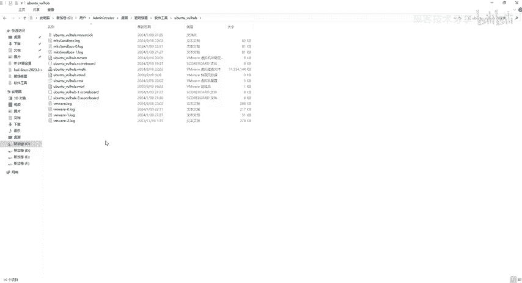

以下是部署Vulhub靶场的具体步骤。

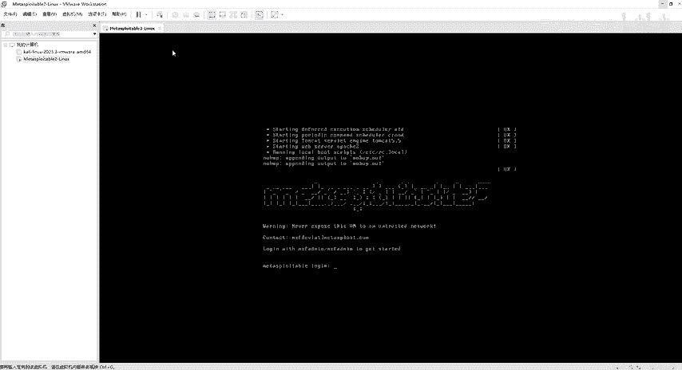

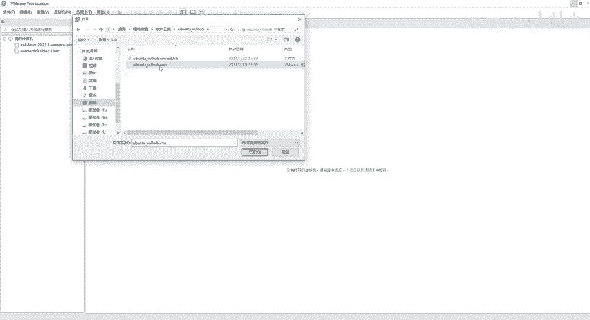

首先，我们需要获取并打开预配置好的Ubuntu虚拟机文件。该文件已放置在“软件工具”目录中并解压完毕。

1.  打开VMware虚拟机软件。
2.  点击菜单栏的“文件”，选择“打开”。
3.  导航到“软件工具”目录，找到名为“乌邦图”的文件夹。
4.  选择其中的 `.vmx` 文件并点击“打开”。

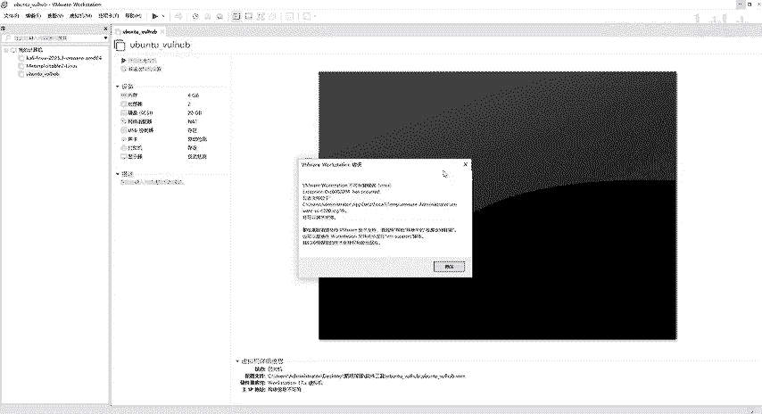


## 配置虚拟机网络

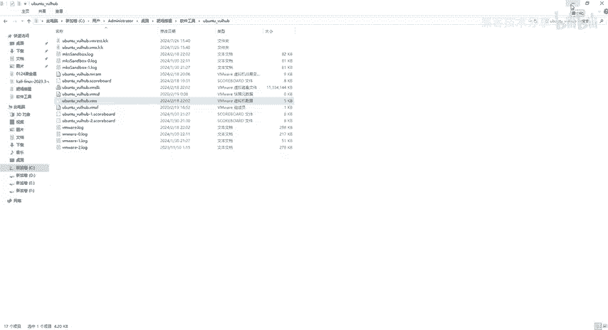

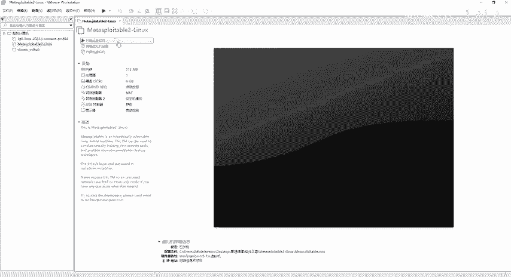

虚拟机启动前，必须正确配置网络，否则靶机将无法与宿主机通信或访问网络。

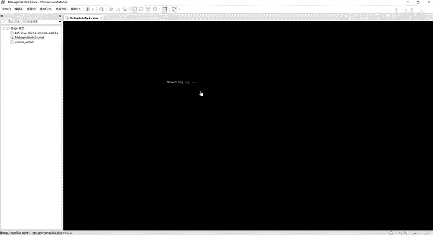

1.  在VMware中，确保虚拟机的内存为4G，处理器为2个，硬盘为20G。
2.  找到网络适配器设置，**必须选择“NAT模式”**。
3.  如果选择桥接或仅主机模式，虚拟机将无法连接到宿主机所在的网络。

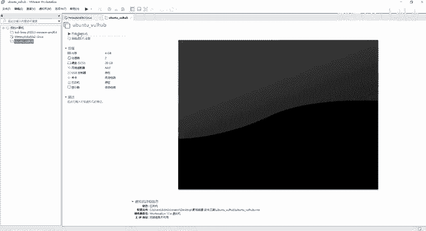


配置完成后，点击“开启此虚拟机”。

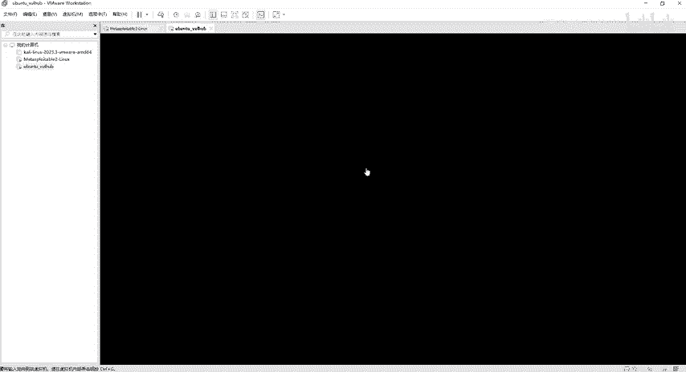

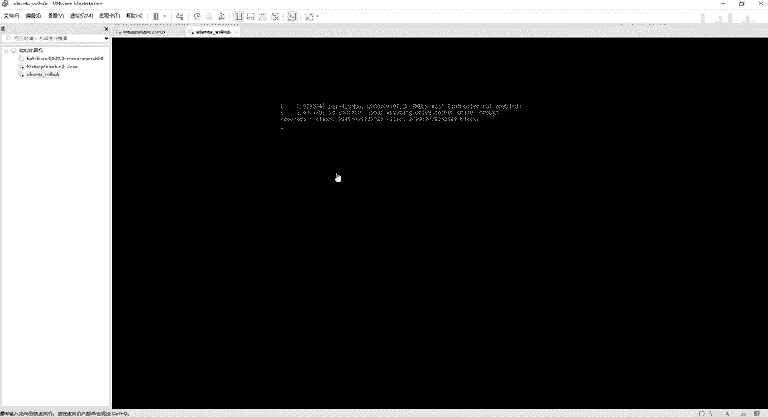


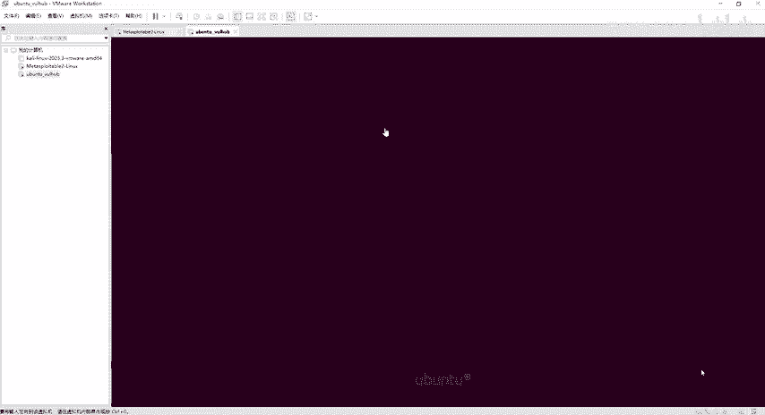

## 登录Ubuntu系统

Ubuntu系统启动后，会进入图形化登录界面，这与Kali Linux类似。

1.  等待系统完全启动，出现登录界面。
2.  点击用户图标，输入用户名和密码进行登录。
    *   **用户名**: `root`
    *   **密码**: `1234%`
3.  点击回车或登录按钮进入系统桌面。

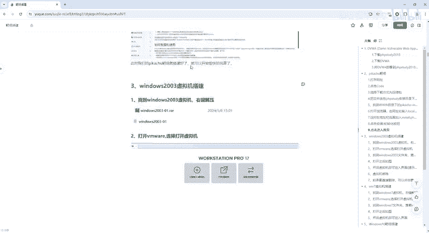


## 验证网络连接

登录系统后，我们需要验证虚拟机和宿主机之间的网络连通性，这是后续所有操作的基础。

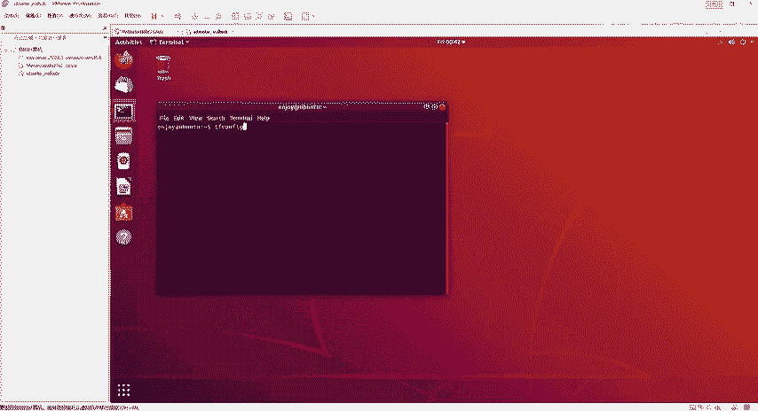

1.  在Ubuntu桌面，点击打开终端（黑色窗口）。
2.  在终端中输入命令查看IP地址：
    ```bash
    ifconfig
    ```
    假设查看到的IP地址为 `192.168.49.141`。
3.  在宿主机（Windows）上，按下 `Win + R`，输入 `cmd` 打开命令提示符。
4.  输入命令查看宿主机在VMware NAT网络中的IP：
    ```bash
    ipconfig
    ```
    假设查看到的VMnet8适配器IP地址为 `192.168.49.1`。


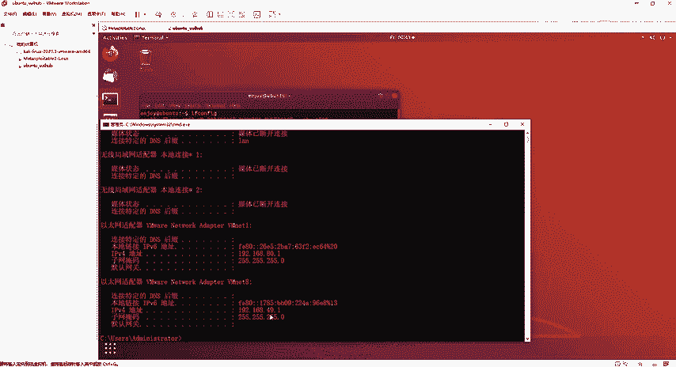


此时，宿主机 (`192.168.49.1`) 和 Ubuntu 靶机 (`192.168.49.141`) 处于同一网段，可以相互通信。这证明了NAT模式配置成功。

## 总结与下节预告

本节课中我们一起学习了Ubuntu Vulhub靶场虚拟机的部署过程，包括打开虚拟机文件、配置关键的网络适配器为NAT模式、登录系统以及验证网络连通性。

至此，我们已经完成了Linux系统下Metasploitable和Vulhub两个重要靶场的部署。接下来，我们将开始部署Windows系统的靶场，例如Windows 10、7、2003和XP。这些系统靶场对于复现“永恒之蓝”等经典漏洞以及进行MSF漏洞攻击练习至关重要。下一节，我们将从Windows 2003开始安装。