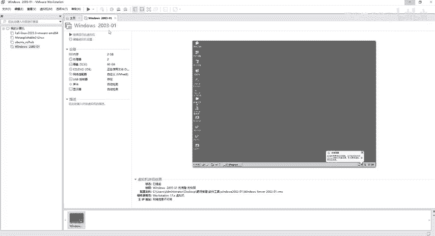
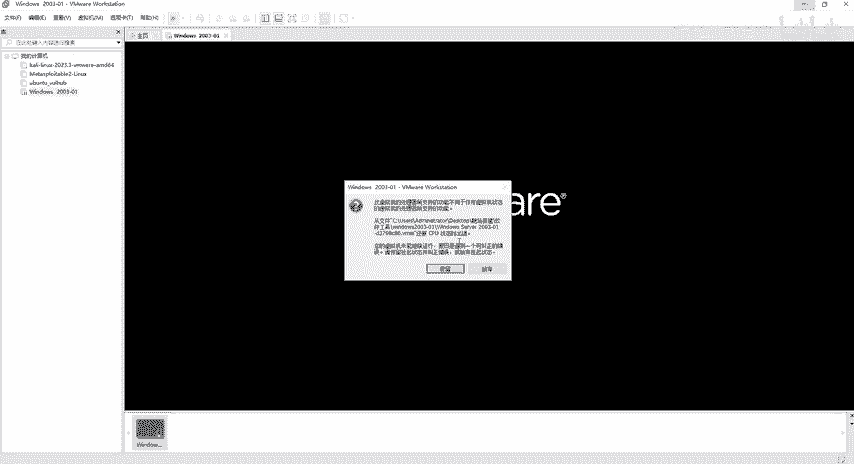
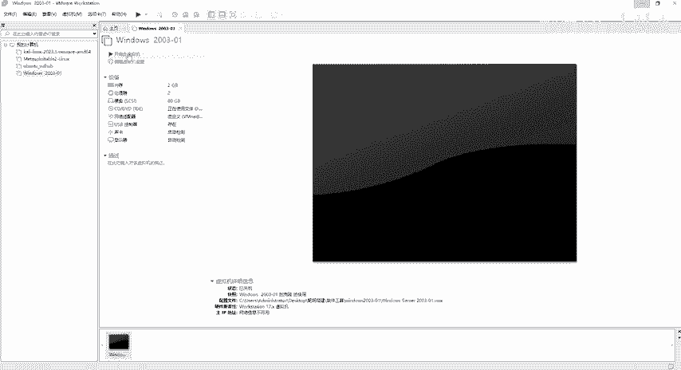
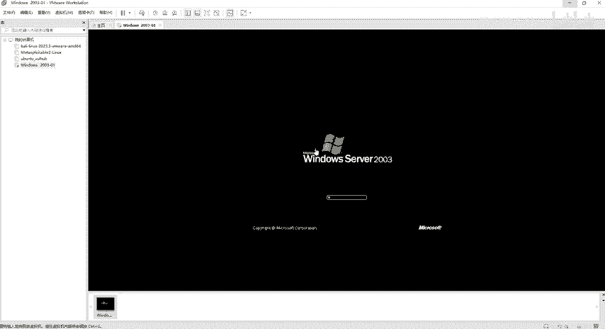
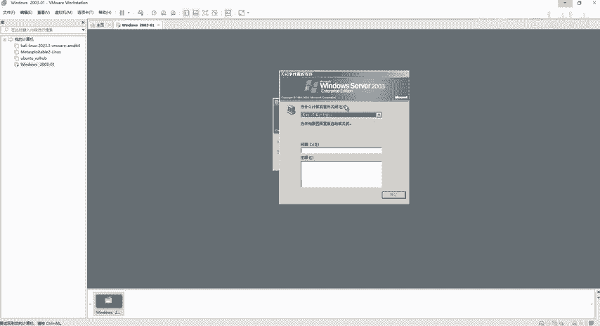
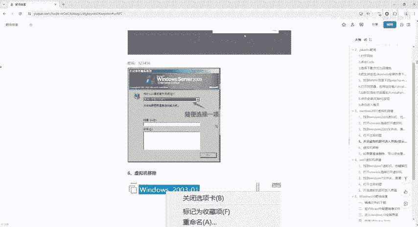
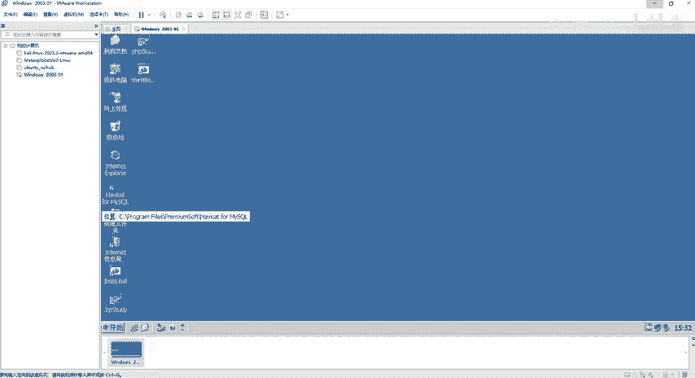

# 网络安全靶场搭建入门：P7：Windows 2003靶机安装部署 🖥️

在本节课中，我们将学习如何在VMware Workstation中安装和部署Windows Server 2003靶机。这是构建本地渗透测试环境的关键一步，我们将详细讲解从解压文件到成功启动虚拟机的完整流程，并解决过程中可能遇到的常见问题。

## 概述与准备工作

上一节我们介绍了虚拟机软件的基本操作，本节中我们来看看如何部署一个具体的Windows靶机。首先，我们需要获取并准备好Windows 2003的虚拟机文件。

1.  获取虚拟机压缩包后，右键点击文件并选择“解压”。
2.  解压完成后，应得到一个包含多个文件的文件夹（例如 `windows2003-015`）。如果解压后文件缺失，则意味着解压失败。

**注意**：为确保解压成功，在操作前必须完成以下步骤：
*   关闭电脑上所有的杀毒软件。
*   关闭Windows安全中心。
*   关闭系统防火墙。

完成上述所有步骤后，再次尝试解压文件。

## 在VMware中打开虚拟机

成功解压出包含众多文件的文件夹后，我们就可以在VMware Workstation中加载这个虚拟机了。

1.  打开VMware Workstation软件。
2.  如果你偏好使用带有明确按钮的界面，可以点击顶部选项卡中的“主页”以切换到主页视图。
3.  在主页界面，点击“打开虚拟机”。
4.  浏览至你解压出的文件夹（例如 `软件工具/windows2003-015`），选择其中的 `.vmx` 文件并打开。

**核心概念**：在VMware中，我们只需打开 `.vmx` 配置文件即可加载整个虚拟机，无需操作其他文件。

## 启动虚拟机与排错

打开虚拟机后，点击“开启此虚拟机”来启动它。启动过程可能会遇到一些弹窗提示，以下是标准的处理方法。

以下是启动时可能遇到的步骤及对应操作：

*   **弹窗1：虚拟机正在使用**：如果提示“该虚拟机似乎正在被使用”，选择“获取所有权”。
*   **弹窗2：我已复制该虚拟机**：启动后出现的第一个常见弹窗，选择“我已复制该虚拟机”。
*   **弹窗3：放弃或保留**：系统可能询问是否保留之前的操作，选择“放弃”。
*   **弹窗4：启动失败**：有时会提示“未能启动虚拟机”，点击“确定”。此时虚拟机状态可能会变为全黑。
*   **重新启动**：在全黑状态下，再次点击“开启此虚拟机”。如果系统询问，选择不保留任何操作以全新启动。

## 登录系统与初始设置

虚拟机成功启动后，会进入系统登录界面。

1.  屏幕可能会提示“请按 Ctrl+Alt+Delete 开始”。由于该组合键在虚拟机内操作不便，我们可以点击VMware菜单栏的“虚拟机” -> “发送 Ctrl+Alt+Delete” 来模拟按键。
2.  在弹出的登录框中，输入密码：`123456`，然后点击“确定”。
3.  随后系统会询问“为什么计算机意外关闭”，这是一个无关紧要的提示。从下拉框中任意选择一项（**不要选择“没有计划”**，否则确认按钮可能不可用），然后点击“确定”即可进入系统桌面。

## 网络配置与验证

进入系统后，可能会弹出“管理您的服务器”窗口，直接关闭即可。

1.  查看桌面右下角的网络连接图标，确认“本地连接”已启用并已获取到IP地址（显示为“已连接上”）。
2.  本靶机已预先配置好网络。你可以在VMware的虚拟机设置中查看，其网络适配器模式应为 **NAT模式**（或自定义的 VMnet8，两者本质相同，均可联网）。

**重要提示**：请确保虚拟机网络模式为 **NAT** 或 **VMnet8**。如果设置为“桥接模式”或“仅主机模式”，靶机可能无法正常联网，影响后续实验。

至此，Windows Server 2003 靶机已成功部署并准备就绪，可以用于后续的网络安全学习和渗透测试练习。

## 总结

本节课中我们一起学习了Windows 2003靶机的完整部署流程。我们首先完成了关闭安全软件、解压文件等准备工作，然后在VMware中加载并启动了虚拟机。过程中，我们掌握了处理一系列启动弹窗的标准方法，成功登录系统，并最终确认了网络的正确配置。现在，你的本地渗透测试环境中已经拥有一台可用的Windows靶机了。