# 网络安全靶场搭建入门：P8：Win7/WinXP靶机安装部署及快照功能 🖥️

在本节课中，我们将学习如何在VMware虚拟机中部署Windows 7和Windows XP靶机，并掌握虚拟机快照功能的使用。快照功能能有效保护我们配置好的靶机环境，避免因误操作导致环境损坏。

上一节我们介绍了Windows 2003靶机的部署，本节中我们来看看Windows 7和Windows XP靶机的安装流程。

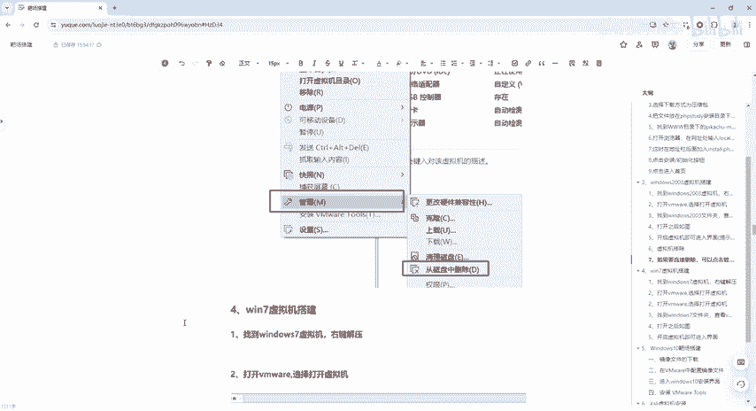

## Win7与WinXP靶机部署步骤

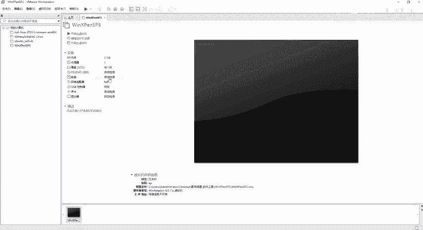

以下是部署Windows 7和Windows XP靶机的具体操作流程。

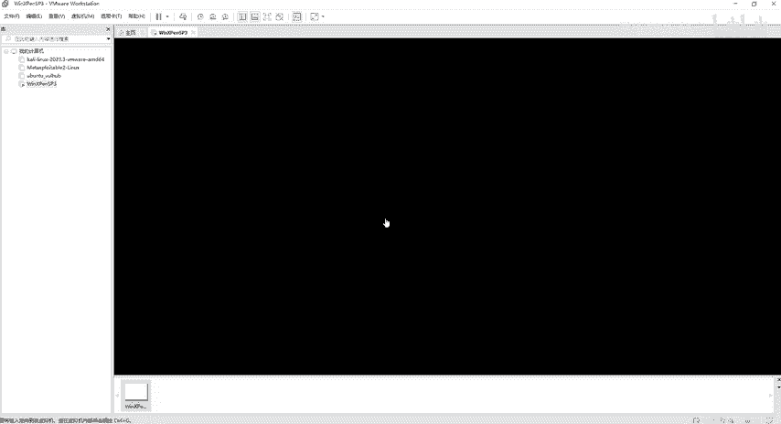

1.  **获取并解压靶机文件**：在提供的软件工具文件夹中，找到名为“win7”和“windows XP”的压缩包。右键点击压缩包，选择“解压到当前文件夹”。等待解压过程完成。

2.  **打开虚拟机**：启动VMware Workstation软件。在软件主界面，点击“打开虚拟机”选项。

    

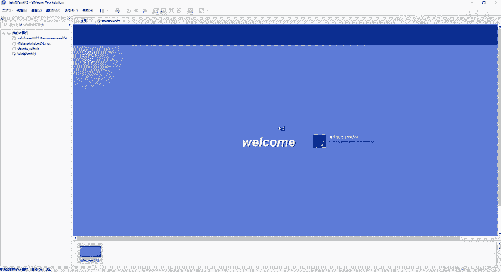

3.  **加载靶机**：在弹出的文件浏览器中，导航至解压好的靶机文件夹（例如“windows XP”），选择以`.vmx`为后缀的虚拟机配置文件，然后点击“打开”。

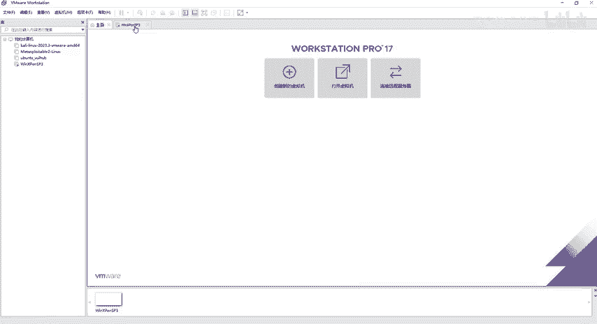

4.  **启动靶机**：虚拟机加载成功后，在VMware左侧列表中会看到新添加的靶机。确保网络适配器设置为“NAT模式”，然后点击“开启此虚拟机”。

    

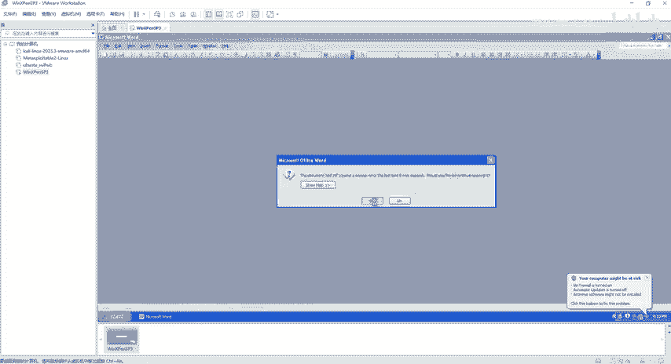

5.  **登录系统**：对于Windows XP靶机，系统启动后，输入密码`123456`即可登录。该系统为英文环境，但不影响后续使用。

    

6.  **处理Win7启动提示**：启动Windows 7靶机时，可能会遇到一些提示框。
    *   如果提示“Windows未成功关闭”，直接按回车键选择正常启动即可。
    *   如果提示Windows未激活，直接关闭提示窗口。
    *   如果弹出网络位置设置窗口，点击“取消”或直接关闭。

    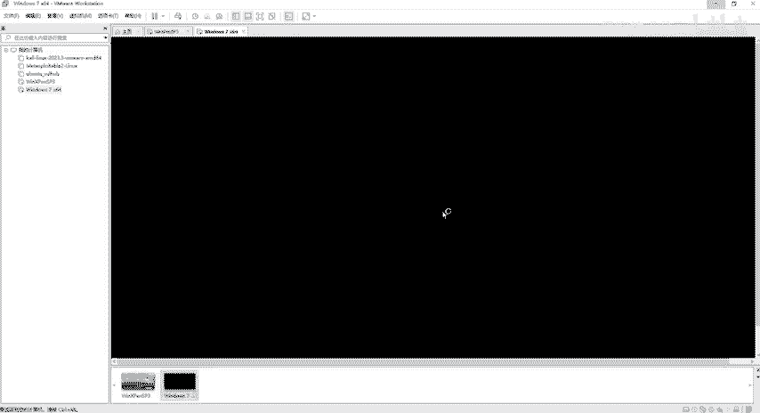
    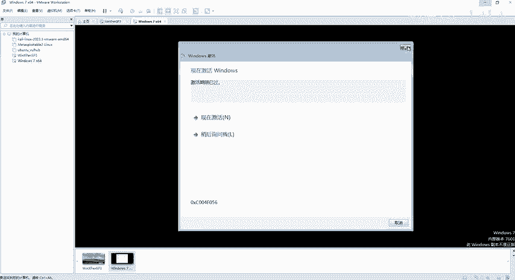

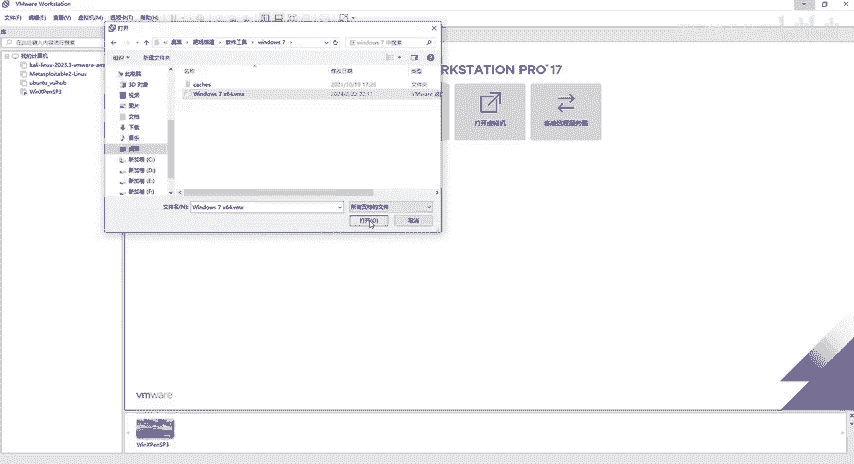

7.  **安装额外软件（可选）**：如果需要在本靶机内安装其他软件（如PHPStudy），可以通过VMware Tools的拖放或复制粘贴功能，将安装文件从宿主机传输到虚拟机内，然后进行安装。

    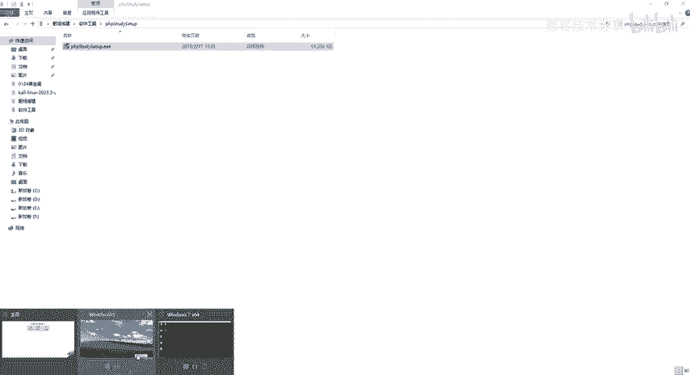

## 关于MSF渗透测试的说明

部署Windows XP靶机的一个重要用途是进行Metasploit Framework（MSF）渗透测试的练习。MSF是一个强大的渗透测试平台。

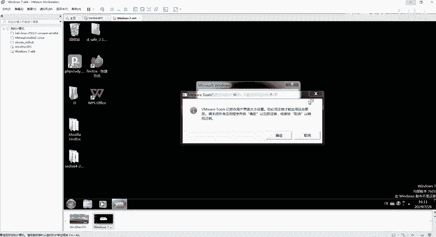

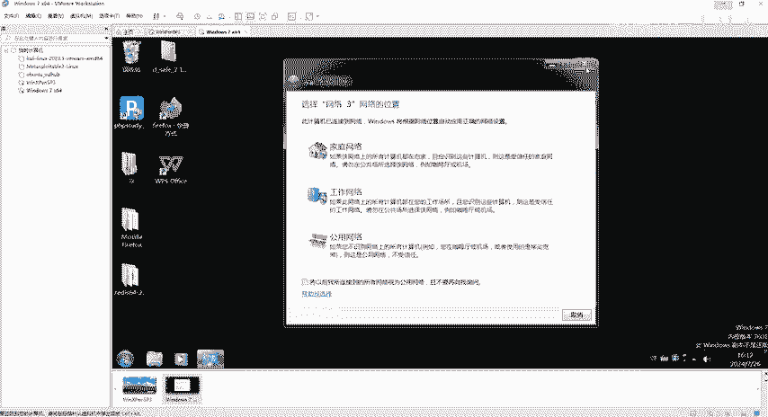

*   **攻击原理**：攻击者可以利用MSF生成含有恶意代码的文件（如木马、被篡改的APK安装包或文档）。当目标用户（在练习中即我们的XP靶机）运行这些文件时，攻击者便能获得系统的控制权。
*   **靶机示例**：在提供的Windows XP靶机桌面上，有一个名为`MSF.rtf`的文档。这个文档看起来普通，但实际上是利用MSF对XP系统进行漏洞利用后生成的。双击它可能会触发预设的恶意行为，这模拟了真实世界中的文档攻击。

    

## 虚拟机快照功能详解 🗂️

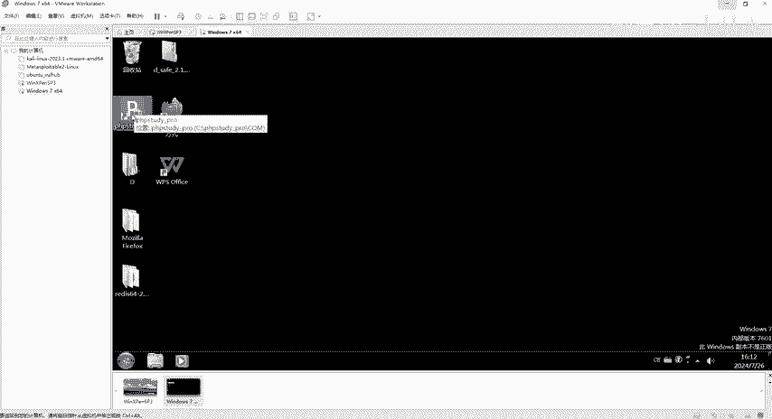

在配置好靶机环境（例如安装完必要软件）后，为了防止后续测试练习中误操作破坏环境，我们需要使用“快照”功能。

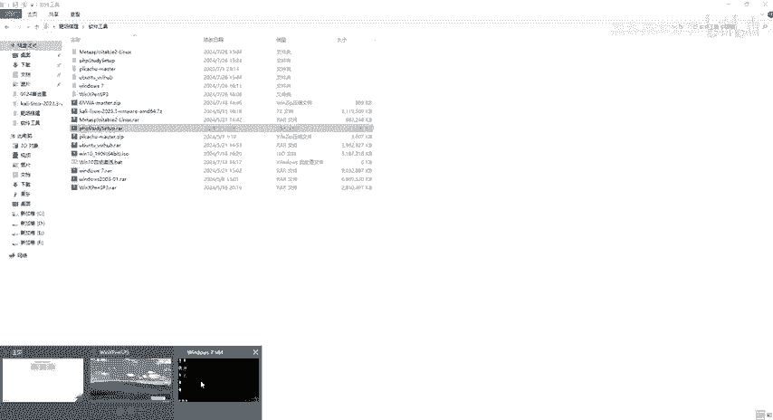

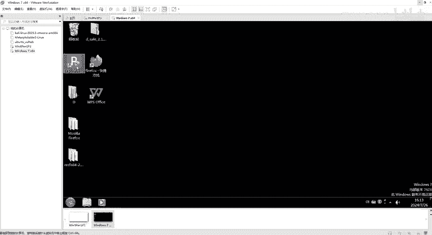

快照可以理解为虚拟机的“存档点”，它完整保存了虚拟机在某个时间点的状态（包括内存、磁盘数据等）。以下是使用快照的步骤。

1.  **创建快照**：在虚拟机运行或关闭状态下，点击VMware菜单栏的“虚拟机”，选择“快照” -> “拍摄快照...”。

    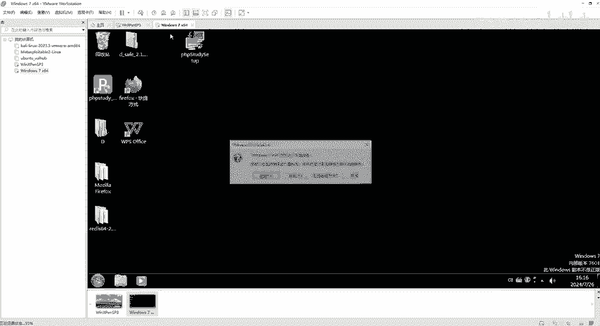

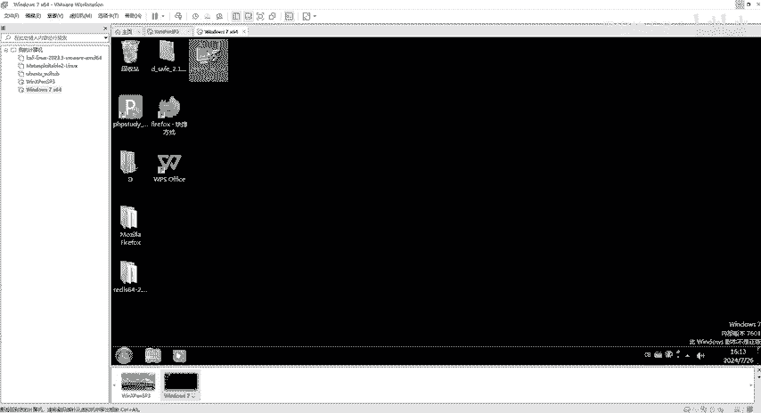

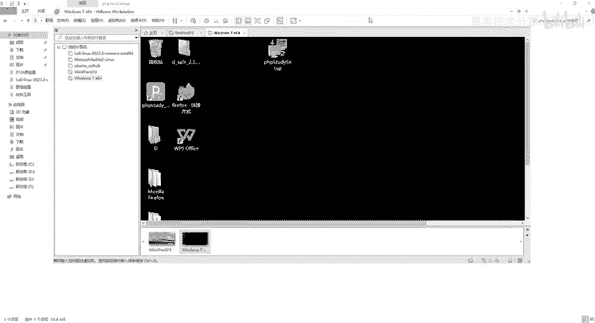

2.  **命名快照**：在弹出的窗口中，为快照取一个易于识别的名字（例如“已安装PHPStudy”），然后点击“拍摄快照”。VMware会开始保存当前状态。

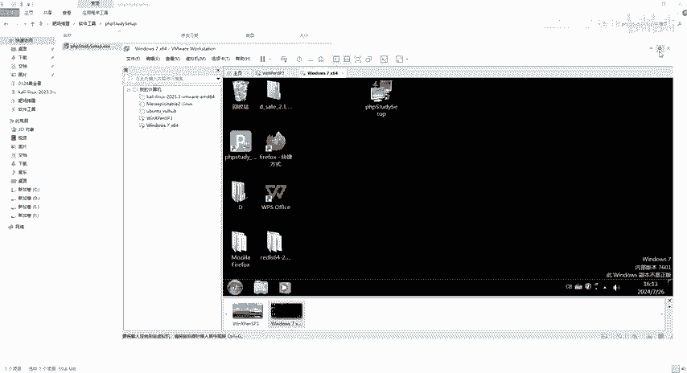

3.  **恢复快照**：当靶机环境被破坏或需要重置时，再次点击“虚拟机” -> “快照”，可以看到“恢复到快照”的选项。选择之前创建的快照，确认恢复，虚拟机便会回到拍摄快照时的状态。

4.  **管理快照**：通过“虚拟机” -> “快照” -> “快照管理器”，可以查看所有快照、创建新快照、删除旧快照或恢复到任意一个历史快照。

**核心操作代码/命令示意**：
在VMware图形界面中，快照功能主要通过菜单操作完成。其底层逻辑类似于为虚拟机磁盘创建了一个差异化的备份点。

**公式/概念**：
`当前虚拟机状态 = 基础镜像 + 快照差异数据`
恢复快照即丢弃当前的“差异数据”，回滚到指定快照点的状态。

本节课中我们一起学习了Windows 7和Windows XP靶机的快速部署方法，了解了MSF渗透测试的基本概念，并掌握了保护靶机环境的利器——虚拟机快照功能。熟练使用快照，能让你在网络安全学习中大胆测试而无后顾之忧。下一节，我们将进行Win10靶机的安装。