# 网络安全靶场搭建：P9：Windows 10靶机安装部署 🖥️

在本节课中，我们将学习如何在VMware虚拟机中安装和部署一个Windows 10操作系统作为网络安全靶场环境。与之前直接导入虚拟机文件不同，本次安装需要使用ISO镜像文件，步骤相对复杂。

## 概述
我们将通过创建虚拟机、配置硬件、安装操作系统、安装VMware Tools等一系列步骤，完成一个独立的Windows 10靶机搭建。以下是详细的安装流程。

## 第一步：准备ISO镜像文件
首先，需要准备好Windows 10操作系统的ISO镜像文件。该文件是安装系统的核心。

## 第二步：在VMware中创建并配置虚拟机
上一节我们准备好了安装介质，本节中我们来看看如何在VMware中创建虚拟机并加载镜像。

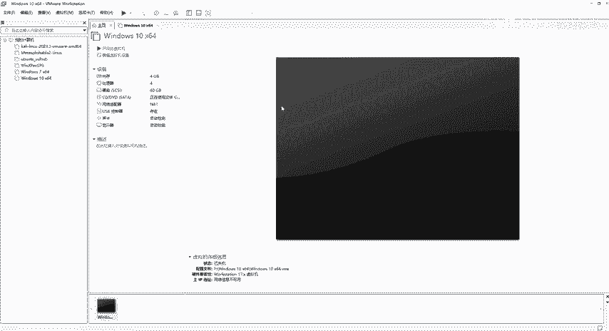

以下是创建虚拟机的具体步骤：
1.  打开VMware Workstation，点击“创建新的虚拟机”。
2.  选择“自定义（高级）”配置，点击下一步。
3.  硬件兼容性选择“Workstation 17.x”，点击下一步。
4.  选择“稍后安装操作系统”，点击下一步。
5.  客户机操作系统选择“Microsoft Windows”，版本选择“Windows 10 x64”，点击下一步。
6.  为虚拟机命名，并选择一个非系统盘（如D盘、E盘）作为存储位置，点击下一步。
7.  固件类型选择“BIOS”，点击下一步。
8.  处理器配置：根据主机性能，通常分配2个处理器，每个处理器2个内核（总计4个逻辑核心），点击下一步。
9.  内存分配：为Windows 10分配**4GB**内存，点击下一步。
10. 网络类型：选择“使用网络地址转换（NAT）”，点击下一步。
11. I/O控制器类型：使用推荐值“LSI Logic”，点击下一步。
12. 磁盘类型：选择“SCSI”，点击下一步。
13. 选择“创建新虚拟磁盘”，点击下一步。
14. 磁盘容量：建议分配**60GB**以上，选择“将虚拟磁盘存储为单个文件”，点击下一步。
15. 指定磁盘文件名称，使用默认值即可，点击下一步。
16. 在最终确认界面，先不要点击完成，点击“自定义硬件...”。

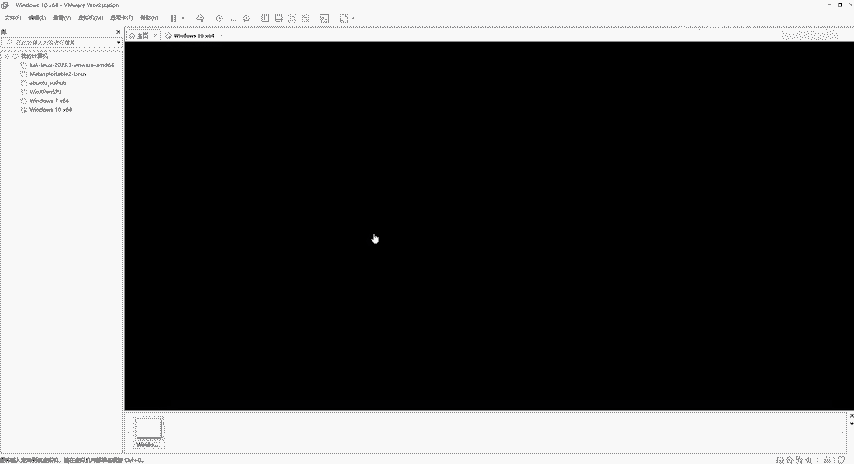

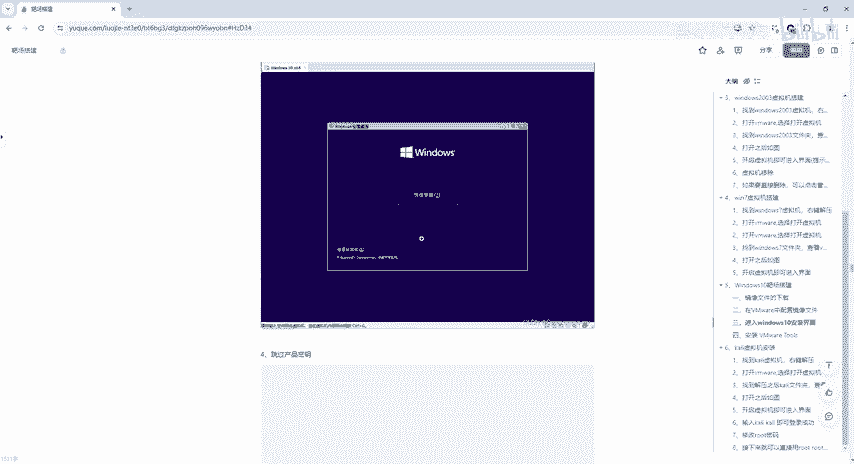

以下是关键的硬件自定义步骤：
1.  在新窗口中，选择“新CD/DVD (SATA)”。
2.  在右侧，选择“使用ISO映像文件”，点击“浏览”找到并选择之前准备的Windows 10 ISO文件。
3.  找到“打印机”设备，选中后点击“移除”，因为我们通常不需要在虚拟机中使用打印机。
4.  点击“关闭”，返回上级界面。
5.  最后，点击“完成”以创建虚拟机。

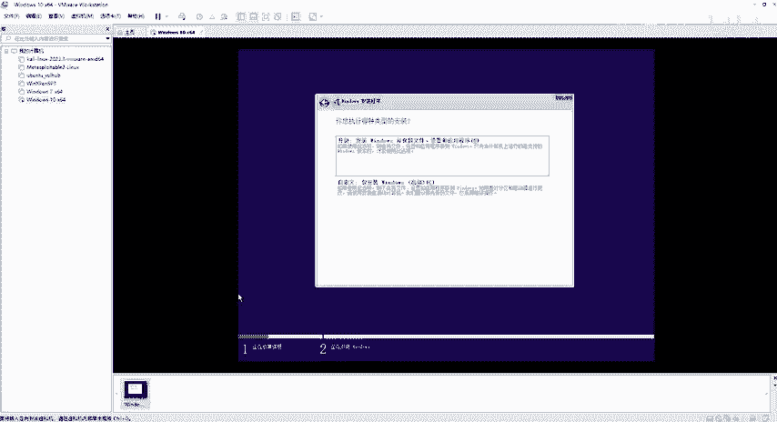

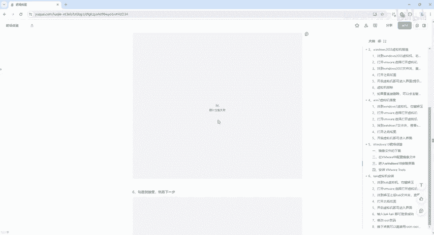

## 第三步：安装Windows 10操作系统
虚拟机创建完成后，我们开始安装操作系统。

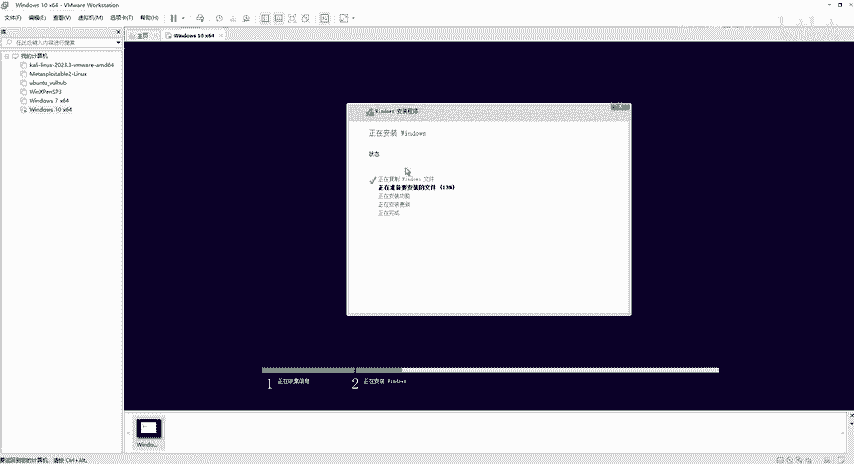

1.  在VMware库中选中新创建的Windows 10虚拟机，点击“开启此虚拟机”。
2.  虚拟机启动后会从ISO镜像引导，进入Windows安装程序。
3.  选择语言、时间和键盘输入法，点击“下一步”。
4.  点击“现在安装”。
5.  输入产品密钥（如有），或点击“我没有产品密钥”暂时跳过。
6.  选择要安装的操作系统版本，例如“Windows 10 专业版”，点击“下一步”。
7.  阅读并接受许可条款，点击“下一步”。
8.  选择安装类型：点击“自定义：仅安装Windows（高级）”。
9.  在磁盘分区界面，直接选中之前创建的虚拟磁盘（通常显示为“驱动器0 未分配的空间”），点击“下一步”开始安装。
10. 安装过程需要一些时间，请耐心等待。
11. 安装完成后，系统会自动重启。

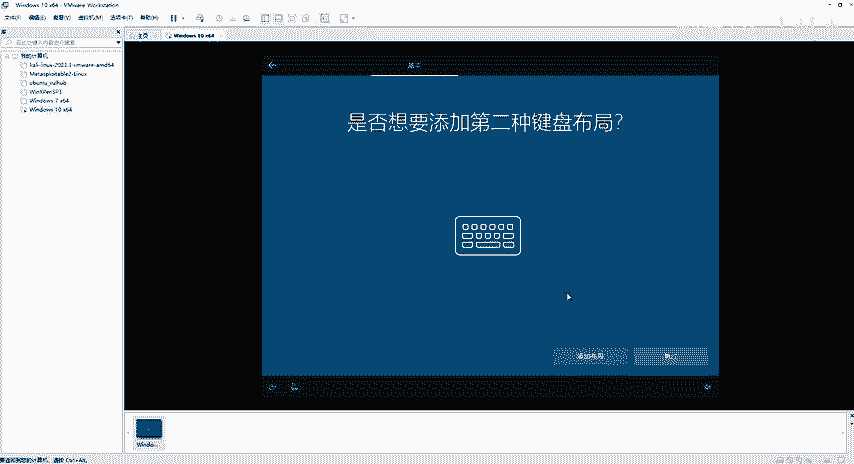

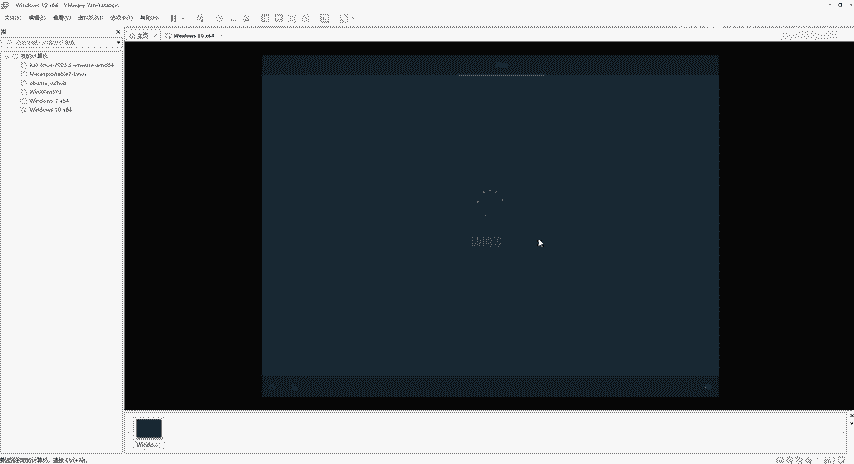

## 第四步：完成Windows初始设置
系统重启后，需要进行一些初始配置。

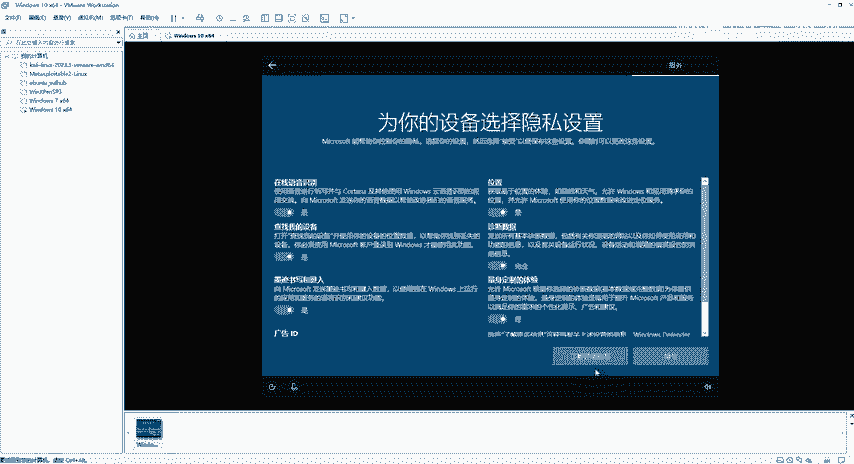

1.  选择区域为“中国”，点击“是”。
2.  选择键盘布局为“微软拼音”，点击“是”。
3.  是否添加第二种键盘布局，选择“跳过”。
4.  在“让我们为你连接到网络”界面，为了简化安装，**建议选择“我没有Internet连接”**。
5.  点击“继续执行有限设置”。
6.  为账户设置用户名，例如 `admin`，点击“下一步”。
7.  设置账户密码（可留空，但建议设置简单密码如`123456`用于测试），点击“下一步”。
8.  设置三个安全提示问题（可随意填写，但需记住答案），依次点击“下一步”。
9.  在隐私设置界面，建议将所有选项切换为“否”，然后点击“接受”。
10. 等待系统完成最后设置，即可进入Windows 10桌面。

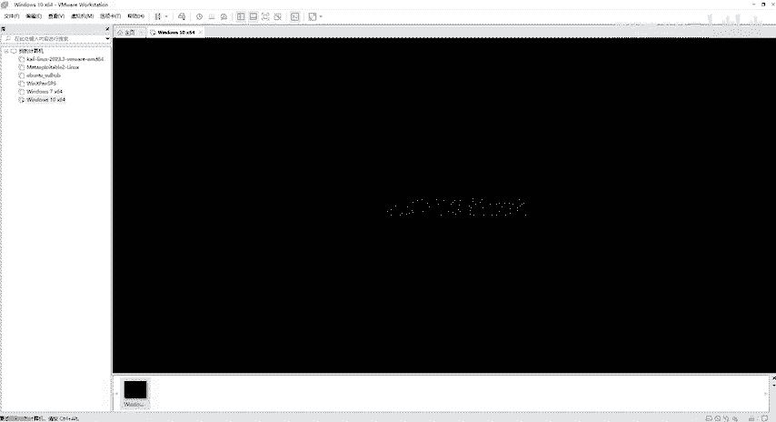

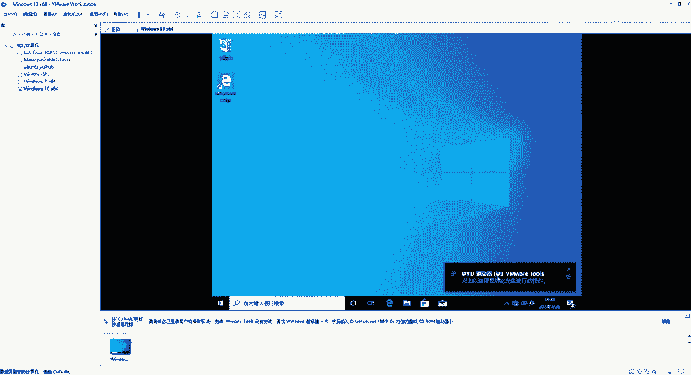

## 第五步：安装VMware Tools
进入桌面后，屏幕可能无法自适应窗口大小，也无法与主机直接复制粘贴文件。安装VMware Tools可以解决这些问题。

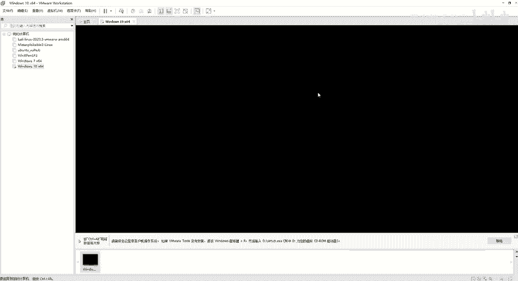

以下是安装VMware Tools的步骤：
1.  在VMware菜单栏，点击“虚拟机” -> “安装VMware Tools...”。
2.  虚拟机会自动加载一个虚拟光驱。在弹出的对话框中，点击“运行setup64.exe”。
3.  如果未自动弹出，可打开“此电脑”，双击“DVD驱动器 (D:) VMware Tools”来运行安装程序。
4.  在安装向导中，点击“下一步”。
5.  选择“典型安装”，点击“下一步”。
6.  点击“安装”开始安装过程。
7.  安装完成后，点击“完成”。
8.  系统会提示必须重新启动计算机才能使更改生效，点击“是”立即重启。

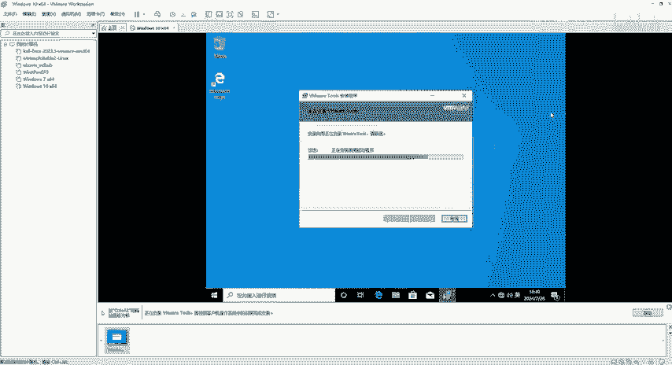

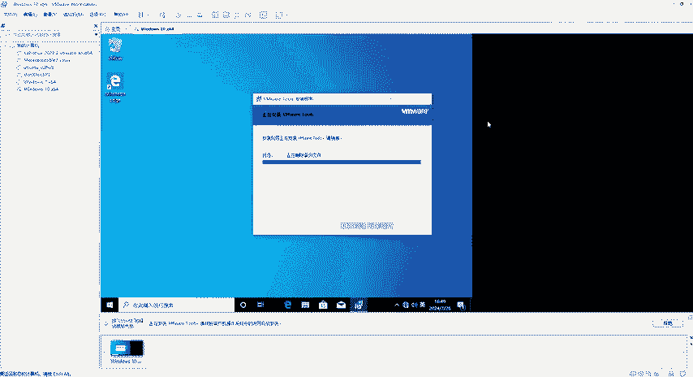

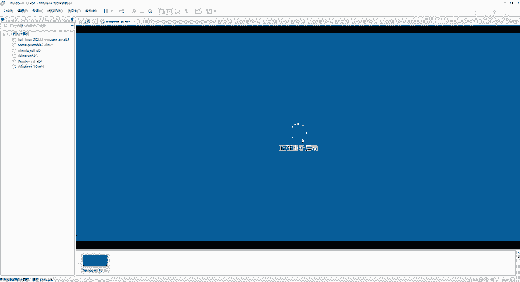

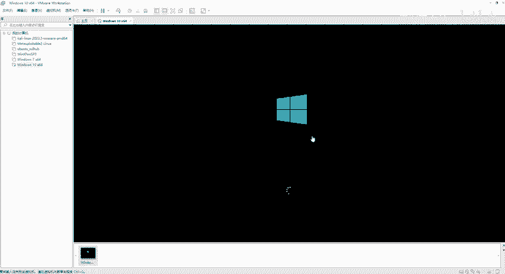

重启后，虚拟机屏幕将能自适应VMware窗口大小，并且可以在虚拟机和主机之间自由地复制、粘贴文本和文件。

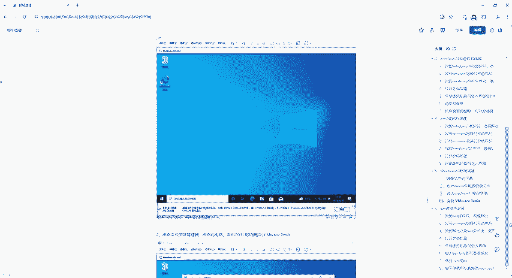

## 总结
本节课中我们一起学习了从零开始搭建Windows 10靶机的完整流程。我们首先准备了ISO镜像，然后在VMware中创建并配置了虚拟机硬件，接着完成了Windows 10系统的安装和初始设置，最后通过安装VMware Tools优化了虚拟机的使用体验。现在，你已经拥有了一个功能完整的Windows 10测试环境，可以用于后续的网络安全学习和实践。