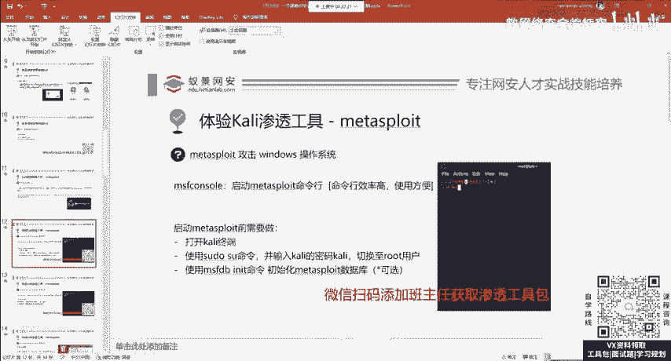
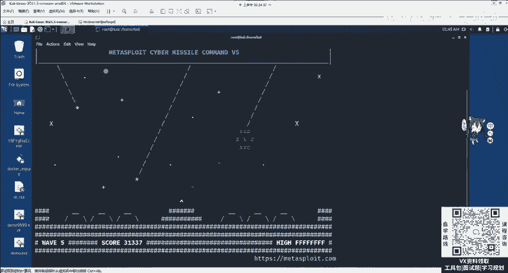
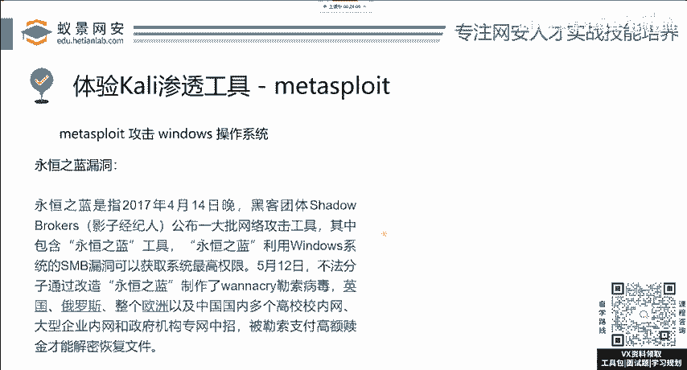

# 网络安全系统教程：P10：漏洞攻击 - MSF与Windows永恒之蓝漏洞 🛡️💻

在本节课中，我们将要学习如何使用强大的渗透测试框架Metasploit Framework（MSF）来对一个著名的Windows漏洞——“永恒之蓝”进行攻击演示。课程将涵盖从启动MSF到执行漏洞利用的完整流程。

## 概述

渗透测试的流程通常包括对目标系统的信息收集、漏洞扫描与检测、漏洞攻击，以及攻击成功后进行的内网渗透等深入利用。许多复杂的利用脚本都已集成在MSF工具中。

MSF的初衷是让复杂的漏洞攻击流程变得非常简单。一个新手经过短暂学习，就能够尝试攻击存在漏洞的操作系统或网站。互联网中存在此类漏洞的网站数量非常多。

**请注意：不要攻击国内，尤其是政府和事业单位的网站。即使怀疑其存在漏洞，也不应进行测试。**

下面，我们将讲解MSF的具体使用方法。其使用方法非常直接。



## 启动Kali终端与调整界面

首先，我们需要打开Kali Linux的终端（Terminal）。


打开终端后，你可能会发现字符显示较小。此时，可以同时按住键盘上的三个按键：`Ctrl`、`Shift` 和 `+`（加号键）。同时按下这三个键可以将终端界面放大。

若要缩小界面，则同时按住 `Ctrl` 和 `-`（减号键）。这个功能同样适用于其他Linux操作系统以及部分编程语言的集成开发环境（IDE）。在其他开发界面中，你也可以尝试使用这些快捷键来调整显示大小。

## 切换至Root用户并启动MSF

接下来，我们需要将Kali的用户切换至超级管理员root用户。在终端中输入以下命令并按回车：

```bash
sudo su
```

系统会提示你输入当前用户（kali）的密码。Kali系统的默认密码是 `kali`。输入密码时，Linux出于安全保护机制，屏幕上不会显示任何字符（如星号）。这并不代表输入无效，就像在ATM机上输入密码一样，是一种保护措施。

成功切换至root用户后，我们就能避免因权限不足而导致的工具执行报错或无法运行的情况。

现在，我们可以启动Metasploit Framework的控制台了。输入以下命令：

```bash
msfconsole
```

`console` 意为控制台接口，类似于网络设备中的管理接口。`msf` 是 Metasploit Framework 的简称。执行该命令后，将启动MSF（当前演示版本为6）。如果你使用的是MSF5，界面和部分命令可能略有不同，但大体流程一致，建议更新至最新版本。




## 认识“永恒之蓝”漏洞



在开始攻击前，我们需要了解本次演示的目标：“永恒之蓝”漏洞。


永恒之蓝是2017年在Windows系统一个默认服务中曝出的漏洞。该服务名为SMB（服务器消息块），中文称为Windows默认文件共享和打印机共享服务。它默认开启在TCP的445端口，几乎所有微软操作系统都运行此服务。

2017年，该服务被曝存在一个**远程代码执行漏洞**。这意味着，攻击者无需任何先决权限，只需利用该漏洞发起攻击，即可获得目标机器的最高控制权，造成严重危害。

永恒之蓝漏洞后来在当年5月被非法组织利用，制作成了震惊世界的勒索病毒。右侧的勒索界面图片，相信很多同学都曾见过。

永恒之蓝漏洞属于**Windows应用服务的缓冲区溢出漏洞**。如果你想深入分析或自己编写漏洞利用脚本，难度极高。对于渗透测试工程师而言，初期无需进行此项工作。除非你未来计划转向漏洞分析或安全研究岗位，届时再深入接触这个方向。目前，我们的重点是掌握渗透测试的流程和工具使用。

## 总结

本节课中，我们一起学习了渗透测试框架MSF的基本启动方法，包括调整终端界面、切换root权限用户以及启动`msfconsole`控制台。同时，我们了解了本次实验的目标——“永恒之蓝”漏洞的背景、原理及其严重性。在接下来的课程中，我们将利用MSF对该漏洞进行实际的攻击演示。