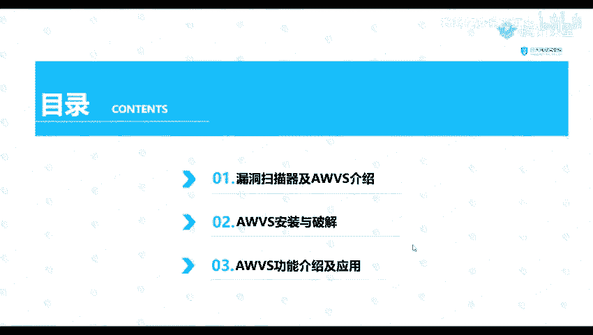
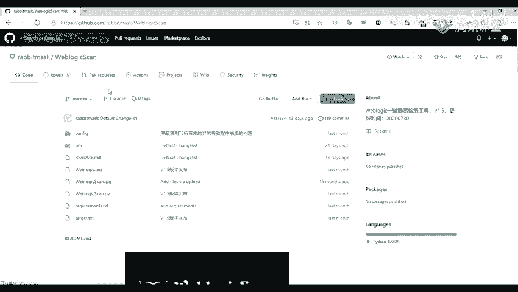
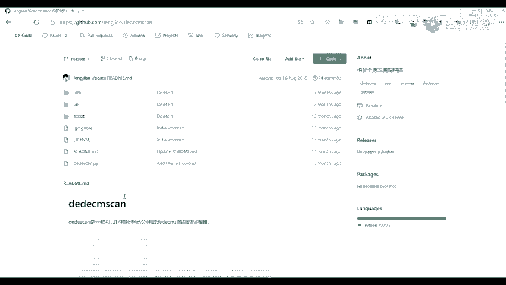
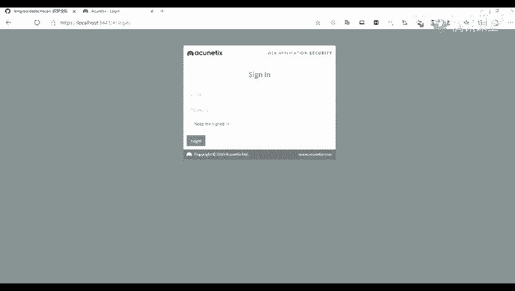
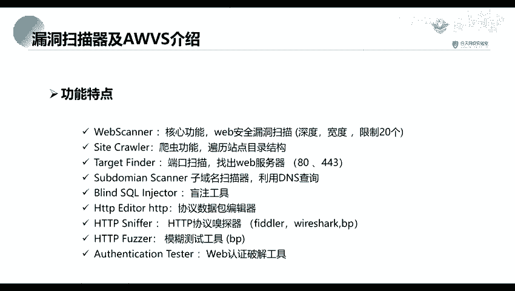

# 网络安全系统教程：P14：1.AWVS工具介绍和应用场景 🛡️

在本节课中，我们将要学习一款重要的Web漏洞扫描工具——AWVS。我们将了解什么是漏洞扫描器，详细介绍AWVS的功能特点，并学习其安装、破解与基本使用方法。通过本节课，你将能够使用AWVS对Web应用进行初步的安全检测。

## 漏洞扫描器与AWVS介绍

上一节我们介绍了信息收集，例如端口、网站及子域名信息的收集。本节中，我们来看看如何利用收集到的信息进行漏洞发现，这正是漏洞扫描器的作用。



漏洞扫描是指基于漏洞数据库，通过扫描等手段，对指定的远程或本地计算机系统的安全性进行检测。也就是说，我们通过扫描手段，对上一节课收集到的子域名进行安全脆弱性检测，以发现是否存在可利用的漏洞，这是渗透攻击的基础。

常见的漏洞扫描工具或脚本有很多，以下是一些分类：

*   **针对某类漏洞的工具**：例如，检测SQL注入漏洞的 `sqlmap` 工具。
*   **针对特定应用或框架的工具**：例如，针对WebLogic的漏洞扫描工具，或针对Struts2、Spring框架的检测工具。
*   **综合性的Web漏洞扫描工具**：例如，Burp Suite（不仅是抓包工具）、Xray以及本节课的核心——**AWVS**。

**什么是AWVS？**
AWVS（Acunetix Web Vulnerability Scanner）是一款知名的网络漏洞扫描工具。它通过网络爬虫测试网站安全性，检测SQL注入、跨站脚本（XSS）等流行安全漏洞。在11.0版本之前，它是一个客户端软件；从11.0版本开始，它转变为通过浏览器访问的Web服务形式。

**AWVS的核心功能特点包括：**
1.  **Web漏洞扫描**：核心功能，对Web安全漏洞进行扫描。
2.  **站点爬虫**：爬取网站目录结构。
3.  **端口扫描**：扫描Web服务器开放端口（如80、443）。
4.  **子域名扫描**：通过DNS查询发现子域名。
5.  **SQL注入工具**：检测SQL注入漏洞。
6.  **HTTP协议嗅探器**。
7.  **模糊测试工具**：用于Fuzz测试。
8.  **Web认证破解工具**：尝试破解登录口令。



## AWVS的安装与破解

了解了AWVS是什么之后，接下来我们看看如何获取并使用它。由于AWVS是商业软件，我们需要进行安装和破解。

以下是安装与破解的基本步骤概述：
1.  从官方或可信渠道下载AWVS安装程序。
2.  运行安装程序，按照向导完成安装，过程中会设置管理员账号和访问端口。
3.  安装完成后，使用破解补丁替换原程序文件，以完成授权破解。
4.  启动AWVS服务，在浏览器中通过 `https://localhost:13443/`（默认地址和端口）进行访问。

> **注意**：破解软件仅用于安全学习和法律授权的测试环境。在实际工作中，请支持正版软件或寻找合法的免费替代方案。

## AWVS的基本功能介绍

成功安装并启动AWVS后，本节我们来熟悉其用户界面和基本功能，学习如何发起一次简单的扫描。

通过浏览器登录AWVS后，你会看到主仪表盘。核心操作区域是“Targets”（目标）和“Scans”（扫描）。

**以下是启动一次扫描的基本流程：**
1.  **添加目标**：在“Targets”页面，点击“Add Target”，输入要扫描的网站URL（例如：`http://testphp.vulnweb.com/`）。
2.  **配置扫描**：添加目标后，可以针对该目标“Launch Scan”启动扫描。在扫描配置页面，可以设置扫描类型（如全扫描、快速扫描）、认证信息等。
3.  **查看结果**：扫描开始后，可以在“Scans”页面查看进度。扫描完成后，点击报告即可查看发现的漏洞详情，包括漏洞类型、风险等级、受影响URL以及修复建议。





**关键概念与操作示例：**
*   **扫描配置**：在启动扫描时，可以选择不同的预设配置，这决定了扫描的深度和广度。
    ```bash
    # 例如，在命令行版本中（概念性示例）
    acunetix_cli --target http://example.com --profile FastScan
    ```
*   **漏洞报告**：AWVS会生成详细的报告，将漏洞分为 **高危（Critical）**、**中危（Medium）**、**低危（Low）** 等级别，并给出CVSS风险评分。

## 总结

本节课中，我们一起学习了Web漏洞扫描的重要工具AWVS。我们首先了解了漏洞扫描器的概念，然后详细介绍了AWVS的功能特点与应用场景。接着，我们学习了AWVS的安装、破解步骤以及通过Web界面进行基本操作的方法。



AWVS是一款功能强大的自动化扫描器，能有效帮助我们发现常见的Web安全漏洞。它是渗透测试人员工具箱中的重要组成部分。请记住，工具的使用必须遵守法律法规，仅在授权范围内进行测试。