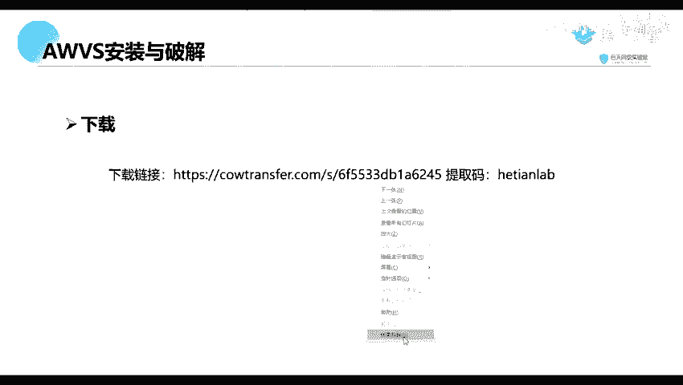
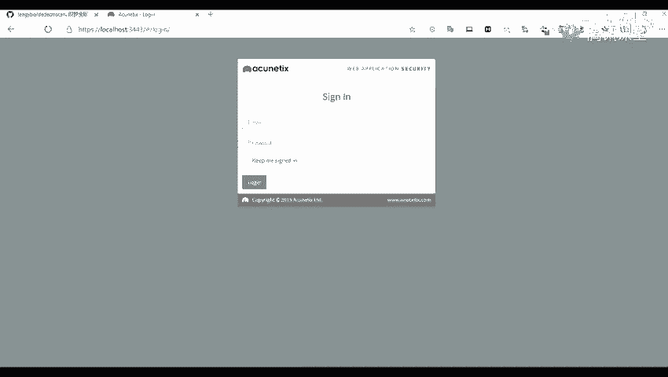
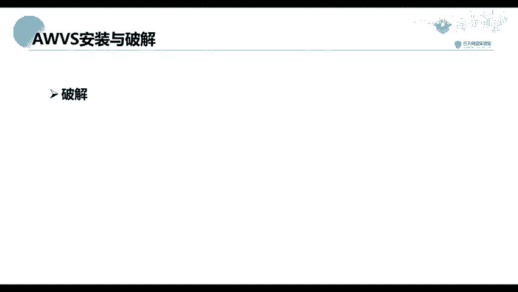

# 网络安全系统教程：P15：AWVS的安装与破解 🛠️

在本节课中，我们将学习如何安装和破解AWVS（Acunetix Web Vulnerability Scanner），这是一款广泛使用的Web应用漏洞扫描工具。掌握其安装与配置是进行Web安全测试的基础步骤。

## 概述
上一节我们介绍了课程的整体安排，本节中我们来看看AWVS工具的获取、安装以及破解激活的具体流程。整个过程包括下载安装包、执行安装程序、进行必要的配置，以及使用破解工具完成激活。

## 工具下载
首先，需要下载AWVS的安装包及破解工具。相关资源的下载链接已提供在课程的预习材料中。

以下是下载包中包含的主要文件：
*   **AWVS安装包**：用于安装AWVS扫描器主程序。
*   **破解工具包**：包含用于激活软件的必要文件。

## 安装AWVS
安装过程与安装常规软件（如QQ、微信）类似，通过图形化界面引导完成。但其中有几步关键配置需要注意。

以下是安装过程中的关键配置步骤：
1.  **设置账户信息**：安装过程中需要设置用于登录AWVS管理界面的邮箱地址和密码。
2.  **配置访问端口**：需要设置Web浏览器访问AWVS管理界面的端口号。此端口可自定义，设置后便通过 `http://localhost:端口号` 来访问。
3.  **设置远程访问**：安装程序会询问是否允许远程计算机访问此AWVS实例。若仅在本机使用，可选择不允许，则只能在安装本机进行访问。

## 破解AWVS
安装完成后，软件处于未激活状态，需要使用破解工具进行激活。破解包内通常包含两个关键文件：一个可执行程序（.exe）和一个数据文件（如date文件）。

以下是破解AWVS的具体操作步骤：
1.  **定位安装目录**：AWVS的默认安装路径通常为 `C:\Program Files (x86)\Acunetix`。安装时无法自定义此路径。
2.  **复制破解文件**：将破解工具包中的两个关键文件，复制到上一步找到的AWVS安装目录下。
3.  **运行破解程序**：以**管理员身份**运行复制过去的可执行破解程序。
4.  **填写注册信息**：程序运行后，会弹出窗口要求填写用户信息，如姓名、公司名称、电话等。这些信息可以随意填写，不影响激活。
5.  **完成激活**：填写信息并确认后，破解程序会完成激活操作。之后便可正常使用AWVS的全部功能。

## 总结
本节课我们一起学习了AWVS漏洞扫描器的完整安装与破解流程。我们首先下载了必要的安装包和破解工具，然后逐步完成了软件的安装与基础配置，最后通过复制文件和管理员运行破解程序的方式成功激活了软件。正确安装和配置工具是后续进行Web漏洞扫描与渗透测试的前提。下一节，我们将开始学习如何使用AWVS进行基本的漏洞扫描。