# 网络安全系统教程：P16：AWVS漏洞扫描工具的使用 🛡️

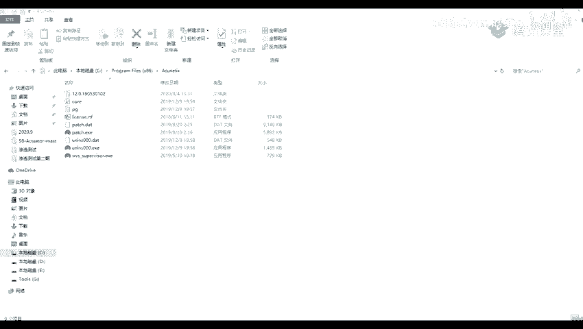

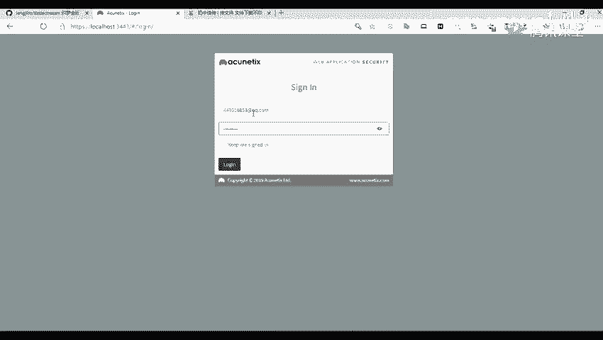

在本节课中，我们将学习AWVS（Acunetix Web Vulnerability Scanner）这款强大的Web漏洞扫描工具。我们将从界面布局开始，逐步了解其核心功能，包括如何添加目标、配置扫描、查看漏洞报告，以及如何利用脚本进行批量扫描。通过学习，你将能够独立使用AWVS对网站进行安全评估。

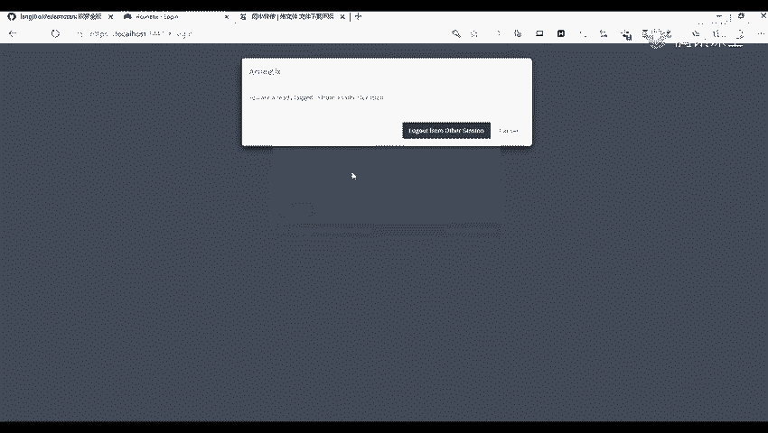

## 界面布局与核心功能

上一节我们介绍了课程概述，本节中我们来看看AWVS工具的主界面。AWVS的页面布局清晰，主要分为六个核心功能区。

以下是AWVS的六个主要功能模块：

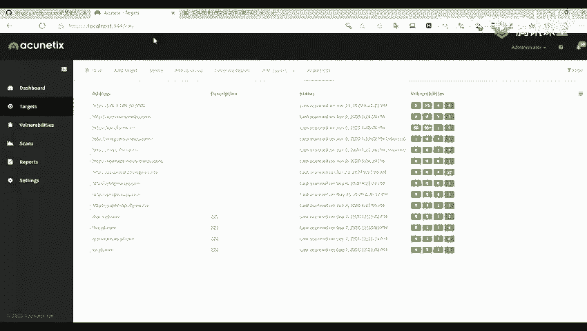

1.  **仪表盘**：展示扫描概览，包括漏洞数量、分布和扫描任务进度。
2.  **目标**：管理所有待扫描或已扫描的网站目标。
3.  **漏洞**：列出所有扫描发现的漏洞详情。
4.  **扫描**：管理具体的扫描任务。
5.  **报告**：查看和导出扫描生成的报告。
6.  **设置**：进行系统和个人偏好设置。

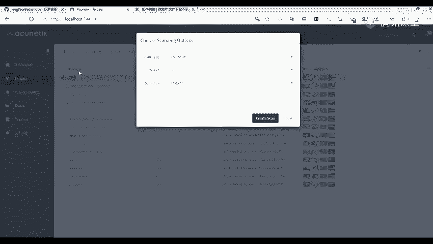

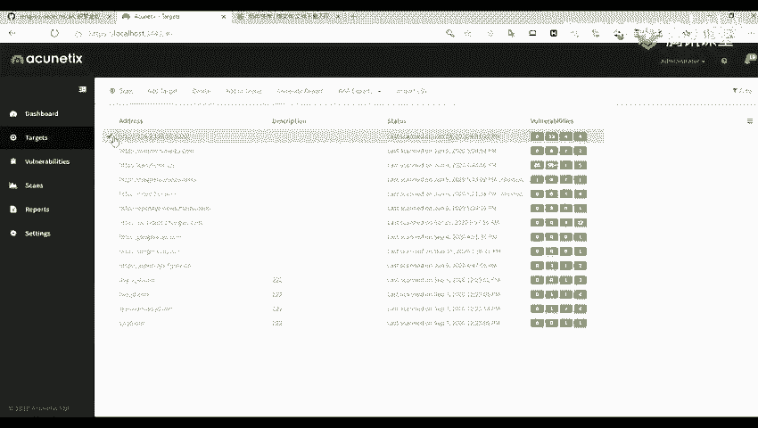

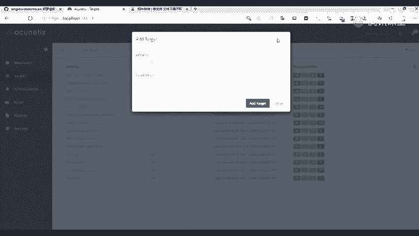


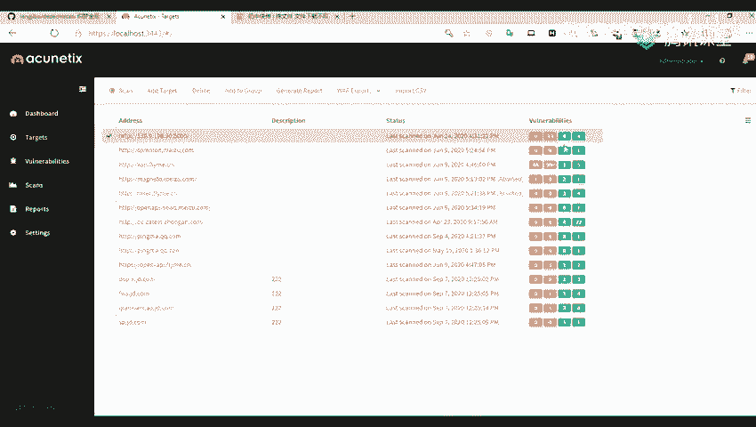

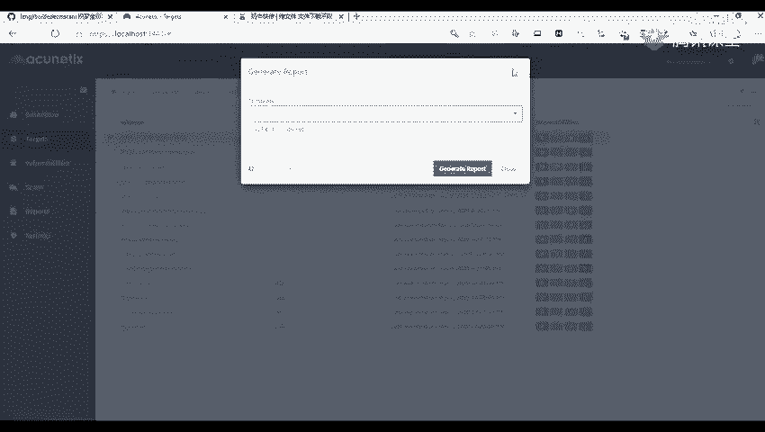

## 仪表盘详解

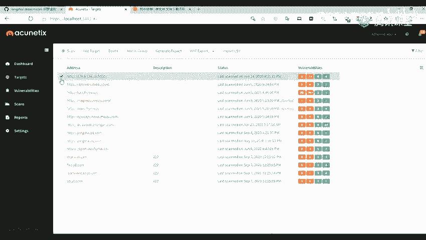

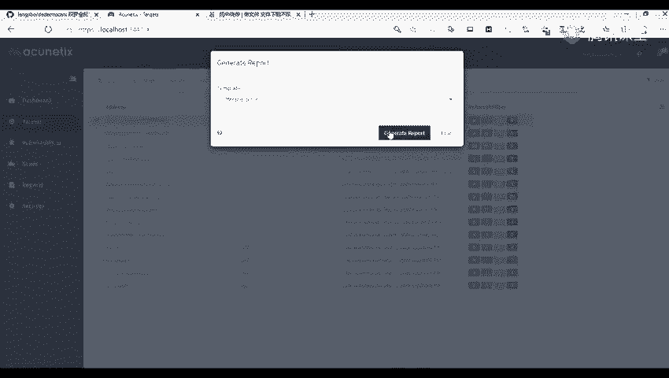

首先，我们从仪表盘开始。登录后，你可能会遇到“已有账号登录”的提示，这是因为AWVS只允许同时登录一个会话。点击“退出”当前会话即可重新登录。


登录成功后，仪表盘提供了全面的扫描概览。

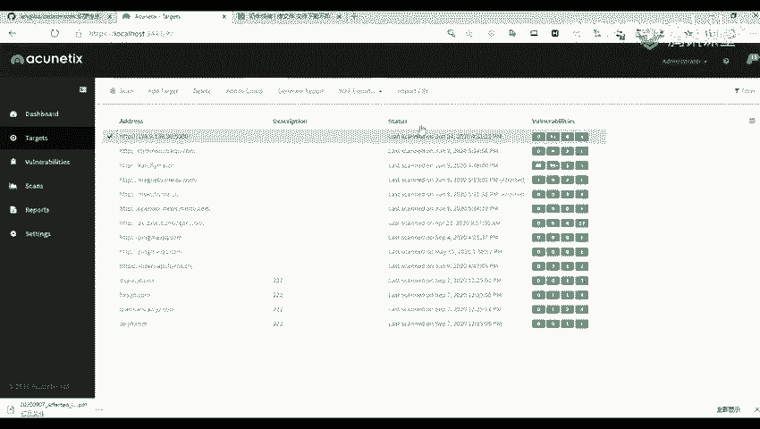

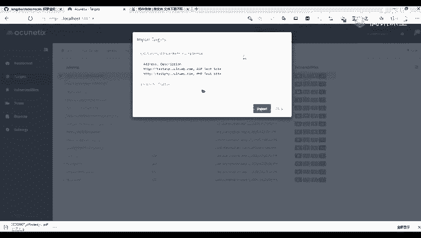

以下是仪表盘各区域的详细说明：

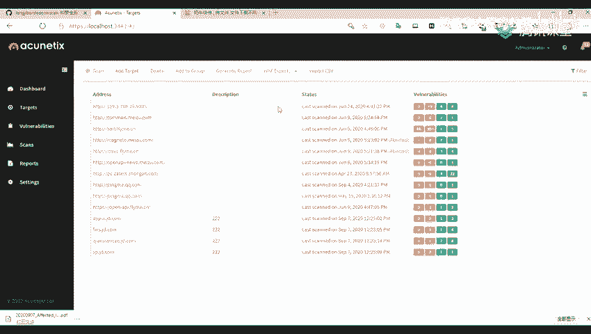

*   **顶部区域**：以饼图形式展示**高危**、**中危**、**低危**漏洞的数量分布。
*   **左下角**：列出发现漏洞的**目标站点**，例如 `xxx.flyme.com` 站点发现了88个高危漏洞。
*   **右下角**：按数量排序展示**漏洞类型**，例如目录遍历漏洞数量最多，其次是跨站脚本（XSS）漏洞。
*   **中间区域**：显示当前**扫描任务的进度**。

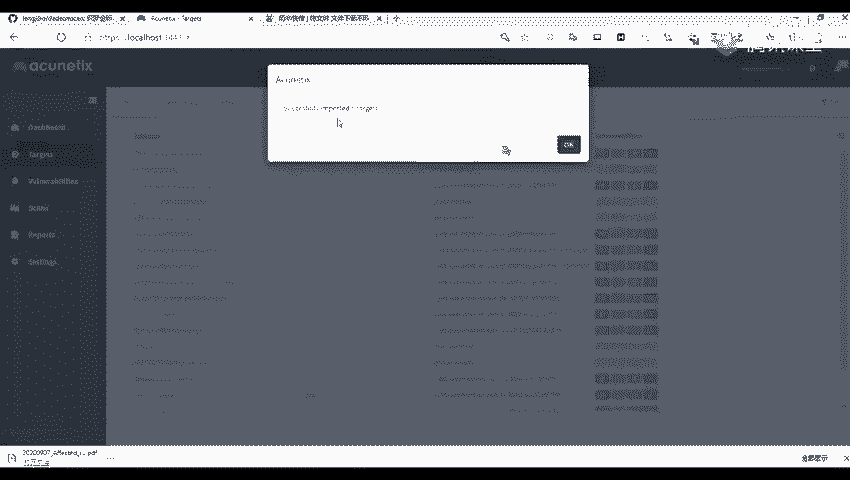

## 目标管理

了解了整体概览后，我们来看看如何管理扫描目标。点击左侧的 `Targets` 选项，进入目标管理页面。这里会展示所有已添加的网站信息。

以下是目标管理页面的主要操作按钮及其功能：

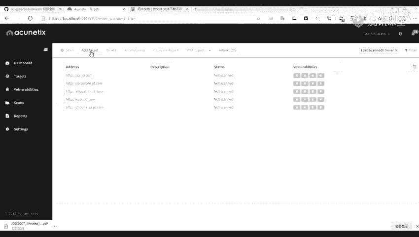

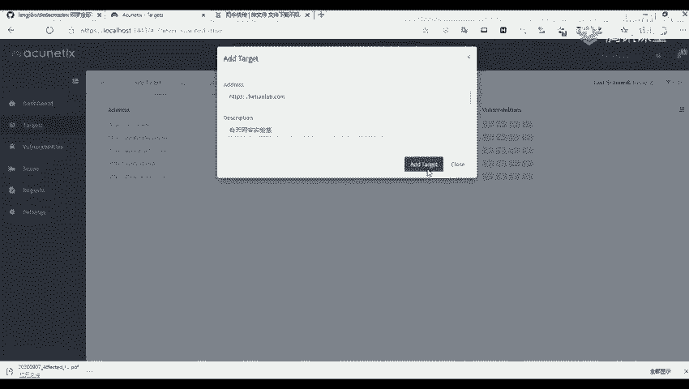

1.  **Scan**：对选中的目标启动扫描。
2.  **Add Target**：添加一个新的扫描目标（URL或IP）。
3.  **Delete**：删除选中的目标。
4.  **Group**：将目标添加到自定义分组中，便于分类管理。
5.  **Export**：导出选中目标的扫描报告。


*添加目标界面*


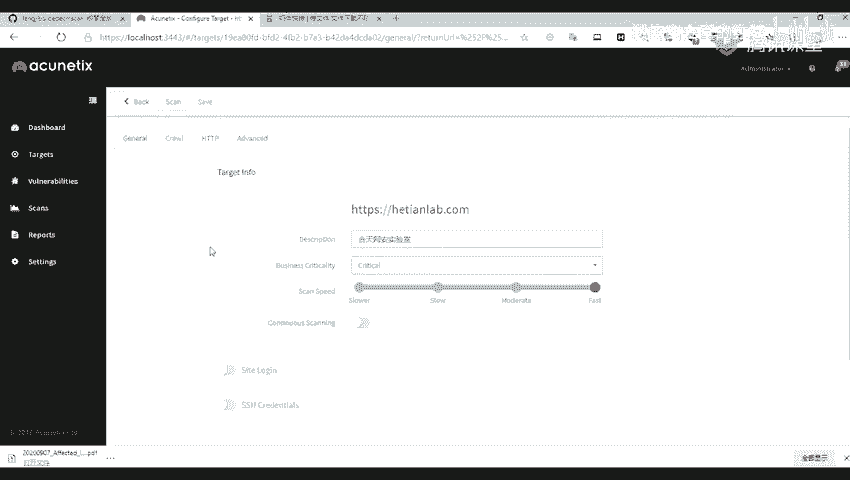

添加目标时，需要填写以下信息：
*   **Address**：目标地址，例如 `http://example.com`。
*   **Description**：目标描述，便于识别。
*   **Scan Speed**：扫描速度（如 `Fast`, `Slow`），速度越快可能遗漏细节。
*   **Login**：如果目标网站需要登录才能访问，可在此配置登录凭证。

## 报告导出与查看

目标扫描完成后，我们需要查看结果。在 `Targets` 页面选中目标，点击 `Export` 即可导出报告。报告可以导出为PDF或HTML格式。

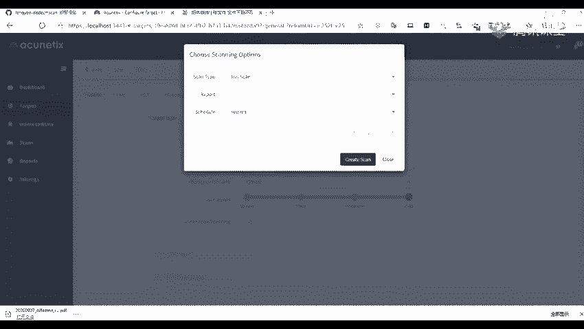


导出的报告通常包含以下内容：
*   目标URL
*   扫描时间
*   漏洞统计（高、中、低危数量）
*   每个漏洞的详细描述、请求/响应示例及修复建议

报告默认是英文的，可以借助翻译工具或寻找汉化包。

## 批量操作与高级功能

当需要扫描大量目标时，手动添加效率低下。AWVS支持批量导入目标。

以下是批量操作和相关高级功能：

*   **Import CSV**：通过CSV文件批量导入目标。CSV文件格式为：`地址,描述`，例如：
    ```csv
    http://site1.com,测试站点1
    http://site2.com,测试站点2
    ```
    
*   **Filter**：使用过滤器根据地址、描述或扫描状态筛选目标。
*   **Compare Results**：比较同一目标两次不同时间的扫描结果，用于验证漏洞修复情况。

## 配置扫描任务

添加目标后，点击 `Scan` 启动扫描。在扫描配置界面，可以进行详细设置。

以下是扫描配置的主要选项：

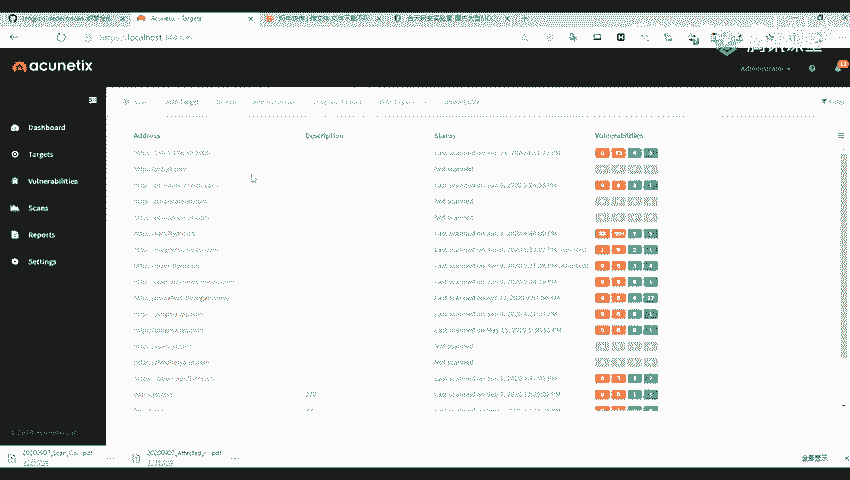

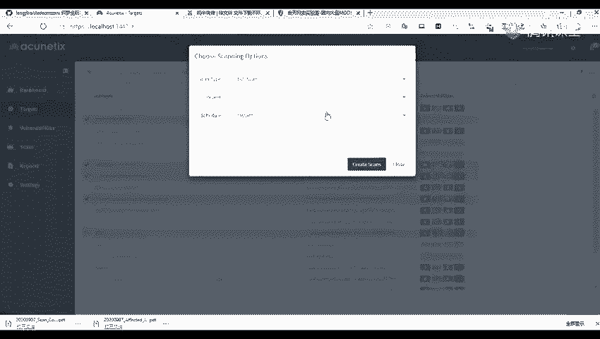

1.  **Scan Type**：扫描类型，如全面扫描、仅扫描高危漏洞、仅爬取站点结构等。
2.  **Report**：选择报告模板，如标准报告、合规性报告等。
3.  **Schedule**：调度设置，可选择立即扫描、定时扫描或循环扫描。


## 使用脚本进行批量扫描

对于成百上千的目标，即使批量导入后，在界面上逐个启动扫描也很繁琐。此时，可以使用Python脚本实现全自动批量扫描。

脚本的核心原理是模拟浏览器登录AWVS，并通过其API接口自动添加目标并启动扫描。使用前需要修改脚本中的账号信息。

以下是使用批量扫描脚本的关键步骤：


1.  **修改脚本**：打开脚本文件，找到登录信息部分。
    *   修改 `username` 为你的AWVS登录邮箱。
    *   修改 `password` 为你的密码经过SHA-256加密后的哈希值。你可以使用在线工具（如 `https://emn178.github.io/online-tools/sha256.html`）对明文密码进行加密。
    ```python
    # 示例：修改以下两行
    username = ‘your_email@example.com‘
    password = ‘sha256_encrypted_password_hash‘
    ```
2.  **准备目标列表**：将需要扫描的URL列表保存为文本文件（如 `targets.txt`），每行一个URL。
3.  **运行环境**：确保系统安装的是 **Python 2.7.9** 版本，并将Python路径添加到系统环境变量中。
4.  **执行脚本**：在命令行中，切换到脚本所在目录，运行命令 `python2 awvs_batch_scan.py`。根据提示选择“1”来添加并执行扫描任务。

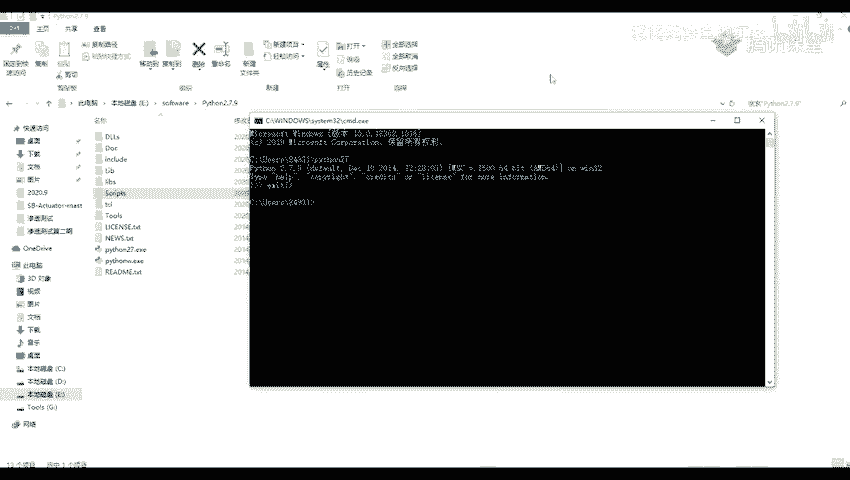

运行脚本时若遇到 `401` 错误，表示存在会话冲突，只需在AWVS网页界面点击右上角“退出”当前登录，再重新运行脚本即可。

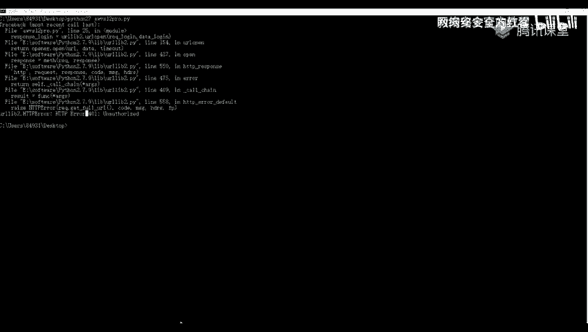

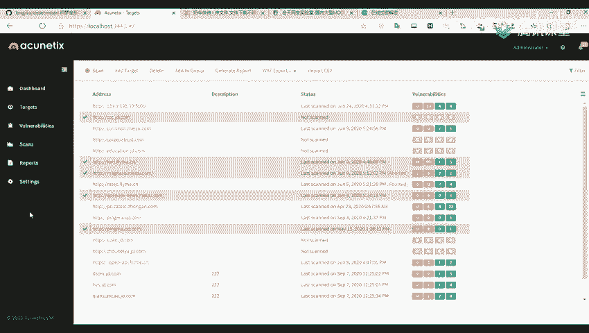


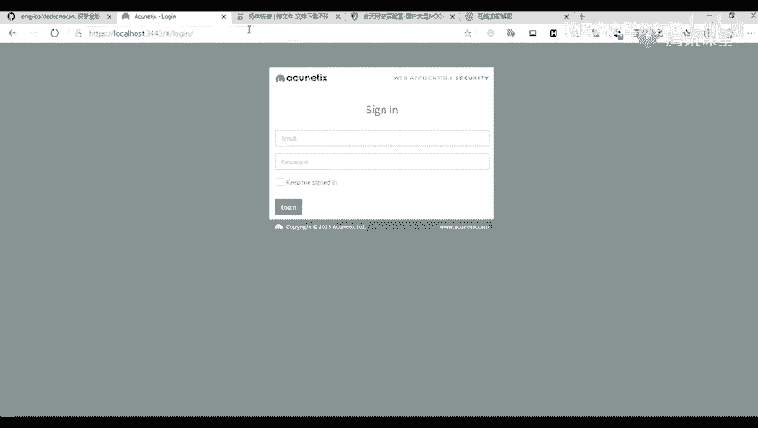

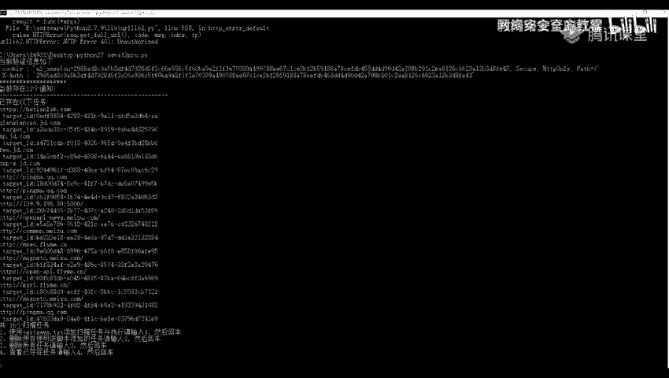

## 激活状态与设置

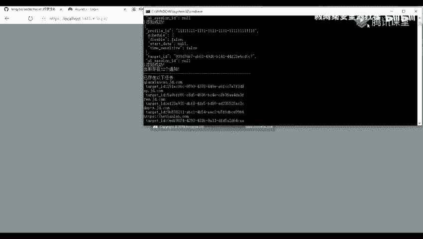

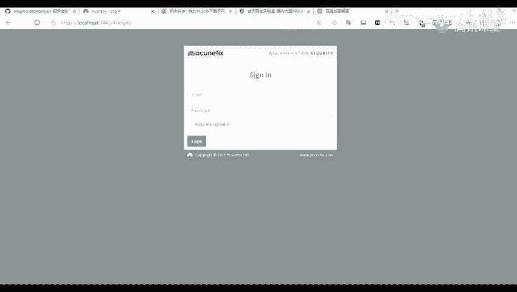

最后，你可以通过右上角的 `Admin` -> `License` 查看AWVS的激活状态和到期时间，确保工具可用。


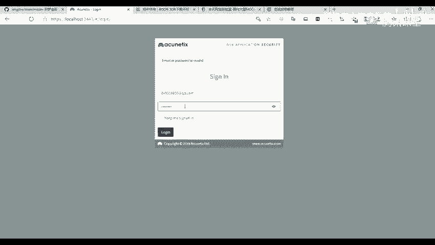


---

本节课中我们一起学习了AWVS漏洞扫描工具的核心使用方法。我们从认识界面开始，逐步掌握了如何添加和管理扫描目标、配置并启动扫描任务、查看和导出漏洞报告。最后，我们还学习了如何利用Python脚本实现批量目标的自动化扫描，极大提升了工作效率。AWVS是一款功能强大的自动化扫描器，是Web安全渗透测试中不可或缺的工具。请多加练习，熟悉其各项功能。